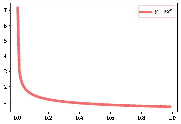
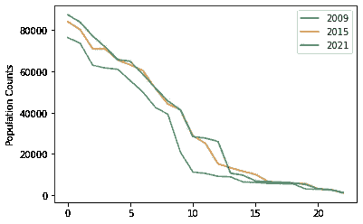
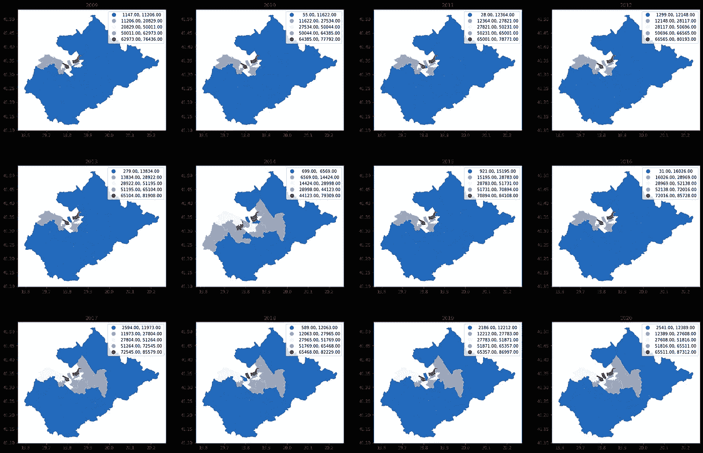
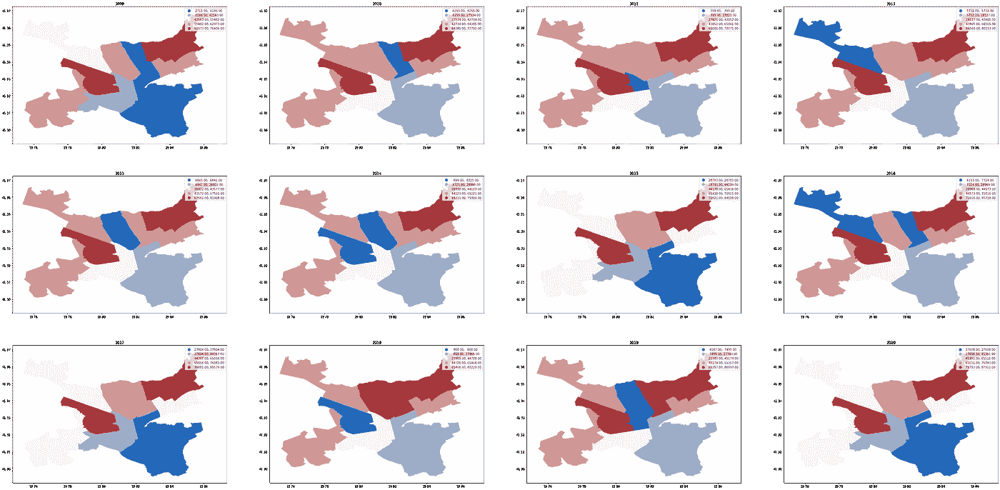
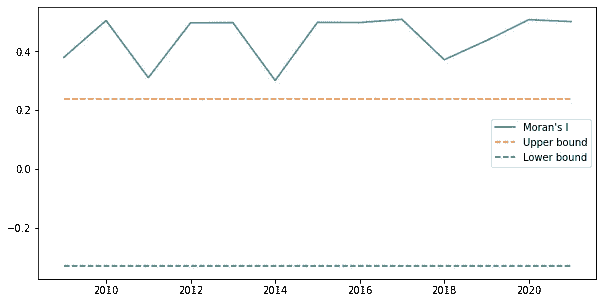
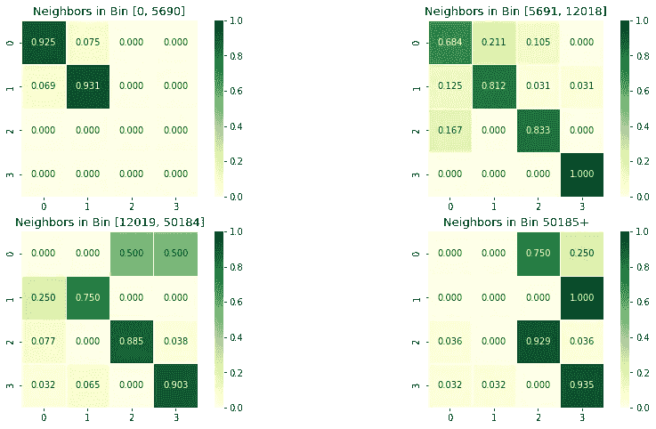

# 城市韧性：地震韧性，案例研究 [第一部分]

> 原文：[`towardsdatascience.com/urban-resilience-tirana-a-case-study-part-1-852bbfc8601?source=collection_archive---------17-----------------------#2023-04-17`](https://towardsdatascience.com/urban-resilience-tirana-a-case-study-part-1-852bbfc8601?source=collection_archive---------17-----------------------#2023-04-17)

## 量化地震韧性：幂律分布、自组织城市和可持续人口动态

 [Dea Bardhoshi](https://deabardhoshi.medium.com/?source=post_page-----852bbfc8601--------------------------------)

·

[关注](https://medium.com/m/signin?actionUrl=https%3A%2F%2Fmedium.com%2F_%2Fsubscribe%2Fuser%2Fd61c58ba988e&operation=register&redirect=https%3A%2F%2Ftowardsdatascience.com%2Furban-resilience-tirana-a-case-study-part-1-852bbfc8601&user=Dea+Bardhoshi&userId=d61c58ba988e&source=post_page-d61c58ba988e----852bbfc8601---------------------post_header-----------) 发布于[Towards Data Science](https://towardsdatascience.com/?source=post_page-----852bbfc8601--------------------------------) ·6 分钟阅读·2023 年 4 月 17 日

--

图片由[Michael Silkesjöö](https://unsplash.com/@silkesjoo?utm_source=medium&utm_medium=referral)拍摄，来源于[Unsplash](https://unsplash.com/?utm_source=medium&utm_medium=referral)

## **你好，欢迎！**

## 设置和简介

我一直在思考城市规划中的各种问题，其中一个引起我兴趣的主要问题是：**“是什么让一个城市具有韧性？”** 为什么有些城市能够应对并克服各种挑战，而另一些城市却挣扎得更多？或者，为什么城市中的不同区域（例如街区）在韧性方面存在超局部差异？这个多部分的故事探讨了以阿尔巴尼亚首都地拉那为背景的城市韧性。

对这个问题已经有很多候选答案：CDC 使用社会脆弱性指数（SVI）来衡量一个普查区对挑战的脆弱性，包括人为和自然挑战。SVI 包括如[贫困、缺乏交通工具和拥挤的住房](https://www.atsdr.cdc.gov/placeandhealth/svi/fact_sheet/fact_sheet.html)等因素，以生成该区域的最终排名。这个指数可以用来解决诸如“决定需要多少紧急救援人员”以及“识别需要紧急避难所的区域”等问题。

在这个故事中，我想的不仅仅关注韧性的“灾害管理”方面。相反，我们来看 OECD 的定义：[**韧性城市是指具有吸收、恢复和为未来冲击（经济、环境、社会和制度）做好准备能力的城市**](https://www.oecd.org/cfe/resilient-cities.htm)**。** 对于地拉那来说，特别重要的是在了解人口变化和自 1990 年代以来的快速城市化背景下的韧性。快速城市化会给城市的土地和服务资源带来很大压力，韧性城市确保居民能够公平地获得这些资源。这些动态在过去 30 年中是如何发展的？

在这个故事中，我将使用来自地拉那市开放数据门户的[人口统计数据（数据+许可：Creative Commons Attribution](https://ckan.tirana.al/dataset/popullsia-sipas-viteve-dhe-nja-2009-2022)）以及**PySAL**用于空间分析，**seaborn**和**pandas**用于数据可视化。让我们开始吧！

## 幂律

城市规划者通过观察城市形态来尝试捕捉韧性城市的概念。一个主要的例子是**尺度层级**或**幂律**。幂律是 x 和 y 之间的一种关系，可以用以下公式和形状建模：

幂律分布（作者图片）

结果表明，很多关系可以用幂律来描述：姓氏的频率（一些姓氏非常流行，因此出现的频率非常高）、能源消耗（一些地理区域消耗了大部分能源）。尤其在城市规划中，规模等级/幂律出现在[地铁站分布、住宅密度甚至职位数量](https://www.tandfonline.com/doi/full/10.1080/19463138.2016.1277227)中。

## 数据可视化

我们来看看地拉那在 2009 年、2015 年和 2021 年这 3 年的数据中的人口分布：

人口计数与排名的行政区域（作者提供的图片）

这些计数似乎略微偏离幂律，至少在定性上是这样。还有更多的测试可以进行来验证幂律，例如 Kolmogorov-Smirnov 测试。然而，我们需要做一系列假设才能实际进行这些测试（如值之间相互独立）。现在，让我们更详细地查看这些邻域。

这些偏差背后的原因可能是什么？原因可能有很多：某些区域的突然增长、向外迁移、邻域内部的移动等。这里是地拉那 24 个区域在 2009 年到 2020 年期间的人口地图：

多年来的地拉那人口（作者提供的图片）

注意到在城市边缘区域的逐步增长：在共产主义垮台后的时期，很多人迁移到地拉那的边界地区，通常在旧的征用土地上建房，最终成为地拉那经济生活的一个重要部分（更多信息见[这里](https://www.sciencedirect.com/science/article/pii/S0264275110000284?casa_token=8lBKyEKWqaEAAAAA%3AgIFJ3wzU1wzQ15cxS2HQsol7pzA_eysVUJ7t69DXjWniSxXLTM1OyfojANRnMOjMNYKtSh9WftrR)）。

那些构成城市地拉那的核心 11 个区域呢？这里是筛选出来的地图：

多年来的城市地拉那（作者提供的图片）

## 空间马尔可夫模型

为了更深入地分析这些人口动态，我们需要建立能够通过时间表达行为的模型。**马尔可夫模型**对于此非常有用，它允许我们对离散状态的转移和稳定概率进行建模。在这种设置下，我们可以为区域的人口计数指定**4**个（可定制）桶：

+   🪣 **桶 1：** [0, 5690] ，**桶 2：** [5691, 12018]，**桶 3：** [12019, 50184]，**桶 4：** 50185+

在每一个时刻，我们可以处于这 4 个状态中的任何一个，且我们处于**状态 i**的机会只取决于之前的**状态 (i — 1)**，这也称为**马尔可夫性质**。因此，我们可以得到一个邻域从例如桶 1 的人口数转变为桶 2 的人口数的转移概率。

然而，在这个具体的案例研究中，我们的区域很可能表现出一定程度的空间依赖性。例如，如果一个区域的人口密度很高，那么它周围的区域也很可能人口密度很高。为了考虑这一点，我们关注**空间马尔可夫模型**。这些模型要求我们计算一个描述这种空间依赖性的权重矩阵**W**。不过，首先，让我们使用莫兰指数检查邻里是否确实存在空间依赖性：

莫兰指数（图片由作者提供）

莫兰指数检查**全局空间自相关**：我们期望类似值的区域彼此靠近，而不同值的区域彼此远离。从本质上讲，它是用于衡量我们需要考虑的空间依赖性的度量。如上图所示，地拉那的行政区域及其人口数量表现出强烈的空间自相关，超出了上限和下限。

现在让我们看看如何计算考虑这种依赖关系的空间权重矩阵 W。有几种方法：对于这个项目，我选择了**皇后连通性**，它将邻近的多边形建模为那些共享至少一个**边**或**顶点**的多边形，并输出 W 矩阵。

W 矩阵是 22x22 的矩阵，每个值(i, j)中为 1，表示第 i 行的多边形与第 j 列的一个顶点或边相交。现在我们准备将年度人口数据和 W 矩阵输入到空间马尔可夫实例中。

## 空间马尔可夫结果

请注意，我们将获得 4 个独立的矩阵：每个多边形邻居可以位于一个分类中。以下是结果的一览：

空间马尔可夫模型矩阵（图片由作者提供）

有一些有趣的模式：

+   如果一个“人口 < 5690”的区域被其他“人口 < 5690”的区域包围，它保持在该分类中的概率为 0.925，但如果它的邻居是“人口在[5691, 12018]”之间，则该概率降至 0.684，因此第一个区域的人口更有可能增加。

+   类似地，一个“人口[5691, 12018]”的区域如果其邻居在最低分类中更可能保持这样（0.931），但如果其邻居也在同一分类中，则可能性较低（0.812）。

你可以使用其余的数值得出类似的结论。重要的是，每个区域更可能保持在同一分类中，而不是发生变化。这也有逻辑上的意义：在相对较短的时间内，一个地方更可能保持其当前特征，而不是经历剧烈变化。

## **下一步 + 代码**

为什么这些结果有用？正如我们所见，观察可持续增长和衰退是城市韧性的重要组成部分。这些工具，包括测量幂律拟合或空间马尔可夫模型，使我们能够更准确地理解这些动态。在这个故事中，我介绍了如何使用其中一些方法，并查看了一些有趣的结果，包括哪些区域在给定的前几年数据中预期会增长或衰退。

下一次，我将更详细地探讨城市设计。与此同时，这里是[代码笔记本](https://github.com/DeaBardhoshi/AlbaniaExplorations/blob/main/Tirana.ipynb)供参考。感谢阅读！
