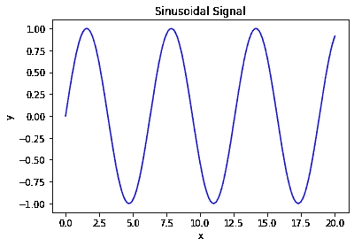
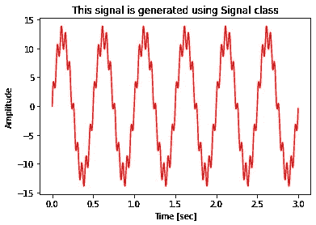

# 使用类来生成信号

> 原文：[`towardsdatascience.com/use-classes-for-generating-signals-6694d22e9a80?source=collection_archive---------14-----------------------#2023-02-01`](https://towardsdatascience.com/use-classes-for-generating-signals-6694d22e9a80?source=collection_archive---------14-----------------------#2023-02-01)

## 类 == 更好的代码可读性

[](https://medium.com/@omar.ok1998?source=post_page-----6694d22e9a80--------------------------------)[](https://towardsdatascience.com/?source=post_page-----6694d22e9a80--------------------------------) [Omar Alkousa](https://medium.com/@omar.ok1998?source=post_page-----6694d22e9a80--------------------------------)

·

[关注](https://medium.com/m/signin?actionUrl=https%3A%2F%2Fmedium.com%2F_%2Fsubscribe%2Fuser%2Ff8302b9534b5&operation=register&redirect=https%3A%2F%2Ftowardsdatascience.com%2Fuse-classes-for-generating-signals-6694d22e9a80&user=Omar+Alkousa&userId=f8302b9534b5&source=post_page-f8302b9534b5----6694d22e9a80---------------------post_header-----------) 发表在 [Towards Data Science](https://towardsdatascience.com/?source=post_page-----6694d22e9a80--------------------------------) ·7 分钟阅读·2023 年 2 月 1 日[](https://medium.com/m/signin?actionUrl=https%3A%2F%2Fmedium.com%2F_%2Fvote%2Ftowards-data-science%2F6694d22e9a80&operation=register&redirect=https%3A%2F%2Ftowardsdatascience.com%2Fuse-classes-for-generating-signals-6694d22e9a80&user=Omar+Alkousa&userId=f8302b9534b5&source=-----6694d22e9a80---------------------clap_footer-----------)

--

[](https://medium.com/m/signin?actionUrl=https%3A%2F%2Fmedium.com%2F_%2Fbookmark%2Fp%2F6694d22e9a80&operation=register&redirect=https%3A%2F%2Ftowardsdatascience.com%2Fuse-classes-for-generating-signals-6694d22e9a80&source=-----6694d22e9a80---------------------bookmark_footer-----------)

在处理信号数据时，你可能需要编写多个函数和方法来实现你想要应用于信号数据的处理过程。然而，有时在没有先前了解这些数据的情况下，跟踪你对信号应用的方法的质量可能会很困难。因此，生成具有已知参数的信号数据可以帮助你更好地理解你的程序和方法。生成信号，特别是正弦信号，在信号处理研究中非常常见。通常，它用于测试或展示不同的信号处理技术，如离散傅里叶变换、小波分析等。


照片由 [Markus Spiske](https://unsplash.com/@markusspiske?utm_source=medium&utm_medium=referral) 提供，来源于 [Unsplash](https://unsplash.com/?utm_source=medium&utm_medium=referral)

在这篇文章中，我们将学习如何使用类构建一个信号生成器，以便生成正弦信号以进一步理解信号处理方法。

让我们从一个简单的代码开始，它生成一个正弦信号。

```py
# Import the required package
import numpy as np
import matplotlib.pyplot as plt

# Generate the x-axis (from 0 to 1 with step of 1/200)
x = np.linspace(0,20,200)
# Generate a sinusoidal 1D Array
y = np.sin(x)

# Plot the result
plt.plot(x, y, 'b')
plt.xlabel('x')
plt.ylabel('y')
plt.title('Sinusoidal Signal')
plt.show()
```



使用 Numpy 包生成信号。[作者提供的图片]

# 为什么选择类？

从上面的代码来看，我们似乎可以在不使用类的情况下生成信号。那么，为什么类是一个好的选择呢？[[1]](https://docs.python.org/3/tutorial/classes.html)

+   使用类时数据更可控，因为你可以构建你的对象和方法，这些方法可以用于控制和获取信号，而不需要像上述那样重复编码。

+   使用类可以带来更多功能。类允许你将变量和函数定义为属性。

+   提高代码的可读性和灵活性。使用类后，你的代码更容易理解和使用。

+   类在构建包中起着重要作用。如果你经常处理信号数据，你可能会考虑构建一个专门的包，帮助你更好、更快地进行信号数据分析工作。

[**“Think DSP”**](https://github.com/AllenDowney/ThinkDSP.git) 是一个专门为数字信号处理构建的优秀示例。[艾伦·道尼](https://medium.com/u/564e295fb7cf?source=post_page-----6694d22e9a80--------------------------------)将他在信号处理方面的思考和经验融入了这个包，从生成信号到分析谱图等。

# 类，简单的开始

定义一个类类似于定义函数。首先，你需要为你的类取一个适当的名字。虽然没有命名类的硬性规定，但最好简短且与其功能相关。同时，这也是一种常见的做法。让我们为我们的信号生成器定义一个类。

```py
# Define a class
class Signal:
  # Statement 1
  # Statement 2
```

在类内部可以定义不同的对象。这些对象可以是变量或函数，可以作为类的方法或属性传递。我们信号生成器类中的变量可能是信号的频率和幅度。让我们还定义一个打印这些变量的函数。

```py
# Signal Generator Class
class Signal:
  """
  Signal Generator
  """
  # Define the frequency
  f = 10 # in Hz
  # Define the amplitude
  a = 2

  # Print the variables
  def vars(self):
    print('frequency=', self.f)
    print('amplitude=', self.a)
```

在上面的代码中，**“self”** 代表类的实例，它用于访问类的属性，并将属性与给定的参数绑定 [[2]](https://www.geeksforgeeks.org/self-in-python-class/)。你可以使用除了 “self” 之外的任何词作为名称，因为该名称对 Python 没有特殊含义。然而，请注意，如果不遵循这一惯例，你的代码可能会对其他 Python 程序员的可读性降低 [[1]](https://docs.python.org/3/tutorial/classes.html)。关于上面的代码，还有一点是定义类之后的语句。这是描述类功能的文档。将其实现到你的类中很重要，因为它使你的代码更具可读性。类的用户可以使用 Python 中的 help 函数访问文档。

下面的代码表示如何访问类的变量或函数。

```py
# Define a signal object
signal = Signal()
# Print the frequency of the signal
print(signal.f)
# Calling vars to print the Signal class variables
signal.vars()
```

```py
10
frequency= 10
amplitude= 2
```

# 类的特殊方法

到目前为止，上述类并没有展示太多灵活性。但幸运的是，Python 提供了可以用来使类更具可控性的特殊方法。我们将讨论的最重要的方法是 **__init__()** 方法。它用于实例化类并将其参数自定义为特定的初始状态。

有了这一点，调用类对象将自动调用 init 方法并实例化所有在 init 方法中实现的变量和函数 [[1]](https://docs.python.org/3/tutorial/classes.html)。下面的代码是在之前的代码基础上修改的，通过定义 init 方法来完成。

```py
# Signal Generator class
class Signal:
  """
  Signal Generator
  """

  # Initialize the class object
  def __init__(self, f, a):
    self.frequency = f
    self.amplitude = a

  # Print the varibles
  def vars(self):
    print('frequency=', self.frequency)
    print('amplitude=', self.amplitude)
```

现在，如果我们尝试定义一个 Signal 对象，我们需要传递信号的频率和幅度。

```py
# Define a signal object
signal = Signal(f=10, a=2)
# Print the frequency of the signal
print(signal.frequency)
# Calling vars to print the Signal class variables
signal.vars()
```

```py
10
frequency= 10
amplitude= 2
```

现在我们理解了如何定义类及其对象以及特殊的初始化方法。是时候构建我们从一开始就想要的信号生成器类了。首先，我们需要指出在 init() 方法中实现的参数。正弦波的一般形式可以用以下方程表示 [[3]](https://pythonnumericalmethods.berkeley.edu/notebooks/chapter24.01-The-Basics-of-waves.html):

> *y*(*t*)=*A*.*sin*(2*πf*+*ϕ*)

其中：

+   ***A*:** 信号的幅度

+   ***f* :** 信号的频率 [Hz]

+   ***ϕ*:** 信号的相位

应该将两个额外的参数添加到我们的变量中：

+   信号的 **duration**，以秒为单位

+   **采样率**，每秒样本数

```py
# Building a class Signal for better use.
class Signal:
  """
  Generate sinusoidal signals with specific ampltiudes, frequencies, duration,
  sampling rate, and phase.

  Example:
    signal = Signal(amplitude=10, sampling_rate=2000.0)
    sine = signal.sine()
    cosine = signal.cosine()
  """

  def __init__(self, amplitude=1, frequency=10, duration=1, sampling_rate=100.0, phase=0):
    """
    Initialize the Signal class.

    Args:
        amplitude (float): The amplitude of the signal
        frequency (int): The frequency of the signal Hz
        duration (float): The duration of the signal in second
        sampling_rate (float): The sampling per second of the signal
        phase (float): The phase of the signal in radians

    Additional parameters,which are required to generate the signal, are
    calculated and defined to be initialized here too:
        time_step (float): 1.0/sampling_rate
        time_axis (np.array): Generate the time axis from the duration and
                              the time_step of the signal. The time axis is
                              for better representation of the signal.
    """
    self.amplitude = amplitude
    self.frequency = frequency
    self.duration = duration
    self.sampling_rate = sampling_rate
    self.phase = phase
    self.time_step = 1.0/self.sampling_rate
    self.time_axis = np.arange(0, self.duration, self.time_step)

  # Generate sine wave
  def sine(self):
    """
    Method of Signal

    Returns:
        np.array of sine wave using the pre-defined variables (amplitude,
        frequency, time_axis, and phase)
    """
    return self.amplitude*np.sin(2*np.pi*self.frequency*self.time_axis+self.phase)

  # Generate cosine wave
  def cosine(self):
    """
    Method of Signal

    Returns:
        np.array of cosine wave using the pre-defined variables (amplitude,
        frequency, time_axis, and phase)
    """
    return self.amplitude*np.cos(2*np.pi*self.frequency*self.time_axis+self.phase)
```

# 让我们使用我们的 Signal 类

假设我们要生成一个由三个正弦信号之和组成的信号。这三个信号的频率分别是 (20, 2, 7)Hz。这三个信号的幅度分别是 (2, 6, 1)。信号的采样率是 1000。最后，信号的持续时间是 3 秒。我们保持信号的相位为 0。

```py
# Define the first signal, 20Hz and amplitude of 2
s1 = Signal(amplitude=2, frequency=20, sampling_rate=1000.0, duration=3)
sine1 = s1.sine()

# Define the second signal, 2Hz and amplitude of 6
s2 = Signal(amplitude=6, frequency=2, sampling_rate=1000.0, duration=3)
sine2 = s2.sine()

# Define the second signal, 7Hz and amplitude of 1
s3 = Signal(amplitude=1, frequency=7, sampling_rate=1000.0, duration=3)
sine3 = s2.sine()

# Our signal is the sum of the three signals
signal = sine1 + sine2 + sine3

# Plot the signal
plt.plot(s1.time_axis, signal, 'r')
plt.xlabel('Time [sec]')
plt.ylabel('Amplitude')
plt.title('This signal is generated using Signal class')
plt.show()
```



使用我们的 Signal 类生成信号的示例。[作者提供的图片]

# 结论

+   我们指出了一些使用类时代码的有用属性，例如，更好的数据控制、更强的代码功能，以及更好的代码可读性和灵活性。

+   我们已经逐步学习了如何在 Python 中构建一个类。我们从定义类及如何将变量或函数定义为对象开始，然后将其作为方法或属性与类一起传递。

+   我们学习了特殊方法 __init__()及其如何用于实例化类，并将参数定制为特定的初始状态，这使得用户能够更好地控制数据。

+   我们构建了最终的类作为一个信号生成器，您可以用它来获取具有特定频率、采样率、振幅和持续时间的正弦信号。

# 参考文献

[[1]](https://docs.python.org/3/tutorial/classes.html) Python 文档，类，类的初步介绍。 [访问时间：2023 年 1 月 28 日]

[[2]](https://www.geeksforgeeks.org/self-in-python-class/) GeeksforGeeks，类，类中的 self。 [访问时间：2023 年 1 月 28 日]

[[3]](https://pythonnumericalmethods.berkeley.edu/notebooks/chapter24.01-The-Basics-of-waves.html) Kong, Q., Siauw, T., & Bayen, A. (2020). 《Python 编程与数值方法：工程师和科学家的指南》，傅里叶变换，波的基础。学术出版社。
