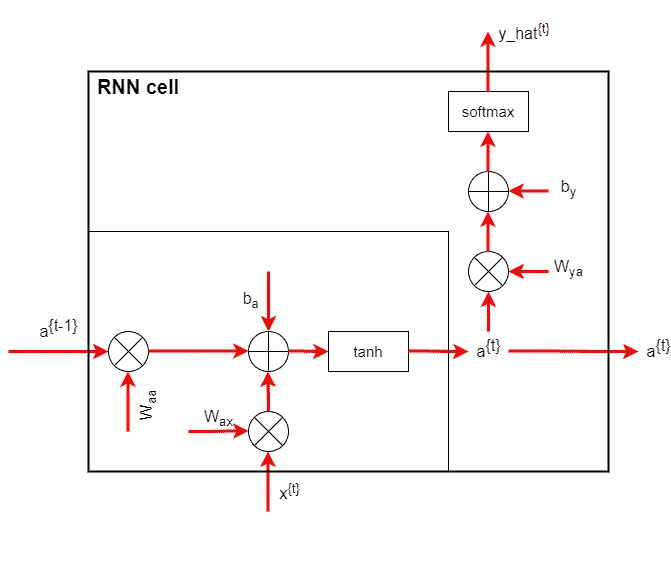
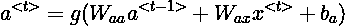
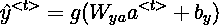
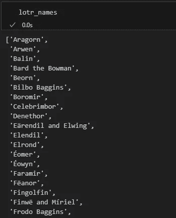
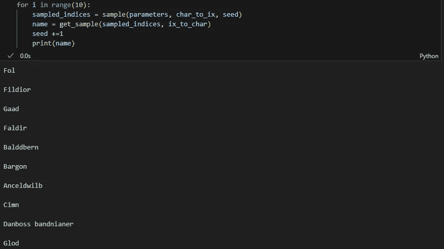
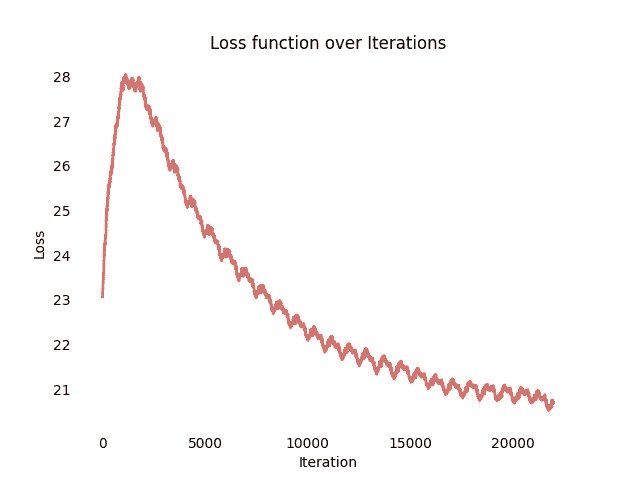

# 使用深度学习生成奇幻名字：从零构建语言模型

> 原文：[`towardsdatascience.com/use-deep-learning-to-generate-fantasy-character-names-build-a-language-model-from-scratch-792b13629efa`](https://towardsdatascience.com/use-deep-learning-to-generate-fantasy-character-names-build-a-language-model-from-scratch-792b13629efa)

## 一个语言模型能否发明独特的奇幻角色名字？让我们从零开始构建它

[](https://medium.com/@riccardo.andreoni?source=post_page-----792b13629efa--------------------------------)[](https://towardsdatascience.com/?source=post_page-----792b13629efa--------------------------------) [Riccardo Andreoni](https://medium.com/@riccardo.andreoni?source=post_page-----792b13629efa--------------------------------)

·发表于 [Towards Data Science](https://towardsdatascience.com/?source=post_page-----792b13629efa--------------------------------) ·阅读时间 11 分钟·2023 年 9 月 22 日

--


来源：[pixabay.com](https://pixabay.com/illustrations/book-old-surreal-fantasy-pages-863418/)

要真正掌握 [**语言模型**](https://en.wikipedia.org/wiki/Language_model#:~:text=A%20language%20model%20is%20a,feedforward%20neural%20networks%20and%20transformers.) (LM) 的复杂性并熟悉其基本原理，唯一的方法就是卷起袖子开始编写代码。在本文中，我展示了一个从零开始完全构建的 [**递归神经网络**](https://en.wikipedia.org/wiki/Recurrent_neural_network) (RNN)，没有使用任何深度学习库。

Tensorflow、Keras、Pytorch 使得构建深层复杂的神经网络变得轻而易举。这无疑是机器学习从业者的一大优势，但这种方法也有一个巨大的缺点，那就是这些网络的运行机制往往不够清晰，因为它们是在“引擎盖下”发生的。

这就是为什么今天我们将进行一个鼓舞人心的练习，仅使用 [Numpy Python](https://numpy.org/) 库来构建一个语言模型！

# 理解递归神经网络和语言模型

标准全连接神经网络不适用于像文本生成这样的 [自然语言处理](https://en.wikipedia.org/wiki/Natural_language_processing) (NLP) 任务。主要原因如下：

+   对于 NLP 任务，输入和输出可能采用不同的形式和维度。

+   标准神经网络不会同时使用网络不同步骤中学到的特征。

在 AI 应用于 NLP 领域的主要突破无疑是递归神经网络 (RNN)。

RNN 是一类特别适合 NLP 任务和文本生成的人工神经网络。它们的有效性在于能够捕捉数据中的序列依赖关系。人类语言深深依赖于考虑上下文并将句子的第一个词与最后一个词联系起来。考虑这些句子：

1.  *他说：“西奥多·罗斯福曾是美国总统。”*

1.  *他说：“泰迪熊正在打折！”*

单词 “*Teddy*” 在这两个句子中具有完全不同的含义。我们人类通过考虑上下文和句子另一部分的词语，很容易理解这一点。令人惊讶的是，**RNN 也能做到这一点**！

## RNN 架构

RNN 的架构相当简单。它们由一系列顺序单元组成，每个单元接收一个词 *x*（或一个字符）作为输入，输出一个词/字符 *y*，并将激活值 *a* 传递给下一个单元。


RNN 流程图。图片由作者提供。

RNN 单元内部发生的事情更有趣。步骤如下：

1.  前一个单元的激活值乘以一些权重 *W_aa*

1.  输入 *x* 乘以一些权重 *W_ax*

1.  前面步骤的结果会相加，并与偏置 *b_a* 一起处理

1.  应用像双曲正切这样的激活函数来计算激活值，然后传递给下一个单元

1.  激活值乘以一些权重 *W_ya* 并与偏置 *b_y* 相加

1.  最后，对结果向量应用 softmax 函数，并返回输出 *y_hat*



RNN 单元流程图。图片由作者提供。

总结一下，激活和输出的公式如下：



我无法在这里提供 RNN 和语言模型的全面理论介绍。有关内容，请参见本文末尾列出的资源。

现在我们来深入了解实际的 Python 代码。本文将详细解释代码中最重要的部分。为了使文章简洁，一些直观的部分被省略。整个带注释的代码可以在我的 [GitHub 仓库](https://github.com/andreoniriccardo/articles/tree/main/names-generator-RNN) 中获取：

[](https://github.com/andreoniriccardo/articles/tree/main/names-generator-RNN?source=post_page-----792b13629efa--------------------------------) [## articles/names-generator-RNN at main · andreoniriccardo/articles

### 通过在 GitHub 上创建账户来为 andreoniriccardo/articles 开发做贡献。

github.com](https://github.com/andreoniriccardo/articles/tree/main/names-generator-RNN?source=post_page-----792b13629efa--------------------------------)

# 数据准备

我们的目标是教会语言模型发明新颖的奇幻角色名称。因此，我们需要为语言模型提供一个实际奇幻名称的数据库。语言模型将从中获得训练和灵感。

由于这个 [维基百科页面](https://en.wikipedia.org/wiki/List_of_Middle-earth_characters)，我们可以轻松访问提到的所有角色的列表，这些角色出现在 [*指环王*](https://en.wikipedia.org/wiki/The_Lord_of_the_Rings) 或 [*霍比特人*](https://en.wikipedia.org/wiki/The_Hobbit) 书中。使用 [BeautifulSoup](https://pypi.org/project/beautifulsoup4/) 和 [Regex](https://docs.python.org/3/library/re.html) 库，以下代码将收集数据：

```py
from bs4 import BeautifulSoup
import requests
import re

url = "https://en.wikipedia.org/wiki/List_of_Middle-earth_characters"
# Get the contents of the webpage in text format
data  = requests.get(url).text

soup = BeautifulSoup(data,"html.parser")

# Parse the HTML code to isolate rows containing character names
names = soup.find_all('li')

# Apply a second filter to isolate actual names
names_2 = []
for i in names:
    if """<li><a href="/wiki/""" in str(i):
        names_2.append(str(i))

# Retrieve final character names applying cleaning conditions
lotr_names = []
for i in names_2:
    candidate_name = re.findall(r'"(.*?)"', i)[1]
    conditions = 'Category:' not in candidate_name and 'Middle-earth ' not in candidate_name and 'Tolkien' not in candidate_name and 'Lord of the Rings' not in candidate_name and 'The Hobbit' not in candidate_name
    if conditions:
        lotr_names.append(candidate_name.replace(' (Middle-earth)','')) 
```

关于 Regex 函数的解释，我为你提供了这份详尽的 [指南](https://pub.towardsai.net/regex-for-the-modern-data-scientists-37bd528d343a)。

此时，我们的数据集将如下所示：



我的目标是通过替换不需要的字符如 ä、é、î 来简化我们的词汇。

```py
replace_dict = {'a':['â','ä','á'],
                'e':['ê','ë','é'],
                'i':['î','í'],
                'o':['ô','ö','ó'],
                'u':['ú','û',],
                ' ':['-']
}
for new_char in replace_dict.keys():
    for old_char in replace_dict[new_char]:
        lotr_names = lotr_names.replace(old_char, new_char)
```

最终，我们的词汇由 27 个字符组成：

*[‘x’，‘j’，‘f’，‘t’，‘c’，‘b’，‘o’，‘l’，‘y’，‘w’，‘i’，‘e’，‘g’，‘m’，‘k’，‘d’，‘v’，‘n’，‘u’，‘a’，‘z’，‘r’，‘\n’，‘s’，‘ ‘，‘p’，‘h’]*

请注意，特殊字符 *‘\n’* 作为名称终止符，表示生成的名称应何时终止。

数据集已经准备好，我们现在可以专注于建模递归神经网络。

# 构建语言模型

在本节中，我展示了语言模型的 Python 实现。整个代码可以分为两个部分：

1.  正向传播

1.  Backprop

在接下来的部分中，我将展示实际训练模型的代码以及如何生成奇幻角色名称。

## 正向传播

如上所示，RNN 是由多个单元组成的网络。在 Python 中建模单个 RNN 单元然后通过多个单元集成其输出是有利的。

模拟单个 RNN 单元的代码如下：

```py
def RNN_forward_prop_step(parameters, a_prev, x):
    W_aa = parameters['W_aa']
    W_ax = parameters['W_ax']
    W_ya = parameters['W_ya']
    b_y = parameters['b_y']
    b = parameters['b']

    # Compute hidden state
    a_next = np.tanh(np.dot(W_ax, x) + np.dot(W_aa, a_prev) + b)

    # Compute log probabilities for next character
    p_t = softmax(np.dot(W_ya, a_next) + b_y)

    return a_next, p_t
```

如你所见，这一点也不复杂。我们只是将模型的参数作为输入，并将其与单元的输入和先前的激活函数相乘。最后，我们应用 softmax 函数返回一个表示输出字符概率的向量。

下一步是遍历多个 RNN 单元。这正是 `RNN_roward_prop()` 函数的作用。

```py
def RNN_forward_prop(X, Y, a0, parameters, vocab_size):

    x = {}
    a = {}
    y_hat = {}
    a[-1] = np.copy(a0)
    loss= 0

    # Iterate for the T timesteps
    for t in range(len(X)):

        # One-hot representation of the t-th character
        x[t] = np.zeros((vocab_size, 1))
        if X[t] != None:
            x[t][X[t]] = 1

        # Run one timestep of forward prop
        a[t], y_hat[t] = RNN_forward_prop_step(parameters, a[t-1], x[t])

        # Update loss function
        loss -= np.log(y_hat[t][Y[t],0])

    cache = (y_hat, a, x)

    return loss, cache
```

它调用之前的 `RNN_roward_pro_step()` 函数 *T* 次，其中 *T* 是输入词的字符数。最后，返回损失函数和输出结果。

## Backprop

Backprop，即反向传播，是调整网络权重以逐渐接近期望输出的过程，即减少模型损失函数。这是通过应用梯度下降来完成的。

详细说明梯度下降或其他可行优化算法的公式超出了本文的范围。我将推荐**这篇文章**，它正好涉及如何选择适合你深度网络的优化算法。

[](/choose-the-right-optimization-algorithm-for-your-neural-network-cb86c15d7328?source=post_page-----792b13629efa--------------------------------) ## 选择适合你神经网络的优化算法

### 由于神经网络的开发过程是迭代性的，我们需要利用每一个可能的便捷方法……

towardsdatascience.com

我用来建模反向传播流的策略与前向传播相同：编码单个 RNN 单元的反向传播并多次迭代。

```py
def RNN_back_prop_step(d_y, grads, parameters, x, a, a_prev):

    grads['dW_ya'] += np.dot(d_y, a.T)
    grads['db_y'] += d_y
    da = np.dot(parameters['W_ya'].T, d_y) + grads['da_next']
    da_raw = (1 - a * a) * da
    grads['db'] += da_raw
    grads['dW_ax'] += np.dot(daraw, x.T)
    grads['dW_aa'] += np.dot(daraw, a_prev.T)
    grads['da_next'] = np.dot(parameters['W_aa'].T, daraw)
    return grads
```

上述函数接受前向传播的输出和之前的梯度作为输入，并计算更新后的梯度。

`RNN_back_prop_function()`函数的迭代通过以下代码行执行：

```py
def RNN_back_prop(X, Y, parameters, cache):
    # Initialize gradients as an empty dictionary
    grads = {}

    # Retrieve from cache and parameters
    (y_hat, a, x) = cache
    W_aa = parameters['W_aa']
    W_ax = parameters['W_ax']
    W_ya = parameters['W_ya']
    b_y = parameters['b_y']
    b = parameters['b']

    # Initialize gradients
    grads['dW_ax'], grads['dW_aa'], grads['dW_ya'] = np.zeros_like(W_ax), np.zeros_like(W_aa), np.zeros_like(W_ya)
    grads['db'], grads['db_y'] = np.zeros_like(b), np.zeros_like(b_y)
    grads['da_next'] = np.zeros_like(a[0])

    # Backpropagate through timesteps
    for t in reversed(range(len(X))):
        dy = np.copy(y_hat[t])
        dy[Y[t]] -= 1
        grads = RNN_back_prop_step(dy, grads, parameters, x[t], a[t], a[t-1])

    return grads, a
```

# 训练语言模型

此时，所有模型的组件都已设置好并准备执行。我写了以下代码来整合我们上面看到的函数。

```py
def RNN_optimization(X, Y, a_prev, parameters, alpha, vocab_size):

    # 1\. Forward propagation
    loss_now, cache = RNN_forward_prop(X, Y, a_prev, parameters, vocab_size)

    # 2\. Backward propagation
    grads, a = RNN_back_prop(X, Y, parameters, cache)

    # 3\. Clip gradients
    grads = clip_grads(grads, 10)

    # 4\. Update parameters
    parameters = update_parameters(parameters, grads, alpha)

    return loss_now, parameters, a[len(X)-1]
```

实际的魔法发生在以下代码片段中。这是整个算法的主要部分，一旦调用此函数，语言模型将被训练。

```py
def train_model(data, n_a=50, max_iter = 100000):
    # Get the list of characters
    chars = list(set(data))
    # Get the dictionary size (number of characters)
    vocab_size = len(chars)

    # Get encoding and decoding dictionaries
    chars_to_encoding = encode_chars(chars)
    encoding_to_chars = decode_chars(chars)

    # Get dataset as a list of names and strip, then shuffle the dataset
    data = data.split('\n')
    data = [x.strip() for x in data]   
    np.random.shuffle(data) 

    # Define n_x, n_y parameters
    n_x, n_y = vocab_size, vocab_size

    # Initialize the hidden state
    # a_prev = initialize_hidden_state(n_a)
    a_prev = np.zeros((n_a, 1))

    # Initialize the parameters
    parameters = initialize_parameters(n_a, n_x, n_y)
    # for k in parameters.keys():
    #     print('{}: tipo {}, Datatype {}'.format(k, type(parameters[k]), parameters[k].dtype))
    # Get current loss function value
    loss_now = get_initial_loss(vocab_size, len(data))

    # Perform max_iter iteration to train the model's parameters
    for iter in range(max_iter):
        # print(iter)
        # Get the index of the name to pick
        name_idx = iter % len(data)
        example = data[name_idx]

        # Convert encoded and decoded example into a list
        example_chars = [char for char in example]
        example_encoded = [chars_to_encoding[char] for char in example]

        # Create training input X. The value None is used to consider the first input character
        # as a vector of zeros
        X = [None] + example_encoded

        # Create the label vector Y by appending the '\n' encoding to the end of the vector
        Y = example_encoded + [chars_to_encoding['\n']]

        # Perform one step of the optimization cycle:
        # 1\. Forward propagation
        # 2\. Backward propagation
        # 3\. Gradient clipping
        # 4\. Parameters update

        loss_tmp, parameters, a_prev = RNN_optimization(X, Y, a_prev, parameters, alpha=0.01, vocab_size=vocab_size)
        # for k in parameters.keys():
        #     print('{}: tipo {}, Datatype {}'.format(k, type(parameters[k]), parameters[k].dtype))
        loss_now = smooth(loss_now, loss_tmp)

    return parameters
```

结果是一个能够模仿托尔金创作过程的模型，轻松生成独特的角色名字。

# 生成奇幻角色名字

为了从我们训练的语言模型中采样新的字符名字，我开发了两个函数。

`sample()`函数接受网络的参数和将字符映射到数字的词汇表作为输入。其思想是多次应用前向传播步骤，直到返回*‘\n’*特殊字符，或者达到生成字符的上限（在此设置为 50）。

最终，它返回一个索引列表，用于编码生成的奇幻角色名字。

```py
def sample(parameters, chars_to_encoding):
    W_aa = parameters['W_aa']
    W_ax = parameters['W_ax']
    W_ya = parameters['W_ya']
    b_y = parameters['b_y']
    b = parameters['b']
    vocab_size = b_y.shape[0]
    n_a = W_aa.shape[1]

    x = np.zeros((vocab_size,))
    a_prev = np.zeros((n_a,))

    indices = []
    idx = -1 

    counter = 0
    newline_character = chars_to_encoding['\n']

    while (idx != newline_character and counter != 50):
        a = np.tanh(np.dot(W_ax,x)+np.dot(W_aa,a_prev)+np.ravel(b))
        z = np.dot(W_ya,a) + np.ravel(b_y)
        y = softmax(z)

        idx = np.random.choice(list(chars_to_encoding.values()), p=np.ravel(y))
        indices.append(idx)    

        x = np.zeros((vocab_size,))
        x[idx] = 1

        a_prev = a

        counter +=1
        if (counter == 50):
            indices.append(chars_to_encoding['\n'])
    return indices
```

为了以人类可读的形式打印生成的奇幻名字，我们需要调用`get_sample()`函数，它接受先前生成的索引列表和将索引映射到字符的解码字典作为输入。

```py
def get_sample(sample_ix, encoding_to_chars):
    txt = ''.join(encoding_to_chars[ix] for ix in sample_ix)
    txt = txt[0].upper() + txt[1:]
    return txt
```

一切就绪后，你现在可以欣赏一些原创的奇幻角色名字，如下所示：



图片由作者提供。

# 评估模型性能

在训练过程的初期，模型仍然无法有效模仿托尔金的风格。如果我们在这个阶段采样随机名字，我们会得到纯粹的胡言乱语，如下所示：

+   在第 2000 次迭代和损失 27.96 时的“Orvnnvfufufiiubx”

+   在第 4000 次迭代和损失 26.43 时的“Aotvux”

我们可以清楚地看到这些名字不符合标志性的中土世界模式和声音。然而，通过让模型在数据集特征上学习更长时间，我们开始逐渐获得更可信的生成名字：

+   “Furun I” 在第 14000 次迭代和损失 21.53

+   “Flutto Balger” 在第 16000 次迭代和损失 21.11

最后，经过训练的模型似乎能够模拟角色的名字风格。

我所描述的改进在定量上也可以通过以下方式可视化。

通过绘制迭代过程中的损失函数，我们可以清楚地看到 优化算法 如何逐步调整权重和偏差到正确的方向。



图片由作者提供。

损失函数的振荡行为是因为我们在每次迭代步骤中使用了一个单一的训练示例来训练模型。使用较大的批次将会导致更平滑的损失曲线。

# 结论

总之，为幻想名称生成构建语言模型给我们带来了几个见解。

我们发现 RNN 和语言模型能够识别数据中的序列依赖性，使它们成为自然语言处理以及涉及文本的所有任务的关键元素。

此外，我不能再强调实践方法在任何数据科学相关主题中获得经验的重要性。学习理论是基础，但只提供了你所需的一半知识。

最后，我想再次强调我们刚刚创建的工具的灵活性。我推荐用不同的名字集进行训练。尝试使用迪士尼角色名字或典型的宠物名字作为输入数据集，并与我分享你生成的内容！

如果你喜欢这个故事，可以关注我，以便及时了解我的最新项目和文章！

这是我的一些过去项目：

[](/ensemble-learning-with-scikit-learn-a-friendly-introduction-5dd64650de6c?source=post_page-----792b13629efa--------------------------------) ## 使用 Scikit-Learn 的集成学习：一个友好的介绍

### 像 XGBoost 或随机森林这样的集成学习算法是 Kaggle 比赛中表现最好的模型之一……

towardsdatascience.com [](/euro-trip-optimization-genetic-algorithms-and-google-maps-python-api-solve-the-traveling-salesman-4ad8e1548207?source=post_page-----792b13629efa--------------------------------) ## 欧洲旅行优化：遗传算法和 Google Maps API 解决旅行推销员问题

### 使用遗传算法和 Google Maps API 探索欧洲 50 个最受欢迎城市的魅力，解锁高效的……

towardsdatascience.com [](/the-birth-of-data-science-historys-first-hypothesis-test-python-insights-4745dccaf6d?source=post_page-----792b13629efa--------------------------------) ## 数据科学的诞生：历史上的首次假设检验与 Python 见解

### 深入了解每位数据科学家需要知道的 Python 驱动的见解

towardsdatascience.com

# 资源

+   [GitHub 仓库](https://github.com/andreoniriccardo/articles/tree/main/names-generator-RNN)

+   [《指环王》角色名字](https://www.behindthename.com/namesakes/list/tolkien/alpha)

+   [深度学习课程](https://www.coursera.org/specializations/deep-learning)

+   [递归神经网络](https://en.wikipedia.org/wiki/Recurrent_neural_network)

+   [BeautifulSoup](https://pypi.org/project/beautifulsoup4/)
