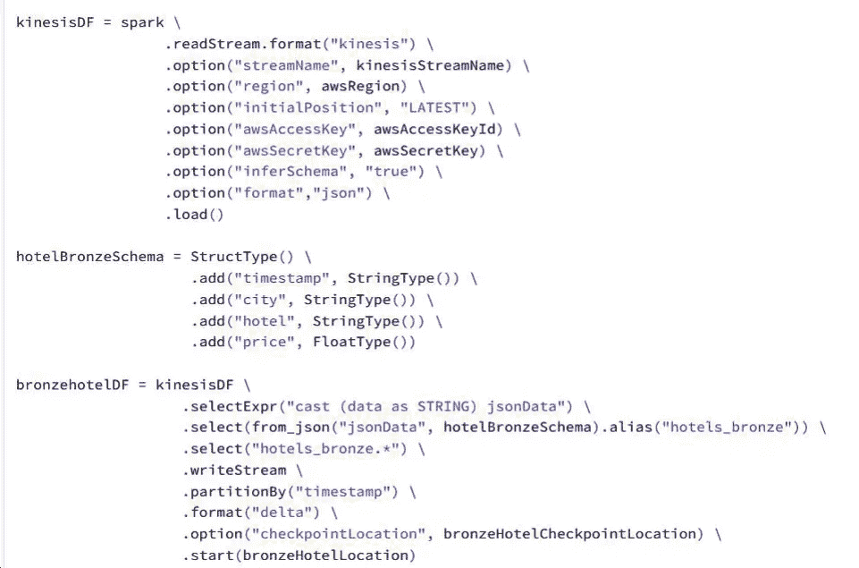

# 将 Delta Lake 用作下游应用程序的主数据管理（MDM）源

> 原文：[`towardsdatascience.com/use-delta-lake-as-the-master-data-management-mdm-source-for-downstream-applications-882250dc0b4a`](https://towardsdatascience.com/use-delta-lake-as-the-master-data-management-mdm-source-for-downstream-applications-882250dc0b4a)

## 在本文中，我们将尝试了解如何利用 Delta Lake 更改提要的输出来为下游应用程序提供数据

[](https://mkukreja1.medium.com/?source=post_page-----882250dc0b4a--------------------------------)[](https://towardsdatascience.com/?source=post_page-----882250dc0b4a--------------------------------) [Manoj Kukreja](https://mkukreja1.medium.com/?source=post_page-----882250dc0b4a--------------------------------)

·发布于 [Towards Data Science](https://towardsdatascience.com/?source=post_page-----882250dc0b4a--------------------------------) ·9 min read·2023 年 2 月 5 日

--


图片由 [Satheesh Sankaran](https://pixabay.com/users/satheeshsankaran-11196627/?utm_source=link-attribution&utm_medium=referral&utm_campaign=image&utm_content=7206402) 提供，来自 [Pixabay](https://pixabay.com//?utm_source=link-attribution&utm_medium=referral&utm_campaign=image&utm_content=7206402)

根据 ACID 规则，隔离理论指出“***任何事务的中间状态不应影响其他事务***”。几乎每个现代数据库都是为了遵循这一规则而构建的。不幸的是，直到最近，同样的规则在大数据领域还未能有效实施。这是什么原因呢？

现代分布式处理框架，如 **Hadoop MapReduce** 和 **Apache Spark**，以批处理的方式进行计算。计算完成后，会生成一组输出文件，每个文件存储一系列记录。通常，分区和减少器的数量会影响生成的输出文件数量。但也存在一些问题：

1.  轻微的记录级更改或新增记录（CDC）会迫使你每次都重新计算整个批处理——这是一种巨大的计算周期浪费，影响了成本和时间。

1.  下游消费者在批处理重新计算期间可能会看到不一致的数据


作者提供的图片

> Delta Lake 框架为 Spark 计算添加了事务管理的概念。通过支持 ACID 事务、模式强制、索引、版本控制和数据修剪，Delta Lake 旨在提高数据的可靠性、质量和性能。

简单来说，即使添加或更改了一些 CDC 记录，也无需**重新计算**整个批次。相反，它提供了插入、更新、删除或合并数据的功能。Delta Lake 通过选择包含已更改数据的文件，将其读入内存，然后将结果写入新文件来工作。


作者提供的图片

**Delta Lake** 被广泛用作实现现代数据湖屋架构的基础。它的核心功能使其非常适合将来自不同来源和不同模式的数据集合并到一个通常被称为“***单一真实来源***”的公共数据层中。这个“***单一真实来源***”即 MDM 层，用于支持所有的分析工作负载，包括 BI、数据科学、机器学习和人工智能。

在本文中，我们将尝试进一步拓展对 Delta Lake 的理解。如果 Delta Lake 可以作为**汇**来合并来自不同来源的数据，那我们为什么不能将其用作**源**来捕获下游消费者的变更数据（CDC）呢？如果我们能使用[奖章架构](https://databricks.com/notebooks/delta-lake-cdf.html)来实现这一点，那就更好了。奖章架构可以用来将来源系统中的 CDC 数据合并到数据湖屋的青铜层、白银层和黄金层。

更好的是，我们可以以流的方式捕获变更并将其发布到下游消费者。让我们探讨一个用例：

+   酒店价格在一天内会发生多次变化

+   一家电子商务公司专注于追踪全球最新的酒店价格，并在其网站门户上展示这些信息，以便客户可以根据实时数据进行预订。


作者提供的图片

在此示例中，我们将使用生产者程序从三个 API 来源读取实时价格信息。生产者将以 JSON 格式将数据作为事件发送到 Amazon Kinesis。然后，我们将在 Databricks notebook 中使用结构化流来读取这些事件。最后，CDC 事件被传输到关系数据库。这个关系数据库被电子商务门户用来展示不断变化的酒店价格。

## **执行运行 CDF Notebook 的前置步骤**

上述示例的代码可以在以下位置找到：

[](https://github.com/mkukreja1/blogs/tree/master/cdc-source?source=post_page-----882250dc0b4a--------------------------------) [## blogs/cdc-source at master · mkukreja1/blogs

### 目前无法执行该操作。您已在另一个标签或窗口中登录。您已在另一个标签或窗口中注销…

github.com](https://github.com/mkukreja1/blogs/tree/master/cdc-source?source=post_page-----882250dc0b4a--------------------------------)

要运行此代码，你需要拥有有效的 AWS 和 Databricks 帐户。在 Databricks 中运行笔记本之前，需要在 AWS 上完成一些前提步骤：

+   使用下面的链接获取 AWS 访问密钥。访问密钥（访问密钥 ID 和秘密访问密钥）将作为 Databricks 笔记本访问 AWS 服务（如 Amazon Kinesis）的凭证。[`console.aws.amazon.com/iam/home?region=us-east-1#/security_credentials`](https://console.aws.amazon.com/iam/home?region=us-east-1#/security_credentials)

+   在连接到 AWS 门户时，点击 AWS 云终端菜单。然后运行下面的命令以创建本文所需的前提 AWS 资源：

```py
$ git clone <LINK>
$ cd blogs/cdc-source
$ sh pre-req
```


作者提供的图片

+   启动将从 API 读取事件并将其发送到 Amazon Kinesis 的生产者。

```py
$ nohup python3 hotel-producer.py &
```


作者提供的图片

+   保持 AWS 云终端会话运行。从这里开始，生产者将每 5 分钟将事件发送到 Amazon Kinesis。

## **Delta Lake 更改馈送正在运行中！**

现在我们已经在 AWS 上创建了前提资源，我们准备好将 CDC 作为源笔记本进行运行。Databricks 笔记本中的代码将从 Amazon Kinesis 读取事件，将更改合并到铜层，然后进行清理并将结果合并到银层。所有这些都将在流式处理的方式中完成，最后，结果（更改数据馈送）将同步到外部关系数据库表。在此时，你需要登录到你的 Databricks 帐户。

## **准备 Delta Lake 作为更改数据馈送源笔记本环境**

将 [delta-as-cdc-source-notebook.ipynb](https://github.com/mkukreja1/blogs/blob/master/cdc-source/delta-as-cdc-source-notebook.ipynb) 笔记本导入到你的 Databricks 工作区。要运行笔记本，你需要用前一节中获取的值替换三个变量（*awsAccessKeyId*、*awsSecretKey* 和 *rdsConnectString*）。


作者提供的图片

## 在铜层中创建 Delta 表

我们将从 Amazon Kinesis 读取事件。默认情况下，Databricks 运行时包括结构化流的 Kinesis 连接器。你可能已经注意到，我们在流的有效载荷中发送了 JSON 事件。在下面的示例中，我们使用结构化流读取事件，将架构应用于 JSON，提取其中的值，最后将结果保存为铜层中的 Delta 表。我们选择 Amazon S3 作为所有 Delta 表的存储位置。



作者提供的图片

注意到铜层中的数据是事件数据的原始表示，因此我们遵循匹配原始流形式的架构。

## **在更改数据流中策划数据**

从这里开始，铜层表将根据从 Kinesis 流读取的数据不断添加**新分区**。在铜层中选择时间戳作为分区列是一个好习惯。这有助于轻松识别从源读取的事件的时间顺序，并在未来需要重放事件时发挥重要作用。

在下一步中，我们将进行一些转换以整理数据，例如将 Unix 纪元时间转换为日期、更改数据类型和拆分字段。


作者提供的图片

我们现在准备将数据合并到银层中。但是在此之前，我们需要了解 CDC 在结构化流中的工作原理。更重要的是，Delta 层的变更日志流如何发布到下游消费者？

## **理解 Delta 作为变更流的流程**

参考下面的示例，我们可以了解使用 Delta Lake 作为数据源的变更数据流动。在结构化流处理数据时，数据会被处理成**微批次**。实施过程中包括将变更数据同时写入多个表，这也称为幂等写入，如下所示：

1.  银层表（**hotels_silver**），其中每个微批次中的记录要么作为新记录插入，要么合并到现有记录中。每次变更都会创建 Delta 表的新版本。

1.  一个变更日志表（**change_log**）存储***键***和***batchId***。将该表中的数据视为时间上的不可变更日志。

在下面的示例中，铜层流显示了**Marriott** 酒店在**纽约**的两条记录（在下图中突出显示）。注意这两条记录随时间变化的价格差异。时间上，当第一条记录从 Kinesis 读取时，其**时间戳=022–02–16T21:06:57** 被分配为**batchId=2**。现在，如果我们使用 *change_log* 表中的键将记录与 *hotels_silver* 表中的记录连接起来，我们可以重建该行并将其作为 CDC 记录发送给下游消费者。在下面的示例中，相同的记录在不同的时间间隔内被发送了两次。


作者提供的图片

第二次变更记录的**时间戳=022–02–16T21:07:41** 被分配为**batchId=3**并发送到下游。下游消费者可以接收 CDC 并保持其状态与持续变化保持同步。

## **将 Delta 实现为变更数据流**

了解数据流动后，让我们深入探讨实际实现。下面的函数在微批次级别运行。对于每个微批次，该函数会对银层以及变更记录表执行**幂等**写入。


该函数通过 *foreachBatch()* 操作调用，该操作允许对流查询的输出进行任意操作和写入逻辑。在下面的代码中，我们同时对两个表执行了经过整理的数据流的幂等写入。


作者提供的图片

在幂等写入进行的同时，对于每个新的微批次，变更数据会与银层表连接，以重建 CDC 记录。


作者提供的图片

然后，可以将重建的 CDC 记录同步到下游。在下面的例子中，我们将 CDC 记录发送到关系型数据存储。


作者提供的图片

关系型数据存储接收**不可变**的 CDC 记录流，并执行**去重**逻辑，以便在其应用程序中显示最新的记录等效项。让我们在下面的部分检查这如何发生。

## **在下游消费者中检查酒店价格**

现在我们已经将 CDC 流推送到下游消费者（在我们的例子中是关系型 MySQL 数据库），让我们查询几个记录以查看记录如何演变。来自 Databricks 笔记本的 CDC 记录流正在不断推送到*hotelcdcprices*表。但该表包含所有记录，包括随时间变化的记录。因此，创建了一个视图来根据时间戳对变更行进行排序。


作者提供的图片

此视图显示了任何酒店在任何给定时间的最新价格等效项。此视图可供 Web 应用程序使用，以在门户上显示最新价格。


作者提供的图片

## 变更数据馈送的典型用例是什么？

下面是一些常见的用例，可以从使用 Delta 表作为合并来自不同来源的 CDC 数据并将其下传给消费者中获益：

**以流式方式读取变更数据馈送并合并到银层**

从流数据源捕获 CDC 并将微批次连续合并到银层。

**在黄金层中执行聚合而无需重新计算整个批次**

仅使用银层中的变更数据，在黄金层中汇总相应的行，无需重新计算整个批次。

**透明地将 Delta 表中的变更传输给下游消费者**

轻松将变更传输到下游消费者，如关系型数据库和应用程序。

总结来说，使用 Delta 表中的变更数据馈送功能，不仅可以简化 CDC 数据的收集和合并过程，还可以将变更数据下传到关系型数据库、No-SQL 数据库以及其他应用程序。这些下游应用可以有效地利用这些 CDC 数据来满足任何必要的目的。

我希望这篇文章对你有所帮助。Delta Lake 和 Change Data Feed 是由 [Datafence Cloud Academy](http://www.datafence.com) 提供的 AWS 大数据分析课程的一部分。课程由我本人在周末在线授课。
