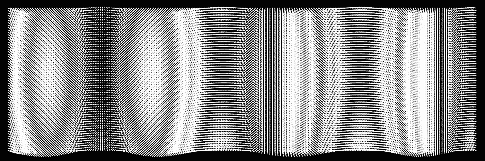

# 更频繁地使用频率

> 原文：[`towardsdatascience.com/use-frequency-more-frequently-14715714de38?source=collection_archive---------6-----------------------#2023-05-18`](https://towardsdatascience.com/use-frequency-more-frequently-14715714de38?source=collection_archive---------6-----------------------#2023-05-18)

## 从简单到高级的频率分析手册：探索一个在数据科学中广泛未被充分利用的重要工具

 [Daniel Warfield](https://medium.com/@danielwarfield1?source=post_page-----14715714de38--------------------------------)

·

[关注](https://medium.com/m/signin?actionUrl=https%3A%2F%2Fmedium.com%2F_%2Fsubscribe%2Fuser%2Fbdc4072cbfdc&operation=register&redirect=https%3A%2F%2Ftowardsdatascience.com%2Fuse-frequency-more-frequently-14715714de38&user=Daniel+Warfield&userId=bdc4072cbfdc&source=post_page-bdc4072cbfdc----14715714de38---------------------post_header-----------) 发表在 [Towards Data Science](https://towardsdatascience.com/?source=post_page-----14715714de38--------------------------------) ·20 分钟阅读·2023 年 5 月 18 日

--

频率分析在大量领域中极为有用。从音频到机械系统，再到自然语言处理和无监督学习。对于许多科学家和工程师来说，它是一个重要的工具，但对于许多数据科学家和开发者来说，它几乎不被理解。如果你对频率分析不太了解，不必担心，你刚刚找到了你的手册。

图片由 Daniel Warfield 使用 p5.js 创建。除非另有说明，本文件中的所有图片均使用 p5.js 或 Python 的 Matplotlib 库创建。

**这对谁有用？** 任何处理几乎任何信号、传感器、图像或 AI/ML 模型的人。

**这篇文章有多高级？** 这篇文章适合初学者，并包含即使是频率分析领域的高级用户也会感兴趣的示例。无论你的技能水平如何，你都可能从这篇文章中获得一些收获。

**你将从这篇文章中获得什么？** 你将获得对波动和频率的概念性和数学性理解，实际运用这些概念的 Python 实践理解，一些常见的使用案例，以及一些更高级的使用案例。

**注意：** 为了帮助你快速浏览，我已将子章节标记为**基础**、**中级**和**高级**。这是一篇长文章，旨在将读者从零基础提升到…
