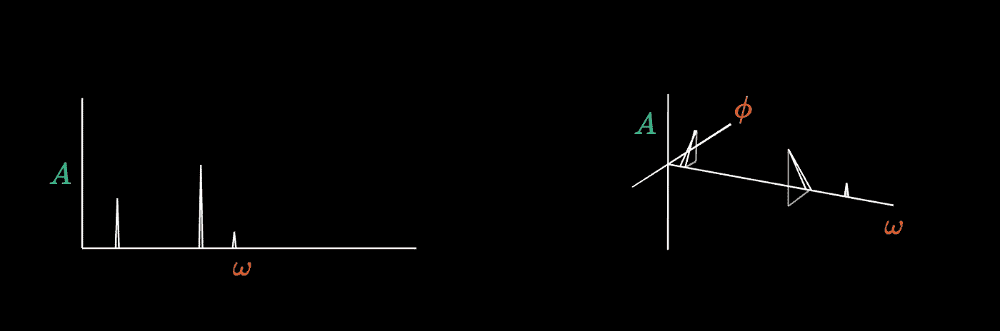

# 更频繁地使用频率分析

> 原文：[`towardsdatascience.com/use-frequency-more-frequently-14715714de38`](https://towardsdatascience.com/use-frequency-more-frequently-14715714de38)

## 一本从基础到高级的频率分析手册：探索一个在数据科学中广泛被低估的重要工具

[](https://medium.com/@danielwarfield1?source=post_page-----14715714de38--------------------------------)[](https://towardsdatascience.com/?source=post_page-----14715714de38--------------------------------) [Daniel Warfield](https://medium.com/@danielwarfield1?source=post_page-----14715714de38--------------------------------)

·发布于 [Towards Data Science](https://towardsdatascience.com/?source=post_page-----14715714de38--------------------------------) ·阅读时间 20 分钟·2023 年 5 月 18 日

--

频率分析在众多领域中极其有用。从音频到机械系统，再到自然语言处理和无监督学习。对许多科学家和工程师来说，它是一个重要的工具，但对许多数据科学家和开发者来说，它几乎不为人知。如果你不了解频率分析，不用担心，你刚刚找到了一本手册。


图片由 Daniel Warfield 使用 p5.js 制作。本文档中的所有图片均使用 p5.js 或 Python 的 Matplotlib 库创建，除非另有说明。

**这对谁有用？** 任何处理几乎所有信号、传感器、图像或 AI/ML 模型的人。

**这篇文章有多高级？** 这篇文章适合初学者，包含的示例也会引起即使是最高级的频率分析用户的兴趣。无论你的技能水平如何，你都能从这篇文章中获得一些有用的东西。

**你将从这篇文章中获得什么？** 对波动和频率的概念性和数学性理解，对如何在 Python 中应用这些概念的实际理解，一些常见的使用案例以及一些更高级的使用案例。

**注意：** 为了帮助你快速浏览，我将子章节标记为**基础**、**中级**和**高级**。这是一篇长文，旨在让从零开始的读者掌握相关知识。然而，如果你已经在频率领域有了教育或经验，你可以跳过中级部分，直接阅读高级主题。

我还设置了**链接**，方便你点击导航到目录以及从目录返回

# 目录

点击链接以导航到特定部分

**1) 频率领域**

1.1) 频率领域的基础（基础）

1.2) 频率领域的细节（中级）

1.3) Python 中的简单示例（中级）

**2) 频域的常见应用** 2.1) 去趋势和信号处理（中级）

2.2) 振动分析（高级）

**3) 频域的高级应用**

3.1) 数据增强（高级）

3.2) 嵌入和聚类（高级）

3.3) 压缩（中级）

**4)** **数据科学家的概念要点** **5)** **总结**

# **1) 频域**

## **1.1) 频域基础（基础）**

(返回目录)

首先，什么是 *领域*？假设你想理解温度随时间的变化。仅仅阅读这句话，你可能会想象出这样的图表：


当你考虑某一时间段内的温度时，你可能会想象的场景

也许你想象时间从左到右进展，更高的温度对应更高的垂直点。恭喜你，你已经将数据映射到了一个二维时间 *领域* 中。换句话说，你把在某些时间记录的温度读数映射到一个时间为一轴、值为另一轴的空间中。

我们还有其他方式来表示温度与时间的数据。如你所见，这些数据具有“周期性”特征，意味着它来回振荡。许多数据以这种方式表现：声音、心跳的 ECG 数据、加速度计等运动传感器，甚至图像。在某种程度上，很多事物的数据都是周期性来回变化的。

> “如果你想发现宇宙的秘密，就要从能量、频率和振动的角度思考。” ― 尼古拉·特斯拉

我可以通过曲折的方式到达这一点，但一图胜千言。本质上，我们可以将温度图表拆解成一系列简单的波，这些波具有不同的频率和振幅（频率指波动的快慢，振幅指波动的高低），然后用这些波来描述数据。


所有不同频率和振幅的波组成了我们原始的波。你可能会注意到，有一条波比另外两条更为微妙，几乎在原始波中看不出来。找到这些隐藏的信息是频域分析的一大好处。

这些波是通过傅里叶变换提取的，傅里叶变换将我们的原始波从时间域映射到频域。频域中不是值对时间，而是振幅对频率。


每个提取的波都有一个频率和振幅。如果我们将频率绘制在 x 轴上，将振幅绘制在 y 轴上，我们就绘制了所谓的频谱图

总结来说，傅里叶变换将数据（通常，但不总是在时间域中）映射到频域中。频域描述了所有的波形，具有不同的频率和振幅，这些波形加在一起可以重建原始波形。


原始波形在时间域中的表现，以及在频域中的频率内容。这两者描述的是相同的信号

## 1.2) 频域的细节（中级）

(返回目录)

*sin* 函数是三角形的对边与直角三角形的斜边的比值，针对某个角度。


θ(theta) 是一个直角三角形的角度，a 是 θ 对边的长度，c 是斜边的长度

*sin* 波是当你绘制 *a/c* 对于不同的 *θ*（不同的角度）时得到的结果，并且它在几乎所有的科学学科中作为最基本的波形使用。


正弦函数、直角三角形和正弦波之间的关系

通常 *sin(θ)* 被展开为 *A*sin(ωθ*+*ϕ)*。

***ω***(omega) 代表频率（*ω* 的值越大，正弦波的振荡速度越快）

***ϕ***(phi) 代表相位（改变 *ϕ* 会将波形向右或向左移动）

***A*** 影响函数的缩放，定义了振幅（振荡的大小）。


“A” 控制振幅（高度）， “omega” 控制频率（振荡速度）， “phi” 控制相位（左右移动）

当我解释频域时，我展示了一个简化的表示，其中水平轴是频率，垂直轴是振幅。实际上，频域不是二维的，而是三维的：一个维度表示频率，一个维度表示振幅，另一个维度表示相位。对于更高维度的信号（如图像），谱图可以具有更高的维度。



传统的振幅与频率谱图（左）与更具描述性的振幅、频率和相位图。

当将信号转换到频域（例如使用像 scipy 这样的库）时，你会得到一个虚数列表。

```py
[1.13-1.56j, 2.34+2.6j, 7.4,-3.98j, ...]
```

如果你不熟悉虚数，不用担心。你可以将这些列表想象成点，其中列表的索引对应于频率，而复数虚数分别代表振幅和相位的元组。

```py
[(1.13, 1.56), (2.34, 2.6), (7.4, -3.98), ...]
```

我还没有谈论这些数字的单位。由于单位本质上是对所有数据的线性变换，它们在数据科学的角度上常常可以忽略。然而，如果你将来使用频域，你可能会遇到像赫兹（Hz）、周期（T）等频域特有的概念。你将在示例中看到这些单位的详细说明。

如果你想更多地了解单位及如何作为数据科学家处理它们，我有一篇关于此的文章[在这里](https://medium.com/@danielwarfield1/how-to-deal-with-units-as-a-data-scientist-7d59fc0c6506)

## 1.3) Python 中的简单示例（中级）

(返回目录)

在这个示例中，我们加载了一个小号音乐片段，将其转换到频域，绘制频谱图，并使用频谱图来理解原始信号。

首先，我们将加载和绘制声音数据，这是一个随时间变化的幅度数据。该数据用于控制扬声器振膜的位置，振膜的振动产生声音。

```py
"""
Loading a sample waveform, and plotting it in the time domain
"""

#importing dependencies
import matplotlib.pyplot as plt     #for plotting
from scipy.io import wavfile        #for reading audio file
import numpy as np                  #for general numerical processing

#reading a .wav file containing audio data.
#This is stereo data, so there's a left and right audio audio channel
samplerate, data = wavfile.read('trumpet_snippet.wav')

#creating wide figure
plt.figure(figsize=(18,6))

#defining number of samples we will explore
N = 3000

#calculating time of each sample
x = np.linspace(start = 0, stop = N/samplerate, num = N)

#plotting channel 0
plt.subplot(2, 1, 1)
plt.plot(x,data[:N,0])

#plotting channel 1
plt.subplot(2, 1, 2)
plt.plot(x,data[:N,1])

#rendering
plt.show()
```


这是一个立体声小号音乐片段的左声道和右声道的时间域图。X 轴表示时间（秒），Y 轴表示信号的幅度，控制扬声器振膜的位置，从而产生声音。（原始小号数据来自 storyblocks.com）

让我们将这些波形转换到频域

```py
"""
Converting the sample waveform to the frequency domain, and plotting it

This is basically directly from the scipy documentation
https://docs.scipy.org/doc/scipy/tutorial/fft.html
"""

#importing dependencies
from scipy.fft import fft, fftfreq      #for computing frequency information

#calculating the period, which is the amount of time between samples
T = 1/samplerate
#defining the number of samples to be used in the frequency calculation
N = 3000

#calculating the amplitudes and frequencies using fft
yf0 = fft(data[:N,0])
yf1 = fft(data[:N,1])
xf = fftfreq(N, T)[:N//2]

#creating wide figure
plt.figure(figsize=(18,6))

#plotting only frequency and amplitude for the 1st channel
plt.subplot(2, 1, 1)
plt.plot(xf, 2.0/N * np.abs(yf0[0:N//2]))
plt.xlim([0, 6000])

#plotting only frequency and amplitude for the 2st channel
plt.subplot(2, 1, 2)
plt.plot(xf, 2.0/N * np.abs(yf1[0:N//2]))
plt.xlim([0, 6000])

plt.show()
```


之前加载的小号音频的频域表示。X 轴是频率（以赫兹为单位，即每秒振荡次数），Y 轴是信号的幅度。

仅通过可视化这个图表，可以得到一些见解。

1.  两个信号包含非常相似的频率内容，这很有意义，因为它们都来自同一录音。通常，立体声录音是用两个独立的麦克风同时录制的。

1.  主频率大约为 523Hz，对应于 C5 音符。

1.  有大量的共鸣，这可以看作是基频整数倍的频率处的尖峰。这种特性在使乐器声音良好时至关重要，是由于乐器的各个部分在不同频率下共鸣，而这些共鸣是由主要振动引起的。

1.  这是一个非常清晰的声音，音峰没有被大量无关的频率内容弄得模糊不清。

1.  这是一个有机的声音。有些频率内容与基频无关。这可以被认为是乐器的音色，使其听起来像小号，而不是其他乐器演奏相同的音符。

在第二部分中，我们将探讨频域在时间序列信号处理中的常见用途。在第三部分中，我们将探讨更高级的话题。

# 2) 频域的常见用途

## 2.1) 去趋势化和信号处理（中级）

(返回目录)

假设你有一个电气系统，并且你想了解在一天时间内该系统的逐分钟电压变化。你设置一个电压计，捕捉并绘制电压随时间的变化信息。

假设在这个例子中，我们只关心逐分钟数据的图表，并且我们将频率过高的波视为噪声，将频率过低的波视为我们想忽略的趋势。


我们不关心几个小时内发生的长期趋势。我们感兴趣的是逐分钟数据（由作者合成生成的原始数据）


我们关心的是这个时间范围内的趋势


我们不关心振荡过快的波，这些被视为信号中的噪声

所以，在这个例子中，我们只关心观察振荡频率低于每秒一次，并且高于每 5 分钟一次的内容。我们可以将数据转换到频域，去除所有不感兴趣的频率，然后转换回时间域，以便仅包括我们感兴趣的趋势来可视化波形。

首先，让我们观察未更改的频域：

```py
"""
Plotting the entire frequency domain spectrogram for the mock electrical data
"""

#load electrical data, which is a numpy list of values taken at 1000Hz sampling frequency
x, y = load_electrical_data()
samplerate = 1000
N = len(y)

#calculating the period, which is the amount of time between samples
T = 1/samplerate

#calculating the amplitudes and frequencies using fft
yf = fft(y)
xf = fftfreq(N, T)[:N//2]

#creating wide figure
plt.figure(figsize=(18,6))

#plotting only frequency and amplitude for the 1st channel
plt.plot(xf, 2.0/N * np.abs(yf[0:N//2]))

#marking units of the two axis
plt.xlabel('fq (Frequency in Hz)')
plt.ylabel('V (Volts)')

#setting the vertical axis as logorithmic, for better visualization
plt.gca().set_yscale('log')

#rendering
plt.show()
```


这是我们正在分析的电气系统的完整未过滤频谱图

我们可以将所有我们不感兴趣的频率内容设置为零。通常你会使用像巴特沃斯滤波器这样的特殊滤波器来完成这个任务，但我们会保持简单。

```py
"""
converting the data to the frequency domain, and filtering out
unwanted frequencies
"""

#defining low frequency cutoff
lowfq = 1/(5*60)

#defining high frequency cutoff
highfq = 1

#calculating the amplitudes and frequencies, preserving all information
#so the inverse fft can work
yf = fft(y)
xf = fftfreq(N, T)

#applying naiive filter, which will likely create some artifacts, but will
#filter out the data we don't want
yf[np.abs(xf) < lowfq] = 0
yf[np.abs(xf) > highfq] = 0

#creating wide figure
plt.figure(figsize=(18,6))

#plotting only frequency and amplitude
plt.plot(xf[:N//2], 2.0/N * np.abs(yf[0:N//2]))

#marking units of the two axis
plt.xlabel('fq (Frequency in Hz)')
plt.ylabel('V (Volts)')

#setting the vertical axis as logorithmic, for better visualization
plt.gca().set_yscale('log')

#zooming into the frequency range we care about
plt.xlim([-0.1, 1.1])

#rendering
plt.show()
```


我们所隔离的频域图，其它频率信息都设置为零

现在我们可以进行逆快速傅里叶变换，以重构我们关心的数据波形

```py
 """
Reconstructing the wave with the filtered frequency information
"""

#importing dependencies
from scipy.fft import ifft      #for computing the inverse fourier transform

#computing the inverse fourier transform
y_filt = ifft(yf)

#creating wide figure
plt.figure(figsize=(18,6))

#plotting
plt.plot(x,y_filt)

#defining x and y axis
plt.xlabel('t (seconds)')
plt.ylabel('V (volts)')

#looking at a few minutes of data, not looking at 
#the beginning or end of the data to avoid filtration artifacts
plt.xlim([60*2,60*10])

#rendering
plt.show()
```


几分钟的数据，启用了我们的滤波器。我们已经去除了过高频率的内容，并通过去除过低频率的内容将波形集中在 0 附近。

就这样。我们成功地去除了我们不关心的高频信息，并通过去除低频趋势将我们关心的数据集中在零附近。我们现在可以使用这逐分钟数据来深入了解我们正在测量的电气系统。

## 2.2) 振动分析（高级）

(返回目录)

我在之前的例子中已经介绍了振动分析，以分析声波的形式。在这个例子中，我将讨论分析物理系统中的振动，比如工厂中的电机。

预测某些电机何时需要维护可能是困难的。通常，像对齐不当这样简单的问题会发展成更严重的问题，例如完全的发动机故障。我们可以使用周期性收集的频率记录来帮助我们了解电机是否以不同的方式运行；从而让我们在问题变成更大的问题之前对发动机进行诊断。


在发动机经历轻微故障的期间采集的振动数据。在时间域中，几乎不可能看到故障发生的时间。（原数据由作者合成生成）

为了分析这些数据，我们将计算并呈现所谓的梅尔频谱图。梅尔频谱图就像普通的频谱图，但不是计算整个波形的频率内容，而是从信号中提取小的滚动窗口中的频率内容。这使我们能够绘制**频率内容随时间变化的情况**。

```py
"""
plotting a mel-spectrogram of motor vibration to diagnose the point of failure

note: if you don't want to use librosa, you can construct a mel-spectrogram
easily using scipy's fft function across a rolling window, allowing for more
granular calculation, and matplotlib's imshow function for more granular
rendering
"""

#importing dependencies
import librosa              #for calculating the mel-spectrogram
import librosa.display      #for plotting the mel spectrogram

#loading the motor data
y = load_motor_data()
samplerate = 1000 #in Hz

#calculating the mel spectrogram, as per the librosa documentation
D = np.abs(librosa.stft(y))**2
S = librosa.feature.melspectrogram(S=D, sr=samplerate)

#creating wide figure
fig = plt.figure(figsize=(18,6))

#plotting the mel spectrogram
ax = fig.subplots()
S_dB = librosa.power_to_db(S, ref=np.max)
img = librosa.display.specshow(S_dB, x_axis='time',
                         y_axis='mel', sr=samplerate,
                         fmax=8000, ax=ax)
fig.colorbar(img, ax=ax, format='%+2.0f dB')
ax.set(title='Mel-frequency spectrogram')

#rendering
plt.show()
```


电机数据的梅尔频谱图。与二维频谱图不同，梅尔频谱图是三维的：垂直轴是振荡频率，x 轴是时间（在这种情况下是时间的百分比），颜色代表幅度，以分贝为单位。注意在时间 0.2 时，电机的频率内容突然发生变化。

在梅尔频谱图中，每个垂直切片代表一个时间区域，高频内容显示在图上方，低频内容显示在图下方。很容易看出在时间 0.2（数据的 20%处），频率内容发生了剧烈变化。在这一点上，一个平衡重物变松，导致发动机失衡。在此时进行维护可能会避免未来的过度磨损。

一种简单而有效地应用这一原理的方法是通过定期振动读数。工人将一个加速度计通过磁铁固定在电机的机体上，并每月记录一次或两次频率内容。这些振动数据窗口随后被转换到频率域，在那里提取某些关键特征。一个常见的频率域提取特征是功率谱密度，实际上是某些频率区域下频率域曲线的面积。提取的特征可以绘制在几周的记录上，并用作整体电机健康状况的代理。

# 3) 频率域的高级应用

## 3.1) 数据增强（高级）

(返回目录)

数据增强是从真实数据中创建假数据的过程。一个典型的例子是图像分类，以增强一个用于分类图像是否是狗还是猫的数据集。


图像增强的示例，其中单张图像可以用来生成多个图像供机器学习模型学习。由 Affinity Designer 2 创建，图片来自 storyblocks.com

增强可以是一个极其强大的工具，但如果你没有图像怎么办？如果你有声音、运动、温度或其他信号呢？如何合理地增强这些类型的数据？在时间域中，增强策略更像是正则化策略：在这里添加一点噪声，在那里上下移动数据。它们向数据中添加随机信息，这可能有用，但实际上并不会生成新的示例。

我们可以借鉴音乐制作场景中的一个概念：波形表。波形表的思想是将两个波形转换到频域，在频域中进行插值，然后将插值转换回时间域。我并不是指混合，将一个信号叠加在另一个信号上，而是创建一个完全新的波形，其中包含两个（或更多）其他波形的频率内容。

让我们假设我们正在尝试构建一个模型来检测音频片段中是否有人在说话。我们有一堆包含人们说话的音频样本，还有一堆没有人说话的样本，且都在各种不同的情况下。这些数据需要有人带着不同的麦克风去捕捉声音，然后手动标记数据是否包含有人说话，且涉及各种情况。假设模型必须非常稳健和准确，而录制足够的数据以达到所需的性能水平在财务上是不可行的。

理论上，使人类语音听起来像这样的是频率内容。将一个谈话片段和另一个谈话片段的频率内容混合起来，应该仍然听起来像有人在说话。我们可以使用波形表来构造这些人工波形，从而免费生成更多数据（除了数据科学家的薪水和云端昂贵的计算资源）。

```py
"""
loading and plotting two waveforms recorded in two seperate environments,
both including people talking
"""

#loading two waveforms
samplerate, y1 = wavfile.read('crowd.wav')
_,          y2 = wavfile.read('citycenter.wav')

#creating x axis for both waveforms
N = 1000000
x1 = np.linspace(start = 0, stop = N/samplerate, num = N)
x2 = np.linspace(start = 0, stop = N/samplerate, num = N)

#creating wide figure
plt.figure(figsize=(18,6))

offset = 1000000

#plotting waveform 1
plt.subplot(2, 1, 1)
plt.plot(x1,y1[offset:offset+N])
plt.xlabel('t (seconds)')
plt.ylabel('A (db)')

#plotting waveform 2
plt.subplot(2, 1, 2)
plt.plot(x2, y2[offset:offset+N])
plt.xlabel('t (seconds)')
plt.ylabel('A (db)')

#rendering
plt.show()
```


两个波形，均明显包含人们说话的声音。（原始数据来自 storyblocks.com）

我们可以将这两个波形转换到频域，并创建几个在这两个波形之间的频率表示。

```py
"""
Converting both waves to the frequency domain, constructing a wave table, and rendering the wave table
"""

#calculating the frequency content for both waves.
#Only analyzing 1 of the 2 stereo channels
fq1 = fft(y1[offset:offset+N,0])
fq2 = fft(y2[offset:offset+N,0])

#defining frequency axis
T = 1/samplerate
xf = fftfreq(N, T)

#creating wide figure
fig = plt.figure(figsize=(18,6))
ax = fig.add_subplot(111, projection='3d')

#plotting source waves
plt.plot(xf[:N//2], np.array([1]*(N//2)), 2.0/N * np.abs(fq1[0:N//2]))
plt.plot(xf[:N//2], np.array([0]*(N//2)), 2.0/N * np.abs(fq2[0:N//2]))

fq_interp = []
#creating interpolations
for per in np.linspace(0.1,0.9,9):
    thisfq = (fq1*per) + (fq2*(1-per))
    fq_interp.append((per, thisfq))

    #plotting interpolation
    plt.plot(xf[:N//2], np.array([per]*(N//2)), 2.0/N * np.abs(thisfq[0:N//2]))

plt.show()
```


原始波形（在极端位置）和中间波形的频谱图。请注意，图表显示的频谱图为频率与振幅，但插值也在相位上进行。

现在我们可以对所有这些插值的频域计算逆快速傅里叶变换，并提取我们的波形表。

```py
"""
Computing the inverse fft on the frequency content, and constructing the final table of waves
"""

#creating wide figure
fig = plt.figure(figsize=(18,6))
ax = fig.add_subplot(111, projection='3d')

plt.plot(x, np.array([1]*len(x)), y1[offset:offset+N,0])
plt.plot(x, np.array([0]*len(x)), y2[offset:offset+N,0])

#creating interpolations
for per, interp in fq_interp:

    waveform = ifft(interp)

    plt.plot(x, np.array([per]*len(x)), waveform)

plt.show()
```


最终的波形表。极端的波形是源波，而中间的波形是在频域中的插值。

就这样。从 2 个讨论波形，我们现在有了 10 个讨论波形。数据增强可能是一个棘手的任务，因为你可能会创建不实际反映你试图模拟的数据的内容。当使用类似的增强策略时，你可以使用更接近源波形的增强（80% 一个波形，20% 另一个）。这些比接近中心的波形（50%，50%）更可能是现实的。

## 3.2) 嵌入和聚类（高级）

(返回目录)

对于这个示例，我们将使用情感分析模型的输出，基于客户情感随时间的变化对不同产品进行聚类。假设我们运营一家有评论的商店，这些评论在正面和负面之间波动。我们注意到一些评论彼此相关。我们想要找到具有相似情感分析趋势的产品，以便将它们分组在一起并进一步理解。

首先，让我们看看我们的数据：

```py
"""
loading 1000 average sentiment scores over the course of a year,
and plotting the first 10 of them
"""

#loading sentiment data
sentiments = load_sentiments()

#creating wide figure
plt.figure(figsize=(18,6))

#plotting first 10 sentiments
for i in range(10):
    plt.plot(sentiments[i])

#rendering 
plt.xlabel('days')
plt.ylabel('sentiment (low to high)')
plt.show()
```


前 10 个情感示例（数据由作者合成生成）

如你所见，我们有许多用户情感的示例，按天平均。我们可以去除非常低频的内容，这将去除非常长期的平均趋势（如平均值），同时去除非常高频的内容，这些是噪声，不太可能产生有用的聚类。

```py
"""
Converting to the frequency domain, removing very low and high frequency content, and plotting the results
We do this, so we can visually understand the frequency content which we deem important, before we begin clustering.
"""

#importing dependencies
from scipy.fft import fft, ifft      #for computing frequency information

#creating wide figure
plt.figure(figsize=(18,6))

#defining the low frequency and high frequency cutoffs
#because lowfq is so low, it effectively only cuts of the wave
#with a frequency of zero, which controls the vertical offset of the data
lowfq = 0.0001 
highfq = 0.05

#plotting first 10 sentiments
for i in range(10):

    #getting signal
    sig = sentiments[i]

    #calculating the frequency domain
    yf = fft(sig)
    T = 1
    N = len(sig)
    xf = fftfreq(N, T)

    #applying naiive filter
    yf[np.abs(xf) < lowfq] = 0
    yf[np.abs(xf) > highfq] = 0

    #converting back to the time domain, and plotting
    y = ifft(yf)
    plt.plot(y)

#rendering
plt.show()
```


最终，我们将会在频域中对数据进行聚类。我们生成这个图表只是为了确认我们是否保留了我们关心的内容类型：既不过于低频，也不过于高频。

现在我们完成了时间域的处理，将开始在频域中构建我们的聚类。让我们看看我们筛选后的频域图。


用于构建上述波形的频率内容

我们的聚类操作的输入将是一个振幅列表，每个振幅对应一个特定的频率。我们可以将这些数据输入到我们的聚类算法中，但还有一个额外的步骤可以带来显著的改进。想象一下，我们试图聚类四个简单的正弦波，其频域内容如下：


四个正弦波的频域表示，用于演示目的

你会期望左边的波形聚集在一起，右边的波形也紧密聚集在一起。然而，描述这些数据的向量看起来是这样的：

```py
[0,0,1,0,0,0,0,0,0,0,0,0,0,0,0,0]
[0,0,0,0,1,0,0,0,0,0,0,0,0,0,0,0]
[0,0,0,0,0,0,0,0,0,0,0,1,0,0,0,0]
[0,0,0,0,0,0,0,0,0,0,0,0,1,0,0,0]
```

从 t-SNE 的角度来看，这些波形都是彼此正交的，因为它们没有沿相似的轴共享任何值。我们可以通过使频域“模糊”来解决这个问题；我们可以对这些数据应用移动平均，使频率内容与邻近区域融合。


我们的样本数据，应用了双向指数移动平均，导致相似的频率内容互相渗透。

这些数据更有可能产生良好的聚类结果，因为相似的频率内容尖峰更容易互相渗透。让我们将这一概念应用到我们的情感数据样本图中：

```py
"""
Converting data to the frequency domain, and applying an exponential
moving average in both directions. This is the data we will be clustering.
"""

#converting data to frequencies, and filtering out content
wfs = [np.abs(fft(y)[0:N//2][1:20]) for y in sentiments[:10]]

#loading sample data into a pandas dataframe
df = pd.DataFrame(wfs).T

#applying an exponential moving average in both directions, and adding them
df_plt = df.iloc[::-1].ewm(span=3, adjust=False).mean().iloc[::-1]
df_plt = df.ewm(span=3, adjust=False).mean().add(df_plt)

#creating wide figure
plt.figure(figsize=(18,6))
plt.plot(df_plt)
```


经过滤波的频率数据，用于聚类。请记住，可以对这种一般方法进行许多更改。可以使用不同的高频和低频，可以使用不同范围的指数平均，可以对频率域进行归一化，以使相对幅度相似，等等。

由于我们的处理步骤，这些数据更有可能创建我们实际关心的数据簇。现在我们可以将所有这些整合在一起，创建我们的最终簇：

```py
"""
Converting all the sentiment waveforms to the frequency domain, 
applying filtration, and embedding in 2d with TSNE
"""

#importing dependencies
from sklearn.manifold import TSNE

#converting data to frequencies, and filtering out content, for al product sentiment waveforms
wfs = [np.abs(fft(y)[0:N//2][1:20]) for y in sentiments]

#loading sample data into a pandas dataframe
df = pd.DataFrame(wfs).T

#applying an exponential moving average in both directions, and adding them
df_plt = df.iloc[::-1].ewm(span=3, adjust=False).mean().iloc[::-1]
df_plt = df.ewm(span=3, adjust=False).mean().add(df_plt)

#creating wide figure
plt.figure(figsize=(18,6))

#embedding the data
embedding = TSNE(n_components=2 ,init='random', perplexity=20).fit_transform(df_plt.values.T)

#plotting
plt.scatter(embedding[:,0],embedding[:,1])
```


t-SNE 图，展示了所有用户情感产品评论的过滤频率域。

就这样！自然地，对于实际应用，生成此图表后还需要做大量工作。这些数据云很可能需要被探索，并可能需要标记，还需要进一步调整关键参数以获得更多洞察。不过在这个例子中，我们使用频率域对时间序列数据应用了聚类算法，使我们能够看到哪些情感以相似的方式波动。这种类型的分析可以为网站内的产品推荐提供信息。

## 3.3) 压缩（中级）

(返回目录)

信号包含大量数据。在每秒采样 96,000 次的情况下，几个小时的录音会生成巨大的音频文件。这些原始录音对于高质量音频处理非常有用，但当你完成工作并想要将样本发送给朋友时，你愿意为了速度和大小牺牲一些音频质量。你可以降采样到一个点（每秒发送更少的样本），但是，这会限制你可以发送的频率的最大音调（如果你每秒只发送 200 个样本，就不能发送高于 100 Hz 的任何频率）。相反，你可以将样本转换到频率域，将相似频率压缩在一起，然后发送频率域和采样率。接收者可以通过从频率域到时间域的变换来重建压缩后的音频。这使你能够发送任意高的频率，而无需发送任意大的数据量。例如，mp3 文件之所以比 .wav 文件小得多，是因为它们在编码中显著使用了傅里叶变换。

# 4) 数据科学家的概念性收获

(返回目录)

直接使用频率分析作为工具对于解决某些问题可能至关重要，正如我们在之前的例子中所看到的。经常被忽视的是将频率域作为一个概念的使用。作为数据科学家，可能很难理解自相似建模策略，如递归网络和卷积网络，尤其是在解决具体且微妙的问题时。有时，将这些问题视为准频率域提取可能更为有用。

例如，卷积网络使用在数据上传播的波形（卷积）。结果随后被池化，降低了数据的分辨率，然后应用进一步的波形。你可以将卷积视为提取**不同频率的信息**，通常是从高频信息到低频信息。记住这一点可以对步幅、内核大小和其他超参数有更直观的理解。

# 5) 总结

(返回目录)

在这篇文章中，我们涵盖了频率域，它如何与信号和正弦波相关，并看到了一些频率域表示的例子。我们看到如何将时间序列信号转换为频率域，反之亦然，并看到通过转换到频率域，如何解决几类问题。

# 关注更多内容！

在未来的帖子中，我将描述频率域如何应用于更高维度的信号，如图像和视频，以及如何在机器学习/数据科学应用中发挥巨大作用。我还将描述几个机器学习领域的标志性论文，重点关注实用和直观的解释。

**署名：** 本文档中的所有图片均由丹尼尔·沃菲尔德（Daniel Warfield）创作。只要你引用本文或[`danielwarfield.dev`](https://danielwarfield.dev)，你可以将本文中的任何图片用于个人非商业目的。

# 附言——加入我在 RoundtableML 的行列

RoundtableML 是一个充满活力的社区，雄心勃勃且积极进取的个人聚集在一起，协作并推动机器学习和人工智能应用的边界，以安全和负责任的方式。如果你渴望扩展机器学习知识，参与开放研究，深入科学论文，并在小型亲密小组中进行机器学习项目——这里就是你的理想之地！

你可以通过这个 Discord [邀请](https://discord.gg/3gT8PVggPN)加入。
