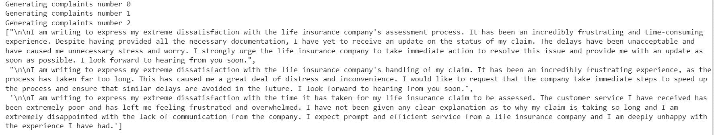
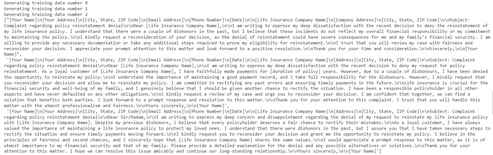

# 使用 GPT 模型生成用于训练机器学习模型的文本数据

> 原文：[`towardsdatascience.com/use-gpt-models-to-generate-text-data-for-training-machine-learning-models-3ff169ce5580`](https://towardsdatascience.com/use-gpt-models-to-generate-text-data-for-training-machine-learning-models-3ff169ce5580)

## Python 中的逐步指南

[](https://jin-cui.medium.com/?source=post_page-----3ff169ce5580--------------------------------)[](https://towardsdatascience.com/?source=post_page-----3ff169ce5580--------------------------------) [Jin Cui](https://jin-cui.medium.com/?source=post_page-----3ff169ce5580--------------------------------)

·发表在 [Towards Data Science](https://towardsdatascience.com/?source=post_page-----3ff169ce5580--------------------------------) ·9 min read·2023 年 7 月 12 日

--


图片由 [Claudio Schwarz](https://unsplash.com/@purzlbaum?utm_source=medium&utm_medium=referral) 提供，来源于 [Unsplash](https://unsplash.com/?utm_source=medium&utm_medium=referral)

# 动机

数据对于构建机器学习模型至关重要，但文本数据的收集却面临以下困难：

+   开源文本数据集是有限的。隐私规则和商业机密通常限制了特权数据的分发。此外，公开的数据集可能不具备商业使用的许可证，或者更重要的是，可能不具有相关的上下文。例如，IMDB 的电影评论可能对分析客户对银行产品的情感没有意义。

+   机器学习模型通常需要大量的训练数据才能有效运作。公司，特别是初创公司，可能需要大量时间来收集可靠的文本数据。此外，这些数据可能没有针对特定机器学习任务标注响应变量。例如，一家公司可能收集了客户的投诉原文，但可能没有详细了解这些投诉的主题或情感。

我们如何克服上述限制，以可扩展且具有成本效益的方式生成适合目的的文本数据？鉴于近期在大型语言模型和生成型人工智能方面的进展，本文*提供了一个关于通过调用 [OpenAI 的 GPT 模型套件](https://platform.openai.com/docs/models) 来生成合成文本数据的教程。

以演示为例，我们来探讨一个为保险公司生成客户投诉数据的用例。通过丰富的文本数据来训练语言模型，该用例是公司可能通过在自然语言理解任务中表现更好，例如将投诉分类到主题中或评分投诉者情感，从而实现更好的客户结果。

**这篇文章 100% 无 ChatGPT。*

## 前提条件：设置 OpenAI API 密钥

为了调用 GPT 模型，只需注册 OpenAI 账户并在 [用户设置](https://platform.openai.com/account/api-keys) 下访问 API 密钥。请务必保持此密钥的私密。

请注意，根据使用情况，访问 GPT 模型会有一定的 [费用](https://openai.com/pricing)，尽管对我来说这并不重要（准备此教程的费用不到 $0.08 美元）。

## 第一步：加载所需的 Python 包

```py
#!pip install openai if you haven't already, make sure you install
# and upgrade to the latest version

import os
import openai

import pandas as pd
import numpy as np
```

## 第二步：生成单个客户投诉

我们首先使用 *text-davinci-003* 模型在 GPT-3.5 模型套件下生成一个客户投诉数据点。

```py
openai.api_key = "INSERT YOUR API KEY STRING HERE"

prompt_text = "You are a customer of a life insurance company. \
              \n \nYou are extremely dissatisfied of the time it takes to assess your life insurance claim. It has been a horrible customer experience.\
              \n \nWhat would you say in a complaint you are going to raise against the life insurance company?"

complaint = openai.Completion.create(

    engine = "text-davinci-003",
    prompt =  prompt_text,
    temperature = 0.6,
    top_p = 1,
    max_tokens = 1000,
    frequency_penalty = 0,
    presence_penalty = 0

    )

print(complaint.choices[0].text)
```

请注意，关于上述代码：

+   你需要在代码的第一行插入你的私有 API 密钥字符串。

+   *prompt_text* 帮助 GPT 模型理解其角色，从而通过回应提示问题生成客户投诉。

+   代码中引用的其他参数（*temperature, top_n, max_tokens, frequency_penalty 和 presence_penalty*）在 [这一部分](https://medium.com/towards-data-science/beginners-guide-to-the-gpt-3-model-2daad7fc335a#2b15) 的文章中有更详细的解释。

上述代码生成的客户投诉是：

*我写信是为了表达对我所购买的寿险公司极度的不满。评估我的寿险索赔所花费的时间不可接受，对我的客户体验造成了严重影响。我觉得我等待如此长时间才能收到对我索赔的回复是不可接受的。我敦促公司立即采取行动解决这一问题，并确保所有客户未来都能收到及时且令人满意的回应。*

初看起来这似乎是合理且连贯的。

## 第三步：大规模生成客户投诉

你可能会争辩说，你可以通过在 ChatGPT 中输入 *prompt_text* 来简单地复制第二步。如果你只是想生成有限数量的数据点，你确实是对的。然而，对于大规模文本数据生成，手动在 ChatGPT 前端重复此操作完全不可行。那么，我们如何自动化这个任务（最终扩展生成客户投诉的操作）呢？答案在于对第二步代码的一个小调整。

由于 GPT 模型的设计以及 *temperature* 参数的性质决定了生成文本的创造力和多样性，因此第 2 步中每次运行代码都会生成不同的客户投诉。鉴于此，我们只需要设置一个循环来运行第 2 步中的代码 *n* 次，并存储每次运行的输出结果。

为了演示，下面的代码创建了一个循环，用于生成 *n = 3* 个投诉，并将输出存储在数据框中：

```py
prompt_text = "You are a customer of a life insurance company. \
              \n \nYou are extremely dissatisfied of the time it takes to assess your life insurance claim. It has been a horrible customer experience.\
              \n \nWhat would you say in a complaint you are going to raise against the life insurance company?"

text_gen = []

for i in range(0, 3):
  completion = openai.Completion.create(
      engine = "text-davinci-003",
      prompt = prompt_text,
      max_tokens = 120,
      temperature = 0.6,
      #top_p = 1,
      frequency_penalty = 0,
      presence_penalty = 0

      )

  text_gen.append(completion.choices[0]['text'])
  print('Generating complaints number %i'%(i))

text_gen
```

以下代码片段展示了生成的 3 条客户投诉。不用说，参数 *n* 可以设置为你选择的任意数字。



图像 1：生成的客户投诉。图片作者提供。

# 更高级的用例

## 零样本与少样本训练在 GPT 模型中的比较

根据上述用例向 GPT 模型提供独立的文本提示被视为**零样本**训练。通过零样本训练生成的文本数据可能会对特定任务略显通用。

在我们已经拥有有限但有意义的训练数据，并希望生成额外的训练数据以与现有数据相似的情况下，我们可以将 *prompt_text* 输入指向现有数据。这提供了 GPT 模型**少样本**训练。

例如，假设我们希望对 GPT 模型进行少样本训练，以生成一些类似于 IMDB 电影评论数据集的文本（假设你已将其存储在 *df_imdb* 变量中）：

```py
text_gen = []

for i in range(len(df_imdb)):

    prompt_text = f"The following are movie reviews with a positive sentiment. REVIEW: {df_imdb[i]} REVIEW:"

    review = openai.Completion.create(

        engine = "text-davinci-003",
        prompt =  prompt_text,
        temperature = 0.6,
        top_p = 1,
        max_tokens = 1000,
        frequency_penalty = 0,
        presence_penalty = 0

        )

    text_gen.append(review.choices[0].text)
```

请注意，这段代码还隐式地为生成的文本数据创建了标签。在这个实例中，我们正在生成‘正面’评论。具有‘负面’或‘中立’标签的文本数据也可以以类似的方式生成。这使我们能够获得带标签的数据集，而无需任何人工努力！

此外，这段代码展示了 GPT 模型能够通过识别文本提示中的模式生成数据，而无需通过问题进行引导。在这个实例中，它被训练以在给出“REVIEW:”提示后生成电影评论。

为了提高与现有数据的相似性，我们甚至可以用现有数据中的多个数据点进行少样本训练。可以通过更新*prompt_text*输入来轻松完成：

```py
prompt_text = 
  f"The following are movie reviews with a positive sentiment. REVIEW: {df_imdb[i]} REVIEW: {df_imdb[i-1]} REVIEW:"
```

## 其他 GPT 模型

到目前为止，*text-davinci-003* GPT 模型已被用来演示本文中的用例。其他 [GPT 模型](https://platform.openai.com/docs/models/gpt-3-5) 也可以通过 *engine* 参数按需调用。例如，某些 GPT 模型如 *gpt-3.5-turbo* 比其他模型更强大，但在 Python 中可能需要不同的调用方式，因为它们接受的是‘对话’作为输入，而不是文本字符串。

以下代码展示了调用 *gpt-3.5-turbo* 模型生成投诉数据。

```py
 dialogue = [
        {"role": "system", "content": "You are a helpful assistant."},
        {"role": "user", "content": "My life insurance company won't let me reinstate my policy after a couple of dishonours?"},
        {"role": "assistant", "content": "I'm sorry to hear that, is there anything I can help you with."},
        {"role": "user", "content": "Yes, you can draft me a complaint directed at the life insurance company, in no more than 100 words"}
    ]

text_gen_chat = []

for j in range(0, 3):

    res = openai.ChatCompletion.create(
      model = "gpt-3.5-turbo",
      messages = dialogue,
      temperature = 0.6

  )

    text_gen_chat.append(res.choices[0].message.content)
    print('Generating complaints data number %i'%(j))

text_gen_chat
```

输出结果：



图像 2：生成的客户投诉。图片作者提供。

# 风险

虽然上述用例展示了 GPT 模型（或更广义的大型语言模型）的即刻实施，但鉴于这些模型相对较新，用户可能需要对将这些模型与实际数据和工作方式整合所固有的已知和未知风险保持谨慎。特别是在生成用于训练机器学习模型的文本数据时，戴上我的风险和治理帽子，以下是我认为在实际实施技术时的关键（已知）风险：

+   关于通过 OpenAI 的 API 端点提供某些类型的输入给 GPT 模型，可能存在**隐私**问题。这在公司利用专有数据生成增强文本数据时尤其相关（如上文的**高级用例**讨论），特别是当输入内容如包含个人信息的客户投诉时。一种潜在的缓解措施是，在预处理步骤中去标识个人信息，以确保投诉数据以匿名方式使用。此外，使用这种技术的公司需要制定监管措施和政策，管理私人和敏感信息的使用。

+   对于某些类型的用例，GPT 模型生成的文本数据可能会引入**偏见**。例如，由于 GPT 模型是基于大量互联网上公开文本的语料库进行预训练的，因此在生成正面和负面客户反馈的任务中，它可能天然倾向于后者（即客户投诉），假设这些内容在互联网上更为突出。此外，生成的文本可能没有‘细致调整’到适应公司提供的特定产品特性，因为相关文本可能在互联网上不可用。这最终表现为在高效文本数据生成与数据可用性之间的权衡。

+   关于**时效性**，尽管预计 GPT 模型将继续获得更新，但在撰写本文时，大多数模型的训练数据基于截至 2021 年 9 月的互联网数据（即将近 2 年前）。

与大语言模型相关的其他已知风险，如**幻觉**，在此背景下较不相关。

# 结论

本文提供了一种实际的（和生成的）方法来解决获取用于训练机器学习模型的文本数据的一些实际约束。

退一步说，正确关注和处理风险的情况下，本文展示了用户如何从‘后端’访问 OpenAI 的 GPT 模型。这使用户能够解锁利用大型语言模型支持 ChatGPT 的商业机会，ChatGPT 最初是为个别临时用例设计的。

*你是这些有关机器学习主题的实用教程的粉丝吗？随着我乘着人工智能/机器学习的浪潮，我喜欢用全面的语言编写和分享逐步指南和操作教程，并附有可直接运行的代码。如果你想访问我所有的文章（以及 Medium 上其他从业者/作者的文章），你可以通过* [*这个链接*](https://medium.com/@jin-cui/membership) *进行注册！*
