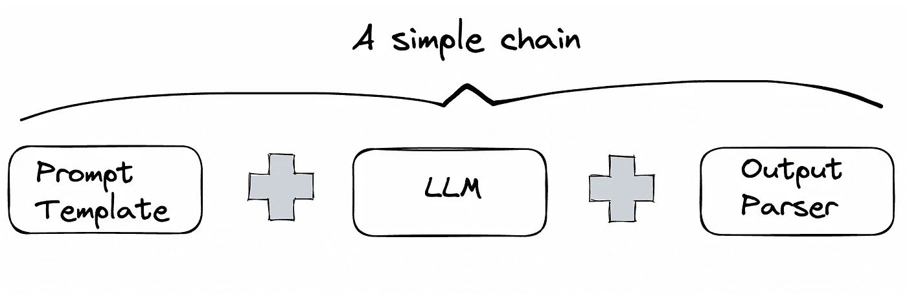

# 使用 LangChain 的输出解析器与 ChatGPT 配合以获得结构化输出

> 原文：[`towardsdatascience.com/use-langchains-output-parser-with-chatgpt-for-structured-outputs-cf536f692685`](https://towardsdatascience.com/use-langchains-output-parser-with-chatgpt-for-structured-outputs-cf536f692685)

## 用一个示例用例进行解释。

[](https://sonery.medium.com/?source=post_page-----cf536f692685--------------------------------)[](https://towardsdatascience.com/?source=post_page-----cf536f692685--------------------------------) [Soner Yıldırım](https://sonery.medium.com/?source=post_page-----cf536f692685--------------------------------)

·发表于 [Towards Data Science](https://towardsdatascience.com/?source=post_page-----cf536f692685--------------------------------) ·6 分钟阅读·2023 年 6 月 6 日

--


图片由 [Dmitry Ratushny](https://unsplash.com/@ratushny?utm_source=unsplash&utm_medium=referral&utm_content=creditCopyText) 提供，来源于 [Unsplash](https://unsplash.com/photos/wpi3sDUrSEk?utm_source=unsplash&utm_medium=referral&utm_content=creditCopyText)

ChatGPT 和许多其他 LLM 在创建基于 LLM 的应用程序方面引领了潮流。这些模型在处理文本输入和根据你的查询生成文本输出方面非常强大。然而，它们并不是作为开发框架而设计的。

LangChain 是一个开源开发框架，用于使用大型语言模型 (LLMs) 的应用程序。它提供了以组件形式的抽象，帮助以更高效或程序化的方式使用 LLM。

这些组件包括：

+   模型：ChatGPT 或其他 LLM

+   提示：提示模板和输出解析器

+   索引：摄取外部数据，如文档加载器和向量存储

+   链：组合组件以创建端到端的用例。一个简单链的示例可以是 提示 + LLM + 输出解析器

+   代理：使 LLM 使用外部工具

LangChain 的主要思想是将多个组件串联在一起，以扩展 LLM 的功能并创建更实用的工具或应用程序。



（图像由作者提供）

LangChain 的开发者不断以非常快速的速度添加新功能。这改变了我们与 LLM 交互的方式。

在本文中，我们将通过一个示例用例演示如何使用输出解析器和提示模板帮助从 LLM 中获取更结构化的输出。

我们将首先使用仅一个提示模板和 LLM 进行示例。然后，我们将添加一个输出解析器来做同样的示例。

## 提示模板 + LLM

提示模板和 LLM 是你可以使用 LangChain 创建的最简单的链。

使用提示模板相比于手动自定义带有 f-strings 的提示有许多优势。它允许在适用时重用提示。此外，LangChain 提供了可直接使用的模板，适用于查询数据库等常见任务。

我们将使用 OpenAI 的 ChatGPT 作为我们的 LLM，因此我们需要设置一个 API 密钥。

```py
import os
import openai

from dotenv import load_dotenv, find_dotenv
_ = load_dotenv(find_dotenv())
openai.api_key = os.environ['OPENAI_API_KEY']
```

为了使这段代码正常工作并设置 API 密钥，你需要创建一个名为 OPENAI_API_KEY 的环境变量，该变量保存你从 [API Keys](https://platform.openai.com/account/api-keys) 菜单中获得的 API 密钥。

让我们开始创建一个模型。`ChatOpenAI` 是 LangChain 对 ChatGPT API 端点的抽象。

```py
from langchain.chat_models import ChatOpenAI

chat = ChatOpenAI(temperature=0.0)
```

默认情况下，LangChain 创建的聊天模型的温度值为 0.7。`temperature` 参数用于调整输出的随机性。像 0.7 这样的较高值会使输出更加随机，而像 0.2 这样的较低值则会使输出更加集中和确定。我们可以在创建模型实例时设置其值。

下一步是创建提示模板。我们将创建一个用于从产品评论中提取信息的模板。

```py
review_template = """\
For the following review, extract the following information:

recommended: Does the buyer recommend the product? \
Answer True if yes, False if not or unknown.

delivery_days: How many days did it take for the product \
to arrive? If this information is not found, output -1.

setup: Extract any sentences about the setup of the product.

Format the output as JSON with the following keys:
recommended
delivery_days
setup

review: {review}
"""

from langchain.prompts import ChatPromptTemplate

prompt_template = ChatPromptTemplate.from_template(review_template)
```

上面的代码片段从给定的提示字符串中创建了一个提示模板。评论作为输入变量保存，可以通过 `input_variables` 属性进行检查：

```py
prompt_template.input_variables

# output
['review']
```

现在我们可以使用这个模板和产品评价创建一个实际的提示。

```py
product_review = """
I got this product to plug my internet based phone for work from home (Avaya desktop phone). 
It works! It arrived in 5 days, which was earlier than the estimated delivery date.
The setup was EXTREMELY easy. At completion, I plugged the phone into the 
extender's ethernet port and made a few phone calls which all worked perfectly with 
complete clarity. VERY happy with this purchase since a cordless headset is 
around $250 (which I would have needed since the phone had to be at the ethernet 
port on the wall). I recommend this product!
"""

messages = prompt_template.format_messages(review=product_review)
```

`messages` 是一个 Python 列表，包含实际的提示。我们可以通过 `messages[0].content` 查看提示，它会输出以下提示：

> 对于以下评论，提取以下信息：
> 
> recommended: 买家是否推荐该产品。如果是，则回答 True；如果不是或未知，则回答 False。
> 
> delivery_days: 产品到达用了多少天？如果没有找到此信息，输出 -1。
> 
> setup: 提取关于产品设置的任何句子。
> 
> 将输出格式化为 JSON，键包括：recommended delivery_days setup
> 
> review: 我购买了这个产品来连接我的互联网电话用于在家工作（Avaya 桌面电话）。它有效！它在 5 天内到达，比预计的交货日期还要早。设置非常简单。完成后，我将电话插入扩展器的以太网端口，并进行了几次电话，所有电话都完全清晰地正常工作。对这次购买非常满意，因为一个无线耳机大约 $250（我本来需要的，因为电话必须放在墙上的以太网端口上）。我推荐这个产品！

我们已经准备好了模型和提示。下一步是使用提示查询模型：

```py
# chat is the model and messages is the prompt
response = chat(messages)
print(response.content)

# output
{
    "recommended": true,
    "delivery_days": 5,
    "setup": "The setup was EXTREMELY easy."
}
```

尽管 `response` 看起来像 JSON，但它是一个字符串，这使得解析变得困难。

```py
type(response.content)
# output
str
```

我们现在将学习如何将输出解析器与提示模板一起使用，以便更容易解析输出。

## 提示模板 + LLM + 输出解析器

通过使用 `format_instructions` 将输出解析器添加到提示中。让我们逐步了解这个过程。

第一步是导入所需的模块，并为每个需要提取的信息定义一个`ResponseSchema`：

```py
from langchain.output_parsers import ResponseSchema
from langchain.output_parsers import StructuredOutputParser

recommendation_schema = ResponseSchema(
    name="recommended",
    description="Does the buyer recommend the product? \
    Answer True if yes, False if not or unknown."
)

delivery_days_schema = ResponseSchema(
    name="delivery_days",
    description="How many days did it take for the product to arrive? \
    If this information is not found,output -1."
)

setup_schema = ResponseSchema(
    name="setup",
    description="Extract any sentences about the setup of the product."
)

response_schemas = [
    recommendation_schema, 
    delivery_days_schema,
    setup_schema
]
```

下一步是创建输出解析器并使用这些模式来格式化指令：

```py
output_parser = StructuredOutputParser.from_response_schemas(response_schemas)
format_instructions = output_parser.get_format_instructions()
```

我们将像之前一样创建提示模板。在创建实际的提示时，我们将传入`format_instructions`参数：

```py
prompt_template = ChatPromptTemplate.from_template(template=review_template)

messages = prompt_template.format_messages(
    review=product_review, 
    format_instructions=format_instructions
)
```

让我们使用我们新的提示来查询模型。

```py
response = chat(messages)
output_dict = output_parser.parse(response.content)

print(output_dict)

# output
{'recommended': 'True', 'delivery_days': '5', 'setup': 'The setup was EXTREMELY easy.'}
```

我们使用了`parse`方法来解析输出。`output_dict`的类型是字典，比字符串更容易解析。我们可以使用`get`方法提取特定的信息。

```py
output_dict.get("delivery_days")

# output
5
```

## 最后的话

你可能会争辩说，我们可以使用内置的`json`模块将字符串解析为 JSON 文件，并且使用`loads`方法是一个简单的过程。你说得对！这比创建一个输出解析器并将其实现到提示模板中要简单。

然而，还有一些更复杂的情况，其中输出解析器简化了这个过程，而这种简化是内置的`json`模块无法做到的。此外，在处理包含不同类型模块的较长链时，输出解析器还提供了额外的好处。

*你可以成为* [*Medium 会员*](https://sonery.medium.com/membership) *以解锁我所有的写作内容，并且可以访问 Medium 上的其他内容。如果你已经是会员了，别忘了* [*订阅*](https://sonery.medium.com/subscribe) *，如果你希望在我发布新文章时收到电子邮件通知。*

感谢阅读。如果你有任何反馈，请告诉我。
