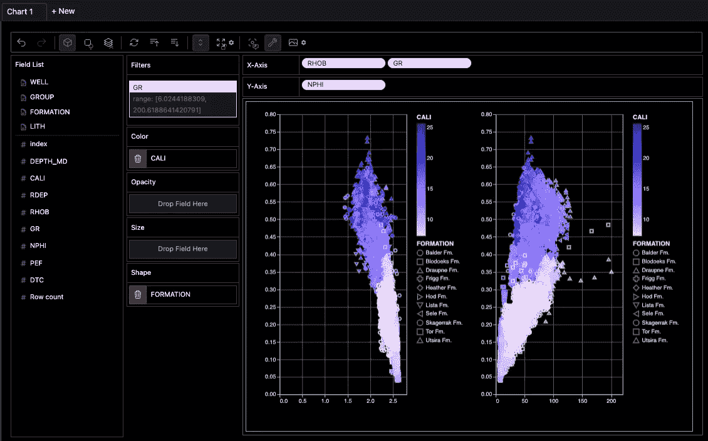
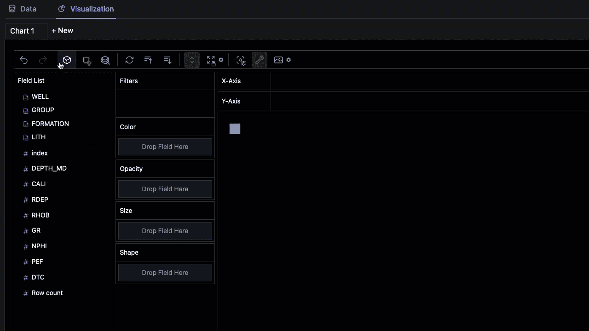

# 使用 PyGWalker 提升你的 Jupyter Notebook EDA 体验

> 原文：[`towardsdatascience.com/use-pygwalker-to-enhance-your-jupyter-notebook-eda-experience-d7a5ee358be9?source=collection_archive---------2-----------------------#2023-03-01`](https://towardsdatascience.com/use-pygwalker-to-enhance-your-jupyter-notebook-eda-experience-d7a5ee358be9?source=collection_archive---------2-----------------------#2023-03-01)

## PyGWalker 库简介：轻松的数据可视化

 [Andy McDonald](https://andymcdonaldgeo.medium.com/?source=post_page-----d7a5ee358be9--------------------------------)

·

[关注](https://medium.com/m/signin?actionUrl=https%3A%2F%2Fmedium.com%2F_%2Fsubscribe%2Fuser%2F9c280f85f15c&operation=register&redirect=https%3A%2F%2Ftowardsdatascience.com%2Fuse-pygwalker-to-enhance-your-jupyter-notebook-eda-experience-d7a5ee358be9&user=Andy+McDonald&userId=9c280f85f15c&source=post_page-9c280f85f15c----d7a5ee358be9---------------------post_header-----------) 发表在 [Towards Data Science](https://towardsdatascience.com/?source=post_page-----d7a5ee358be9--------------------------------) ·8 分钟阅读·2023 年 3 月 1 日

--

PyGWalker 在同一视图中显示多个图表。图像由作者提供。

高效、迅速地创建有效且引人注目的数据可视化是数据科学工作流中的关键部分。有多种选项可用于实现这一目标，从商业软件如 Tableau 到免费的替代方案如专门的 Python 库。生成图表所需的技能和时间在不同选项之间可能有所不同。

多年来，已经开发出多个 Python 库来简化数据探索过程。如此简单，实际上你只需 3 到 5 行代码即可开始。

最近在 EDA 领域出现的一个库是 PyGWalker。

[PyGWalker](https://github.com/Kanaries/graphic-walker) (**Py**thon 绑定的 **G**raphic **Walker**) 是一个 Python 库，可以帮助加速数据分析和可视化流程，直接在 Jupyter notebook 中进行。它通过提供类似于流行数据分析软件 Tableau 的界面，充分利用了互动性。

使用井下测井数据在 PygWalker 中创建散点图。图像来自作者。
