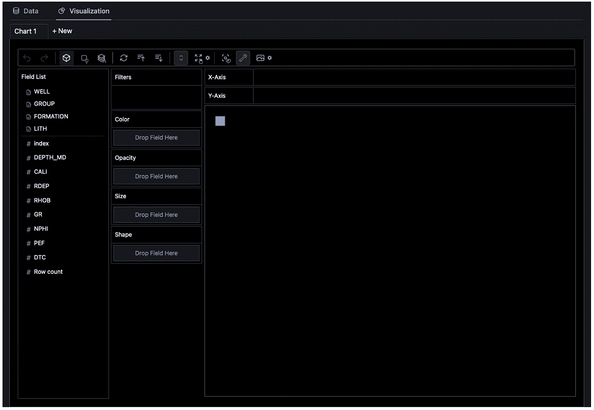
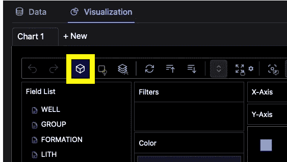
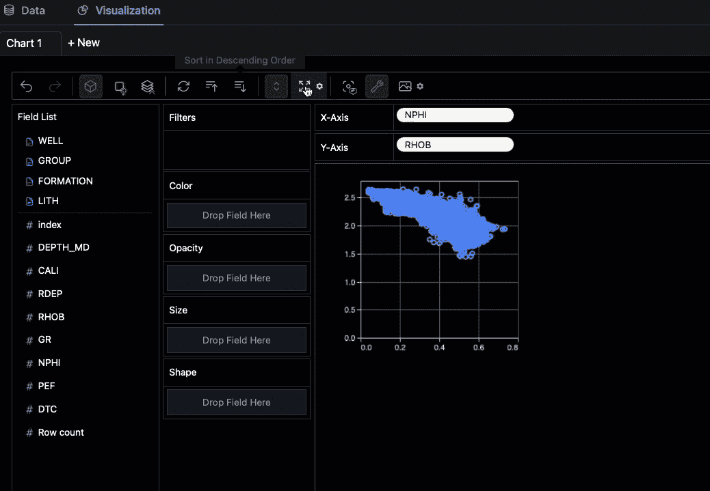
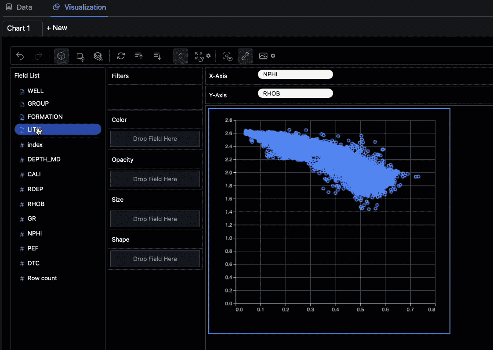
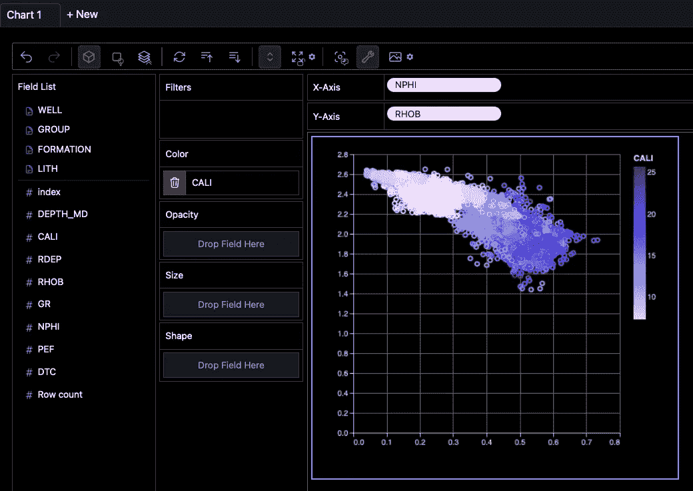
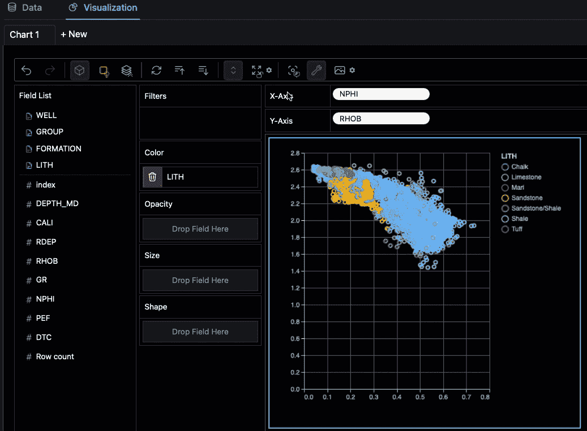
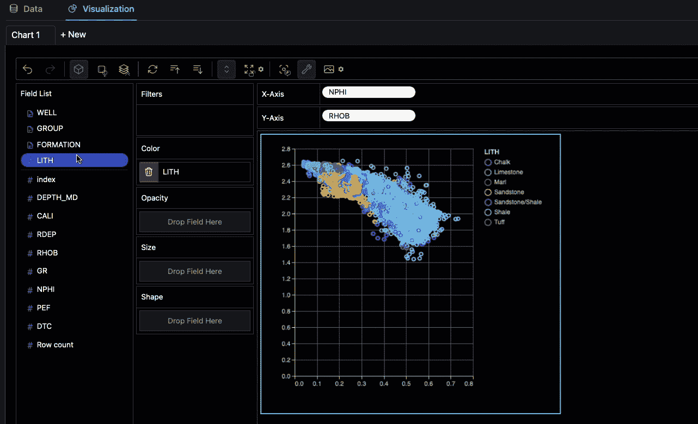
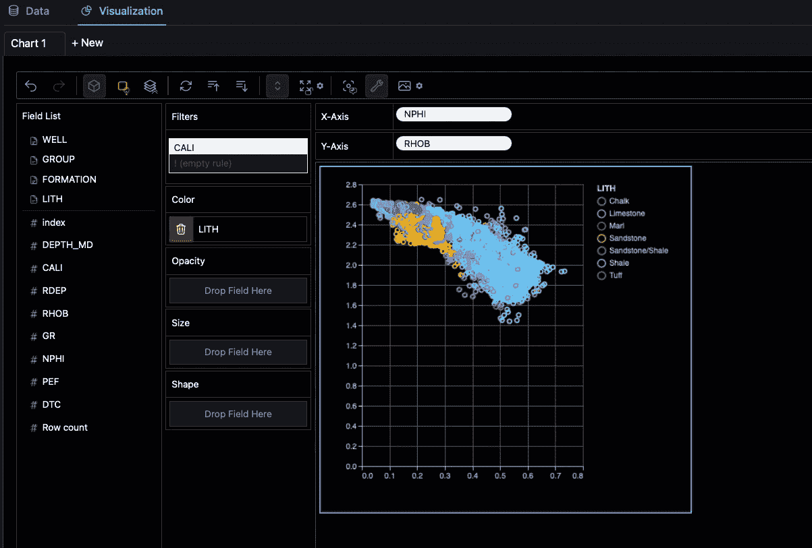
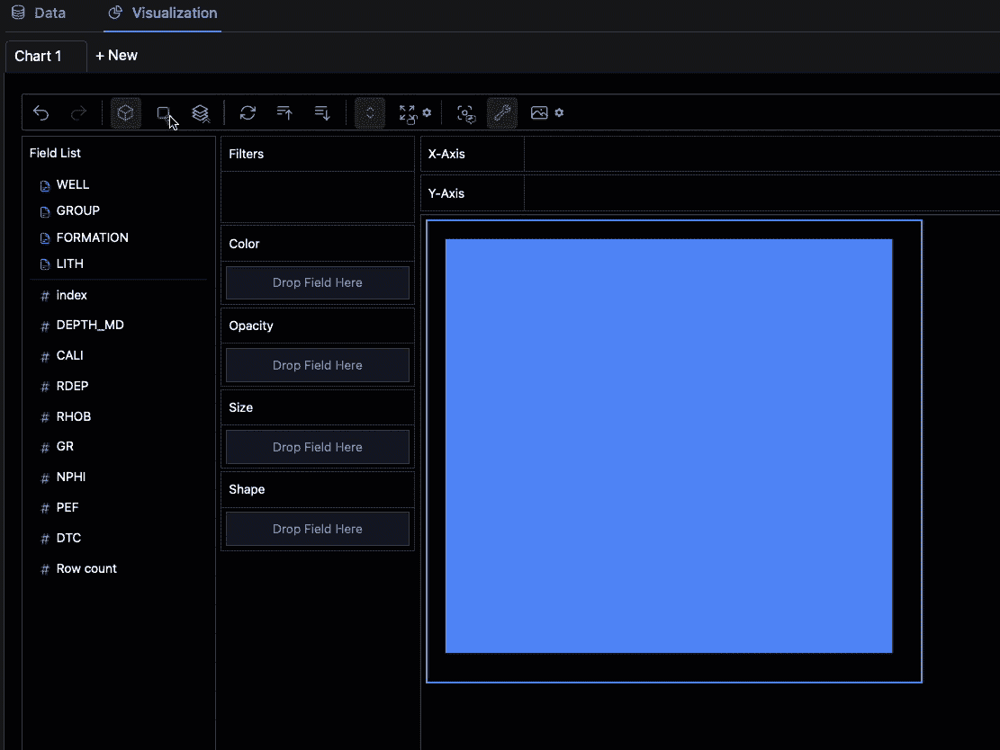
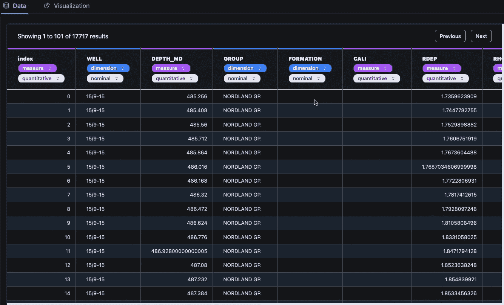

# 使用 PyGWalker 提升你的 Jupyter Notebook EDA 体验

> 原文：[`towardsdatascience.com/use-pygwalker-to-enhance-your-jupyter-notebook-eda-experience-d7a5ee358be9`](https://towardsdatascience.com/use-pygwalker-to-enhance-your-jupyter-notebook-eda-experience-d7a5ee358be9)

## PyGWalker 库简介，便于数据可视化

[](https://andymcdonaldgeo.medium.com/?source=post_page-----d7a5ee358be9--------------------------------)[](https://towardsdatascience.com/?source=post_page-----d7a5ee358be9--------------------------------) [Andy McDonald](https://andymcdonaldgeo.medium.com/?source=post_page-----d7a5ee358be9--------------------------------)

·发表于 [Towards Data Science](https://towardsdatascience.com/?source=post_page-----d7a5ee358be9--------------------------------) ·阅读时间 8 分钟·2023 年 3 月 1 日

--


PyGWalker 在同一视图中显示多个图表。图片由作者提供。

快速高效地创建有效且引人注目的数据可视化是数据科学工作流程的关键部分。有多种选项可以实现这一点，从商业软件如 Tableau 到免费的替代方案如专用的 Python 库。生成图表所需的技能和时间因选项而异。

多年来，已经开发了几种 Python 库来简化数据探索过程。事实上，这些库如此简单，以至于你只需 3–5 行代码即可开始使用。

最近出现在 EDA 场景中的一个库是 PyGWalker。

[PyGWalker](https://github.com/Kanaries/graphic-walker) (**Py**thon 绑定的 **G**raphic **Walker**) 是一个 Python 库，能够帮助加速数据分析和可视化工作流程，直接在 Jupyter notebook 中进行。它通过提供类似于流行数据分析软件 Tableau 的界面来利用交互性的强大功能。


使用井孔数据在 PygWalker 中创建散点图。图片由作者提供。

使用这种类型的界面，我们可以将变量拖放到特定部分，快速创建图表、筛选图表并理解数据。

你可以使用下面的链接访问 PyGWalker 的 GitHub 存储库。

[](https://github.com/Kanaries/pygwalker?source=post_page-----d7a5ee358be9--------------------------------) [## GitHub - Kanaries/pygwalker: PyGWalker: 将你的 pandas 数据框转换为 Tableau 风格的用户界面…](https://github.com/Kanaries/pygwalker?source=post_page-----d7a5ee358be9--------------------------------)

### PyGWalker 可以简化你的 Jupyter Notebook 数据分析和数据可视化工作流程，通过将 pandas 数据框转换为 Tableau 风格的界面来实现。

[github.com](https://github.com/Kanaries/pygwalker?source=post_page-----d7a5ee358be9--------------------------------)

本文将探讨 PyGWalker 的一些功能，使用的是我最喜欢的井筒数据集之一（详细信息见文章末尾）。

在撰写本文时，PygWalker 的版本是 `0.1.4.6`，其中一些功能可能已在此版本之后进行了更新。

# 视频教程

如果你想查看 PyGWalker 的实际操作，可以在我的 [YouTube 频道](https://www.youtube.com/c/AndyMcDonald42) 上找到该教程的视频版本。

# 在 Jupyter Lab 中安装和运行 PyGWalker

要开始使用 PyGWalker，我们需要先安装它。我们可以使用 `pip install pygwalker` 或 `conda install pygwalker`（如果你使用 Anaconda）。

安装 PyGWalker 库后，我们可以打开 Jupyter Notebook，然后导入 PyGWalker 和 [pandas](https://pandas.pydata.org/) 库，后者将用于从 CSV 文件中加载数据。

```py
import pandas as pd
import pygwalker as pyg
```

在这些导入之后，下一步是加载我们将用于本教程的数据。我们可以通过调用 pandas 中熟悉的 `pd.read_csv()` 函数来加载数据，然后传入我们的 CSV 文件。

```py
df = pd.read_csv('Data/Xeek_Well_15-9-15.csv')
```

现在是运行 PyGWalker 的时候了，我们可以使用以下简单的调用来实现。

```py
pyg.walk(df)
```

一旦单元格运行完毕，我们将得到一个非常好的界面，显示数据集中可用的变量。变量将根据其类型进行分组。



PyGWalker 用户界面直接在 Jupyter Notebook 中。图片由作者提供。

# 使用 PyGWalker 构建散点图

我们将创建的第一个图是 RHOB 和 NPHI 的简单散点图——这是岩石物理学中常用的图。

在此之前，我们需要在工具栏上关闭聚合。这将允许我们绘制实际的数据值，而不是任何形式的聚合。



关闭聚合选项将允许绘制实际的数据值。图片由作者提供。

现在我们可以从左侧的字段列表中选择我们想要绘制的变量。根据你想将变量放在 x 轴还是 y 轴，可以点击并拖动到相应的轴框中。

你还会注意到字段列表中的项目有不同的图标。蓝色文档图标代表分类数据，紫色井号代表数值数据。

在这个例子中，我将 NPHI 放在 x 轴上，将 RHOB 放在 y 轴上。


使用井筒数据在 PygWalker 中创建散点图。图片由作者提供。

## 更改 PyGWalker 图表大小

当图表出现时，它可能看起来很小。然而，我们可以很容易地增加图表的大小。方法是通过菜单将布局模式从自动更改为固定。

一旦选项更改，我们可以通过点击出现在图周围的蓝色边框来更改大小，或者点击“布局模式”按钮旁边的齿轮图标并调整滑块。



在 PygWalker 中更改图形大小。图片来自作者。

## 向 PyGWalker 散点图添加额外的变量

我们还可以向图中添加更多变量，以帮助我们更好地理解数据。这些额外的变量可以是分类的也可以是数值的，我们可以使用它们来添加颜色、不透明度、大小和形状。

在下面的示例中，我添加了 LITH 变量，这将根据不同的岩性给数据点上色。然后我们可以将鼠标悬停在散点图中的任何一点上，查看其值。



将分类变量应用于 PyGWalker 创建的散点图。图片来自作者。

如果我们改用数字变量，我们将在图的侧边看到一个颜色条。这个轴的值范围可以通过应用过滤器来更改——我们很快就会看到如何操作。



将数字变量应用于 PyGWalker 创建的散点图。图片来自作者。

## 缩放和移动 PygWalker 散点图

如果我们想要更改比例或放大数据的某个部分，我们首先需要点击工具栏上的“自动调整大小”按钮，然后可以使用鼠标滚轮进行放大或缩小。

然后，我们可以通过使用左键点击、按住该按钮并拖动光标在图中移动。



在 PyGWalker 中缩放和移动散点图。图片来自作者。

如果能像在 Plotly 图表中那样，通过点击轴或轴的角来手动更改图上的刻度，将是一个很好的功能。

## 按类别过滤数据

我们还可以使用我们的变量过滤数据。

当我们使用分类数据进行过滤时，我们点击并拖动我们想要的变量到过滤器区域，然后取消选择我们不想看到的类别。



在 PygWalker 中应用分类过滤器。图片来自作者。

使用数字变量进行过滤时，我们会得到一个滑块，可以控制最小值和最大值范围。看起来我们不能手动编辑这些值，这将是一个很好的功能。

一个不错的功能是，我们可以通过将另一个变量添加到过滤框中并设置范围或选择我们想要的类别，来应用多个过滤器。



使用 PygWalker 对数据应用数值过滤器。图片来自作者。

# 使用 PyGWalker 创建折线图

PyGWalker 中有几种不同的图表类型。

当添加数据且标记类型设置为自动时，库将尝试为你的数据找到最佳图表。然而，这可能并不总是最合适的图表类型。

你可以通过点击工具栏上的标记类型按钮，然后选择你想要的类型来更改图表类型。

下面的示例展示了如何用两个变量创建折线图。



在 PyGWalker 中创建折线图。图片由作者提供。

# 查看原始数据

PyGWalker 提供了一种方便的方式来查看数据框中的原始数据，并在需要时更改数据类型。如果某列被错误识别为不正确的数据类型，你可以快速更改它。

如果数据视图中能够进行更多操作，例如过滤数据或对列应用颜色比例尺，那就太好了，因为有时这有助于揭示数据中的问题。



PyGWalker 中的原始数据视图。图片由作者提供。

# 摘要

PyGWalker 提供了我在 Jupyter notebook 中遇到的最互动、外观最好的 EDA 库体验之一。该界面为非编码者或初学者提供了一种立即开始创建图表的简便方法。

你应该在下一个项目中尝试一下。查看我下面的文章，如果你想了解其他强大的 Python EDA 库。

[](/5-powerful-python-libraries-you-need-to-know-to-enhance-your-eda-process-f0100d563c16?source=post_page-----d7a5ee358be9--------------------------------) ## 5 个强大的 Python 库，你需要了解的 EDA 工具

### 利用 Python 的力量探索和理解你的数据

towardsdatascience.com

本文使用的数据集是 Xeek 和 FORCE 2020 *(Bormann et al., 2020)* 机器学习竞赛的训练数据集的一个子集。它在挪威政府的 NOLD 2.0 许可下发布，详细信息可以在这里找到：[挪威开放政府数据许可 (NLOD) 2.0](https://data.norge.no/nlod/en/2.0/)。完整数据集可以[在这里访问](https://doi.org/10.5281/zenodo.4351155)。

数据集的完整参考是：

Bormann, Peter, Aursand, Peder, Dilib, Fahad, Manral, Surrender, & Dischington, Peter. (2020). FORCE 2020 油井记录和岩性数据集，用于机器学习竞赛 [数据集]. Zenodo. [`doi.org/10.5281/zenodo.4351156`](http://doi.org/10.5281/zenodo.4351156)

*感谢阅读。在你离开之前，你一定要订阅我的内容，并将我的文章发送到你的邮箱。* [***你可以在这里操作！***](https://andymcdonaldgeo.medium.com/subscribe)*另外，你也可以* [***注册我的通讯***](https://fabulous-founder-2965.ck.page/2ca286e572) *，将额外的内容直接发送到你的邮箱，完全免费。*

*其次，您可以通过注册会员来获得完整的 Medium 体验，并支持我和其他数千名作者。它只需每月 $5，并且您可以全面访问所有精彩的 Medium 文章，还可以通过写作赚取收入。如果您使用* [***我的链接***](https://andymcdonaldgeo.medium.com/membership)***，*** *您将直接通过您的费用的一部分支持我，而不会增加额外费用。如果您这样做，非常感谢您的支持！*
