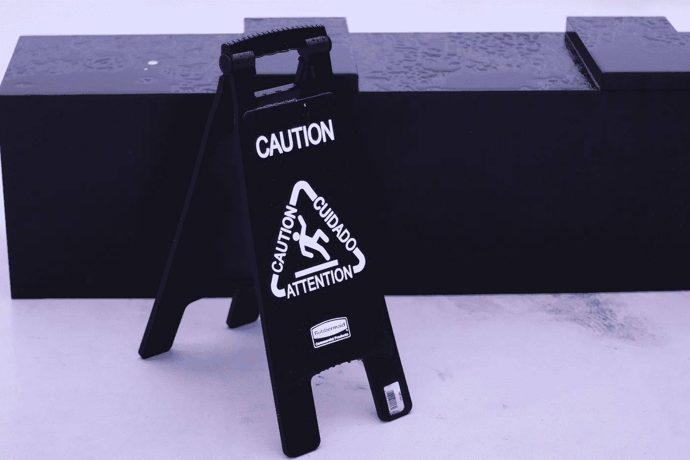

# SMOTE 和其他选项：处理不平衡数据的综合指南

> 原文：[`towardsdatascience.com/use-smote-with-caution-3fa015ba3bc5`](https://towardsdatascience.com/use-smote-with-caution-3fa015ba3bc5)

## 关于何时使用和何时不使用合成数据来解决类别不平衡问题的指南

[](https://ransakaravihara.medium.com/?source=post_page-----3fa015ba3bc5--------------------------------)[](https://towardsdatascience.com/?source=post_page-----3fa015ba3bc5--------------------------------) [Ransaka Ravihara](https://ransakaravihara.medium.com/?source=post_page-----3fa015ba3bc5--------------------------------)

·发布于 [Towards Data Science](https://towardsdatascience.com/?source=post_page-----3fa015ba3bc5--------------------------------) ·10 分钟阅读·2023 年 1 月 3 日

--



图片由 [은 하](https://unsplash.com/@b0nn13_4nd_clyd3?utm_source=medium&utm_medium=referral) 提供，出处 [Unsplash](https://unsplash.com/?utm_source=medium&utm_medium=referral)

如果你是一名机器学习从业者，你可能会更频繁地遇到类别不平衡问题。类别不平衡发生在数据集中类别分布不均的情况。例如，假设我们正在处理流失问题。在这个特定场景下，我们的少数类和多数类分别是客户流失和客户继续留在当前服务提供商。但是，如果你深入探索这个问题，你会发现流失类别的客户较少，因为客户流失是一个对业务有利但对模型不利的不频繁事件。因此，如果我们将这个数据集输入模型，它将比少数类别（流失场景）更准确地学习到多数类别（非流失场景）。这就是我们问题的开始。

# 如何处理机器学习中的类别不平衡

最明显的答案是由于模型在训练过程中与少数类的交互较少，我们可以通过向模型中添加更多少数类数据来改善这一点。但是怎么做呢？我们有几种方法：

1.  收集更多的少数类数据——这是一个理论上简单但在实践中不可行的解决方案。因为在满足业务实际需求的同时很难做到这一点，例如，我们可能需要改变逻辑以将更多客户转入流失类别。

1.  随机过采样——我们可以复制少数类数据，直到得到合理的类别分布。这可能导致模型学习到不准确的流失场景。简单来说，它会过度学习一些小的事件模式。

1.  随机欠采样 — 我们可以通过从多数类中删除样本来平衡数据集。然而，这会从数据集中删除一些信号。此外，如果我们的数据集严重不平衡（少数样本少于 1%），我们可能需要从数据集中删除大量的多数类样本，以使其更平衡。

1.  我们可以生成合成数据 — 我们将在本文中更深入地探讨这一点。

# 生成合成数据以重新平衡数据集

其基本思想是生成与少数类中现有样本类似的更多少数类样本。但与重复少数类实例多次不同，这将基于我们拥有的数据集生成新的少数类实例。为此，通常使用 SMOTE（合成少数过采样技术）方法。但也有许多替代方法，如……

1.  ADASYN（自适应合成采样）

1.  Tomek Links：该技术从多数类中移除与少数类样本非常接近的样本。这个想法是移除那些容易被误分类为少数类的多数类简单案例。

1.  近邻缺失：该技术从特征空间中选择与少数类样本最接近的多数类样本，并将其从数据集中移除。这个想法类似于 Tomek Links，但它移除的是最有可能被误分类为少数类的样本，而不是多数类中的简单案例。

让我们对 SMOTE 进行一些实验。

首先，导入数据集。这里我使用的是*Wine Quality dataset*，*你可以通过* [*这个*](https://zenodo.org/record/61452#.Y7OfjHZBzrd) *链接*访问数据集。我们来加载数据集并绘制类别分布。

```py
import pandas as pd
import numpy as np

#read the dataset
data = np.load('x20data.npz')

df = pd.DataFrame(data['data'])
df['target'] = data['label']
df['target'] = df['target'].replace(-1,0)

#lets plot class distribution
df['target']\
.value_counts(normalize=True)\
.plot\
.bar(figsize=(10,6),alpha=0.6)

plt.xlabel("Label")
plt.ylabel("Distribution %")
plt.yticks(list(np.linspace(0,1,11)))
plt.grid(True)
plt.show()
```


图片由作者提供

现在我们可以使用 imblearn 库对数据集进行 SMOTE。在下面的代码中，我们将对数据集进行 SMOTE 处理，并绘制原始数据集和重采样数据集的图。

```py
import matplotlib.pyplot as plt
from sklearn.manifold import TSNE
from imblearn.over_sampling import SMOTE

# Set the font family for matplotlib
plt.rcParams['font.family'] = 'Verdana'

# Split your data into features and labels
X = df.drop('target', axis=1)
y = df['target']

# Define the SMOTE resampling method
smote = SMOTE(random_state=42)

# Resample the data using SMOTE
X_resampled, y_resampled = smote.fit_resample(X, y)

# Use TSNE for dimensionalilty reduction
X_tsne = TSNE(n_components=2).fit_transform(X)
X_resampled_tsne = TSNE(n_components=2).fit_transform(X_resampled)

# Get the class ratios
original_class_ratio = np.bincount(y) / len(y)
resampled_class_ratio = np.bincount(y_resampled) / len(y_resampled)

# Create subplots
fig, (ax1, ax2) = plt.subplots(1, 2, figsize=(12, 6))

# Plot the original data
ax1.scatter(X_tsne[:, 0], X_tsne[:, 1], c=y, cmap='rainbow',alpha=0.4)
ax1.set_title(f'Original Data\nClass Ratio: {original_class_ratio[1] * 100:.1f} : {original_class_ratio[0] * 100:.1f}')

# Plot the resampled data
ax2.scatter(X_resampled_tsne[:, 0], X_resampled_tsne[:, 1], c=y_resampled, cmap='rainbow',alpha=0.4)
ax2.set_title(f'Resampled Data\nClass Ratio: {resampled_class_ratio[1] * 100:.0f} : {resampled_class_ratio[0] * 100:.0f}')

plt.show()
```


图片由作者提供

如图所示，我们将 220 个原始少数事件转化为 2152 个，大约增加了 9 倍。这就是问题所在。让我们关注我们特定的流失问题。

1.  生成这种虚假客户数据可能会导致模型学习到在现实世界中不存在的模式。

1.  在大多数情况下，我们的数据集存在质量问题。因此，数据集中加入噪声的可能性很高。使用嘈杂数据生成新数据是个坏主意。

面对这些潜在的问题，我们有如下问题。

> 我们要将这些模型部署到生产环境中吗？

如果这是一个流失或欺诈检测问题，我不会将其部署到生产环境中，因为这些客户数据在应用 SMOTE 后可能变得更加嘈杂。但上述问题的答案很大程度上取决于我们所处理的数据和业务问题。一般来说，当数据嘈杂且问题复杂时，依赖 SMOTE 并不是一个好主意。

让我们使用过采样数据构建分类器并评估模型。

```py
from sklearn.metrics import confusion_matrix, roc_auc_score, roc_curve, ConfusionMatrixDisplay

def plot_confusion_matrix_and_roc(model,df):

    """Helper function for plotting model performances"""    

    # Make predictions on the holdout set

    X,y = df.drop('target',axis=1), df['target']

    y_pred = model.predict(X)

    # Create the confusion matrix
    cm = confusion_matrix(y, y_pred)

    # Calculate the AUC ROC score
    auc = roc_auc_score(y, y_pred)

    # Get the FPR and TPR for the ROC curve
    fpr, tpr, thresholds = roc_curve(y, y_pred)

    # Create a figure with two subplots
    fig, (ax1, ax2) = plt.subplots(1, 2, figsize=(10, 5))

    # Plot the confusion matrix
    ax1.matshow(cm, cmap='Blues')
    ax1.set_title('Confusion Matrix')
    ax1.set_xlabel('Predicted')
    ax1.set_ylabel('Actual')

        # Add labels to the confusion matrix
    # for i in range(cm.shape[0]):
    #     for j in range(cm.shape[1]):
    #         ax1.text(j, i, f'{cm[i, j]:n}', ha='center', va='center')

    # Add labels for the TP, FP, TN, and FN cells
    ax1.text(0, 0, f'TN: {cm[0, 0]:n}', ha='center', va='center', color='w')
    ax1.text(0, 1, f'FN: {cm[1, 0]:n}', ha='center', va='center', color='k')
    ax1.text(1, 0, f'FP: {cm[0, 1]:n}', ha='center', va='center', color='k')
    ax1.text(1, 1, f'TP: {cm[1, 1]:n}', ha='center', va='center', color='k')

    # Plot the ROC curve
    ax2.plot(fpr, tpr, label='AUC ROC = %0.2f' % auc)
    ax2.plot([0, 1], [0, 1], 'k--')
    ax2.set_title('ROC Curve')
    ax2.set_xlabel('FPR')
    ax2.set_ylabel('TPR')
    ax2.legend()

    plt.show()

#train the model

from xgboost import XGBClassifier

model = XGBClassifier()
model.fit(X_resampled,y_resampled)

plot_confusion_matrix_and_roc(model,df_holdout)
```


作者提供的图片

现在是时候尝试其他处理类别不平衡的方法了。下面我将解释一些我用来解决不平衡问题的方法。

1.  使用类别权重

1.  更改评估指标

1.  通过对模型进行错误分析来创建更多特征

1.  使用无监督算法检测数据集中的聚类。

让我们**深入探讨**这些方法。

# 使用类别权重

在对具有类别不平衡的数据集进行模型训练时，损失函数可能会被多数类主导，因为它的实例更多。这可能导致模型更多地关注多数类而不是少数类。类别权重的主要思想是根据每个样本的类别分配权重。在训练过程中，它会对少数类给予更多的权重。这意味着模型在训练过程中会更多关注少数类，以期提高该类别的表现。

> 提前使用类别权重可以通过对少数类分配更高的权重来平衡损失函数，使其对损失函数的影响更大。这可以帮助模型更好地学习少数类的特征并提高其表现。

从数学上讲，类别权重通常通过将每个样本的损失乘以其类别的权重来融入损失函数。例如，假设我们有一个包含两个类别（0 和 1）的数据集以及以下类别权重：

```py
class_weights = {0: 1, 1: 10}
```

二分类模型的损失函数可能定义如下：


作者提供的图片

要将类别权重融入这个损失函数，我们可以按如下方式修改它：


作者提供的图片

现在，当模型训练完成后，每个样本的损失将乘以其类别的权重。这将使模型更加关注少数类，因为其样本将显著影响损失函数。

大多数主要机器学习模型接受 *sample_weight* 参数。以下是如何使用 XGBoost 库来做到这一点的示例。

```py
# this will compute sample weight for us
from sklearn.utils import compute_sample_weight

#coputing class weights, this will be (num_samples_in_y,)
sample_weights = compute_sample_weight(class_weight='balanced',y=y)

model = XGBClassifier()

# just plug sample weight parameter into your model
model.fit(X,y,sample_weight=sample_weights)
```

需要注意的是，如果权重过高，样本权重可能会导致过拟合。通常，尝试一系列权重并查看哪个在验证集上表现最佳是个好主意。

另外，我们也可以使用 [scale_pos_weight](https://xgboost.readthedocs.io/en/stable/parameter.html) 参数在 XGBoost 中实现。它会给出类似的结果。

让我们快速绘制上述模型性能图。


作者提供的图片

如果你检查上述两种情况的混淆矩阵。你会注意到，在过采样场景中，高假阳性比较多。我们使用类别权重减少了假阳性预测，同时也减少了真正的阳性。因此，我们必须根据实际业务需求调整我们的方法。

# 更改评估指标

大多数库将准确率作为分类任务的默认评估指标。对于平衡问题，这没问题。但对于不平衡问题，这将导致模型仅猜测主要类别而不会学习任何潜在的信号。

例如，假设我们有 97 个非流失客户和三个流失客户。构建一个模型并使用准确率作为评估指标，通过盲目预测每 100 个样本为非流失类别，可以达到 97%的准确率。作为简单的解决方法，我们可以将评估指标更改为其他不同的指标。精确度、召回率、F1 分数和**平衡准确率**是处理不平衡分类任务的几个最佳选择。

# 通过对模型进行错误分析来创建更多特征

当你的模型表现不佳时，我们可以使用错误分析来寻找不同的数据段，发现不同的性能水平。以之前的流失示例为例，我们可以找到模型的错误与客户收入区间的关系，并识别模型表现好的收入段和表现差的收入段。类似地，我们可以利用这些信息创建错误分析报告。在错误分析报告之后，我们可以确定模型可以用来区分流失者与非流失者的新特征。

例如，如果你知道低收入用户因为“XYZ”原因而流失，你可以添加这个特征（如果模型中还没有的话）。否则，你可以利用这个潜在特征进行特征工程，例如对“XYZ”特征进行分箱处理。

# 使用无监督算法检测数据集中的聚类

一种强大且流行的方法是分段。如果我们知道一些特征可以用于将数据分隔成不同的子群体，我们可以利用这些特征进行聚类模型。在聚类后，你会注意到不同组之间存在各种类别不平衡的情况。有几种可能的场景，例如，

1.  你可能会发现只有一个类别的子群体。验证了这种客户行为后，我们可以进一步跳过对这个特定子群体的建模。这将减少整个数据集的不平衡。

1.  你可能会发现与之前的数据集相比，分布较为平衡且易于建模。

1.  或者，你可能会发现具有高度不平衡类别分布的子群体。但这与原始分布相比并不差。这是因为这种不平衡发生在相似的数据点中，并且即使分布不平衡，也可以是一个强烈的信号。例如，如果我们正在处理一个疾病预测模型，将人们根据年龄分组是个好主意。如果整体类别不平衡为 2%，则按年龄分组将为不同的子群体产生不同的类别分布。在较高年龄组中，这种分布将更加平衡。在中年和年轻年龄组中，这将高度不平衡。由于我们单独对每个段进行建模，模型可以很好地泛化到该特定段。 

# 结论

本文旨在展示除了合成数据生成之外的处理类别不平衡的替代方法。值得注意的是，一些方法在很大程度上依赖于数据、问题类型以及你所处理的领域。尝试几种不同的方法，并选择最适合你问题的方法通常是一个好主意。

请查找上述数据集的引用和许可证信息。

1\. 引用：Lemaître, G., Nogueira, F., Aridas, C. K., & Oliveira, D. V. R. (2016). 用于基准测试的*不平衡数据集* [Data set]. Zenodo. [`doi.org/10.5281/zenodo.61452`](https://doi.org/10.5281/zenodo.61452)

2\. 数据集许可证： [Open Data Commons Open Database License v1.0](https://opendatacommons.org/licenses/odbl/1-0/)

感谢阅读。
