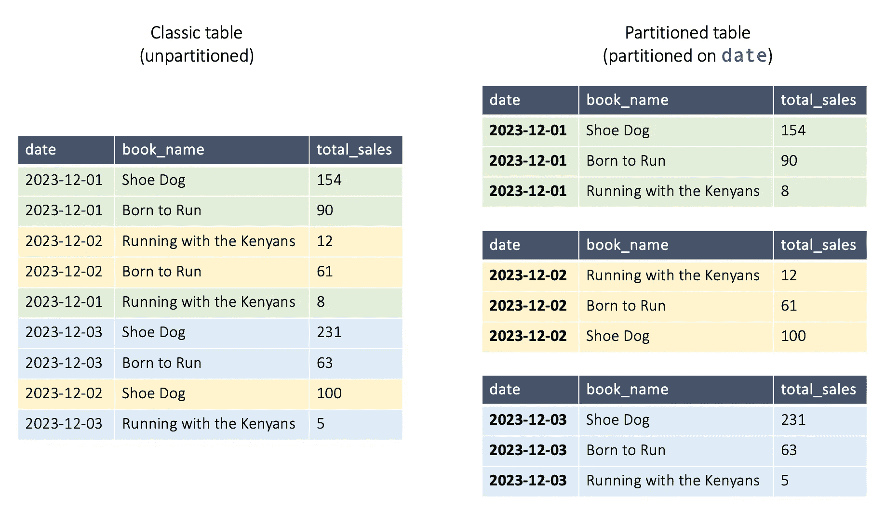
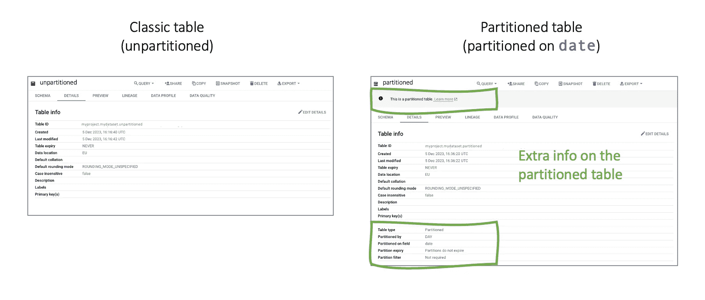
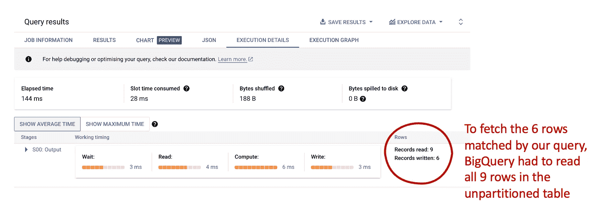
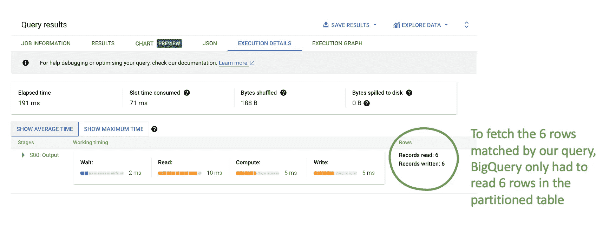
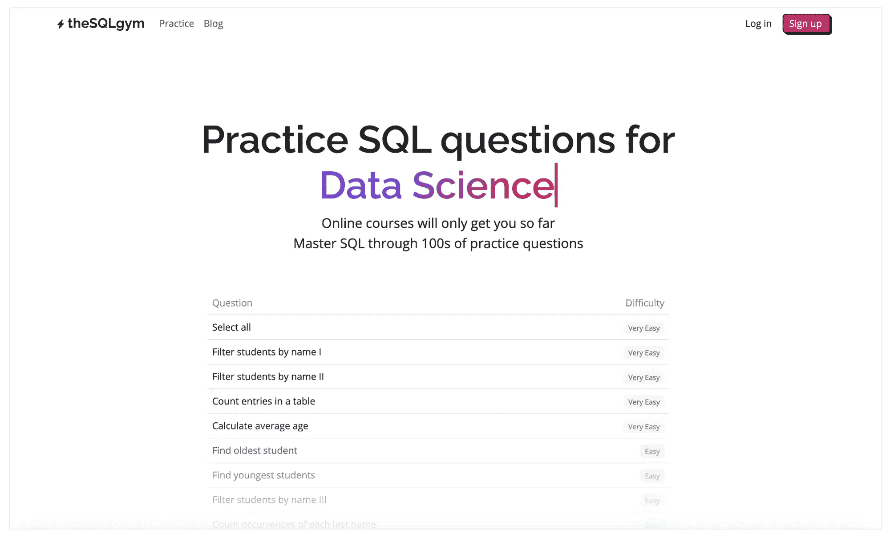
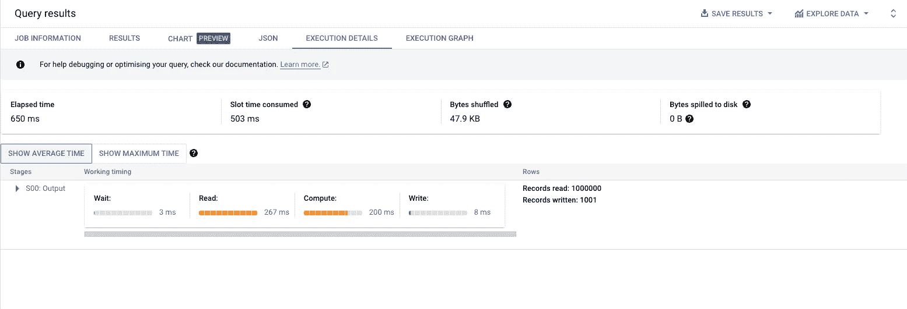
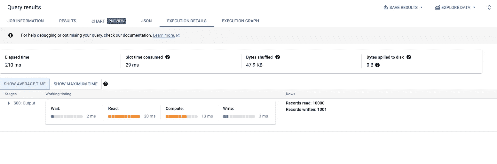

# 使用分区，卢克！一个简单且经过验证的优化 SQL 查询的方法

> 原文：[`towardsdatascience.com/use-the-partitions-luke-a-simple-and-proven-way-to-optimise-your-sql-queries-43e24ea4c5d0`](https://towardsdatascience.com/use-the-partitions-luke-a-simple-and-proven-way-to-optimise-your-sql-queries-43e24ea4c5d0)

## 如果你曾写过一个需要很长时间才能运行的 SQL 查询，那么这篇文章就是为你准备的。

[](https://medium.com/@mattchapmanmsc?source=post_page-----43e24ea4c5d0--------------------------------)[](https://towardsdatascience.com/?source=post_page-----43e24ea4c5d0--------------------------------) [Matt Chapman](https://medium.com/@mattchapmanmsc?source=post_page-----43e24ea4c5d0--------------------------------)

·发表于 [Towards Data Science](https://towardsdatascience.com/?source=post_page-----43e24ea4c5d0--------------------------------) ·8 分钟阅读·2023 年 12 月 7 日

--


宝宝尤达喜欢分区。你呢？图片由 [Victor Serban](https://unsplash.com/@victorserban) 提供，来源于 [Unsplash](https://unsplash.com/photos/green-frog-plush-toy-on-brown-textile-ZFN6UNWhstI)

数据科学家们喜欢 SQL，但我们确实很糟糕于编写高性能的查询（也许是因为我们花了太多时间争论“SQL”是读作“S-Q-L”还是“sequel”？）。

在这篇文章中，我将向你展示如何使用 ***SQL 分区*** 来优化你的查询，并编写更快速、更便宜的代码。如果你已经掌握了 SQL 的基础知识，并希望开始解锁更高级的数据科学技能，这将是你工具箱中的一个很棒的补充。

# 什么是分区表？

分区表是将数据表划分为多个段/分区的表（谁能想到呢？）。

在分区表中，每个分区存储在服务器上的不同位置。这与普通（未分区）SQL 表不同，后者整个表位于一个位置。

这里是使用虚拟数据对比了我最喜欢的三本书的每日销售情况：



作者提供的图片

未分区表和分区表都包含相同的数据；唯一的区别是分区表将数据分成不同的段。它仍然是一个单一的表（即它不是三个单独的表）；只是以不同的方式存储数据。

我们为什么要关注这个？好吧，正如我们稍后会看到的，我们可以利用这种结构来编写更高效的 SQL 查询。

# 创建分区表

创建分区表简直轻而易举。

例如，如果我们使用以下代码来创建一个普通（未分区）表……

```py
CREATE TABLE `myproject.mydataset.unpartitioned` (
  date DATE, 
  book_name STRING,
  total_sales INT64
);

INSERT INTO `myproject.mydataset.unpartitioned`
VALUES
  ('2023-12-01', 'Shoe Dog', 154),
  ('2023-12-01', 'Born to Run', 90),
  ('2023-12-02', 'Running with the Kenyans', 12),
  ('2023-12-02', 'Born to Run', 61),
  ('2023-12-01', 'Running with the Kenyans', 8),
  ('2023-12-03', 'Shoe Dog', 231),
  ('2023-12-03', 'Born to Run', 63),
  ('2023-12-02', 'Shoe Dog', 100),
  ('2023-12-03', 'Running with the Kenyans', 5);
```

… 我们可以通过在`CREATE TABLE`语句的末尾添加一行来创建一个分区版本：

```py
CREATE TABLE `myproject.mydataset.partitioned` (
  date DATE, 
  book_name STRING,
  total_sales INT64
) PARTITION BY date; # New line!

INSERT INTO `myproject.mydataset.partitioned`
VALUES ... # Rest of the code is same as in previous snippet
```

我们进行分区的列被称为**分区键**；在这种情况下，我们在`date`列上进行分区，但任何列都可以，只要它是（1）日期/时间戳字段或（2）整数字段。

一旦我们创建了这两个表，我们会发现它们乍一看是相同的（例如，如果你对每个表运行`SELECT *`，结果将是相同的）。然而，如果我们查看表的详细信息/元数据，我们会看到分区表包含了一些额外的元数据。在 BigQuery 中（我在这里运行 SQL），情况是这样的：



作者提供的图片

# 这有什么重要的？因为使用分区减少了处理查询所需的数据量

这真是个好消息，因为这意味着分区可以帮助你编写更高效的查询！

当你查询一个普通（未分区）表时，SQL 引擎通常需要扫描整个表以找到你所需的行。在大型表中，这可能不必要地慢且昂贵，因为你的机器需要处理对生成最终输出没有用的数据。

例如，让我们查询一下我们之前创建的未分区表：

```py
SELECT * 
FROM `myproject.mydataset.unpartitioned`
WHERE date > '2023-12-01'
```



作者提供的图片

在上面的图片中，你可以看到**表中的所有 9 行**都被读取以返回日期大于‘2023-12-01’的 6 行。

现在让我们对分区表运行相同的查询：

```py
SELECT *
FROM `myproject.mydataset.partitioned`
WHERE date > '2023-12-01'
```



作者提供的图片

这一次，我们看到**仅读取了未分区表中的 6 行**以生成相同的结果。在执行查询的主要部分之前，BigQuery 能够识别包含相关行的分区并进行选择性提取。它根本不需要读取其他分区中的 3 行。

选择分区的这个初步步骤被称为***修剪***。这比正常查询更高效，因为这意味着 SQL 引擎无需读取表中的每一行；它会首先获取所需的分区，然后才会执行你的查询。在高阶 SQL 术语中，我们在分区列上添加的过滤器被 SQL 引擎视为***访问谓词***，并在执行主查询之前运行。

# — 快速插曲 —

如果你喜欢这篇文章，你可能会喜欢我的网站 [the-sql-gym.com](https://the-sql-gym.com)，网站包含了 100 多个 SQL 练习题。如果你想提升你的 SQL 技能，可以去看看！如果有任何反馈，请告诉我 :-)



作者提供的图片。来源：[the-sql-gym.com](https://the-sql-gym.com/)

# 回到分区——让我们看一个更大的例子

当我们处理像上面这些小表时，分区可能显得有些过度。但当我们扩展到更大的表时，它可以带来显著的性能提升。

首先，让我们创建两个大表，每个表包含 100 万行。第一个将是未分区表，第二个将按`id`列进行分区，每个分区包含 10,000 行。

```py
##############################
# Create unpartitioned table #
##############################

CREATE OR REPLACE TABLE `myproject.mydataset.unpartitioned_large` AS (
  SELECT id, GENERATE_UUID() AS uuid 
  FROM UNNEST(GENERATE_ARRAY(1, 1000000)) AS id
);

############################
# Create partitioned table #
############################

CREATE TABLE `myproject.mydataset.partitioned_large` (id INT64, uuid STRING)

# Partition into 100 segments of 10,000 each
PARTITION BY RANGE_BUCKET(id, GENERATE_ARRAY(1, 1000000, 10000))

AS (
  SELECT *
  FROM `myproject.mydataset.unpartitioned_large`
);
```

当我们对未分区的表运行以下查询时：

```py
SELECT *
FROM `myproject.mydataset.unpartitioned_large` # Unpartitioned
WHERE id BETWEEN 1000 AND 2000;
```



作者提供的图片

… 我们看到在输出 1,001 条记录之前，表中的所有 1,000,000 行都被读取了。整个操作耗时 650 毫秒（经过时间）/503 毫秒（消耗的槽时间）。

但是，当我们对**分区**表运行相同的查询时，只读取了 10,000 行（即一个单独的分区）。

```py
SELECT *
FROM `myproject.mydataset.partitioned_large` # Partitioned
WHERE id BETWEEN 1000 AND 2000;
```



作者提供的图片

当查询未分区的表时，操作的经过时间不到第一个查询（在未分区的大表上）的时间的一半，且消耗的槽时间降低了近 95%。

很酷，对吧？

# 使用分区时的常见错误

如果你希望开始使用分区来改善你的表/查询，有几个陷阱需要注意：

1.  **不要在非分区列上过滤大分区表** — 如果你在一个非分区键的列上进行过滤，你将无法利用表的分区结构。如果你确实需要在非分区键列上进行过滤，我建议你（如果可能的话）首先添加一个针对分区键的过滤条件（以修剪不需要的分区），然后再应用第二个过滤条件。这是因为 BigQuery（像许多 SQL 引擎一样）会从上到下执行`WHERE`语句中的过滤条件。

1.  **不要在分区键上应用函数** — 例如，如果你的分区键是`date`列，不要添加像`WHERE CAST(date AS STRING) = '2023-12-02'`这样的过滤条件。相反，如果你需要在`WHERE`子句中使用函数，可以将函数应用于常量。在这个例子中，你可以将过滤条件改写为`WHERE date = CAST('2023-01-01' AS DATE)`，以确保你仍能利用修剪/分区的优势。

# 关于 BigQuery 分区的两个快速提示

BigQuery 对每个表有**4,000 个分区的限制**。如果你尝试使用一个将创建超过 4,000 个分区的分区键，请尝试使用不同的分辨率。例如，不要按日期/天分区：

```py
CREATE TABLE `myproject.mydataset.partitioned` (
  ...
) PARTITION BY date;
```

… 你可以按周进行分区：

```py
CREATE TABLE `myproject.mydataset.partitioned` (
  ...
) PARTITION BY DATE_TRUNC(date, WEEK);
```

另外，值得了解的是 BigQuery 允许基于摄取时间字段和名为`_PARTITIONTIME`的伪列进行分区。虽然这个话题在本文中不够相关，但你可以在[这里](https://cloud.google.com/bigquery/docs/partitioned-tables#ingestion_time)阅读更多内容。

# 何时不使用分区

在较小的表格中，分区可能不会带来性能提升。为什么？因为修剪分区的过程可能比简单地查看表中所有行花费更多时间（[来源](https://stackoverflow.com/questions/58743050/whats-a-good-balance-to-decide-when-to-partition-a-table-in-bigquery)）。

在这些情况下，***聚类***可能是一个更高效的替代方案。请关注我下一篇文章了解更多内容！

# 还有一件事——

我已经开始了一份免费的通讯，叫做 [AI in Five](https://aiinfive.substack.com/)，每周分享 5 个要点，涵盖最新的 AI 新闻、编码技巧和数据科学家/分析师的职业故事。没有炒作，没有“**数据是新的石油**”的废话，也没有来自 Elon 的推文（或者我现在应该说‘x-es’？）——只有实用的技巧和见解，帮助你在职业生涯中发展。

[在这里订阅](https://aiinfive.substack.com/) 如果这正是你感兴趣的！感谢阅读。

[## AI in Five | Matt Chapman | Substack](https://aiinfive.substack.com/?source=post_page-----43e24ea4c5d0--------------------------------)

### 最新消息、职业故事和数据科学与人工智能领域的编码技巧，浓缩成 5 个要点……

[aiinfive.substack.com](https://aiinfive.substack.com/?source=post_page-----43e24ea4c5d0--------------------------------)
