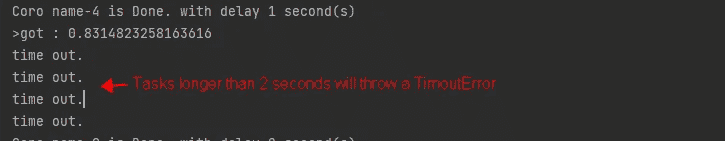

# 使用这些方法使你的 Python 并发任务表现更佳

> 原文：[`towardsdatascience.com/use-these-methods-to-make-your-python-concurrent-tasks-perform-better-b693b7a633e1`](https://towardsdatascience.com/use-these-methods-to-make-your-python-concurrent-tasks-perform-better-b693b7a633e1)

## [PYTHON 并发](https://medium.com/@qtalen/list/python-concurrency-2c979347da3b)

## asyncio.gather、asyncio.as_completed 和 asyncio.wait 的最佳实践

[](https://qtalen.medium.com/?source=post_page-----b693b7a633e1--------------------------------)[](https://towardsdatascience.com/?source=post_page-----b693b7a633e1--------------------------------) [Peng Qian](https://qtalen.medium.com/?source=post_page-----b693b7a633e1--------------------------------)

·发布于 [Towards Data Science](https://towardsdatascience.com/?source=post_page-----b693b7a633e1--------------------------------) ·6 分钟阅读·2023 年 4 月 18 日

--


图片由 [Aleksandr Popov](https://unsplash.com/@5tep5?utm_source=medium&utm_medium=referral) 提供，来自 [Unsplash](https://unsplash.com/?utm_source=medium&utm_medium=referral)

# 问题所在

Python 的多线程性能一直未能如预期那样，因为 GIL 的存在。

自从版本 3.4 起，Python 引入了 asyncio 包，通过并发执行 IO 绑定任务。经过几次迭代，asyncio API 的表现非常出色，与多线程版本相比，并发任务的性能显著提高。

然而，程序员在使用 asyncio 时仍然会犯许多错误：

一个错误如图所示，是直接使用 await 协程方法，这种方式将并发任务的调用从异步变为同步，最终丧失了并发特性。

另一个错误如图所示，虽然程序员意识到需要使用 `create_task` 来创建后台执行的任务。但是，下面这种逐个等待任务的方式，将具有不同时间的任务转变为有序等待。

这段代码将会等到 *task_1* 先完成，而不管 *task_2* 是否先完成。

# 什么是并发任务执行？

那么，什么是实际的并发任务？让我们用图示来说明：


不管我们启动了多少任务，最终都需要等待它们完成。图源：作者

如图所示，一个并发过程应该包括两个部分：启动后台任务，将后台任务重新加入主函数，并获取结果。

大多数读者已经知道如何使用 `create_task` 来启动后台任务。今天，我将介绍几种等待后台任务完成的方法以及每种方法的最佳实践。

# 入门

在我们开始介绍今天的主要内容之前，我们需要准备一个示例异步方法来模拟一个 IO 绑定的方法调用，并且还需要一个自定义的 AsyncException，用于在测试抛出异常时友好地提示异常消息：

# 并发执行方法的比较

一旦我们完成了准备工作，就该开始今天的旅程，系好安全带。

## 1\. asyncio.gather

`asyncio.gather` 可用于启动一组后台任务，等待它们执行完毕，并获取结果列表：

`asyncio.gather` 尽管可以形成一组后台任务，但不能直接接受列表或集合作为参数。如果你需要传递包含后台任务的列表，请解包它。

`asyncio.gather` 接受一个 `return_exceptions` 参数。当 `return_exceptions` 的值为 False 时，如果任何后台任务抛出异常，该异常将抛给调用 gather 方法的函数，并且 gather 方法的结果列表将为空。


截图。图像由作者提供

当 `return_exceptions` 的值为 True 时，后台任务抛出的异常不会影响其他任务的执行，最终会被合并到结果列表中一起返回。

```py
results = await asyncio.gather(*aws, return_exceptions=True)
```


截图。图像由作者提供

接下来，让我们看看为什么 `gather` 方法不能直接接受列表，而必须解包列表。因为当列表被填充并执行时，在等待它们完成的同时，很难向列表中添加新任务。然而，`gather` 方法可以使用嵌套组将现有任务与新任务混合，这解决了在中间无法添加新任务的问题：

然而，`gather` 无法直接设置超时参数。如果需要为所有正在运行的任务设置超时，请使用这种方式，这样的方式并不够优雅。

## 2\. asyncio.as_completed

有时候，我们必须在完成一个后台任务后立即开始后续操作。例如，当我们抓取一些数据并立即调用机器学习模型进行计算时，`gather` 方法不能满足我们的需求，但我们可以使用 `as_completed` 方法。

在使用 `asyncio.as_completed` 方法之前，我们先来看一下这个方法的源代码。

```py
# This is *not* a @coroutine!  It is just an iterator (yielding Futures).
def as_completed(fs, *, timeout=None):
  # ...
  for f in todo:
      f.add_done_callback(_on_completion)
  if todo and timeout is not None:
      timeout_handle = loop.call_later(timeout, _on_timeout)
  for _ in range(len(todo)):
      yield _wait_for_one()
```

源代码显示，`as_completed` 不是一个并发方法，而是返回一个带有 `yield` 语句的迭代器。因此，我们可以直接遍历每个完成的后台任务，并且可以对每个任务分别处理异常，而不会影响其他任务的执行：

`as_completed` 接受 `timeout` 参数，并且在超时发生时，当前迭代的任务将会抛出 `asyncio.TimeoutError`。



截图。图片来源：作者

`as_completed` 在处理任务执行结果方面比 `gather` 灵活得多，但在等待时很难将新任务添加到原任务列表中。

## 3\. asyncio.wait

`asyncio.wait` 的调用方式与 `as_completed` 相同，但返回一个包含两个集合的元组：`done` 和 `pending`。`done` 包含已经完成的任务，`pending` 包含仍在运行的任务。

`asyncio.wait` 接受一个 `return_when` 参数，该参数可以取三个枚举值：

+   当 `return_when` 为 `asyncio.ALL_COMPLETED` 时，`done` 存储所有已完成的任务，而 `pending` 为空。

+   当 `return_when` 为 `asyncio.FIRST_COMPLETED` 时，`done` 包含所有已完成的任务，而 `pending` 包含仍在运行的任务。


截图。图片来源：作者

+   当 `return_when` 为 `asyncio.FIRST_EXCEPTION` 时，`done` 存储那些抛出异常并完成执行的任务，而 `pending` 包含仍在运行的任务。

当 `return_when` 为 `asyncio.FIRST_COMPLETED` 或 `asyncio.FIRST_EXECEPTION` 时，我们可以递归调用 `asyncio.wait`，以便根据情况添加新任务并继续等待所有任务完成。


截图。图片来源：作者

## [4\. asyncio.TaskGroup](https://docs.python.org/3/library/asyncio-task.html#task-groups)

在 Python 3.11 中，`asyncio` 引入了新的 `TaskGroup` API，这使得 Python 正式支持 [**结构化并发**](https://en.wikipedia.org/wiki/Structured_concurrency)。这一特性允许你以更 Pythonic 的方式管理并发任务的生命周期。由于篇幅限制，我不会在这里详细讨论，但有兴趣的读者可以参考我的文章：

[](/why-taskgroup-and-timeout-are-so-crucial-in-python-3-11-asyncio-c424bcc88b89?source=post_page-----b693b7a633e1--------------------------------) ## 为什么 Taskgroup 和超时 在 Python 3.11 Asyncio 中如此重要

### 在 Python 3.11 中拥抱结构化并发

towardsdatascience.com

# 结论

本文介绍了 `asyncio.gather`、`asyncio.as_completed` 和 `asyncio.wait` API，并回顾了 Python 3.11 中引入的新 `asyncio.TaskGroup` 特性。

根据实际需要使用这些后台任务管理方法，可以使我们的 `asyncio` 并发编程更加灵活。

由于经验限制，本文的阐述不可避免地存在遗漏，请在阅读过程中随时留下评论，我会积极回复。

在以下文章中，我将描述如何让 tqdm 与 asyncio 配合使用，以通过进度条指示并发任务的进度：

[](/using-tqdm-with-asyncio-in-python-5c0f6e747d55?source=post_page-----b693b7a633e1--------------------------------) ## 在 Python 中使用 Tqdm 和 Asyncio

### 监控并发任务进度的高效方法

towardsdatascience.com

如果你对如何在实际应用中使用 asyncio 处理数据集任务感兴趣，可以阅读我的这篇文章：

[](/combining-multiprocessing-and-asyncio-in-python-for-performance-boosts-15496ffe96b?source=post_page-----b693b7a633e1--------------------------------) ## 在 Python 中结合多进程和 Asyncio 以提升性能

### 使用实际案例来解释 `run_in_executor` APIs

towardsdatascience.com

通过 [加入 Medium](https://medium.com/@qtalen/membership)，你将可以无限制访问我所有的文章以及成千上万其他作者的文章。它只需花费你一杯咖啡的钱，但对我来说是极大的鼓励。

这篇文章最初发布于：[`www.dataleadsfuture.com/use-these-methods-to-make-your-python-concurrent-tasks-perform-better/`](https://www.dataleadsfuture.com/use-these-methods-to-make-your-python-concurrent-tasks-perform-better/)
