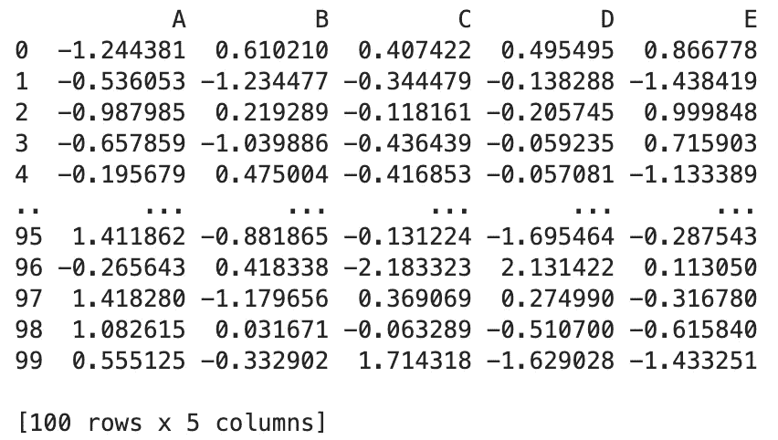
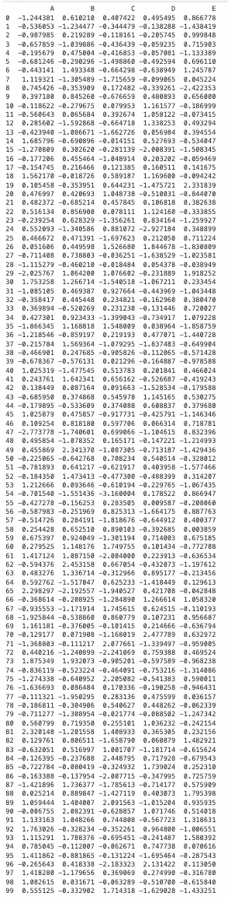
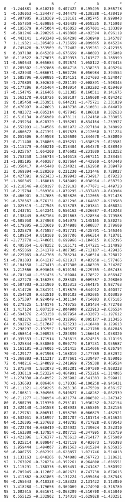

# 使用 to_string() 防止 Python 隐藏打印数据框的主体

> 原文：[`towardsdatascience.com/use-to-string-to-stop-python-from-hiding-the-body-of-the-printed-dataframes-47ce474ea914`](https://towardsdatascience.com/use-to-string-to-stop-python-from-hiding-the-body-of-the-printed-dataframes-47ce474ea914)

## 3-分钟 Pandas

## 我们应该怎么做才能在 Python 脚本执行后查看整个打印的数据框？

[](https://jianan-lin.medium.com/?source=post_page-----47ce474ea914--------------------------------)[](https://towardsdatascience.com/?source=post_page-----47ce474ea914--------------------------------) [Yufeng](https://jianan-lin.medium.com/?source=post_page-----47ce474ea914--------------------------------)

·发表于 [Towards Data Science](https://towardsdatascience.com/?source=post_page-----47ce474ea914--------------------------------) ·4 分钟阅读·2023 年 4 月 10 日

--


照片由 [Pascal Müller](https://unsplash.com/@millerthachiller?utm_source=medium&utm_medium=referral) 提供，来源于 [Unsplash](https://unsplash.com/?utm_source=medium&utm_medium=referral)

有时，运行 Python 脚本时没有报告任何错误，并不是调试过程中的唯一任务。我们需要确保函数按预期执行。这是在探索性数据分析中的一个典型步骤，检查数据在某些特定数据处理前后的样子。

因此，我们需要在脚本执行过程中打印一些数据框或重要变量，以检查它们是否“正确”。然而，简单的 print 命令有时只能显示数据框的前几行和最后几行（如下例所示），这使得检查过程变得不必要地困难。

通常，数据框的格式是 `pandas.DataFrame`，如果直接使用 print 命令，你可能会得到如下内容，

```py
import pandas as pd
import numpy as np

data = np.random.randn(5000, 5)
df = pd.DataFrame(data, columns=['A', 'B', 'C', 'D', 'E'])

print(df.head(100))
```



打印前 100 行（图像由作者提供）

你可能已经注意到，数据框的中间部分被三个点隐藏了。如果我们真的需要检查前 100 行是什么呢？例如，我们想检查一个大型 Python 脚本中间某个特定步骤的结果，以确保函数按预期执行。

## set_option()

最直接的解决方案之一是编辑 Pandas 显示的默认行数，

```py
pd.set_option('display.max_rows', 500)
print(df.head(100))
```



设置 Pandas 显示的默认行数后，打印前 100 行（图像由作者提供）

其中 `set_option` 是一个方法，它允许你控制 Pandas 函数的行为，包括设置显示的最大行数或列数，如我们之前所做的。第一个参数 `display.max_rows` 是用来调整显示的最大行数的，500 是我们设定的最大行数值。

尽管这种方法被广泛使用，但将其放在可执行的 Python 文件中并不理想，尤其是当你有多个数据框要打印，并且希望它们显示不同的行数时。

例如，我有一个结构如下的脚本，

```py
## Code Block 1 ##
...
print(df1.head(20))
...

## Code Block 2 ##
...
print(df2.head(100))
...

## Code Block N ##
...
print(df_n)
...
```

我们在整个脚本中需要显示不同数量的前行，有时我们想查看整个打印的数据框，但有时我们只关心数据框的维度和结构，而不需要查看全部数据。

在这种情况下，我们可能需要使用函数 `pd.set_option()` 来设置所需的 `display`，或使用 `pd.reset_option()` 每次在打印数据框之前恢复默认选项，这样会变得非常麻烦。

```py
## Code Block 1 ##
...
pd.set_option('display.max_rows', 20)
print(df1.head(20))
...

## Code Block 2 ##
...
pd.set_option('display.max_rows', 100)
print(df2.head(100))
...

## Code Block N ##
...
pd.reset_option('display.max_rows')
print(df_n)
...
```

实际上，还有一种更灵活和有效的方法来显示整个数据框，而不需要为 Pandas 指定显示选项。

## to_string()

`to_string()` 直接将 `pd.DataFrame` 对象转换为字符串对象，当我们打印它时，不会受 `pandas` 的显示限制影响。

```py
pd.set_option('display.max_rows', 10)
print(df.head(100).to_string())
```



使用 to_string() 打印前 100 行（图片由作者提供）

我们可以看到，尽管我将显示的最大行数设置为 10，`to_string()` 帮助我们打印了 100 行的整个数据框。

函数 `to_string()` 将整个数据框转换为 `string` 格式，因此可以在打印步骤中保留数据框中的所有值和索引。由于 `set_option()` 仅对 pandas 对象有效，我们的打印 `string` 不受之前设置的最大行数限制。

所以，策略是你无需通过 `set_option()` 设置任何内容，只需使用 `to_string()` 即可查看整个数据框。这将避免你考虑在脚本的哪个部分设置哪个选项。

## 收获

1.  当你在整个脚本中有一致的行数需要显示时，请使用 `set_option('display.max_rows')`。

1.  如果你想打印整个 Pandas 数据框，无论 Pandas 选项设置如何，请使用 `to_string()`。

感谢阅读！希望你在工作中喜欢使用 Pandas 技巧！

如果你想阅读更多我的故事，请 [订阅我的 Medium](https://jianan-lin.medium.com/subscribe)。你还可以通过我的 [推荐链接](https://jianan-lin.medium.com/membership) 加入 Medium 会员！
