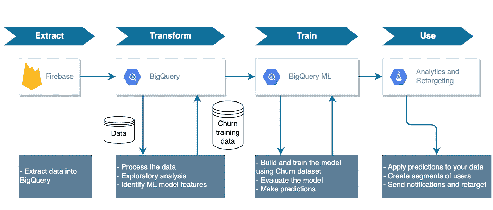
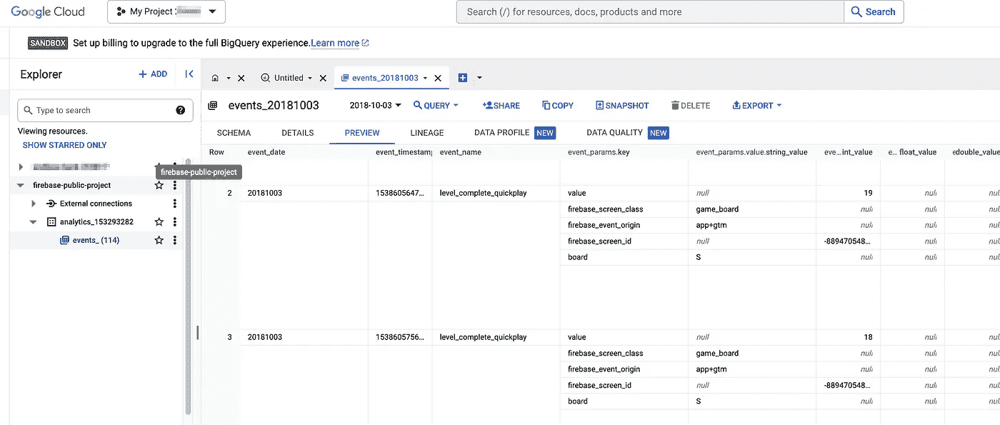
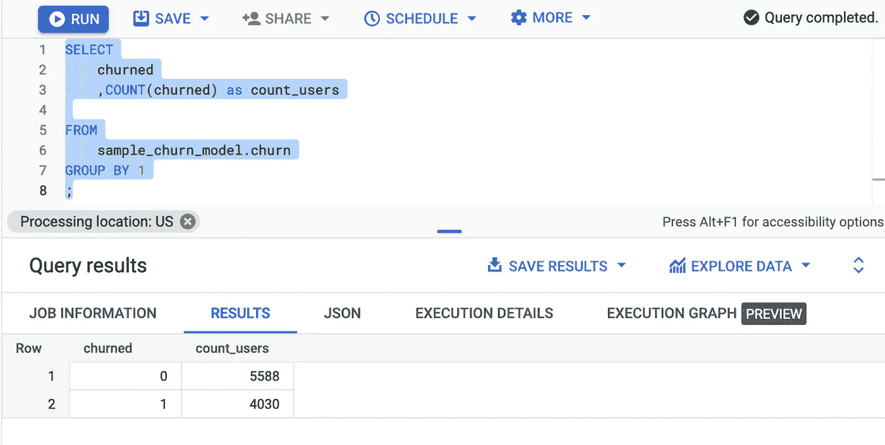
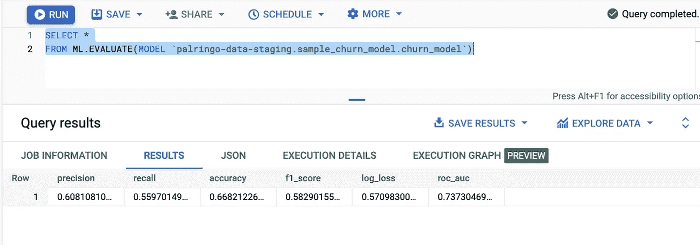
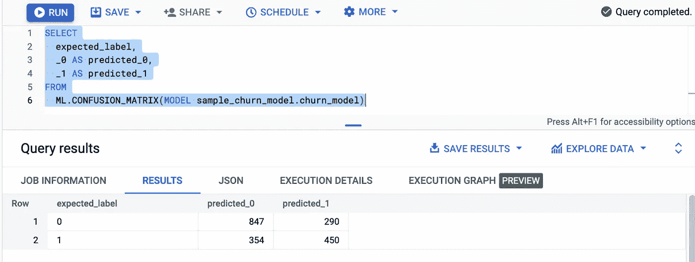
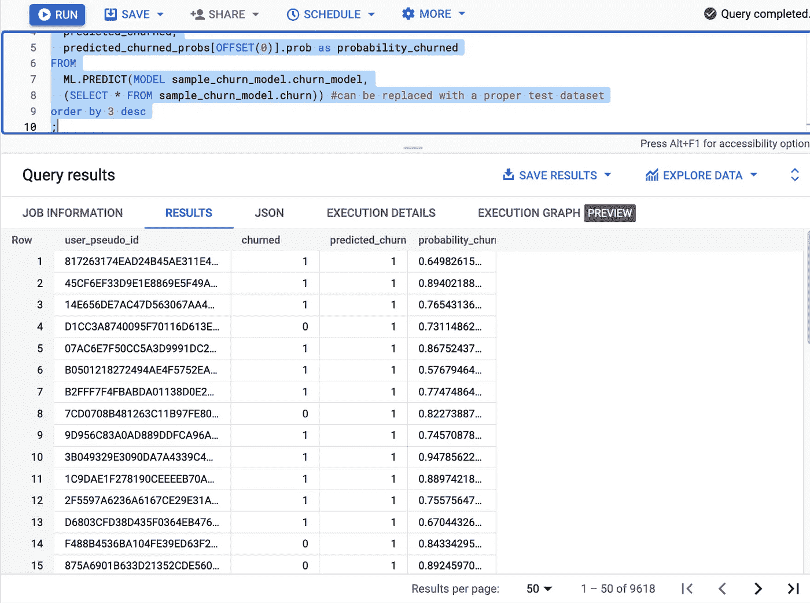

# 用户流失预测

> 原文：[`towardsdatascience.com/user-churn-prediction-d43c53e6f6df`](https://towardsdatascience.com/user-churn-prediction-d43c53e6f6df)

## 现代数据仓库与机器学习

[](https://mshakhomirov.medium.com/?source=post_page-----d43c53e6f6df--------------------------------)[](https://towardsdatascience.com/?source=post_page-----d43c53e6f6df--------------------------------) [💡Mike Shakhomirov](https://mshakhomirov.medium.com/?source=post_page-----d43c53e6f6df--------------------------------)

·发表于 [Towards Data Science](https://towardsdatascience.com/?source=post_page-----d43c53e6f6df--------------------------------) ·12 分钟阅读·2023 年 12 月 23 日

--


照片由 [Martin Adams](https://unsplash.com/@martinadams?utm_source=medium&utm_medium=referral) 提供，发布在 [Unsplash](https://unsplash.com/?utm_source=medium&utm_medium=referral)

毫无疑问，**用户留存**是许多公司和在线应用程序的重要绩效指标。我们将讨论如何利用内置的数据仓库机器学习功能，运行用户行为数据的倾向模型，以确定**用户流失**的可能性。在这个故事中，我想重点关注数据集准备和使用标准 SQL 进行模型训练。现代数据仓库允许这样做。确实，留存是一个重要的业务指标，有助于理解用户行为的机制。它提供了一个高层次的概述，回答了我们应用程序在留住用户方面的成功程度：我们的应用程序是否足够好，能够留住用户？一个众所周知的事实是，留住现有用户比获得新用户要便宜。

在我之前的一篇文章中，我写到了现代数据仓库 [1]。

[](/modern-data-warehousing-2b1b0486ce4a?source=post_page-----d43c53e6f6df--------------------------------) ## 现代数据仓库

### 先进的数据平台设计

towardsdatascience.com

现代 DWH 具有许多有用的功能和组件，使其与其他数据平台类型有所区别 [2]。

> ML 模型支持似乎是处理大数据时的基础 DWH 组件。

在这个故事中，我将使用**二元逻辑回归**，这是训练速度最快的模型之一。我将演示如何利用它来预测用户流失的倾向。确实，我们不需要了解每一个机器学习模型。

> 我们无法与 Amazon 和 Google 等云服务提供商在机器学习和数据科学领域竞争，但我们需要知道如何使用它。

我在我的文章中曾经写过关于这个的内容 [3]：

[](/how-to-become-a-data-engineer-c0319cb226c2?source=post_page-----d43c53e6f6df--------------------------------) ## 如何成为数据工程师

### 2024 年初学者的快捷方式

[towardsdatascience.com

在本教程中，我们将学习如何转换原始事件数据，以创建一个用于 ML 模型的训练数据集。我们将使用它来生成对用户的预测。我将以**BigQuery ML**作为示例，但还有很多其他支持此功能的数据仓库工具。

BigQuery ML 使机器学习操作和模型训练变得更加普及，因此现在数据分析师或软件工程师可以轻松训练模型。我们只需要对 SQL 有良好的知识，并了解用户保留数据集的逻辑[4]。

数据准备过程简单明了，应该很容易跟随。

> 我们将使用标准 SQL 来实现。

通常，这有助于揭示一些有关数据和用户基础的有用信息。分析用户行为和进行探索性数据分析有助于检测重要的用户行为漏斗（开放漏斗），这些漏斗可以用于进一步的特征工程，并改进模型。

例如，我们可以使用 Google 友善提供的免费用户行为数据集中的一个。这些数据集的典型移动应用有两个版本——Android 和 iOS，它们生成持续的事件数据流。Google Analytics 4 是一个很好的例子，这些数据可以用来衡量我们应用中的流量和参与度水平。

> 每个模型都需要一个数据集

我们想要创建一个。我们需要：

+   对来自 Firebase（Google Analytics 4）的 BigQuery 导出数据集进行探索性数据分析（EDA）。

+   将数据集分为两部分用于训练和测试，包含用于机器学习（ML）模型的分类和行为属性。

+   使用 BigQuery ML 训练和评估机器学习模型

+   使用 BigQuery ML 模型进行预测

+   将模型洞察应用于实践

在 Firebase 或 Google Analytics 4 中，所有用户行为数据都作为事件存储，这意味着表中的每一行对应一个单独的事件，并附带额外的参数和属性。



数据集准备和模型训练示意图

我们将使用一个公开的 Google Analytics 数据集[5]，它包含一个名为“Flood It!”的移动游戏应用的数据（Android、iOS），且没有相关费用。然而，Google Cloud Platform（GCP）服务是按使用量计费的，可能会产生费用。



数据集示例。图片由作者提供。

该数据集包含来自超过 15,000 个用户的 570 万个事件。打开上面的链接并点击预览。

> 运行任何表的预览不会产生费用。

通过在下面的命令行中运行此命令来复制此数据集：

```py
gcloud init # Authenticate

# Use bq mk command with --dataset flag to create a new dataset:
bq mk
  --dataset \
  --location=US \
  PROJECT:DATASET

# # Example:
# bq mk
#   --dataset \
#   --location=US \
#   bq-shakhomirov:analytics_153293282

# Use bq mk with --transfer_config flag to copy the dataset with public data:
bq mk
--transfer_config
--project_id=PROJECT \ # Replace with your project_id
--data_source=cross_region_copy
--target_dataset=analytics_153293282
--display_name=analytics_153293282
--params='{"source_dataset_id":"analytics_153293282","source_project_id":"firebase-public-project","overwrite_destination_table":"true"}'
```

## 探索数据

分析用户行为和进行探索性数据分析 [6] 有助于更好地理解用户旅程。

[](/exploratory-data-analysis-with-bigquery-sql-easy-69895ac4eb9e?source=post_page-----d43c53e6f6df--------------------------------) ## 使用 BigQuery SQL 进行探索性数据分析？简单！

### 完整的 Python 比较和逐步指南，适用于任何数据集。Kaggle 用户流失数据。

towardsdatascience.com

运行此查询以检查数据集结构：

```py
SELECT *
FROM `firebase-public-project.analytics_153293282.events_*`
TABLESAMPLE SYSTEM (1 PERCENT)
;
```

该数据集的限制在于用户数据没有实际的 `user_id`，而 `user_id` 通常是在注册后分配的。因此，在处理该数据集时，我们仅使用 `device ids`，这在理想情况下不是很好，因为这些在重新安装或新应用版本推出后会不断更新。

首先，我们希望对原始事件数据进行预处理，并创建一个具有正确结构的新数据集，以便用于机器学习模型。

+   如果用户在过去 30 天内活跃，我们将标记每个用户为**保留（0）**。

+   我们将使用 GA4 的 `user_pseudo_id`（device_id），Firebase 默认使用它来识别每个用户的设备。

+   根据我们的 EDA，我们将排除一些明显的异常值，例如垃圾邮件发送者（事件过多）和 `bounced` 用户（在 `install` 事件后在应用中停留时间少于 10 分钟的用户）。

+   我们将添加几个从原始事件数据中提取的类别特征列，例如 `platform`、`device_type`、`country` 等。

+   我们最终会添加每个用户在一定时间内的用户行为和活动总量，例如 `user_engagement`、`spend_virtual_currency` 等。

这些计算将用作机器学习模型的特征，但简而言之，它们是开放的事件漏斗，即用户在使用应用程序时的步骤。

我们的**未流失**（回归用户）定义是用户在当前日期前的过去 30 天内活跃并与应用程序互动。你可以尝试调整此参数。你还可以尝试预测某些内容，例如在应用中消费的可能性（`in_app_purchase`）等。

## 计算跳失和流失用户

如果我们在模型中使用 `user_pseudo_id`，则如果 `last_touch` 在注册后 10 分钟内，我们会计算 `bounced = 1`，否则为 0：

```py
...

 IF (user_last_engagement <= TIMESTAMP_ADD(user_first_engagement, 
      INTERVAL 10 MINUTE),
    1,
    0 ) AS bounced

, IF(last_seen_dt < DATE_SUB(current_date(),INTERVAL 30 DAY) , 1, 0)     AS churned
...
```

如果我们有一个每天更新的动态数据集，使用 `current_date()` 来识别流失用户是理想的。然而，我们正在处理一些样本数据，因此我们应该使用数据中的最后已知日期，即我们假设在特定日期（20181003）收集了数据。

理想情况下，我们希望只跟踪那些在安装应用后完成注册的用户。在这种情况下，我们不需要计算 `bounced`，如果 `last_seen_dt` 在从 `current_timestamp()` 计算的 ***24 小时/3 天/30 天*** 之前，则计算 `churned = 1`，否则为 0：

```py
...
  , IF( last_seen_ts < timestamp_sub(
        current_timestamp(), interval 30*24 hour) , 1, 0) AS churned
...
```

## 添加行为定量和类别特征

这就是我们将用来构建模型的数据。分类特征可以表示一些不可量化的人口统计值，例如性别等。定量特征则是我们可以测量和计数的。

这两种特征的组合有助于创建一个更具预测性的模型。Firebase/GA4 数据集中提取了大量信息，这可能对我们的模型有用，例如 app_info、device、event_params、geo 等。

Firebase 会自动收集许多事件，但请记住，也可以设置自定义事件和属性。作为移动开发者，我们可以集成一个自定义事件，例如用户 `tag`。对于我们的示例应用程序，这将指示用户可能具有某些应用内权限（如高级会员、影响者、群组管理员、版主等）。

话虽如此，我们希望使用以下分类特征：

+   platform (IOS/Android)

+   geo.country

+   device.operating_system

+   device.language

需要注意的是，用户在这些字段中可能具有不同的值，例如不同的设备、语言更改和 VPN 设置可能会影响这些值。因此，我们只需要第一个参与事件和他们在 `install` 或 `registration` 时使用的设备设置。

> 添加 row_number 函数将有助于实现这一点：

```py
...
ROW_NUMBER() OVER (PARTITION BY user_pseudo_id ORDER BY event_timestamp DESC) AS row_number
...
```

然后，为了预测用户流失，我们希望统计用户在注册/安装后的 ***24 小时/3 天/7 天*** 内遇到的事件数量：

在我们的案例中，我们希望收集和统计这些事件：

+   user_engagement

+   level_start_quickplay

+   level_end_quickplay

+   level_complete_quickplay

+   level_reset_quickplay

+   post_score

+   spend_virtual_currency

+   ad_reward

+   challenge_a_friend

+   completed_5_levels

+   use_extra_steps

对于其他应用程序，收集描述用户行为的其他事件可能是有用的，即：

+   message_sent

+   chat_open

+   spend_virtual_currency

+   account_topup

+   set_avatar

+   group_join

+   broadcast_listened

+   achievement_unlocked

+   reputation_update

## 计算模型特征

让我们为未来的模型及其数据创建一个专用数据集：`sample_churn_model`。

`./sql/churn.sql` 中的 SQL 查询演示了如何计算这些用户指标。我们可以在代码小部件中找到这个文件。要创建这个数据集，请在命令行中运行：

```py
bq query --nouse_legacy_sql < sql/churn.sql
```

## `./sql/churn.sql:`

```py
-- ./sql/churn.sql
create schema if not exists sample_churn_model
  OPTIONS (
    description = 'sample_churn_model',
    location = 'US'
)
;

create or replace table sample_churn_model.churn as
with first_engagement_data as (
select distinct

    user_pseudo_id
  , device.language
  , geo.country
  , platform
  , ROW_NUMBER() OVER (PARTITION BY user_pseudo_id ORDER BY event_timestamp DESC) AS row_num

from `firebase-public-project.analytics_153293282.events_*`

where
-- _TABLE_SUFFIX =  FORMAT_DATE('%Y%m%d', DATE_SUB(current_date(), INTERVAl 1 DAY))
-- and 
lower(event_name) = 'user_engagement'
)

, first_engagement as (
    select * except (row_num)
    from first_engagement_data
    where row_num = 1 
)

, first_last_seen as (
    select
        user_pseudo_id
      , min(event_timestamp) as first_seen_ts
      , max(event_timestamp) as last_seen_ts
    from
      `firebase-public-project.analytics_153293282.events_*`
    where event_name = 'user_engagement'
    group by
      user_pseudo_id
)

, event_aggregates as (
  select
     event_date                                         
    ,user_pseudo_id
    ,lower(event_name)                   as event_name  
    ,count(distinct event_timestamp)     as event_cnt   
  from 
    `firebase-public-project.analytics_153293282.events_*`
--   where
--     _TABLE_SUFFIX =  FORMAT_DATE('%Y%m%d', DATE_SUB(current_date(), INTERVAl 1 DAY))
  group by
     event_date
    ,user_pseudo_id
    ,event_name
)

, daily_data as (
select
     a.user_pseudo_id   
    ,a.event_date       
    ,a.event_name
    ,a.event_cnt
    ,f.first_seen_ts    
    ,f.last_seen_ts     
    ,e.language         
    ,e.country          
    ,e.platform         

    , date_diff(
          parse_date('%Y%m%d', a.event_date)
        , cast(timestamp_micros(first_seen_ts) as date)
        , day
    )  as day_number

    ,if( cast(timestamp_micros(f.last_seen_ts) as date) < 
                date_sub(parse_date('%Y%m%d', '20181003'), interval 30 day) 
        , 1
        , 0)     as churned -- wasn't active last 30 days

    ,if (timestamp_micros(last_seen_ts) <= timestamp_add(timestamp_micros(first_seen_ts), 
                interval 10 minute)
        ,1
        ,0 )     as bounced

from event_aggregates a
left join first_last_seen f on f.user_pseudo_id = a.user_pseudo_id 
left join first_engagement e on e.user_pseudo_id = a.user_pseudo_id
)

-- Final dataset for churn model training:
select
     user_pseudo_id   
    ,first_seen_ts    
    ,last_seen_ts     
    ,language         
    ,country          
    ,platform         
    ,churned          
    ,sum(if(day_number in (0) and event_name = 'user_engagement', event_cnt, 0))            as user_engagement_cnt          
    ,sum(if(day_number in (0) and event_name = 'level_start_quickplay', event_cnt, 0))      as level_start_quickplay_cnt    
    ,sum(if(day_number in (0) and event_name = 'level_end_quickplay', event_cnt, 0))        as level_end_quickplay_cnt      
    ,sum(if(day_number in (0) and event_name = 'level_complete_quickplay', event_cnt, 0))   as level_complete_quickplay_cnt 
    ,sum(if(day_number in (0) and event_name = 'level_reset_quickplay', event_cnt, 0))      as level_reset_quickplay_cnt    
    ,sum(if(day_number in (0) and event_name = 'post_score', event_cnt, 0))                 as post_score_cnt               
    ,sum(if(day_number in (0) and event_name = 'spend_virtual_currency', event_cnt, 0))     as spend_virtual_currency_cnt   
    ,sum(if(day_number in (0) and event_name = 'ad_reward', event_cnt, 0))                  as ad_reward_cnt                
    ,sum(if(day_number in (0) and event_name = 'challenge_a_friend', event_cnt, 0))         as challenge_a_friend_cnt       
    ,sum(if(day_number in (0) and event_name = 'completed_5_levels', event_cnt, 0))         as completed_5_levels_cnt       
    ,sum(if(day_number in (0) and event_name = 'use_extra_steps', event_cnt, 0))            as use_extra_steps_cnt          
from daily_data
-- where bounced = 0
group by
     user_pseudo_id   
    ,first_seen_ts    
    ,last_seen_ts     
    ,language         
    ,country          
    ,platform         
    ,churned 
```

让我们看看有多少用户流失了：

从我们的数据集中，我们发现 4030 名用户在过去 30 天内流失并处于非活动状态：

```py
SELECT
    churned
    ,COUNT(churned) as count_users

FROM
    sample_churn_model.churn
GROUP BY 1
;
```



流失的用户。图片由作者提供。

## 模型训练和分类

目前在 BigQuery ML 中有不同的模型类型 [7]：

+   BOOSTED_TREE_CLASSIFIER

+   神经网络

+   AutoML Tables

+   逻辑回归

逻辑回归可能是一个很好的起点，因为它可以相对较快地训练。其他类型的模型可能提供更好的性能，但也需要更多的训练时间，例如深度神经网络。

这些模型中的每一个都会输出一个 0 到 1.0 之间的概率分数（倾向），表示模型预测的可能性。

请参考文件``./sql/churn_model.sql``。如果我们运行它，它将创建并训练模型。

运行此查询来评估模型：

```py
bq query --nouse_legacy_sql \
'SELECT * FROM ML.EVALUATE(MODEL sample_churn_model.churn_model);'
```

你将看到模型性能指标。分析这些指标可能有助于在不同模型之间进行选择。

例如，关于模型准确性，任何超过 70%的结果都被视为强模型性能。

我们的模型的召回率为 0.559——换句话说，它正确识别了 56%的所有流失用户。



模型性能指标。图片由作者提供。

我们可以使用混淆矩阵来查看我们的模型在预测标签方面的表现，与实际标签进行比较。

如果我们运行下面的 SQL，它将生成一个混淆矩阵。

```py
SELECT
  expected_label,
  _0 AS predicted_0,
  _1 AS predicted_1
FROM
  ML.CONFUSION_MATRIX(MODEL sample_churn_model.churn_model)
```

这可以被解释为`false positive`和`false negative`预测的比较。



混淆矩阵。图片由作者提供。

## 使用预测

对于我们的分类模型，最重要的指标是用户流失和不活跃的倾向。换句话说，这是一种概率，且该概率越接近 1，模型预测的用户越不可能返回应用程序：

```py
SELECT
  user_pseudo_id,
  churned,
  predicted_churned,
  predicted_churned_probs[OFFSET(0)].prob as probability_churned
FROM
  ML.PREDICT(MODEL sample_churn_model.churn_model,
  (SELECT * FROM sample_churn_model.churn)) #can be replaced with a proper test dataset
order by 3 desc
;
```



预测。图片由作者提供。

> 在现实生活中，我们希望创建一个每天更新的预测数据集。

**首先**，我们需要昨天注册的 Firebase/Analytics 用户。我们需要安排我们的``sample_churn_model.churn``数据集，并逐步添加昨天的新用户，即：

```py
insert into sample_churn_model.churn (...)
select
  ... -- aggregate model features for new users.
from 
  `firebase-public-project.analytics_153293282.events_*`
where
  _TABLE_SUFFIX =  FORMAT_DATE('%Y%m%d', DATE_SUB(current_date(), INTERVAl 1 DAY))
...
```

然后我们希望生成对它们的预测并将其插入到我们的新`predictions`数据集中：

```py
SELECT
  user_pseudo_id,
  churned,
  predicted_churned,
  predicted_churned_probs[OFFSET(0)].prob as probability_churned
FROM
  ML.PREDICT(MODEL sample_churn_model.churn_model,
  (SELECT * FROM sample_churn_model.churn 
WHERE date(first_seen_ts) = date_sub(current_date(), interval 1 day)))
```

使用这个模型，我们可以通过模式更好地理解用户行为，当然，我们还希望利用这些知识做些事情。

有多种方法可以使用预测数据（激活）。例如，我们可以使用 SDK 和客户端库直接从我们的 DWH 解决方案中读取数据。例如，我们可能希望**创建一个数据服务**，每天收集新用户的预测数据，然后将这些数据发送到其他地方，即**重新定向服务**。是的，我们可能也希望重新定向那些可能流失的用户或可能留在应用中的用户。

## 结论

确实，对机器学习（ML）模型数据采取行动以保留用户被证明是非常有用的，并且可能帮助在快速变化的市场环境中获得竞争优势。这就是为什么能够预测用户参与度以预测用户是否即将离开是重要的。我们不需要成为数据科学家就能创建和训练 ML 模型。我们所需要的 — 是现代数据仓库、良好的 SQL 知识以及对用户保留逻辑的良好理解。现代数据仓库已发展到可以提供所有已知 ML 模型的状态，它们已经准备好使用标准 SQL 方言进行创建。通过预测的保留数字，我们可以创建和编辑受众。利用现代数据仓库中的 ML 功能，我们可以通过向识别出的用户提供相关信息、有用的优惠和促销来量身定制用户体验。现代数据仓库解决方案使机器学习操作和模型训练民主化。这对于数据工程师来说是一个极其有用的特性，因为所有这些过程可以很容易地自动化、计划和触发，具体取决于使用案例场景。

## 推荐阅读

[1] `towardsdatascience.com/modern-data-warehousing-2b1b0486ce4a`

[2] `towardsdatascience.com/data-platform-architecture-types-f255ac6e0b7`

[3] `towardsdatascience.com/how-to-become-a-data-engineer-c0319cb226c2`

[4] `towardsdatascience.com/retention-and-daily-active-users-explained-79c5dab1bf84`

[5] [`console.cloud.google.com/bigquery?p=firebase-public-project&d=analytics_153293282&t=events_20181003&page=table&_ga=2.124992394.-1293267939.1657258995`](https://console.cloud.google.com/bigquery?p=firebase-public-project&d=analytics_153293282&t=events_20181003&page=table&_ga=2.124992394.-1293267939.1657258995)

[6] `towardsdatascience.com/exploratory-data-analysis-with-bigquery-sql-easy-69895ac4eb9e`

[7] [`cloud.google.com/bigquery-ml/docs/introduction`](https://cloud.google.com/bigquery-ml/docs/introduction)
