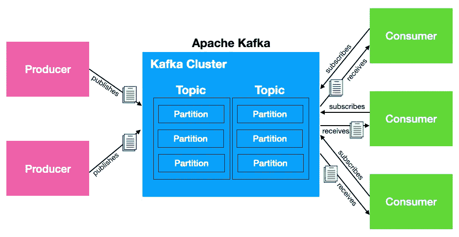

# 使用 Apache Kafka 进行数据流处理

> 原文：[`towardsdatascience.com/using-apache-kafka-for-data-streaming-9199699623fa?source=collection_archive---------9-----------------------#2023-03-01`](https://towardsdatascience.com/using-apache-kafka-for-data-streaming-9199699623fa?source=collection_archive---------9-----------------------#2023-03-01)

## 学习如何安装和使用 Kafka 发送和接收消息

 [Wei-Meng Lee](https://weimenglee.medium.com/?source=post_page-----9199699623fa--------------------------------)

·

[查看](https://medium.com/m/signin?actionUrl=https%3A%2F%2Fmedium.com%2F_%2Fsubscribe%2Fuser%2F6599e1e08a48&operation=register&redirect=https%3A%2F%2Ftowardsdatascience.com%2Fusing-apache-kafka-for-data-streaming-9199699623fa&user=Wei-Meng+Lee&userId=6599e1e08a48&source=post_page-6599e1e08a48----9199699623fa---------------------post_header-----------) 发布于 [Towards Data Science](https://towardsdatascience.com/?source=post_page-----9199699623fa--------------------------------) ·6 分钟阅读·2023 年 3 月 1 日

--

图片由 [Patrick Perkins](https://unsplash.com/@patrickperkins?utm_source=medium&utm_medium=referral) 提供，来源于 [Unsplash](https://unsplash.com/?utm_source=medium&utm_medium=referral)

# **什么是 Apache Kafka?**

**Apache Kafka** 是一个开源应用程序，用于大数据的实时流处理。它是一个发布-订阅消息系统，可以用来在进程、应用程序和服务器之间发送消息。下图展示了 Apache Kafka 的高层架构概览：

所有图片均由作者提供

与其他消息系统不同，Kafka 还具有如分区、复制等附加特性，且其吞吐量和容错能力高于其他消息系统。这些特性使得 Kafka 非常适合高容量消息处理。

> 我将会在未来的文章中详细讨论集群和分区以及其他特性。

在本文中，我将带你了解如何在你的系统上安装 Kafka，以便你对其工作原理有更好的理解。未来的文章将深入探讨 Kafka 的具体使用案例。

# 安装

安装 Kafka 是相当简单的。你只需按照这 3 个步骤…
