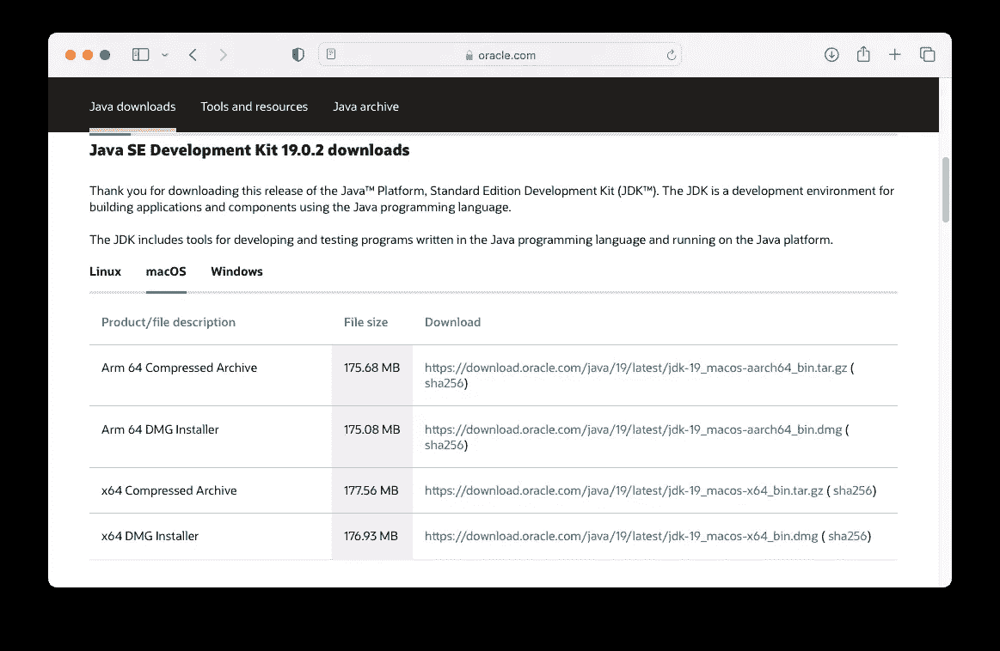
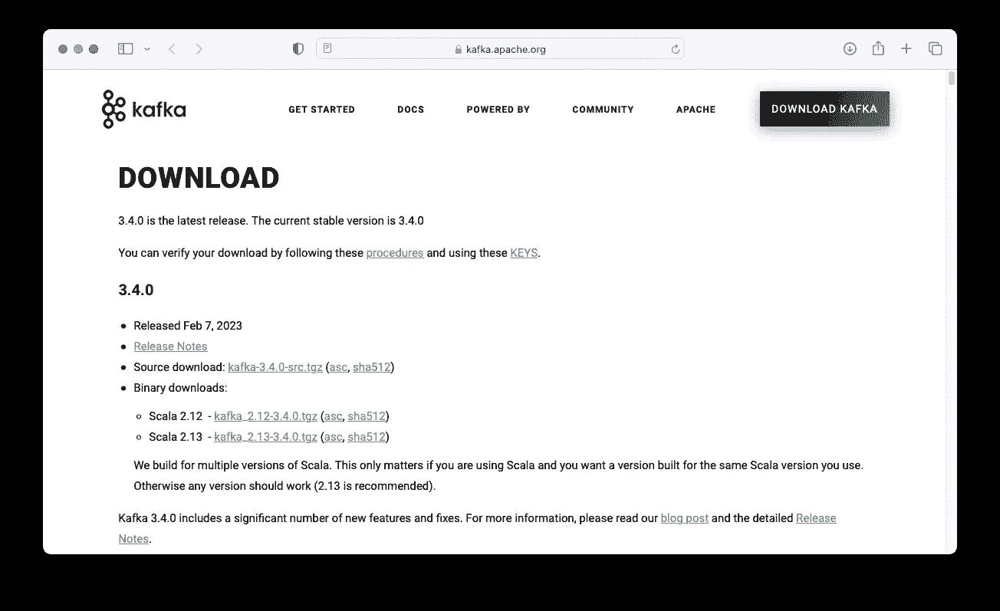
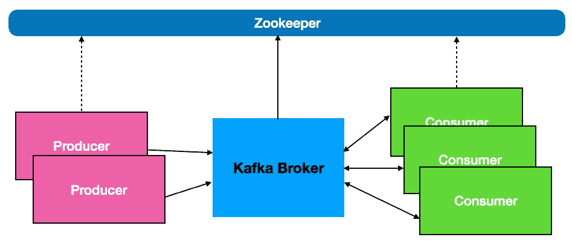
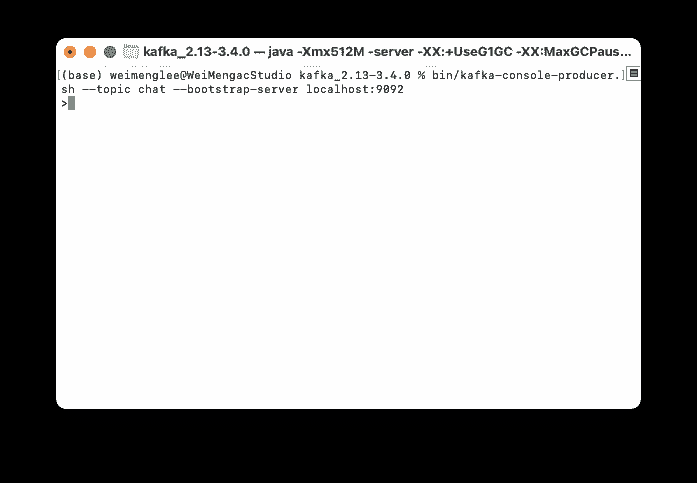
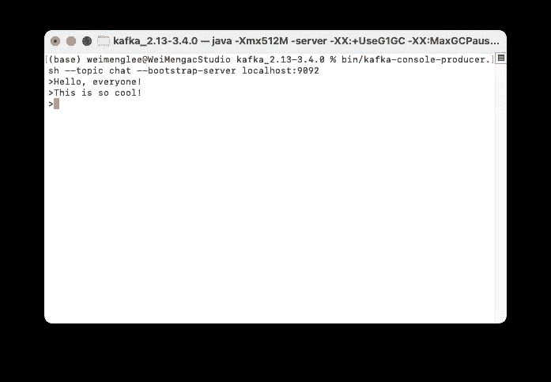
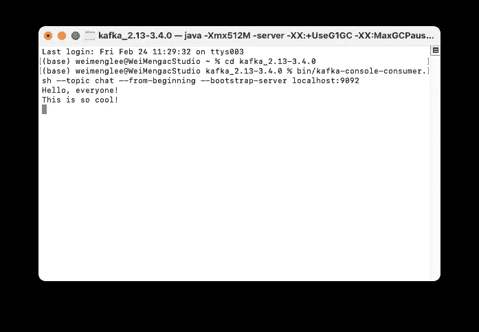
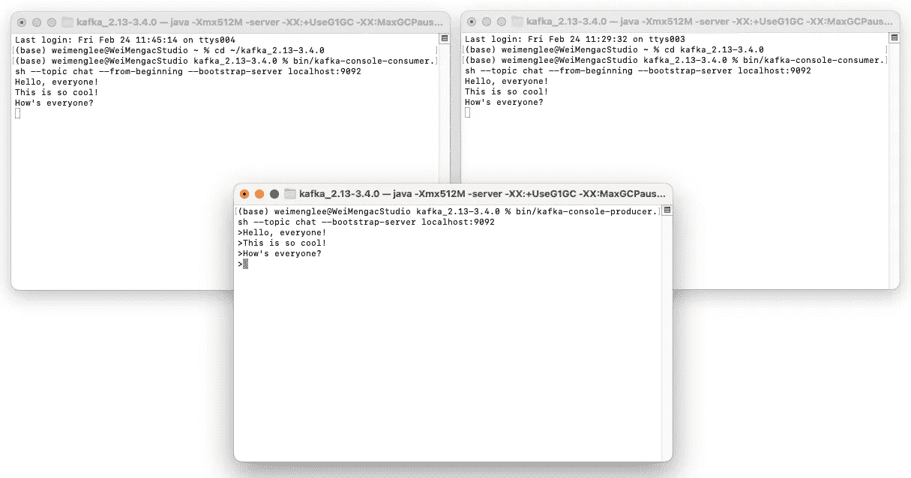

# 使用 Apache Kafka 进行数据流处理

> 原文：[`towardsdatascience.com/using-apache-kafka-for-data-streaming-9199699623fa`](https://towardsdatascience.com/using-apache-kafka-for-data-streaming-9199699623fa)

## 学习如何安装和使用 Kafka 发送和接收消息

[](https://weimenglee.medium.com/?source=post_page-----9199699623fa--------------------------------)[](https://towardsdatascience.com/?source=post_page-----9199699623fa--------------------------------) [Wei-Meng Lee](https://weimenglee.medium.com/?source=post_page-----9199699623fa--------------------------------)

·发表于 [Towards Data Science](https://towardsdatascience.com/?source=post_page-----9199699623fa--------------------------------) ·6 分钟阅读·2023 年 3 月 1 日

--


由 [Patrick Perkins](https://unsplash.com/@patrickperkins?utm_source=medium&utm_medium=referral) 提供的照片，刊登在 [Unsplash](https://unsplash.com/?utm_source=medium&utm_medium=referral)

# **什么是 Apache Kafka？**

**Apache Kafka** 是一个开源应用，用于大数据的实时流处理。它是一个发布-订阅消息系统，你可以用它在进程、应用和服务器之间发送消息。以下图示展示了 Apache Kafka 的高层架构概述：


所有图片均由作者提供

与其他消息系统不同，Kafka 还具有额外的功能，如分区、复制，并且具有比其他消息系统更高的吞吐量和容错性。所有这些功能使 Kafka 非常适合高容量的消息处理。

> 我将在未来的文章中详细讨论集群、分区及其他功能。

在本文中，我将指导你完成在系统上安装 Kafka 的过程，以便你对其工作原理有更好的了解。未来的文章将深入探讨 Kafka 的具体使用案例。

# 安装

安装 Kafka 相当简单。你只需按照以下列出的 3 个步骤安装并运行 Kafka：

+   安装 Java

+   下载并安装 Kafka

+   运行 ZooKeeper 和 Kafka

> 在本文中，我将展示如何在 macOS 上安装 Kafka。

## 1\. 安装 Java

Kafka 是用 Scala 和 Java 编写的。因此，你需要做的第一步是安装最新的 JDK。你可以通过访问 **官方 Java 下载** 页面来安装 Java，网址为：[`www.oracle.com/java/technologies/downloads/`](https://www.oracle.com/java/technologies/downloads/)。



> 如果你使用的是基于 Intel 的 Mac，请下载 **x64 DMG 安装程序**；否则，请下载 **Arm 64 DMG 安装程序**。

如果你的 Mac 上安装了**Homebrew** ([`brew.sh/`](https://brew.sh/))，可以使用以下命令直接安装 Java：

```py
$ brew tap caskroom/cask
$ brew cask install java
```

## 2\. 下载 Kafka

前往 **Official Apache Kafka Downloads** 页面 [`kafka.apache.org/downloads`](https://kafka.apache.org/downloads) 并下载最新的 Kafka 二进制版本（在撰写时为 **kafka_2.13–3.4.0.tgz**）：



在 Mac 上，下载的二进制文件将保存在默认的 **Downloads** 文件夹中。

在终端中，输入以下命令以解压 Kafka 安装包：

```py
$ cd ~/Downloads
$ tar -xzf kafka_2.13-3.4.0.tgz
```

在 **Downloads** 文件夹中将创建一个名为 **kafka_2.13–3.4.0** 的新文件夹。将整个文件夹移动到你的主目录 (`~`)。

或者，你可以使用 **Homebrew** 通过以下命令安装 Kafka：

```py
$ brew install kafka
```

## 3\. 运行 ZooKeeper 和 Kafka

为了确保 Kafka 正常运行，你需要运行一个称为**ZooKeeper**的工具。

> ZooKeeper 负责 Kafka 的集群管理。它随 Kafka 安装包一起提供。

要启动 **ZooKeeper**，在终端中输入以下命令：

```py
$ cd ~/kafka_2.13-3.4.0
$ bin/zookeeper-server-start.sh config/zookeeper.properties
```

> **kafka_2.13–3.4.0** 文件夹在你的主目录中。

接下来，启动 **Kafka broker service**。Kafka 代理是生产者和消费者之间的中介：



在一个新的终端窗口中，输入以下命令以启动 Kafka 代理服务：

```py
$ cd ~/kafka_2.13-3.4.0
$ bin/kafka-server-start.sh config/server.properties
```

如果没有错误，你的 Kafka 安装现在已经准备好使用了！

# 创建一个主题

Kafka 代理启动并运行后，你现在可以看到 Kafka 的实际操作了！首先，创建一个新的 *主题*。

> 主题是用于管理和组织消息的类别。生产者将消息发送到特定主题，消费者订阅特定主题以接收发送到该主题的消息。

启动一个新的终端窗口，并输入以下命令：

```py
$ cd ~/kafka_2.13-3.4.0
$ bin/kafka-topics.sh --create --topic chat --bootstrap-server localhost:9092
```

上述命令在监听端口 9092 的 Kafka 代理服务上创建了一个“**chat**”主题。

# 查看主题

要查看刚刚创建的主题，使用以下命令：

```py
$ cd ~/kafka_2.13-3.4.0
$ bin/kafka-topics.sh --describe --topic chat --bootstrap-server localhost:9092
```

你应该会看到以下输出：

```py
Topic: chat TopicId: TuTCBnOISzqhOpqh8FP2FA PartitionCount: 1 ReplicationFactor: 1 Configs: 
 Topic: chat Partition: 0 Leader: 0 Replicas: 0 Isr: 0
```

# 将事件写入主题

要将一个 *事件*（通常称为消息）写入主题，首先使用以下命令启动 **Kafka producer console**：

```py
$ bin/kafka-console-producer.sh --topic chat --bootstrap-server localhost:9092
```

你现在应该能看到 `>` 提示符：



继续输入一些消息：



消息将被发送到 Kafka 代理。

# 阅读事件

要从“**chat**”主题中读取事件（消息），启动一个新的终端窗口并输入以下命令以启动 **Kafka consumer console**：

```py
$ cd ~/kafka_2.13-3.4.0
$ bin/kafka-console-consumer.sh --topic chat --from-beginning --bootstrap-server localhost:9092
```

你现在应该会看到你之前发送的消息：



你可以启动另一个新的终端窗口，输入相同的命令启动另一个 Kafka consumer console，你也会看到相同的消息。

转到你运行 **Kafka 生产者控制台** 的终端窗口，输入一条新消息。两个运行 **Kafka 消费者控制台** 的其他终端窗口现在将接收到新消息：



**如果你喜欢阅读我的文章并且这些文章对你的职业/学习有所帮助，请考虑注册成为 Medium 会员。每月 $5，会员可以无限制访问 Medium 上的所有文章（包括我的文章）。如果你使用以下链接注册，我将获得少量佣金（对你没有额外费用）。你的支持意味着我将能花更多时间撰写类似的文章。**

[](https://weimenglee.medium.com/membership?source=post_page-----9199699623fa--------------------------------) [## 使用我的推荐链接加入 Medium - Wei-Meng Lee

### 阅读 Wei-Meng Lee 的每一篇故事（以及 Medium 上成千上万其他作者的作品）。你的会员费直接支持……

weimenglee.medium.com](https://weimenglee.medium.com/membership?source=post_page-----9199699623fa--------------------------------)

# 总结

在这篇文章中，我简要介绍了 Apache Kafka 的使用及其主要组件。为了避免让你感到信息过载，我展示了如何通过安装 Kafka 并启动 Kafka broker 服务来开始使用 Kafka。为了了解 Kafka 的工作原理，你创建了一个主题，并使用 Kafka 生产者和消费者发送和接收消息。希望这个快速入门能让你对 Kafka 能做什么有更清晰的认识，未来的文章中我将深入探讨 Kafka 的具体应用案例！
