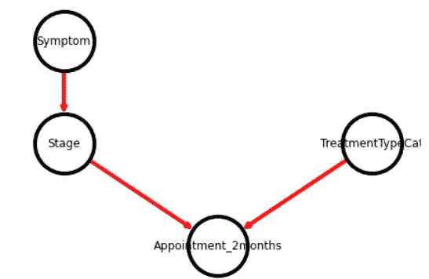
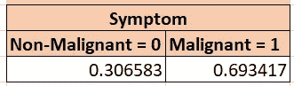
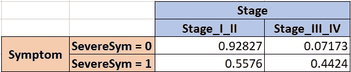

# 使用贝叶斯网络预测医院中的辅助服务量

> 原文：[`towardsdatascience.com/using-bayesian-networks-to-forecast-ancillary-service-volume-in-hospitals-48968a978cb5?source=collection_archive---------9-----------------------#2023-08-11`](https://towardsdatascience.com/using-bayesian-networks-to-forecast-ancillary-service-volume-in-hospitals-48968a978cb5?source=collection_archive---------9-----------------------#2023-08-11)

## 使用诊断输入变量的 Python 示例

[](https://gabeverzino.medium.com/?source=post_page-----48968a978cb5--------------------------------)[](https://towardsdatascience.com/?source=post_page-----48968a978cb5--------------------------------) [Gabe Verzino](https://gabeverzino.medium.com/?source=post_page-----48968a978cb5--------------------------------)

·

[关注](https://medium.com/m/signin?actionUrl=https%3A%2F%2Fmedium.com%2F_%2Fsubscribe%2Fuser%2Fb4abbbfdcbbb&operation=register&redirect=https%3A%2F%2Ftowardsdatascience.com%2Fusing-bayesian-networks-to-forecast-ancillary-service-volume-in-hospitals-48968a978cb5&user=Gabe+Verzino&userId=b4abbbfdcbbb&source=post_page-b4abbbfdcbbb----48968a978cb5---------------------post_header-----------) 发表在 [Towards Data Science](https://towardsdatascience.com/?source=post_page-----48968a978cb5--------------------------------) ·8 min read·2023 年 8 月 11 日

--

[](https://medium.com/m/signin?actionUrl=https%3A%2F%2Fmedium.com%2F_%2Fbookmark%2Fp%2F48968a978cb5&operation=register&redirect=https%3A%2F%2Ftowardsdatascience.com%2Fusing-bayesian-networks-to-forecast-ancillary-service-volume-in-hospitals-48968a978cb5&source=-----48968a978cb5---------------------bookmark_footer-----------)

来自 Unsplash 的照片，作者 EJ Strat

## 探索复杂性：预测医疗保健中的患者数量

在医疗保健中，准确预测即将到来的患者量不仅对运营成功至关重要，而且是一个极其棘手的问题。有太多依赖因素需要考虑——患者的严重程度和特殊要求、行政需求、检查室的限制、员工请病假、恶劣的雪暴等。更糟糕的是，意外的情况可能对调度和资源分配产生连锁影响，即使是最好的 Excel 预测也会被推翻。

从数据的角度来看，这些挑战真的很有趣，因为它们复杂，你可以深入思考一段时间。但同时，即使是微小的改进也可以带来重大的收获（例如，提高患者流量，降低等待时间，增加提供者的满意度，降低成本）。

## 另一种预测的方法：贝叶斯模型

那么还有什么替代方案呢？好吧，Epic 为我们提供了大量数据，包括患者到达预约时间的实际记录。通过已知的历史“到达”和“未到达”数据，我们可以在监督学习的范围内进行操作，而贝叶斯网络（BNs）提供了良好的概率图模型来预测未来的访问概率。

虽然生活中的大多数决策可以通过单一输入来确定（例如，考虑“我是否应该带雨衣？”，假设外面在下雨，那么决定应该是“是”），但贝叶斯网络可以轻松处理更复杂的决策——涉及多个输入的决策（例如，湿度高，步行仅需 3 分钟，你的雨衣在另一层楼，你的朋友可能带了伞等），这些输入具有不同的概率和依赖关系。在本文中，我将用 Python 在“草稿纸”上创建一个超级简单的贝叶斯网络，根据已知的三种因素的概率：症状、癌症阶段和治疗目标，输出患者在两个月后到达的概率分数。

## 理解贝叶斯网络：

贝叶斯网络的核心是使用有向无环图（DAG）表示联合概率分布的图形表示。DAG 中的节点表示随机变量，有向边表示这些变量之间的因果关系或条件依赖关系。正如所有数据科学项目所示，在开始时与利益相关者花大量时间正确绘制决策过程中的工作流程（例如，变量）对于高质量预测至关重要。

所以，我会编造一个场景，我们与乳腺肿瘤学合作伙伴会面，他们解释说，有三个变量对于确定患者是否需要在两个月后预约至关重要：患者症状、癌症阶段和当前治疗目标。我在输入时编造这个，但我们就这么做吧。

*（实际上，将有数十个因素影响未来的患者量，其中一些具有单一或多重依赖关系，其他的则完全独立但仍会影响结果）。*



现在，假设我们同意工作流程如上所示：Stage 依赖于其症状，但治疗类型独立于这些并且还会影响 2 个月后的预约发生。

基于此，我们将从数据源（对我们而言，是 Epic）中获取这些变量的数据，这些数据将包含我们分数节点（Appointment_2months）的 *已知* 值，标记为“是”或“否”。这种数据处理是一个重要部分；你需要根据这些变量在 2 个月前所指示的内容，准确捕捉真实患者在 2 个月后的到达情况。

```py
# install the packages
import pandas as pd # for data manipulation 
import networkx as nx # for drawing graphs
import matplotlib.pyplot as plt # for drawing graphs

!pip install pybbn
# for creating Bayesian Belief Networks (BBN)
from pybbn.graph.dag import Bbn
from pybbn.graph.edge import Edge, EdgeType
from pybbn.graph.jointree import EvidenceBuilder
from pybbn.graph.node import BbnNode
from pybbn.graph.variable import Variable
from pybbn.pptc.inferencecontroller import InferenceController

# Create nodes by manually typing in probabilities
Symptom = BbnNode(Variable(0, 'Symptom', ['Non-Malignant', 'Malignant']), [0.30658, 0.69342])
Stage = BbnNode(Variable(1, 'Stage', ['Stage_III_IV', 'Stage_I_II']), [0.92827, 0.07173, 
                                                      0.55760, 0.44240])
TreatmentTypeCat = BbnNode(Variable(2, 'TreatmentTypeCat', ['Adjuvant/Neoadjuvant', 'Treatment', 'Therapy']), [0.58660, 0.24040, 0.17300])
Appointment_2weeks = BbnNode(Variable(3, 'Appointment_2weeks', ['No', 'Yes']), [0.92314, 0.07686, 
                                                0.89072, 0.10928, 
                                                0.76008, 0.23992, 
                                                0.64250, 0.35750, 
                                                0.49168, 0.50832, 
                                                0.32182, 0.67818])
```

上述内容，让我们手动输入每个变量（节点）中级别的概率分数。这些概率不是猜测，甚至不是最佳猜测。实际上，你将再次根据现有数据计算频率。

以症状变量为例。我会得到它们的 2 个级别的频率，大约 31% 是良性的，69% 是恶性的。



作者提供的照片

然后，我们考虑下一个变量 Stage，并与 Symptom 交叉表以获得这些频率。我们这样做是因为 Stage 对 Symptom *依赖*，并且由于它们每个都有两个场景，它们实际上有 4 种概率结果。



作者提供的照片

如此类推，直到定义所有父子对之间的交叉表。

现在，大多数 BN 包含许多父子关系，因此计算概率可能会变得繁琐（且主要容易出错），所以下面的函数可以计算任何子节点对应于 0、1 或 2 个父节点的概率矩阵。虽然见解不能也不应该被自动化，但数据准备部分可以且应该被自动化。

```py
# This function helps to calculate probability distribution, which goes into BBN (note, can handle up to 2 parents)
def probs(data, child, parent1=None, parent2=None):
    if parent1==None:
        # Calculate probabilities
        prob=pd.crosstab(data[child], 'Empty', margins=False, normalize='columns').sort_index().to_numpy().reshape(-1).tolist()
    elif parent1!=None:
            # Check if child node has 1 parent or 2 parents
            if parent2==None:
                # Caclucate probabilities
                prob=pd.crosstab(data[parent1],data[child], margins=False, normalize='index').sort_index().to_numpy().reshape(-1).tolist()
            else:    
                # Caclucate probabilities
                prob=pd.crosstab([data[parent1],data[parent2]],data[child], margins=False, normalize='index').sort_index().to_numpy().reshape(-1).tolist()
    else: print("Error in Probability Frequency Calculations")
    return prob 
```

然后我们创建实际的 BN 节点和网络本身：

```py
# Create nodes by using our earlier function to automatically calculate probabilities
Symptom = BbnNode(Variable(0, 'Symptom', ['Non-Malignant', 'Malignant']), probs(df, child='SymptomCat'))
Stage = BbnNode(Variable(1, 'Stage', ['Stage_I_II', 'Stage_III_IV']), probs(df, child='StagingCat', parent1='SymptomCat'))
TreatmentTypeCat = BbnNode(Variable(2, 'TreatmentTypeCat', ['Adjuvant/Neoadjuvant', 'Treatment', 'Therapy']), probs(df, child='TreatmentTypeCat'))
Appointment_2months = BbnNode(Variable(3, 'Appointment_2months', ['No', 'Yes']), probs(df, child='Appointment_2months', parent1='StagingCat', parent2='TreatmentTypeCat'))

# Create Network
bbn = Bbn() \
    .add_node(Symptom) \
    .add_node(Stage) \
    .add_node(TreatmentTypeCat) \
    .add_node(Appointment_2months) \
    .add_edge(Edge(Symptom, Stage, EdgeType.DIRECTED)) \
    .add_edge(Edge(Stage, Appointment_2months, EdgeType.DIRECTED)) \
    .add_edge(Edge(TreatmentTypeCat, Appointment_2months, EdgeType.DIRECTED))

# Convert the BBN to a join tree
join_tree = InferenceController.apply(bbn)
```

我们一切就绪。现在让我们通过我们的 BN 运行一些假设并评估输出。

## 评估 BN 输出

首先，让我们看看每个节点的概率情况，而不具体声明任何条件。

```py
# Define a function for printing marginal probabilities
# Probabilities for each node
def print_probs():
    for node in join_tree.get_bbn_nodes():
        potential = join_tree.get_bbn_potential(node)
        print("Node:", node)
        print("Values:")
        print(potential)
        print('----------------')

# Use the above function to print marginal probabilities
print_probs()
```

```py
Node: 1|Stage|Stage_I_II,Stage_III_IV
Values:
1=Stage_I_II|0.67124
1=Stage_III_IV|0.32876
----------------
Node: 0|Symptom|Non-Malignant,Malignant
Values:
0=Non-Malignant|0.69342
0=Malignant|0.30658
----------------
Node: 2|TreatmentTypeCat|Adjuvant/Neoadjuvant,Treatment,Therapy
Values:
2=Adjuvant/Neoadjuvant|0.58660
2=Treatment|0.17300
2=Therapy|0.24040
----------------
Node: 3|Appointment_2weeks|No,Yes
Values:
3=No|0.77655
3=Yes|0.22345
----------------
```

上述结果显示，该数据集中的所有患者有 67% 的概率处于 Stage_I_II，69% 的概率是非恶性的，58% 的概率需要辅助/新辅助治疗，而只有 22% 的患者需要 2 个月后的预约。

我们可以轻松地从简单的频率表中获得这些数据，而不需要 BN。

**但现在，让我们提出一个更有条件的问题：** 给定患者处于 Stage = Stage_I_II 并且 TreatmentTypeCat = Therapy 的情况下，他们需要在 2 个月内护理的概率是多少？此外，考虑到提供者对他们的症状一无所知（也许他们还没有见过患者）。

我们将运行在节点中我们知道是真实的内容：

```py
# To add evidence of events that happened so probability distribution can be recalculated
def evidence(ev, nod, cat, val):
    ev = EvidenceBuilder() \
    .with_node(join_tree.get_bbn_node_by_name(nod)) \
    .with_evidence(cat, val) \
    .build()
    join_tree.set_observation(ev)

# Add more evidence
evidence('ev1', 'Stage', 'Stage_I_II', 1.0)
evidence('ev2', 'TreatmentTypeCat', 'Therapy', 1.0)
# Print marginal probabilities
print_probs()
```

返回结果：

```py
Node: 1|Stage|Stage_I_II,Stage_III_IV
Values:
1=Stage_I_II|1.00000
1=Stage_III_IV|0.00000
----------------
Node: 0|Symptom|Non-Malignant,Malignant
Values:
0=Non-Malignant|0.57602
0=Malignant|0.42398
----------------
Node: 2|TreatmentTypeCat|Adjuvant/Neoadjuvant,Treatment,Therapy
Values:
2=Adjuvant/Neoadjuvant|0.00000
2=Treatment|0.00000
2=Therapy|1.00000
----------------
Node: 3|Appointment_2months|No,Yes
Values:
3=No|0.89072
3=Yes|0.10928
----------------
```

那位病人在 2 个月内到达的机会只有 11%。我们可以向预测该病人 2 个月内到达的概率询问已知或未知特征的任何组合。进一步的算法和函数可以用来获取多个病人的概率，或者病人群体的概率，或优化这些概率。

## 关于高质量输入变量重要性的说明：

编写 Python 代码是一回事，但贝叶斯网络在提供可靠的未来就诊估计方面的真正成功在很大程度上依赖于准确的患者护理工作流程映射。这需要时间、讨论和白板——而不是编码。可能还需要多次深入数据，与客户一起测试假设：“我们之前说过，护士导航员在报告症状差时总是会联系病人，但实际上只发生了 10% 的情况。下一次病人与他们的医生联系。”（再说一次，这只是举个例子，但这将是一个重要的工作流程映射）。

病人呈现出相似的情况时，通常会需要类似的服务，并且到来的频率也相似。这些输入的排列，其特征可以从临床到行政，最终对应于服务需求的某种确定性路径。但时间预测越复杂或越远，就越需要更多特定的、复杂的贝叶斯网络和高质量的输入。

这里是原因：

1.  **准确表示：** 贝叶斯网络的结构必须反映变量之间的实际关系。选择不当的变量或误解依赖关系可能导致不准确的预测和见解。

1.  **有效推断：** 高质量的输入变量提升了模型进行概率推断的能力。当变量基于条件依赖准确连接时，网络可以提供更可靠的见解。

1.  **减少复杂性：** 包含无关或冗余的变量会不必要地使模型复杂化并增加计算要求。高质量的输入使网络更加高效。

感谢阅读。很高兴在[LinkedIn](https://www.linkedin.com/in/gabe-verzino-71401137/)上与任何人连接！如果你对数据科学与医疗保健的交集感兴趣，或者有有趣的挑战分享，请留言或私信。

查看我其他的一些文章：

[**为什么平衡类别被过度炒作**](https://medium.com/towards-data-science/why-balancing-classes-is-over-hyped-e382a8a410f7)

[**特征工程 CPT 代码**](https://medium.com/mlearning-ai/working-with-cpt-codes-5a2b04a4d183)

**设计基础神经网络的 7 个步骤**
