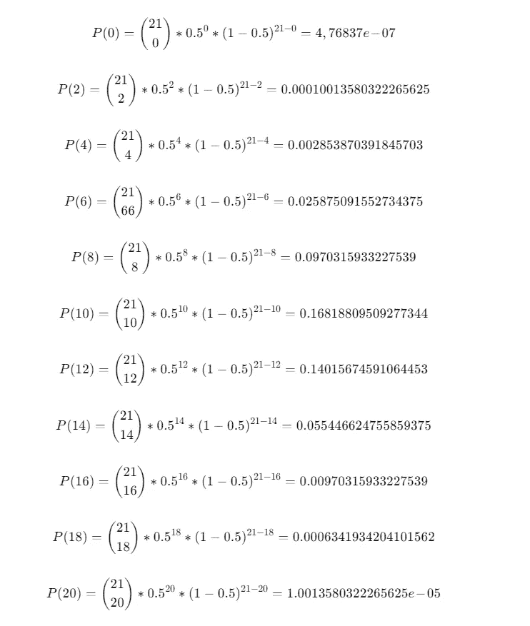

# 在 Python 中使用二项分布

> 原文：[`towardsdatascience.com/using-binomial-distribution-in-python-c9002ac2a424?source=collection_archive---------6-----------------------#2023-05-03`](https://towardsdatascience.com/using-binomial-distribution-in-python-c9002ac2a424?source=collection_archive---------6-----------------------#2023-05-03)

## *在 Python 中探索二项分布：了解不同方法下的硬币投掷概率计算*

[](https://nathanrosidi.medium.com/?source=post_page-----c9002ac2a424--------------------------------)[](https://towardsdatascience.com/?source=post_page-----c9002ac2a424--------------------------------) [Nathan Rosidi](https://nathanrosidi.medium.com/?source=post_page-----c9002ac2a424--------------------------------)

·

[关注](https://medium.com/m/signin?actionUrl=https%3A%2F%2Fmedium.com%2F_%2Fsubscribe%2Fuser%2Fab636cbf3611&operation=register&redirect=https%3A%2F%2Ftowardsdatascience.com%2Fusing-binomial-distribution-in-python-c9002ac2a424&user=Nathan+Rosidi&userId=ab636cbf3611&source=post_page-ab636cbf3611----c9002ac2a424---------------------post_header-----------) 发布于 [Towards Data Science](https://towardsdatascience.com/?source=post_page-----c9002ac2a424--------------------------------) ·9 分钟阅读·2023 年 5 月 3 日[](https://medium.com/m/signin?actionUrl=https%3A%2F%2Fmedium.com%2F_%2Fvote%2Ftowards-data-science%2Fc9002ac2a424&operation=register&redirect=https%3A%2F%2Ftowardsdatascience.com%2Fusing-binomial-distribution-in-python-c9002ac2a424&user=Nathan+Rosidi&userId=ab636cbf3611&source=-----c9002ac2a424---------------------clap_footer-----------)

--

[](https://medium.com/m/signin?actionUrl=https%3A%2F%2Fmedium.com%2F_%2Fbookmark%2Fp%2Fc9002ac2a424&operation=register&redirect=https%3A%2F%2Ftowardsdatascience.com%2Fusing-binomial-distribution-in-python-c9002ac2a424&source=-----c9002ac2a424---------------------bookmark_footer-----------)

照片由 [Joshua Hoehne](https://unsplash.com/@mrthetrain?utm_source=medium&utm_medium=referral) 提供，来源于 [Unsplash](https://unsplash.com/?utm_source=medium&utm_medium=referral)

在今天的文章中，我将向你展示如何在 Python 代码中应用统计学概念，如概率。作为示例，我将使用高盛的统计面试问题，并展示在 Python 中计算二项分布的不同方法。

我还制作了一个关于同一主题（和相同问题）的免费视频教程，你可以随意使用它来简化你的工作。

在这篇文章中，我们将通过使用不同的 Python 方法来检验和解决高盛面试中提出的概率问题。

# 为什么概率和统计在数据科学中很重要？


图片由作者提供

概率和统计是数据科学中广泛使用的两个数学分支。

**概率**是研究随机事件及其发生可能性的学科。它用于建模许多现实世界中的不确定性，并且是统计推断的基础。

数据收集、分析和评估的研究称为**统计学**。它包括使用数学方法总结和得出数据结论。

概率和统计在数据科学中用于**分析数据、进行预测和提供决策支持**。它们对于**理解复杂系统的行为和识别数据中的模式与趋势**至关重要。

# 概率面试问题：硬币抛掷预测

> ***21 枚公平硬币***
> 
> ***有 21 枚公平硬币。每一枚都被抛掷。得到偶数个正面的概率是多少？***

高盛是全球领先的投资银行及金融服务提供商，成立于 1869 年。该公司向企业、政府和个人提供各种金融服务，是世界上最大的投资银行之一，总部位于纽约市。

这个面试问题要求你确定在抛掷 21 枚公平硬币时，得到偶数个正面的概率。

一个公平的硬币有 50/50 的机会落在正面或反面。

当抛掷多个硬币时，可能的结果会迅速变得非常庞大。

要解决这个问题，我们需要使用二项分布的概念。让我们看看它是什么。

# Python 中的二项分布


图片由作者提供

二项分布是一种概率分布，可以用来描述**一系列事件中成功或失败的次数，这些事件必须相互独立**。

当只有两种可能的结果时，比如正面或反面，并且每次试验的成功概率相同，便会使用它。

试验必须满足**两个条件**：

1.  它们必须只有两个可能的结果（正面或反面/成功或失败），

1.  每次试验的成功概率必须相同。

当抛硬币时，**成功**可以定义为**得到正面**，**失败**可以定义为**得到反面**。

要找出抛掷 21 枚硬币时得到偶数个正面的概率，我们需要计算得到 0、2、4、6、8、10、12、14、16、18 或 20 个正面的概率。

我们将通过使用二项分布来解决这个问题：


这意味着：

+   P(X = k) — 在**n**次独立试验中获得**k**次成功结果的概率。

+   n — 试验次数。（在本例中为 21。）

+   k — 成功的次数。（在本例中为正面。）

+   p — 试验成功的概率。（在本例中为 0.5）

+   $\binom{n}{k} $ — 从 n 次独立试验中选择 k 次成功的方法数量。

# 手动计算：硬币翻转预测

我们可以插入值并计算每个可能的偶数个头的概率。

让我们首先手动进行以下值的计算：

n = 21（试验次数）

p = 0.5（成功的概率）

q = 1 — p = 0.5（失败的概率）

这是计算结果



这些计算的含义是什么？例如，让我们看看 P(18)。

公式意味着在 21 次抛硬币时得到 18 个正面的概率，即 0.06341934204101562%。这略高于 10000 次中的 6 次。

在面试问题的背景下，当您抛掷 21 枚硬币 10000 次时，您可能会六次得到 18 个正面。这是一个罕见的概率，正如您所见。

在这里，您可以看到基于我们的计算，抛掷 21 枚硬币时偶数个正面的概率分布。


作者提供的图片

要回答面试问题，我们需要将所有概率相加：


将我们计算的所有单个概率插入，您会得到：


现在，让我们使用 Python 中的**math 库**实现此计算

# Python 计算：硬币翻转预测

## 使用 math 库

我们可以使用 Python 中的 math 库实现在 21 次抛硬币中获得偶数个头的二项分布。

为此，我们可以使用**for loop**来迭代 21 次抛硬币中可获得的每个偶数个头。

对于范围内的每个 i 值，从 0 到 22（不包括），步长为 2，我们可以使用二项分布公式计算得到 i 个头的对应概率。

在循环内，我们可以首先使用**math.comb()**函数计算出 21 次翻转中获得 i 个头的方式数量。

然后，我们可以计算在 21 次抛硬币中获得恰好 i 个头的概率，即**(1/2)**21**。最后，我们可以将这两个值相乘，以获取在 21 次抛硬币中获得恰好 i 个头的概率，并将其存储在名为 probabilities 的列表中。

我们可以使用另一个**for loop**来打印概率列表中每个偶数个头的概率。

循环结束后，我们可以使用**sum()**函数计算存储在列表 probabilities 中的所有概率的总和，并打印在 21 次翻转中获得偶数个头的总概率。

这里是代码。

```py
import math

# Create an empty list to store the probabilities of getting an even number of heads
probabilities = []

# Loop over all even numbers of heads that can be obtained in 21 flips
for i in range(0, 22, 2):
    # Calculate the number of ways to choose i heads out of 21 flips
    m = math.comb(21, i)
    # Calculate the probability of getting i heads in 21 flips
    n = (1/2 ** 21)
    prob = m * n 
    # Append the probability to the list
    probabilities.append(prob)

# Loop over the probabilities and print the probability of getting each even number of heads
for i, prob in enumerate(probabilities):
    print("The probability of getting {} heads in 21 flips is {}.".format(2*i, prob))

# Calculate the total probability 
total_prob = sum(probabilities)
print("Total probability of getting even number of heads is {}".format(total_prob))
```

现在，让我们看一下输出。


在早期计算中，我们使用二项分布公式手动计算了 21 次抛硬币得到偶数个正面的概率。

这涉及到单独计算 0、2、4、6、8、10、12、14、16、18 和 20 个正面的概率，这可能非常耗时。

另一方面，我们刚刚使用数学库编写的代码允许我们仅用几行代码计算所有这些概率。

这种方法节省了我们大量的时间和精力，特别是当我们需要计算更多结果的概率或需要对更多试验进行重复计算时。

但我们还有一种实现方式，它甚至更快。

## 使用 SciPy 库

这一次，我们将使用预构建的函数来计算概率。

在以下代码中，我们首先从**scipy.stats 模块**中导入**binom()**函数。

然后，我们使用**binom()**函数定义具有**n 次试验**和**成功概率**p 的二项分布。

我们使用**pmf()**方法计算得到偶数个正面（0、2、4、…、20）的概率。

**pmf()方法**返回给定范围内每个值的分布概率质量函数（PMF）。

然后，我们使用另一个**for loop**来打印列表 even_probs 中每个偶数个正面的概率。

最后，我们通过对列表**even_probs**中的概率进行求和来计算 21 次抛硬币得到偶数个正面的总概率。

使用 scipy 库计算二项分布提供了一种更高效、更方便的计算方法。它允许我们用几行代码定义和计算分布。

以下是代码。

```py
from scipy.stats import binom

n = 21
p = 0.5

# Define the binomial distribution with n trials and probability p of success
binom_dist = binom(n, p)

# Calculate the probability of getting an even number of heads (0, 2, 4, ..., 20)
even_probs = binom_dist.pmf(range(0, 22, 2))

# Print the probability of getting each even number of heads
for i, prob in enumerate(even_probs):
    print("The probability of getting {} heads in 21 flips is {}".format(2*i,prob))

# Calculate the total
total_prob = sum(even_probs)
print("Total probability of getting even number of heads is {}".format(total_prob))
```

以下是输出结果。


如果你比较两种 Python 方法得到的结果，你可能会注意到它们并不完全相同。

# 为什么结果（略微）不同？

SciPy 和数学计算之间的差异是由于浮点精度误差造成的。

在计算机编程中，浮点数以有限的位数表示，这可能会导致计算时精度丢失。

这就是为什么当比较两种方法的结果时，我们得到的偶数个正面的概率略有不同。

两种方法都提供了对真实概率的良好近似，而这两者之间的差异对于大多数实际应用来说是微不足道的。

如果你处理较长的脚本并计划进行更长时间的计算，同时计算能力有限，那么使用 SciPy 会更高效、更快速。

然而，如果你有足够的资源，我们建议使用第一种计算方法，即我们使用数学方法的那种。这是如果你想确保结果的准确性，即使这些细微的差异影响不大。

如果你想最小化浮点错误的影响，可以将计算结果四舍五入到所需的精度。

这里是代码。

```py
total_prob = round(total_prob, 14)
print("Total probability of getting even number of heads, after correcting precision error is {}".format(total_prob))
```

这里是结果。


# 结论

在这篇文章中，我们探讨了一个来自高盛的统计问题，并通过使用 Python 进行了回答。

我们探讨了不同的方法，并详细解释了每一步。同时，我们也使用了预构建的函数进行了实现。

总的来说，本文是二项分布如何通过手动计算或使用 Python 解决的一个优秀示例。

如果你想掌握随机变量和概率分布，并在下一个数据科学面试中脱颖而出，请查看这篇文章“[随机变量和概率分布](https://www.stratascratch.com/blog/random-variables-and-probability-distributions/?utm_source=blog&utm_medium=click&utm_campaign=tds+binomial+distribution)”。

*最初发布于* [*https://www.stratascratch.com*](https://www.stratascratch.com/blog/binomial-distribution-in-python-for-coin-flip-prediction/?utm_source=blog&utm_medium=click&utm_campaign=tds+binomial+distribution)*。*
