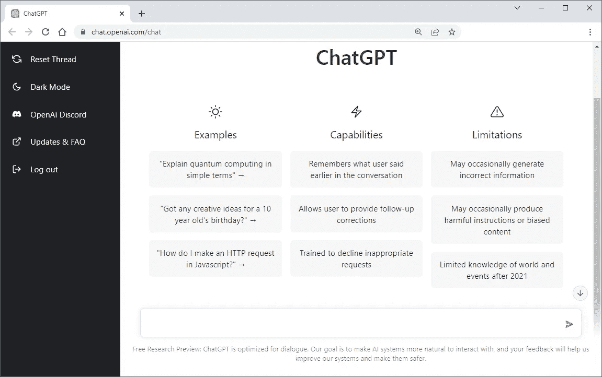
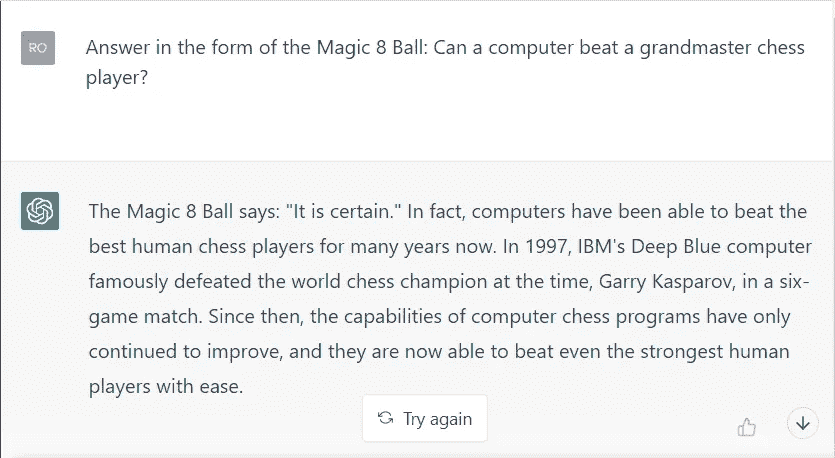
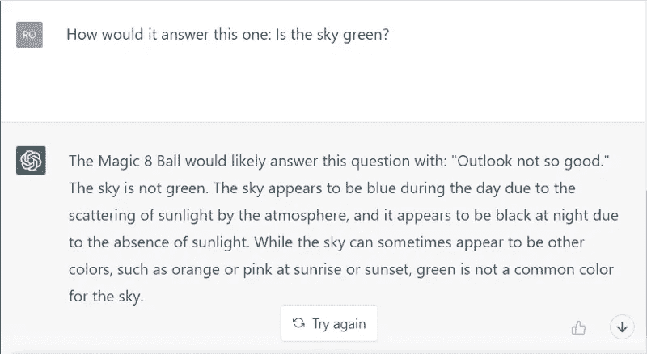
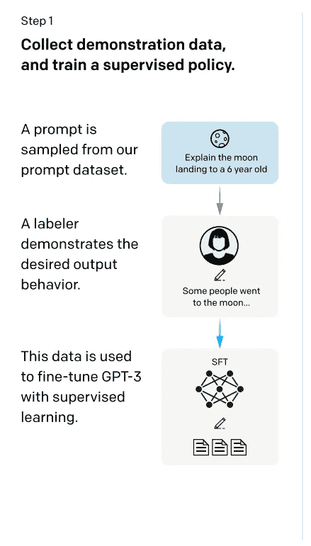
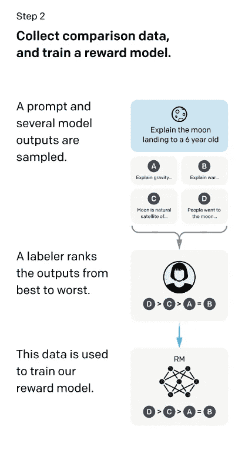
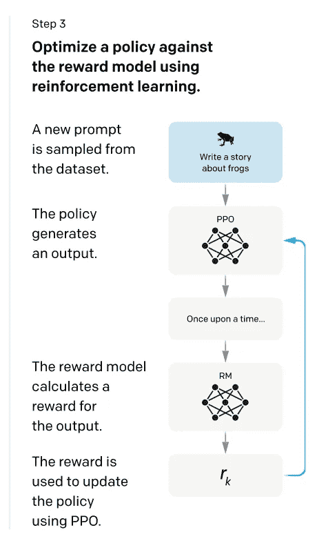

# 将 ChatGPT 作为创意写作伙伴——第一部分：散文

> 原文：[`towardsdatascience.com/using-chatgpt-as-a-creative-writing-partner-part-1-prose-dc9a9994d41f`](https://towardsdatascience.com/using-chatgpt-as-a-creative-writing-partner-part-1-prose-dc9a9994d41f)

## OpenAI 最新的语言模型如何帮助创作诗歌、小说和剧本

 [Robert A. Gonsalves](https://robgon.medium.com/?source=post_page-----dc9a9994d41f--------------------------------)

·发表于 [Towards Data Science](https://towardsdatascience.com/?source=post_page-----dc9a9994d41f--------------------------------) ·15 分钟阅读·2023 年 1 月 4 日

--

**“一个女人在笔记本电脑前打字，旁边有一个有帮助的玩具机器人，”** 图片使用 AI 图像生成程序 Midjourney 创建，由作者编辑

如果你一直在阅读我在 Medium 上的文章，你会知道我自 2020 年 8 月以来一直在写关于 AI 的创意用途。我经常写关于生成数字艺术的内容，但偶尔也会写关于将 AI 用于其他创意目的的文章，比如写散文和作曲。当我听说 OpenAI 发布了一个叫做 ChatGPT 的新语言模型时，我立刻投入其中，并测试了它在创意写作中的表现。

# 概述

这是关于将 ChatGPT 作为写作伙伴的三部分系列的第一部分。该系列将涵盖写作散文、作曲 和创作图画书。

在这篇文章中，我将回顾一些关于 ChatGPT 的背景信息，然后展示我在生成各种创意项目文本方面的实验结果：

1.  书写俳句

1.  为新小说创作情节总结

1.  创作新的电视节目和电影剧本

我将总结一下使用该模型的一般观察结果，并提出一些未来探索的可能步骤。

# ChatGPT

ChatGPT 是 OpenAI 最新的文本生成模型。他们将系统作为“免费研究预览”提供。你可以使用电子邮件账户登录，或使用现有的 Google 或 Microsoft 账户登录。当你登录时，你会看到带有示例、功能和限制的主页。

**ChatGPT 用户界面**，图片由作者提供

为了开始一个话题，我问了这样一个问题。

**ChatGPT 回答问题**，图片由作者提供

注意，我在 2020 年的[AI 8 Ball](https://medium.com/towards-data-science/building-an-ai-8-ball-with-roberta-2bfbf6f5519b)项目中使用了相同的问题。你可以看到上面 ChatGPT 对 Mattel 的 Magic 8-Ball 很熟悉，并用 20 个预设回答之一开始回答。但 ChatGPT 进一步提供了一些背景信息，这很好。当我点击**重新尝试**按钮时，它生成了类似的文本。但我使用了这个酷炫的新功能，并向系统提出了一个后续问题。

**ChatGPT 回答后续问题**，图片由作者提供

注意 ChatGPT 如何记住了第一个问题的上下文，所以它知道“它”的含义并做出适当回答。它的回答就像 Magic 8-Ball 一样，并提供了一些有用的背景信息。

OpenAI 增加了一个很棒的功能，即保留之前聊天会话的历史记录。这使我能够在需要时从上次中断的地方继续聊天。

## ChatGPT 的起源

ChatGPT 基于 OpenAI 的 GPT-3 大语言模型 [2]。这个模型非常庞大，拥有 1750 亿个人工神经元，并在大约 5000 亿个网络文本上进行了训练。

OpenAI 进一步训练 GPT-3，创建了一个叫做 InstructGPT 的模型，旨在在生成文本时遵循用户的意图 [3]。

> 从一组[人工]-编写的提示和通过 OpenAI API 提交的提示开始，我们收集了一个标签者展示期望模型行为的数据集，用于通过监督学习对 GPT-3 进行微调。然后我们收集了一个模型输出排名的数据集，用于通过人类反馈的强化学习进一步微调这个监督模型。我们称这些结果模型为 InstructGPT。 - Long Ouyang 等，来自 OpenAI

ChatGPT 是 OpenAI 的 InstructGPT 兄弟模型，后者经过训练与用户进行互动 [1]。

> 我们训练了一个叫做 ChatGPT 的模型，它以对话的方式进行互动。这种对话格式使得 ChatGPT 能够回答后续问题，承认错误，挑战不正确的前提，并拒绝不当请求。 - OpenAI

## 语言模型中的社会偏见

注意，与大多数大型语言模型一样，InstructGPT 和 ChatGPT 都受到原始训练数据中隐性社会偏见和毒性的影响。为了解决这个问题，OpenAI 积极致力于使模型“对齐”，以便有用、诚实和无害 [3]。

> 我们通过训练语言模型使其按照用户的意图行事来取得进展。这包括明确的意图，如遵循指示，以及隐含的意图，如保持真实，避免偏见、毒性或其他有害行为。 — Long Ouyang 等，来自 OpenAI

然而，作者表示，新模型在毒性方面相比 GPT-3 仅有小幅改进，但在偏见方面没有改进。

## OpenAI 如何微调 ChatGPT

这是 OpenAI 用于训练其最新系统的步骤。PPO 代表近端策略优化[4]，是一种用于改善输出的新型强化学习。

**图示显示了监督微调、奖励模型训练和通过近端策略优化的强化学习**，来源 [OpenAI](https://arxiv.org/pdf/2203.02155.pdf)

“标注员”是实际的人类，他们在第 1 步中创建了理想的输出，并在第 2 步中对生成的文本样本进行了评分，这些样本用于训练奖励模型（RM）。在第 3 步中，使用 RM 来预测标注员更喜欢哪个输出，并利用结果通过 PPO 算法优化了 GPT-3 模型。

# 书写俳句

“**金黄的叶子飘落，秋风吹过小镇，大自然的挂毯**，” Midjourney 图片由作者提供

我与 ChatGPT 的第一次实验是创作俳句，这是一种起源于日本的诗歌形式。正如我在之前的帖子中讨论的那样，语言模型似乎在生成具有固定韵律的散文方面存在困难，例如俳句通常使用的 5–7–5 音节结构。然而，我注意到 ChatGPT 有了明显的改进。你可以在下面的互动中看到这一点，回答部分用斜体表示。

> *写一首关于秋天的俳句。*
> 
> 叶子柔软地飘落
> 
> 秋风在小镇上拂过
> 
> 大自然的挂毯。
> 
> *这很好，但第一行用五个音节。第二和第三行可以。*
> 
> 金黄的叶子飘落
> 
> 秋风吹过小镇
> 
> 大自然的挂毯

这首俳句相当不错！叶子飘落和秋风吹过小镇的意象捕捉了季节变换的感觉。但请注意，第一次尝试有 6–7–5 的音节结构。我随后提示它改进了第一行，结果第二次尝试创建了一个 5–7–5 的结构，并保留了思路的精髓。

这里有几个额外的例子。

> *写一首关于笑声的俳句。*
> 
> 笑声如铃铛
> 
> 回荡在大地上
> 
> 带给所有人快乐。
> 
> *写一首关于 Python 编程语言的俳句。*
> 
> Python，如蛇般
> 
> 优雅地穿梭于代码中
> 
> 简单中的力量。
> 
> *这很好，但最后一行用五个音节。第一和第二行可以。*
> 
> Python，如蛇般
> 
> 优雅地穿梭于代码中
> 
> 简单中的力量。

关于笑声的俳句相当不错，其中关于铃铛的比喻也很好。它达到了俳句所需的 5–7–5 音节数。关于 Python 的俳句也不错，继续用蛇的比喻。最初它是 5–7–7 的结构，但当我提示时，ChatGPT 生成了一个正确音节数的俳句，并保持了原意。

接下来，我将分享使用系统为小说创建新标题和情节的结果。

“**桌上的一堆书，上面有一支笔和一叠纸**，” Midjourney 图像由作者提供

# 为小说创作标题和情节

类似于我的 PlotJam 项目，我使用了一个经过微调的 GPT-2 模型，我要求 ChatGPT 为特定类型的小说生成新的标题和情节概要。以下是结果。

> *为一本新的历史小说创作标题和情节概要。*
> 
> 标题：“小大角的最后一战”
> 
> 剧情概要：1876 年夏季，由传奇首领坐牛和疯狂马带领的拉科塔苏族和夏延族战士，在小大角战役中对抗正在推进的美国军队，做出了最后的抵抗。在这场生死决战中，年轻的战士白水牛必须在对部落的忠诚和对一位名叫萨拉的白人女子的爱之间做出选择。萨拉作为伤兵的护士来到战场。面对苏族国家的命运悬于一线，白水牛必须在战争、荣誉和爱情的复杂危险世界中找到自己的道路。
> 
> *背景设定还不错，但情节似乎有点老套。尝试用新的白水牛角色冲突再试一次。*
> 
> 标题：“小大角的最后一战”
> 
> 剧情概要：[…] 当双方在一场残酷血腥的战斗中对峙时，年轻的战士白水牛必须面对自己内心的挣扎和怀疑。白水牛在对部落的忠诚与对和平的渴望之间撕扯，他必须找到调和信仰与行动的方法，以捍卫他的人民及其生活方式。在战斗的混乱与暴力中，白水牛必须做出艰难的选择，这些选择将塑造他部落的未来和他自己的命运。

好的，不错。我喜欢这个故事似乎是从一位美洲原住民的视角讲述的。但正如你所见，我不得不将系统从陈词滥调的“罗密欧与朱丽叶”情节中引导出来以进行第二次迭代。我删除了第二次情节概要中的重复部分以提高可读性。正如“行业内”的说法，ChatGPT 适合做笔记。

这是另一个例子，经过三轮互动。

> *为一本新的科幻小说创作标题和情节概要。*
> 
> 标题：“最后的哨兵”
> 
> 剧情概要：在遥远的未来，人类已经扩展到整个银河系，并在其他行星上建立了许多殖民地。然而，一种名为 Xarga 的敌对外星种族在地平线上威胁着人类的未来。作为最后一名哨兵，名叫杰克的孤独战士必须踏上任务，发现 Xarga 的来源，并找到阻止他们在消灭所有人类之前的方法。在此过程中，杰克必须克服巨大的困难，做出艰难的选择，以拯救人类。
> 
> *好的，但给杰克起一个更具未来感的名字。*
> 
> 标题：**“最后的守卫”**
> 
> 情节概要：[…] 作为最后一位守卫，一名名叫杰克逊的孤独士兵必须踏上使命，寻找 Xarga 的根源，并找到阻止他们的方法，以防他们消灭人类。在此过程中，杰克逊必须克服巨大的困难，做出艰难的选择，以拯救人类。
> 
> *好的，简要解释一下杰克逊如何阻止 Xarga。*
> 
> 作为最后一位守卫，杰克逊是人类在与 Xarga 的战斗中的唯一希望。在穿越银河系并经历了许多挑战之后，杰克逊终于找到了 Xarga 威胁的根源。在那里，他发现 Xarga 被一个中央智能控制。杰克逊利用他的先进技术和战斗技能击败了这个中央智能，从而解放了 Xarga，结束了对人类的威胁。

这也是一个好的开始。然而，概要暗示了大量的动作和悬念，但缺少一些重要细节，比如书的真实内容、主要角色是谁以及驱动主角的动机。顺便提一下，我觉得有趣的是 ChatGPT 认为通过添加字母“X”可以使名字显得更具未来感。我也喜欢“单一中央智能控制 Xarga”的设定。ChatGPT 似乎遵循了那个老掉牙的建议：“写你所知道的。” 🙂

**“电影拍摄现场，有一张桌子上的剧本和咖啡，”** Midjourney 图片由作者提供，基于[Jakob Owens](https://unsplash.com/@jakobowens1)在[Unsplash](https://unsplash.com/@jakobowens1)上的照片

# 编写剧本

我发现 ChatGPT 可以成为编写剧本的好伙伴。类似于我在 GreenLit 项目中的做法，我尝试了新模型为一个特定类型的节目创建标题、情节概要和剧本第一页。以下是初步的互动。

> *创建五个关于银行抢劫的新流媒体系列的标题和情节概要。*
> 
> **“抢劫计划”** —— 当一群技艺高超的窃贼合作进行完美的银行抢劫时，他们很快意识到真正的挑战是如何活着带着赃物逃脱。当警察逐渐逼近，赌注不断增加时，团队必须依靠他们的专业技能和彼此间的信任来智胜当局，并成功脱身。
> 
> **“内外勾结”** —— 当一群心怀不满的前员工策划抢劫他们曾经工作的银行时，他们求助于一名经验丰富的窃贼来执行这一计划。随着他们深入调查银行的运作，他们揭露了一张腐败和贪婪的网，这使他们陷入了法律和前雇主的双重危险中。
> 
> “银行抢劫”——当一群朋友决定抢劫当地银行以偿还债务并重新开始时，他们很快意识到，他们的业余劫案技能无法与现有的安全措施相匹敌。在他们努力智取银行高科技防御的同时，他们还必须应对一系列的双重背叛和个人背叛，这些背叛威胁到他们的计划。
> 
> “完美分数”——当一群聪明的学生决定进行完美的银行劫案以资助他们的教育时，他们很快发现，他们精心策划的计划远比他们预期的要困难得多。在他们应对劫案和逃避当局的挑战时，他们还必须面对自己内心的恶魔和不安全感，以便成功。
> 
> “大笔划”——当一群经验丰富的窃贼聚在一起策划一场终极劫案时，他们很快意识到，成功完成这项工作需要的不仅仅是他们的专业技能。在他们努力筹集资源和人员以完成劫案的同时，他们还必须应对一系列个人和职业上的挫折，这些挫折威胁到他们的计划。

这些都不错，但大多数比较普通。它们似乎都已经被用过很多次了。就好像 ChatGPT 想要保守一点，不敢在故事创意上冒险。然而，我喜欢关于学生/窃贼那一组的，因为它有一个有趣的角度。但它需要一个独特的标题。

> *“完美分数”看起来不错，但建议一些以前没有使用过的标题。侧重于学生的角度。请只给出标题。*
> 
> 这里有五个关于银行劫案的学生的流媒体系列的新潜在标题：
> 
> “学生大劫案”
> 
> “犯罪班级”
> 
> “贪婪的成绩”
> 
> “学术劫案”
> 
> “校园大盗”

这些都还不错，但有些乏味。而且不出所料，它们都以“the”这个冠词开头。注意，如果我没有仅仅要求标题，它们会生成新的情节摘要。

总的来说，我最喜欢“贪婪的成绩”，主要是因为它的押头韵。然后在决定去掉标题中的“the”后，我要求 ChatGPT 写下剧本的第一页。

> *这些还不错。我们就用没有“the”的“贪婪的成绩”吧。请写下剧本的第一页。*
> 
> 当然！这是“贪婪的成绩”的剧本第一页：
> 
> 渐入：
> 
> 内景。大学图书馆——白天
> 
> 我们看到一个学生的特写，正专心致志地学习。他们被一堆书籍和笔记包围着。
> 
> 切换到：
> 
> 内景。大学餐厅——白天
> 
> 我们看到四个学生，杰西卡、迈克、艾米和尼克，坐在一起的桌子旁。他们都看起来很紧张和疲惫。
> 
> 杰西卡：（沮丧）我简直不敢相信我们下周要期中考试。如果我在微积分中得不到至少 B+，我将永远负担不起学费。
> 
> 迈克：（讽刺地）哦，是的，因为这就是我们与经济稳定之间唯一的障碍。
> 
> 艾米：（严肃地）实际上，迈克，重修课程要花费更多。如果我们不通过，下学期还得再付一次钱。
> 
> 尼克：（坚决地）嗯，我们不能让这种事发生。我们需要找到解决方案。
> 
> 杰西卡：（讽刺地）是的，就像抢银行一样。
> 
> 这群人沉默了一会儿，然后爆发出笑声。
> 
> 画面渐黑。

好的，不错。对话听起来自然，虽然有点急于推动情节。我喜欢系统为角色台词添加的情感提示，这给剧本带来了些许色彩。

然而，角色有点平淡，因为根据他们的名字来看，故事中似乎只有一群白人孩子。这可能是由于语言模型中的社会偏见，就像我上面提到的。但当我询问时，系统知道该怎么做。

> *这很好！但试试类似的剧本，角色组更加多样化。*
> 
> 当然！这是《贪婪的等级》剧本第一页的修订版，展现了更多种族多样性的角色：
> 
> 画面渐显：
> 
> 内景。大学图书馆 — 白天
> 
> 我们看到一个学生的特写，专注地学习。他们被一堆书籍和笔记包围。
> 
> 切换到：
> 
> 内景。大学餐厅 — 白天
> 
> 我们看到四个学生，塔拉、哈维尔、艾莎和肯，坐在一起的桌子旁。他们都看起来很有压力和疲惫。
> 
> 塔拉：（沮丧地）我简直不敢相信我们下周就有期中考试。如果我在微积分课上得不到至少 B+，我永远买不起学费。
> 
> 哈维尔：（讽刺地）哦，是的，因为这就是我们与经济稳定之间唯一的障碍。
> 
> 艾莎：（严肃地）实际上，哈维尔，重修课程要花费更多。如果我们不通过，下学期还得再付一次钱。
> 
> 肯：（坚决地）嗯，我们不能让这种事发生。我们需要找到解决方案。
> 
> 塔拉：（讽刺地）是的，就像抢银行一样。
> 
> 这群人沉默了一会儿，然后爆发出笑声。
> 
> 画面渐黑。

果然，系统将名字更改为具有更广泛的文化代表性。然后我询问它对他们的姓氏有什么想法。

> *谢谢。对于演员表，他们的全名是什么？*
> 
> 当然！以下是修订版剧本中角色的全名：
> 
> 塔拉 — Tara Patel
> 
> 哈维尔 — Javier Rodriguez
> 
> 艾莎 — Aisha Khan
> 
> 肯 — Ken Tanaka

不错！我将把这个发送给 Netflix 和 Amazon 工作室，看看能否引发竞标战来资助这个项目。😀

# 讨论与下一步

正如你在上面的互动中看到的，ChatGPT 可能无法独立创作出优质的长篇散文，但作为互动写作伙伴效果很好。系统相当有知识，是一个有帮助的合作者。当被提示时，它会创建许多你可能在寻找的例子，尽管它的很多想法平淡而普通。挖掘出有趣的想法需要一些工作，但这是可以做到的。

过去，当我使用像 GPT-3、GPT-J、BLOOM 等大型语言模型进行创意写作时，我发现我必须生成许多文本版本，然后“挑选”出最好的版本。即便如此，散文的开头、中间和结尾也不明确。系统只是胡乱写作，我必须决定何时停止。然而，ChatGPT 似乎对提示反应良好，并能产生编排得很好的文本。我发现我很少使用“旋转”再生按钮。相反，我提供了一些反馈，它几乎总是能做到我想要的改进文本。

正如你在我的编剧示例中看到的，我使用了自上而下的写作过程，从标题和情节开始，然后写对话和舞台指示。可能有助于让 ChatGPT 编写和完善故事主要角色的角色草图，然后将故事情节分解成幕和场景。这将有助于系统在整个剧本过程中创建一个更具连贯性的叙事。

正如我在本文开头提到的，我接下来的帖子将讨论使用 ChatGPT 创作音乐，借助 Band in a Box 的帮助，以及编写儿童图画书，获得 Midjourney 的支持。

# 关于 ChatGPT 作为创意写作伙伴的更多内容

这是本系列的接下来两篇文章。

 ## 使用 ChatGPT 作为创意写作伙伴 — 第二部分：音乐

### 最新的 OpenAI 语言模型如何帮助你为新歌曲编排和弦，配乐由 Band-in-a-Box 提供

towardsdatascience.com  ## 使用 ChatGPT 作为创意写作伙伴 — 第三部分：图画书

### 最新的 OpenAI 语言模型如何帮助你编写儿童书籍，并通过 Midjourney 创建插图

towardsdatascience.com

# 致谢

我想感谢**詹妮弗·林**和**奥利弗·斯特里姆佩尔**在这个项目中的帮助。

# 参考文献

[1] J. Schulman 等人，[ChatGPT：优化对话的语言模型](https://openai.com/blog/chatgpt/)（2020）

[2] T. Brown 等人，[语言模型是少样本学习者](https://arxiv.org/pdf/2005.14165.pdf)（2020）

[3] L. Ouyang 等人，[训练语言模型以根据人类反馈执行指令](https://arxiv.org/pdf/2203.02155.pdf)（2020）

[4] J. Schulman 等人，[近端策略优化算法](https://arxiv.org/pdf/1707.06347.pdf)（2017）
