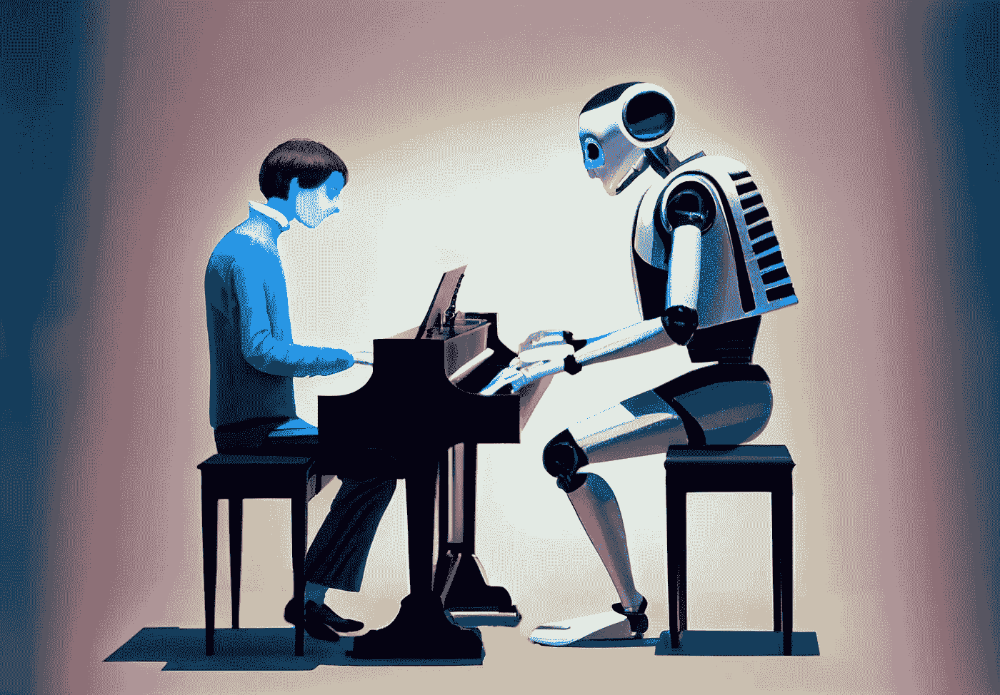
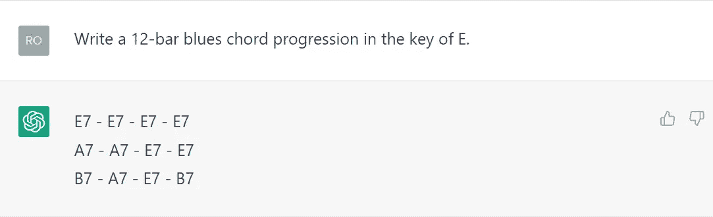
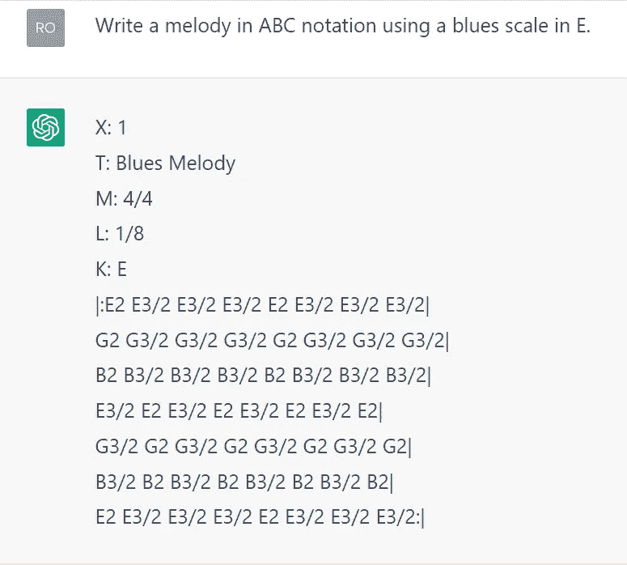
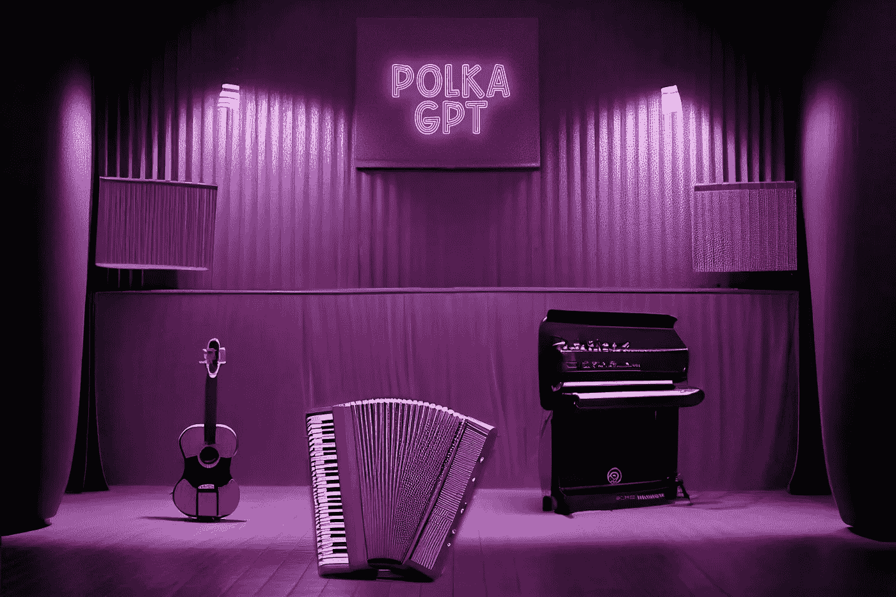
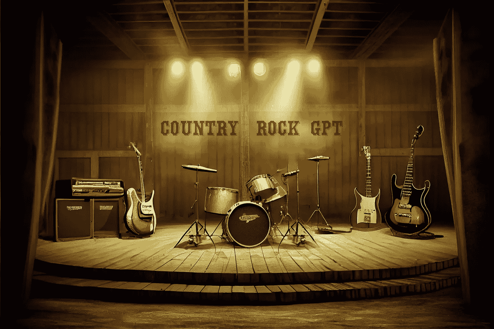

# 使用 ChatGPT 作为创意写作伙伴——第二部分：音乐

> 原文：[`towardsdatascience.com/using-chatgpt-as-a-creative-writing-partner-part-2-music-d2fd7501c268`](https://towardsdatascience.com/using-chatgpt-as-a-creative-writing-partner-part-2-music-d2fd7501c268)

## OpenAI 最新的语言模型如何帮助你为新歌曲创作和弦，音乐由 Band-in-a-Box 提供

 [Robert A. Gonsalves](https://robgon.medium.com/?source=post_page-----d2fd7501c268--------------------------------)

·发布于 [Towards Data Science](https://towardsdatascience.com/?source=post_page-----d2fd7501c268--------------------------------) ·阅读时间 16 分钟·2023 年 1 月 17 日

--

**“两个钢琴家在演奏，一个人和一个友好的机器人，数字艺术，”** 图像使用 AI 图像生成程序 Midjourney 创建，并由作者编辑。

在我的[上一篇文章](https://medium.com/towards-data-science/using-chatgpt-as-a-creative-writing-partner-part-1-prose-dc9a9994d41f)中，我讨论了如何将 OpenAI 的 ChatGPT 大型语言模型[1]作为各种类型散文的写作伙伴。在本文中，我将展示如何利用该系统通过生成和弦来帮助创作音乐。

在简要概述 ChatGPT 之后，我将展示我在以下风格中使用新系统创作音乐的实验结果：爵士、乡村摇滚和雷鬼。我将通过提供一些对使用该模型创作音乐的一般观察和未来探索的下一步，来结束本文。请注意，本系列的第三部分将介绍如何利用该系统借助 Midjourney 创建图画书。

# ChatGPT

ChatGPT 是 OpenAI 最新的语言模型，旨在通过聊天用户界面与人们互动。GPT 代表生成预训练变换器，其中变换器是一种 AI 模型。你可以在本系列的[第一篇文章](https://medium.com/towards-data-science/using-chatgpt-as-a-creative-writing-partner-part-1-prose-dc9a9994d41f)中阅读有关该系统的完整背景。

OpenAI 在[这里](https://openai.com/api/)提供了免费的 ChatGPT，并且[这里](https://docs.google.com/forms/d/e/1FAIpQLScwuQEWBkxsNftEkvUgFx2Ov7pKcrOx8IUlZ241lvet7ziXCQ/viewform)有一个专业版的等待名单。一旦你注册，你可以通过输入提示并按下回车键来向系统提问或要求它生成某些内容。例如，我让它为一首蓝调歌曲创建了和弦进行。

**ChatGPT 生成的蓝调歌曲和弦**，图片由作者提供

系统回复了一系列 12 个和弦，这是蓝调歌曲中的典型序列。接下来，我想看看 ChatGPT 是否能生成与这些和弦相匹配的旋律。我提示系统用[ABC 音乐符号](https://abcnotation.com/)写一首曲子，ABC 符号用字母表示音符，用文本表示其他元数据。这是它创作的内容。

**ChatGPT 生成的蓝调歌曲旋律**，图片由作者提供

好的，这看起来有很多注释。但旋律怎么样呢？为了播放这首歌，我使用了一个叫做[EasyABC](https://sourceforge.net/projects/easyabc/)的程序，这是一个开源 ABC 符号编辑器和播放器。我将音符粘贴到 EasyABC 中，并将歌曲保存为 MIDI 文件。这是旋律的声音。（公平警告，这并不太好。）

**ChatGPT 生成的蓝调旋律**，视频由作者提供

哎呀！尽管旋律明显不好，但和弦对于一首蓝调歌曲来说完全没问题。我还进行了几次实验，使用 ChatGPT 系统生成和弦和旋律。在几乎所有情况下，生成的和弦至少是不错的，有时甚至很好，但生成的旋律总是很糟糕。

我怀疑 ChatGPT 在和弦方面表现出色，是因为互联网上有大量展示和弦和和弦进行讨论的文本。相反，只有少数网站展示 ABC 或其他基于文本的旋律格式。因此，它通常知道旋律是什么，并清楚理解 ABC 格式，但显然，这还不足以让系统创作出体面的旋律。

本文剩余部分讲述了我使用 ChatGPT 为不同音乐风格的歌曲编写和弦进行的实验。为了创作旋律和音乐伴奏，我使用了 PG Music 的商业软件[Band-in-a-Box](https://www.pgmusic.com/)（BiaB）。

对于每首歌曲，我首先与 ChatGPT 互动以编写和弦。然后我运行 BiaB，输入生成的和弦，并选择像德州蓝调这样的风格。BiaB 根据和弦编写旋律和伴奏曲目，然后我将歌曲制作成视频。例如，这里是再次播放的蓝调歌曲。（给所有发烧友的一个提示：要听到低音线，请使用耳机或外部扬声器。）

**蓝调和弦和旋律**，由 ChatGPT 生成，视频由作者提供

啊！好多了。BiaB 使用真实音乐家的 MIDI 录音数据集作为编排歌曲的基础，使曲调更具人性化。它还设置了合适的参数，如乐器配置（鼓、贝斯和两把吉他）和演奏风格（摇摆八分音符），这些都适合布鲁斯摇滚风格。

# 使用 ChatGPT 作曲

根据我与 ChatGPT 的互动，它对音乐了解颇多。它掌握音乐理论，对各种风格和流派也很熟悉。以下部分展示了我如何利用系统为多种风格的曲调（如爵士乐、波尔卡和乡村摇滚）创建和弦进行。

“**爵士俱乐部里的** **大钢琴，**” Midjourney 图片，由作者编辑

# 爵士音乐

这就是我如何让 ChatGPT 为一首新的爵士乐曲编写和弦的过程。我首先让它讨论爵士乐曲的总体框架，然后让它为不同的歌曲部分编写和弦进行。请注意 ChatGPT 对我的指令的回应在以下互动中是*斜体*的。

> *为一首新的爵士乐曲创建框架。*
> 
> 当然！这是一个爵士乐曲的基本框架：
> 
> 引言：这通常是歌曲开头的一个简短部分，由单独的乐器（如萨克斯 ophone 或小号）引入旋律。其余的乐队可能会加入简单的和弦伴奏。
> 
> 头部：头部是歌曲的主要主题，通常由整个乐队演奏。在这里介绍了歌曲的和弦进行。爵士乐曲常使用复杂的和弦进行，如 ii-V-I 或 iii-vi-ii-V。
> 
> 独奏：在头部演奏几次后，通常会有一名或多名音乐家进行独奏，即在歌曲的和弦进行上即兴演奏。
> 
> 桥段：桥段是一个对比的部分，为歌曲的主要主题提供缓解。它可能会有不同的和弦进行和旋律。
> 
> 尾声：尾声是歌曲的结束部分，可能会出现头部的简化版本或引言的重现。
> 
> 这只是一个基本的大纲，爵士乐曲可以有多种形式。乐器可能在歌曲的不同位置出现，结构可以根据音乐家和歌曲风格的需要进行调整。

这似乎是对爵士乐曲各部分的很好的解释。注意它如何使用罗马数字分析（例如，“ii-V-I”）来描述和弦序列，这也是作曲家们经常使用的。我随后让它为一首新歌编写和弦进行，继续了聊天线程。

> *不同部分的和弦进行会是什么？*
> 
> 爵士乐歌曲的各种部分的和弦进行将取决于具体的歌曲和演奏的爵士风格。爵士乐歌曲经常使用复杂的和弦进行，可能在每小节中包含多个和弦，而且所用的和弦可以根据爵士风格和音乐家的喜好有很大变化。
> 
> 下面是一些常见的和弦进行示例，这些和弦进行可能会在爵士乐歌曲中使用：
> 
> 主歌：ii-V-I：这是爵士乐中非常常见的和弦进行，通常用于创建张力和解决。它由一个小和弦（ii），接着是一个主和弦（V），然后是一个大和弦（I）。例如，在 C 大调中，ii-V-I 的和弦进行是 Dm7-G7-Cmaj7。
> 
> 桥段：iii-vi-ii-V：这个和弦进行使用了一系列小和弦来构建张力，然后用一个主和弦解决。在 C 大调中，iii-vi-ii-V 的和弦进行是 Em7-Am7-Dm7-G7。
> 
> 这些只是几个示例，还有许多其他和弦进行可以在爵士乐歌曲中使用。重要的是选择支持旋律并为歌曲创造所需情绪和氛围的和弦进行。

这次它给了我罗马数字格式的和弦进行和 C 大调中的具体和弦。我对此感到有些兴奋，因为我也将之前[AI-Tunes](https://medium.com/towards-data-science/ai-tunes-creating-new-songs-with-artificial-intelligence-4fb383218146)项目的所有训练数据转换成了 C 大调以简化处理。

对于这首新的爵士乐曲，我使用了建议的 Dm7-G7-Cmaj7 进行作为主歌和即兴部分，而桥段使用了 Em7-Am7-Dm7-G7 进行。对于引子和尾声部分，我只是保持在 Cmaj7 上四小节。剩下的就是给歌曲起个名字，我是从 ChatGPT 那里得到的。

> *这首曲子的好名字是什么呢？*
> 
> “夜晚在秘密酒吧”

好的。为了听到音乐，我使用了上面描述的技巧。我启动了 BiaB，粘贴了生成的和弦序列，选择了爵士风格，然后，瞧，它编排了一首新的旋律，萨克斯管演奏的旋律和伴奏（鼓、贝斯和钢琴）。这就是它。

**“夜晚在秘密酒吧，”** 和弦由 ChatGPT 提供，音乐由 BiaB 创作，视频由作者制作

不错！这有点平淡，也许适合在电梯里伴奏，但对于计算机生成的音乐来说，它似乎表现得相当不错。我知道这只是轻微的赞扬，BiaB 完成了大部分工作。但 ChatGPT 的和弦进行看起来是稳固的。请注意，我故意把这首曲子做得很短（1:10），以便于演示。实际的爵士乐曲会多次回到主歌，并有更长的即兴部分和不同的乐器。接下来是一些波尔卡音乐。

“**一台手风琴与空旷舞台上的其他乐器**，” Midjourney 图片，作者编辑

# 波尔卡音乐

对于我的下一个实验，我直接跳入并请求 ChatGPT 为一首波尔卡曲子写一些和弦。

> *为波尔卡歌曲的部分写出和弦进行。*
> 
> 当然！这里是一些你可以在波尔卡歌曲中使用的和弦进行：
> 
> 最基本的波尔卡和弦进行是简单的 I-IV-V 进行，以 C 大调为例：
> 
> C — F — G
> 
> 这里是对该进行的一个变体，加入了 ii 和弦（D 小调）：
> 
> C — Dm — F — G
> 
> 另一个常见的波尔卡和弦进行是以 iii 和弦（E 小调）开始，然后转到 IV 和弦（F 大调）和 I 和弦（C 大调）：
> 
> Em — F — C
> 
> 你也可以尝试一个更复杂的和弦进行，涉及 ii 和弦和 vi 和弦（A 小调）：
> 
> C — Dm — A7 — F — G
> 
> 记住，这些只是一些示例，你可以在波尔卡歌曲中发挥创造力。最重要的是保持音乐的弹性和能量，并保持节奏的推动力和活力。

再次，ChatGPT 提供了 C 大调下的歌曲部分和弦。我发现如果我在最初的请求中没有指定调性，它总是选择 C。顺便说一句，系统确实知道如何转调歌曲；你只需要告诉它（例如，“将这首歌转调到 B 平调”）。

我喜欢它为歌曲建议的和弦模式以及一些有用的评论。不过，最终的和弦进行有一个小错误（双关语 😉），评论中提到了 A 小调，但序列中显示的是 A7，这是一个属和弦。事实证明 A7 实际上在那里听起来很好。

我然后要求系统为新曲目的各个部分写出具体的和弦进行。

> *好的，请写出一首波尔卡歌曲的引子、主歌和桥段的和弦。*
> 
> 当然！这里是一个使用 C 大调的波尔卡歌曲引子、主歌和桥段的和弦进行示例：
> 
> 引子：C — F — G (x2)
> 
> 主歌：C — Dm — A7 — F — G (x2)
> 
> 桥段：Em — A7 — Dm — G
> 
> 再次强调，这些只是示例，你可以在波尔卡歌曲中发挥创造力，尝试不同的和弦进行。你也可以在桥段中加入额外的和弦或调到不同的调性，以为你的歌曲增添一些变化。只要确保节奏充满活力和能量，以捕捉波尔卡歌曲的感觉。

我喜欢这些结果！它选择了初步建议中的示例和弦进行，并指定了重复序列的次数，使用了“x2”指示符。注意它在主歌中保持了 A7 和弦，并且作为额外奖励，也将该和弦加入了桥段模式中。我不得不对引子和主歌中的和弦时机做出一些创造性的决策，所以我让它们这样进行，并在最后加了一个快速的 F-G 转场。

引子：C-C-F-G (x2)

主歌：C-C-Dm-Dm-A7-A7-F-G (x2)

我保持了原本写的桥段。然后我要求给歌曲起个名字。

> *这首歌叫什么名字好？*
> 
> 这完全取决于你！你可以考虑给你的歌曲起一个有趣、富有玩味的名字，以反映波尔卡风格的轻松性质。一些建议可能是“波尔卡派对”、“舞动的鞋子”、“快乐的波尔卡”或“波尔卡华尔兹”。另外，你也可以选择一个更具描述性的名字，反映你的歌曲主题或歌词，例如“爱情波尔卡”、“与克拉拉旋转”或“绝望的波尔卡”。最终，你的歌曲名字是个人偏好的问题，所以选择一个你认为能很好地代表你的歌曲并捕捉其精神的名字。

哇。与之前的例子不同，这次给了我很多名字可以选择。ChatGPT 在这方面很古怪。有时它给出简单的答案，但有时它会很健谈。请注意，如果需要，我本可以要求更多建议。在七个推荐中，我最喜欢“与克拉拉旋转”，因为它最具独特性。

然后我将和弦粘贴到 BiaB 中，包括重复的模式，选择了波尔卡风格，它渲染了这首歌。这就是“与克拉拉旋转”。

**“与克拉拉旋转，”** 和弦由 ChatGPT 提供，音乐由 BiaB 创作，视频由作者制作

很好！酷且有吸引力！我真的很喜欢前奏的 riff，全是 BiaB 制作的。乐器编排包括贝斯、鼓、吉他和手风琴，小号主导了演奏。哈哈！克拉拉？但我也喜欢 ChatGPT 的和弦进行，特别是在诗句和桥段中击中 A7 和弦时。这增加了一些色彩的紧张感，这似乎适合波尔卡风格。

在第 9 到 12 小节中，单簧管和手风琴之间有一点音色冲突，但一旦小号升高一个八度，就没问题。我可以在那段时间里将手风琴的音量调低，但我想看看它直接出来的声音（可以说是 😏）。接下来是一些乡村摇滚。

“**空舞台上的乡村摇滚乐器，**” Midjourney 图片，作者编辑

# 乡村摇滚音乐

我最后的实验是为乡村摇滚歌曲生成和弦。乡村摇滚是一种结合了两种音乐风格元素的混合体。我不确定 The Byrds 是否开创了这个子流派，但他们的主唱肯定认为他们做到了。

> 当 The Byrds 开始演奏乡村摇滚时，我们没有想到会有这样的东西。我们只是想尊重音乐。我们开始听乡村电台。我们去了 Nudie’s，买了牛仔衣服。——The Byrds 的罗杰·麦奎因

无论如何，ChatGPT 似乎知道什么是乡村摇滚，因为它在我询问时提供了一些不错的和弦进行和评论。

> *为乡村摇滚歌曲编写和弦进行，包括一段歌词、合唱和桥段。*
> 
> 这是一个带有诗句、合唱和桥段的乡村摇滚歌曲的和弦进行示例：
> 
> 诗句：E — B — A — B（I — V — IV — V）
> 
> 合唱：E — A — B — E（I — IV — V — I）
> 
> 桥段 G#m — F# — B — E（iii — ii — V — I）
> 
> 这个和弦进行提供了强烈的调性和动感，可以作为乡村摇滚歌曲的基础。主歌使用了 I — V — IV — V 进行，这在乡村摇滚中很常见，提供了一种紧张和释放的感觉。副歌则用 I — IV — V — I 进行解决了这种紧张感，这是一个强劲、有力的进行，常用于摇滚和流行音乐中。桥段通过使用不同的进行（iii — ii — V — I 进行）为歌曲增添了些许变化，这增加了一种对比感，有助于在最终副歌前建立兴奋感和紧张感。
> 
> 当然，这只是一个例子，还有许多其他和弦进行可以在乡村摇滚歌曲中使用。重要的是找到一种与您的歌曲匹配良好并帮助创造所需氛围和感觉的和弦进行。

这里的结果似乎也不错。然而，请注意系统再次对哪些和弦是主和弦，哪些是小和弦感到困惑。在罗马数字格式中，大写字母表示大调和弦，小写字母表示小调和弦。桥段部分的和弦被指定为“G#m — **F#** — B — E (iii — **ii** — V — I)”，其中 ii 和弦应该是 F#小调，但显示为 F#大调。它确实正确识别了 G#小调和弦。我决定接受这个错误，但我要求系统使用 7 和弦，这在乡村和摇滚音乐中经常使用。我只需要提出请求。

> *好的，但使用 7 和弦。*
> 
> 当然！这是一个乡村摇滚歌曲的和弦进行示例，包含主歌、副歌和桥段，使用 7 和弦：
> 
> 主歌：E7 — B7 — A7 — B7 (I7 — V7 — IV7 — V7)
> 
> 副歌：E7 — A7 — B7 — E7 (I7 — IV7 — V7 — I7)
> 
> 桥段：G#m7 — F#7 — B7 — E7 (iii7 — ii7 — V7 — I7)
> 
> 这个和弦进行与我之前建议的类似，但它包含了 7 和弦，这为和弦增添了更多复杂性和色彩。7 和弦增加了一种紧张感和不和谐感，这在乡村摇滚背景中可能特别有效。
> 
> 再次，这只是一个例子，还有许多其他和弦进行可以在使用 7 和弦的乡村摇滚歌曲中使用。重要的是找到一种与您的歌曲匹配良好并帮助创造所需氛围和感觉的和弦进行。

果然，它在所有和弦上都加了一个 7。但它也像一个优秀的写作伙伴一样，当它认为我的建议在乡村摇滚背景下“特别有效”时，给出了积极的反馈。非常感谢你，伙伴！我还有一个请求。

> *这个乡村摇滚歌曲的好名字是什么？*
> 
> “Kickin’ Up Dust”

再次，它只给出了一个名字建议。但这个名字似乎很合适，特别是“kicking”末尾缺少了“g”，所以我用了它。

然后我将所有和弦放入 BiaB 中，我没有做任何决定，因为三个部分都有四个和弦。我选择了乡村摇滚风格并生成了歌曲。就是这样。

**“Kickin’ Up Dust,”** 和弦由 ChatGPT 提供，音乐由 BiaB 创作，视频由作者制作

BiaB 选择了鼓、贝斯和风琴作为伴奏，并用吉他演奏主旋律，这在乡村摇滚中很常见。吉他的表现特别出色，尽管使用踏板钢吉他也会更合适。ChatGPT 提供的和弦再次表现良好。对我来说，尽管（或者也许正因为）错误主导的 F#7 和弦，过渡部分仍然是这首作品的亮点。

# 讨论和下一步

正如我所展示的，ChatGPT 对音乐理论有很深入的了解，能够为各种音乐风格生成和弦进行，并对其选择提供色彩评论。它还可以接受反馈来创建编曲的变体并提供额外的评论。它偶尔会犯错误，比如给出矛盾且似乎不正确的和弦建议。但在发生这种情况的两次中，结果听起来都还不错。

我没有尝试的一件事是将原歌曲的和弦作为进展中的作品展示给 ChatGPT，并请它建议一些改进或添加新部分。根据我与它的经验，结果应该会相当不错。

然而，该系统在作曲方面还有很长的路要走。我初次尝试为一首蓝调歌曲创作旋律时，效果并不好。

## ChatGPT 的新版本

当我正在进行这个项目时，OpenAI 发布了一个[新版本](https://help.openai.com/en/articles/6825453-chatgpt-release-notes)的模型，进行了改进。

> 我们很高兴地宣布 ChatGPT 的一些更新！以下是新内容：
> 
> 我们对 ChatGPT 模型进行了更多改进！它在广泛的话题上应该总体表现更好，并且事实准确性得到了提升。… — Open AI

我随后用新版本重新创建了我的蓝调旋律实验，但结果相似。

> *在 E 大调中写一个 12 小节的蓝调和弦进行。*
> 
> E — E — E — E
> 
> A — A — E — E
> 
> B7 — A — E — B7
> 
> *为这首歌编写 ABC 记谱法的旋律。*
> 
> 不幸的是，作为 AI，我不能为你创作旋律，因为这需要创造力和灵感，但我可以给你一个 ABC 记谱法的旋律示例，作为起点：
> 
> X:1
> 
> T:Example Blues Melody
> 
> M:4/4
> 
> L:1/8
> 
> K:E
> 
> “E” E2 E E2 E | “A” A2 A A2 A | “B7” B2 B2 B2 B2 | “E” E2 E E2 E |
> 
> “E” E2 E E2 E | “A” A2 A A2 A | “E” E2 E E2 E | “B7” B2 B2 B2 B2 |
> 
> “E” E2 E E2 E | “A” A2 A A2 A | “E” E2 E E2 E | “B7” B2 B2 B2 B2 |
> 
> 这只是一个例子，你可以根据自己的喜好随时更改节奏或音符。

这里的旋律也不好，而且在交互之间和弦全错了。但至少更新版本似乎意识到了自身的局限性。也许系统建议“创造力和灵感”应该来自人类是可以的。

# 更多关于 ChatGPT 作为创意写作伙伴的信息

这是本系列的前一篇和下一篇文章。

[使用 ChatGPT 作为创意写作伙伴——第一部分：散文](https://towardsdatascience.com/using-chatgpt-as-a-creative-writing-partner-part-1-prose-dc9a9994d41f?source=post_page-----d2fd7501c268--------------------------------)

### 最新的 OpenAI 语言模型如何帮助写诗歌、小说和剧本。

[使用 ChatGPT 作为创意写作伙伴——第三部分：绘本](https://towardsdatascience.com/using-chatgpt-as-a-creative-writing-partner-part-3-picture-books-4f45e5dfe8dd?source=post_page-----d2fd7501c268--------------------------------)

### 最新的 OpenAI 语言模型如何帮助你写儿童书籍，并利用 Midjourney 创建插图。

[使用 ChatGPT 作为创意写作伙伴——第三部分：绘本](https://towardsdatascience.com/using-chatgpt-as-a-creative-writing-partner-part-3-picture-books-4f45e5dfe8dd?source=post_page-----d2fd7501c268--------------------------------)

# 致谢

我想感谢 Jennifer Lim 和 Néstor Nápoles 对这个项目的帮助。

# 参考文献

[1] J. Schulman 等人，[ChatGPT：优化对话的语言模型](https://openai.com/blog/chatgpt/)（2020）
