# 使用 ChatGPT 作为创意写作伙伴 — 第三部分：图画书

> 原文：[`towardsdatascience.com/using-chatgpt-as-a-creative-writing-partner-part-3-picture-books-4f45e5dfe8dd`](https://towardsdatascience.com/using-chatgpt-as-a-creative-writing-partner-part-3-picture-books-4f45e5dfe8dd)

## OpenAI 最新的语言模型如何帮助你写儿童书籍并用 Midjourney 创建插图

 [Robert A. Gonsalves](https://robgon.medium.com/?source=post_page-----4f45e5dfe8dd--------------------------------)

·发布于 [Towards Data Science](https://towardsdatascience.com/?source=post_page-----4f45e5dfe8dd--------------------------------) ·阅读时间 17 分钟·2023 年 2 月 7 日

--

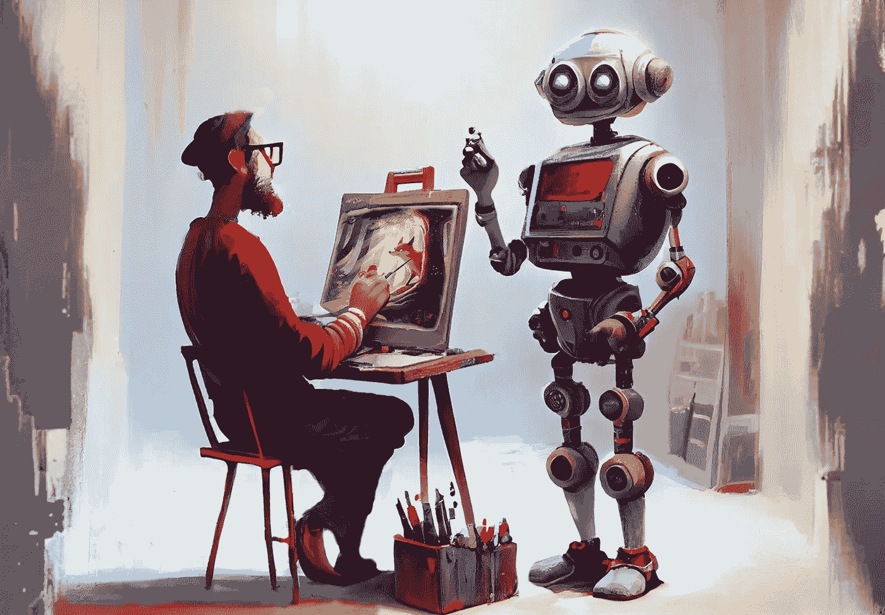

“**一个人和一个友好的机器人在画架上用画笔和颜料画画的场景，**” 这个图像是使用 AI 图像生成程序 Midjourney 创建的，并由作者进行编辑

这是我关于使用 OpenAI 的 ChatGPT 语言模型 [1] 进行创意写作的三篇文章系列的第三篇也是最后一篇。在第一篇文章中，我描述了如何使用 ChatGPT 写作散文、诗歌、小说和剧本。在第二篇文章中，我展示了如何使用该系统创建和弦序列来编写各种风格的音乐。

我为这篇文章进行的最新实验是使用 ChatGPT 创建图画书。因为系统无法直接渲染图像，所以我让它描述场景，然后我使用 Midjourney [2] 这个文本到图像生成系统进行渲染，Midjourney 是我在早期文章中探讨过的。

# 概述

我将从 ChatGPT 和 Midjourney 的背景信息开始，然后展示我如何利用这两个系统为儿童创作一本新的图画书。最后，我将讨论使用这些系统的一般方法，并提供一些未来探索的下一步建议。

## ChatGPT

ChatGPT 是来自 OpenAI 的一个大型语言模型。它基于他们的 GPT-3 模型 [3] 的一种变体，经过微调以遵循人类的指示，称为 InstructGPT [4]。之后，它又进一步微调，成为一个功能性的聊天机器人，利用先前的互动作为输入。

ChatGPT 可以在你[这里](https://openai.com/api/)免费注册使用，并且即将推出的专业版的等待列表在[这里](https://docs.google.com/forms/d/e/1FAIpQLScwuQEWBkxsNftEkvUgFx2Ov7pKcrOx8IUlZ241lvet7ziXCQ/viewform)。当你注册并登录后，你可以要求它生成一些文本或像这样提出问题。

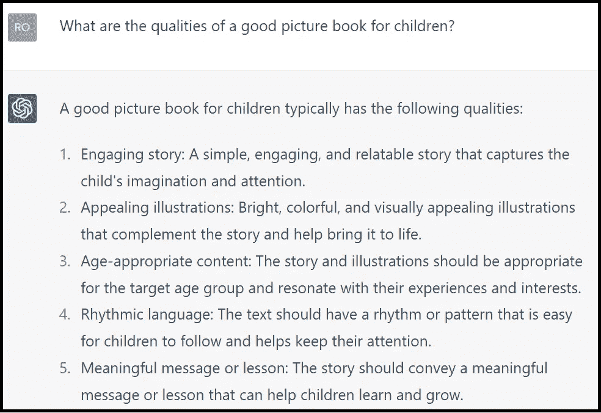

**来自 ChatGPT 的输出**，作者截屏

这一切看起来都很直接和合理。它确实知道什么是图画书及其基本特质。这个列表似乎也是按优先顺序排列的。我同意简单而吸引人的故事应该是儿童书籍的首要任务，其次是视觉上吸引人的插图和其他列出的要点。

该系统有一个不错的功能，即在生成每个回应时使用先前的互动。这意味着系统在回应时知道到目前为止的对话背景。

你可以在我的第一篇文章中阅读有关 ChatGPT 的更完整描述。接下来，我将介绍如何使用 Midjourney 从文本生成图像。

## Midjourney

Midjourney 是由同名公司创建的文本到图像生成器。该服务提供免费版和付费版。免费版对你创建的图像数量有限制，且这些图像仅供非商业用途。付费版则是一个订阅服务，具有[不同级别](https://docs.midjourney.com/docs/plans)，你将拥有所有使用该服务创建的图像。完整的服务条款可以在[这里](https://docs.midjourney.com/docs/terms-of-service)查看。

Midjourney 的用户界面是 Discord 服务器上的一个聊天机器人，Discord 是一个主要由玩家使用的社交媒体平台。我开始时使用了一个通用的提示语：“儿童图画书封面”，以查看它会生成什么。我在 Discord 中使用了 **/imagine** 命令并输入了提示；大约二十秒后，它生成了四个缩略图。

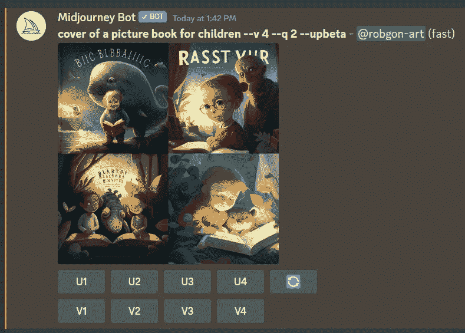

结果相当不错。质量似乎很高，孩子们看起来很可爱。除了飞鲸和令人毛骨悚然的老人之外，我注意到的下一个问题是随机文本。当前版本的 Midjourney，即第 4 版，在生成文本字符时效果还不错，但文字并没有意义。在下面的部分中，我将讨论如何使用 Photoshop 向书中的图像添加文本。你可以在我早期的文章中[这里](https://medium.com/towards-data-science/digital-art-showdown-stable-diffusion-dall-e-and-midjourney-db96d83d17cd)阅读更多关于使用 Midjourney 的内容。

接下来，我将展示我如何使用 ChatGPT 和 Midjourney 创建一本新的儿童图画书。

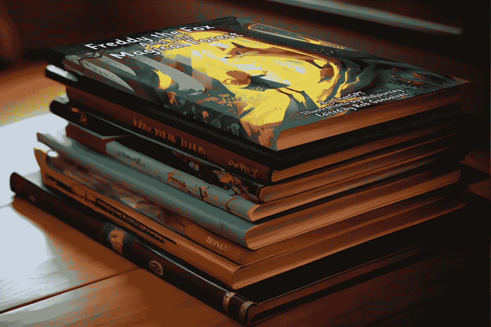

**“儿童图画书的堆叠”，** 图像是使用 AI 图像创建程序 Midjourney 生成并由作者编辑的

# 使用 AI 系统创建图画书

在这一部分，我将带你了解我如何使用 ChatGPT 和 Midjourney 来创建一本儿童图画书。我首先使用前者互动地创建新书的标题和情节摘要。然后我使用两个系统描述并绘制封面的插图。我使用 Photoshop 自己编辑了图像并添加了排版。接着，我使用 ChatGPT 编写了其余的八页书籍内容并描述了每张图片。我用它来创建我输入 Midjourney 的提示，以生成书中的八幅插图。我用 Photoshop 编辑了这些图像，添加了文本，然后在 Microsoft Word 中组装所有页面，创建了最终书籍的 PDF 文件。

以下是每个步骤的详细信息。注意，我使用一个 ChatGPT 会话创建了整个书籍，这样可以让之前的互动内容影响后续的回答。

## 生成标题和情节摘要

从我之前与 ChatGPT 的互动中，你可以看到它知道一本好的儿童图画书的基本特质。但系统不仅知道这些，它还可以创造东西。我首先让它为书生成标题和情节摘要。

> *为幼儿创建图画书的标题和情节。*
> 
> “勇敢的小龙” — 当一只小龙发现自己能像它的大龙朋友们一样喷火时，它变成了这片土地上最勇敢的龙，并通过运用喷火技能帮助需要帮助的人来拯救一天。
> 
> “伟大的花园冒险” — 一群朋友踏上了一段穿越花园的旅程，在途中遇到了各种有趣和惊奇的生物。他们了解了照顾环境的重要性和自然的魔力。
> 
> “顽皮的猴子” — 一只好奇的猴子在探索丛林时遇到各种麻烦，但最终学会了有时候在行动之前先思考是更好的选择。
> 
> “好奇的毛虫” — 一只毛虫踏上了一段探索它长大后会变成什么的旅程。在过程中，它遇到了各种不同的昆虫，并了解了蜕变的不同阶段。
> 
> “魔法森林” — 一个小女孩在她的后院发现了一个通往充满妖精、会说话的动物和其他神话生物的魔法森林的秘密门。她在探索这个魔法世界的过程中经历了各种冒险，并学习了想象力的力量。

这些都很不错，但也相当普通。它们涉及各种动物，包括一条龙、一只猴子、一只毛虫以及一些不明确的魔法生物。

我让系统为第五个生成的标题添加细节，以了解它心中有哪些会说话的动物。注意我只需将我喜欢的标题/情节称作“最后一个”，它就知道我在说哪个。

> *最后一个听起来不错。给情节摘要添加一些新的奇特和具体的细节。*
> 
> 当然！这是“神奇森林”的修订版情节摘要：
> 
> “神奇森林”——当一个名叫莉莉的小女孩在她的后院发现一个秘密门时，她从未想过它会把她带到哪里。门后面是一个充满仙女、会说话的动物和其他神话生物的神奇森林。莉莉对这个发现感到非常高兴，开始了她在森林中的旅程，渴望看到所有的奇观。在旅途中，她遇到了一只会说话的狐狸，它愿意成为她的向导，一个讲述森林过去故事的脾气古怪的老树，以及一个捉弄她的顽皮仙女。莉莉还了解到想象力的力量和照顾环境的重要性。随着她探索森林，她开始想知道这个神奇的地方是否会永远成为她生活的一部分，还是只是现实世界中的一时逃避。

我发现这个情节扩展更有趣。它设计了一个会说话的狐狸、一个脾气暴躁的树木和一个爱捉弄人的仙女作为书中的角色。然后我问它这些角色的名字。

> *好的，狐狸、树和仙女的名字是什么？*
> 
> 当然！以下是“神奇森林”中的角色可能的名字：
> 
> 会说话的狐狸可以叫弗雷德里克。脾气暴躁的老树可以叫奥克利。顽皮的仙女可以叫费伊。

好吧，看来它喜欢名字中的头韵，因为它用了弗雷德里克来命名狐狸，费伊来命名仙女。我想它没有选择特雷弗来命名树木。但我确实喜欢名字奥克利，非常聪明。

我随后决定在标题中使用狐狸的名字，以使其更独特。

> *我们用弗雷迪作为狐狸的名字。把这个名字融入标题五次。*
> 
> 当然！这里有五个包含弗雷迪名字的“神奇森林”修订标题：
> 
> “狐狸弗雷迪与神奇森林”
> 
> “弗雷迪和莉莉在神奇森林中的冒险”
> 
> “弗雷迪在神奇森林中的奇妙之旅”
> 
> “莉莉和弗雷迪的神奇森林冒险”
> 
> “狐狸弗雷迪与神奇森林的奇观”
> 
> 希望这些标题对你有用！如果你有任何其他问题或需要我为故事提出更多想法，请告诉我。

这些也都很好。再一次，注意它如何记住并提到之前对话中的内容，比如它知道莉莉是故事中的主要角色，并将她融入了五个提议标题中的两个。

## 创建书封面

在确定了标题之后，我让它描述了书封面的插图。

> *描述一下“狐狸弗雷迪与神奇森林”的书封面会是什么样子。*
> 
> 对于《弗雷迪与神奇森林》这本书，封面可以展示弗雷迪狐狸站在神奇森林中央的插图，旁边站着一个年轻的女孩（莉莉）。森林中可以充满各种奇幻生物，如仙女和会说话的树木。背景可以是一个美丽的、色彩斑斓的日落，树木和森林中的其他元素在地面上投下长长的阴影。书名《弗雷迪与神奇森林》可以用大号粗体字写在封面的顶部，作者的名字则用较小的字母写在下面。整体上，封面应该引人注目，充满奇幻和惊奇，邀请年轻读者深入书页中的神奇世界。

这是对书籍封面的详细描述。它添加了一些可爱的细节，比如日落如何在地面上投下长长的阴影。

然后我要求系统生成一个提示以创建插图。我知道 Midjourney 不会知道弗雷迪和莉莉是谁，所以我要求 ChatGPT 省略他们的名字。我还要求省略文字描述，因为我知道 Midjourney 对渲染文本字符处理得不好。

> *为语音转图系统编写一个提示语，以创建书籍封面。描述角色的视觉特征，而不是名字。包括年龄、发色和衣服等细节。不要提及文字。*
> 
> 为一本图画书的封面创建插图。插图中展示一只勇敢且充满冒险精神的会说话的狐狸，站在一个神奇的森林中央。一位年轻的女孩站在狐狸旁边，抬头用惊奇的目光看着它。女孩有着红色的头发，约 8 岁，穿着绿色连衣裙。背景是一个美丽的、色彩斑斓的日落，树木和森林中的其他元素在地面上投下长长的阴影。插图应该引人注目，充满了奇幻和惊奇，吸引年轻读者深入书页中的神奇世界。

很好。这正是我所寻找的。我省略了开头的“创建”一词和结尾的“邀请年轻读者”这一从句，因为这些内容对于图像生成帮助不大。我使用的命令是**/imagine [prompt] --v 4 --q 2 --upbeta**，这意味着它使用了第四版本的模型，质量设置为 2.0，并且使用了升级器的测试版。这个升级算法将选定缩略图的分辨率从 512x512 像素提高到 2048x2048 像素。有关这些参数的更多信息，请参见[这里](https://github.com/midjourney/docs/blob/main/user-manual.md#parameters-to-imagine)。

然后我将命令输入到 Midjourney 中，它生成了四个缩略图。

哇，这些都很不错。左上角的那张有一些神奇的事物，包括一只小狐狸和一只大狐狸。左下角的那张在树上有一个奇怪的狐狸状阴影。但我最喜欢右上角的那张。我使用 Midjourney 放大了缩略图，然后在 Photoshop 中稍微修整了一下。我按照 ChatGPT 之前的规格添加了文本。这里是编辑前后的最终结果。

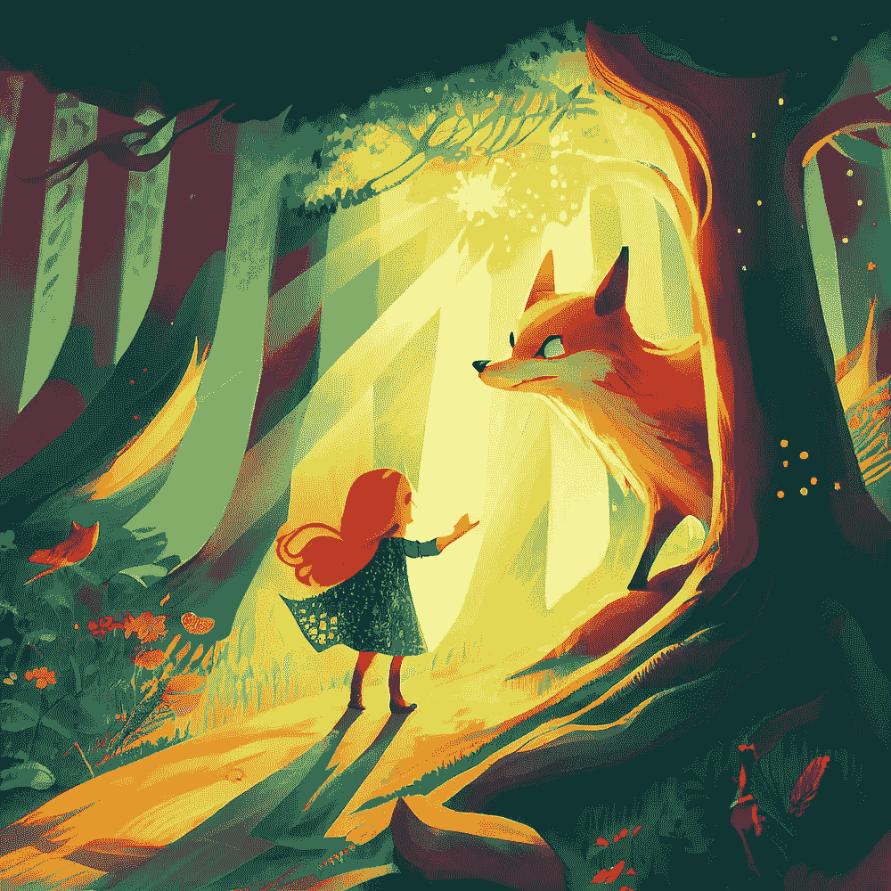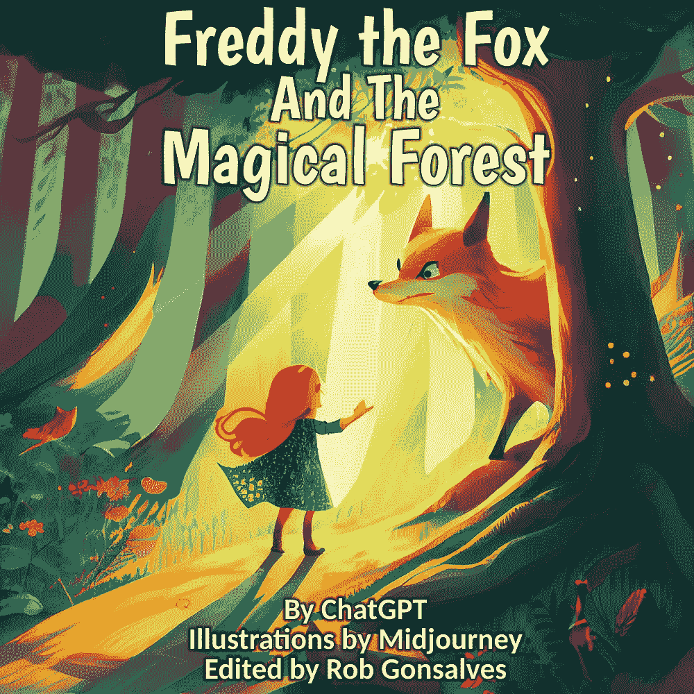

**《弗雷迪狐狸与神奇森林》的封面**，**原始图像**（左）**和最终图像**（右），由作者使用 Midjourney 编辑的图像

我没有对图像进行太多编辑。在 Photoshop 中，我只为狐狸添加了一个瞳孔。对于文本，我使用了 Google 的两个开源字体，[Boogaloo](https://fonts.google.com/specimen/Boogaloo)用于标题，[Carlito](https://github.com/googlefonts/carlito)用于致谢。我添加了黑色边框和轻微的阴影，以确保文本在背景的浅色上可读。

## **编写这本书**

为了编写这本书，我只需要选择八页的数量，并给 ChatGPT 一些基本指示。

> *编写一本总共八页的书，每页两句话和一幅插图。提供插图的描述，并用方括号标出。*
> 
> 这是《弗雷迪狐狸与神奇森林》的图画书，共有八页，每页两句话和一幅插图：
> 
> 第 1 页：“莉莉是一个充满好奇心的女孩，拥有丰富的想象力。” “一天，她在后院发现了一扇秘密的门。” [插图：一个名叫莉莉的小女孩站在她后院的一扇藏在灌木后的门前。]
> 
> 第 2 页：“门后是一个充满奇迹的神奇森林。” “莉莉惊讶不已，迫不及待地想要探索。” [插图：莉莉站在神奇森林的入口处，四周有盛开的树木和花朵，天空中有一抹淡淡的彩虹。]
> 
> 第 3 页：“当她在森林中漫游时，莉莉遇见了一只名叫弗雷迪的会说话的狐狸。” “他主动提出成为她冒险的向导。” [插图：莉莉和狐狸弗雷迪站在一起，弗雷迪友好地看着莉莉。]
> 
> 第 4 页：“莉莉和弗雷迪穿越森林，遇见了一棵名叫奥克利的脾气暴躁的老树。” “他给他们讲述了森林的过去和神奇的居民。” [插图：奥克利树，一棵大橡树，脸上带有表情和手臂，双臂交叉，脸上带着皱眉。]
> 
> 第 5 页：“当他们继续旅行时，莉莉和弗雷迪遇到了一位名叫费伊的顽皮小精灵。” “她捉弄他们，并引导他们在森林中进行了一次疯狂的追逐。” [插图：费伊小精灵，一个小小的有翅膀的生物，金色头发和顽皮的表情，飞翔在空中，身后留下一串闪光的痕迹。]
> 
> 第 6 页：“莉莉和 Freddy 在魔法森林中经历了各种冒险。” “他们了解了想象力的力量和保护环境的重要性。” [插图：莉莉和 Freddy 站在森林里，莉莉望向远方，脸上带着梦幻般的表情，Freddy 则友好地看着她。]
> 
> 第 7 页：“莉莉忍不住想知道魔法森林是否会永远成为她生活的一部分。” “还是只是从现实世界中的暂时逃避。” [插图：莉莉站在秘密门前，带着怀旧的表情回望魔法森林。]
> 
> 第 8 页：“但有一件事是肯定的——她与 Freddy、Oakly 和 Fae 的冒险记忆将永远伴随她。” “完结。” [插图：莉莉在魔法森林中的冒险蒙太奇，显示她、Freddy、Oakly 和 Fae 在旅程中不同场景的合影。]

我喜欢它如何重复了指示，然后迅速生成了八页的叙述文本和插图简要描述。

从批评的角度来看，故事情节比较薄弱，几乎没有情节（注意缺乏对手的存在）。但为了展示目的，这似乎还可以。第 7 页有些哲学性的内容，但在第 8 页以感人的结局作结。

接下来是这个项目的有趣部分，生成书中的插图。

## 生成插图

我上面展示了如何使用 Midjourney 渲染书封面图像。我遵循了这个方法来创建八个页面的插图。由于 GPT 有上下文，我只需逐个请求提示。

这是我创建书中第一个插图所做的工作。注意我再次要求了角色的具体视觉细节，这有助于在再次渲染时保持连贯性。

> *为语音转图像系统编写一个提示，以创建第 1 页的插图。描述角色的视觉特征，不要提及名字。但不要提及文本。*
> 
> 创建一个插图，展示一个小女孩站在她后院一丛灌木后面隐藏的门前。女孩是红发，约 8 岁，穿着绿色连衣裙。她站在门前，脸上带着兴奋的表情，门很大，木制的，带有一个铜把手。

为了在 Midjourney 中渲染图像，我省略了“create”一词，使用了上述选项的**/imagine**命令。以下是结果。

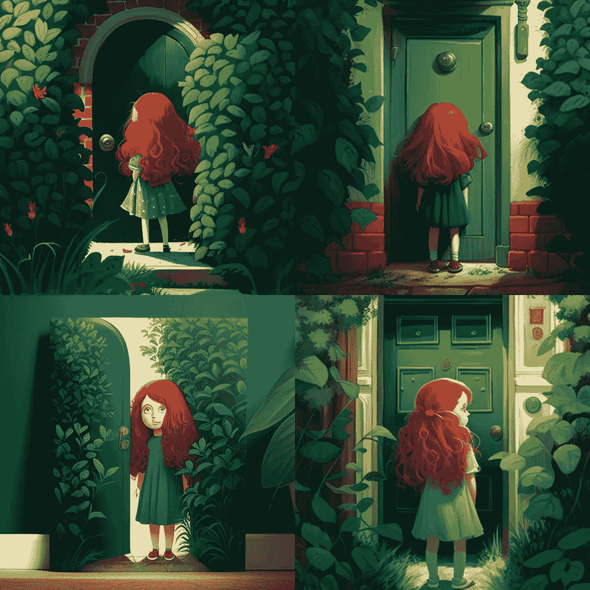

**“Freddy the Fox and the Magical Forest”**的第一页缩略图，Midjourney 图像由作者提供

与书封面类似，这些图像也做得很好。所有规定的元素都渲染得很不错，包括女孩、门、灌木丛等。我最喜欢左上角的那一张，但女孩的额头和头发有一些问题。Midjourney 中有一个很好的功能叫做“remix variations”，它使用选择的图像和原始提示生成四个插图变体。我点击了**V1**按钮来表示左上角的缩略图，系统生成了四个变体。

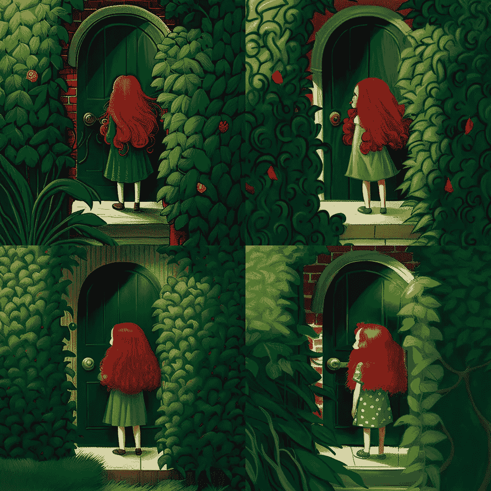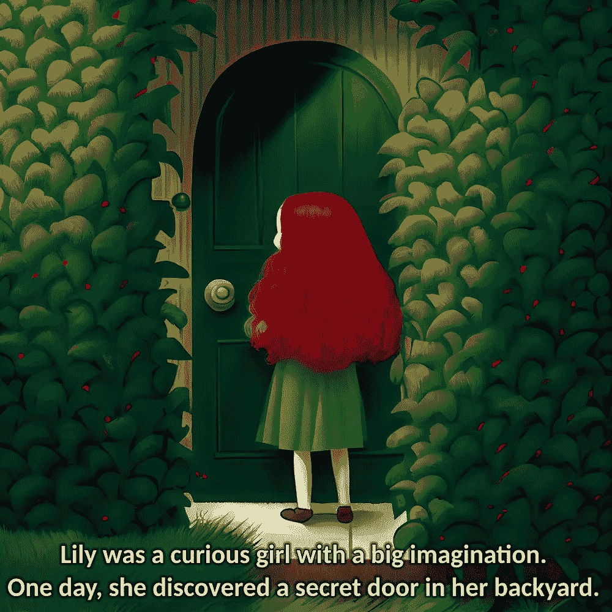

**《弗雷迪狐狸与神奇森林》的首幅插图**（左）**和最终图像**（右），Midjourney 作者图像

在左侧，你可以看到 Midjourney 生成的四个修订版缩略图，每个图像都有细微和不那么细微的视觉差异。我喜欢左下角的那一张，因为她的头发问题较少，而且门的渲染似乎更好。因此，我点击了**U3**按钮，将其放大到 2048x2048 像素。然后，我使用 Photoshop 添加了文字。我没有对这张图像进行任何修饰。

## 角色的视觉连续性

阅读图画书时，读者期望角色在每一页上看起来大致相同。但如果你将书封面的莉莉与第一页的插图进行比较，你会注意到一些连续性问题。例如，衣服的图案是最明显的差异。

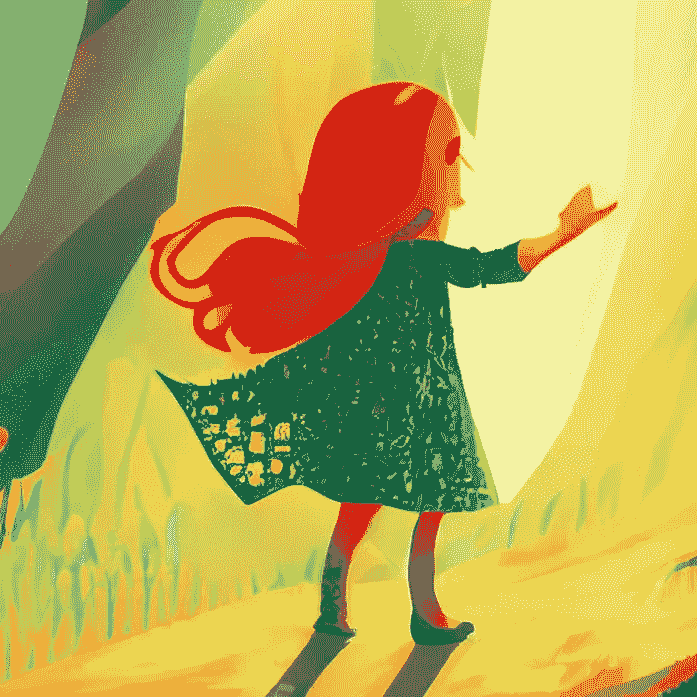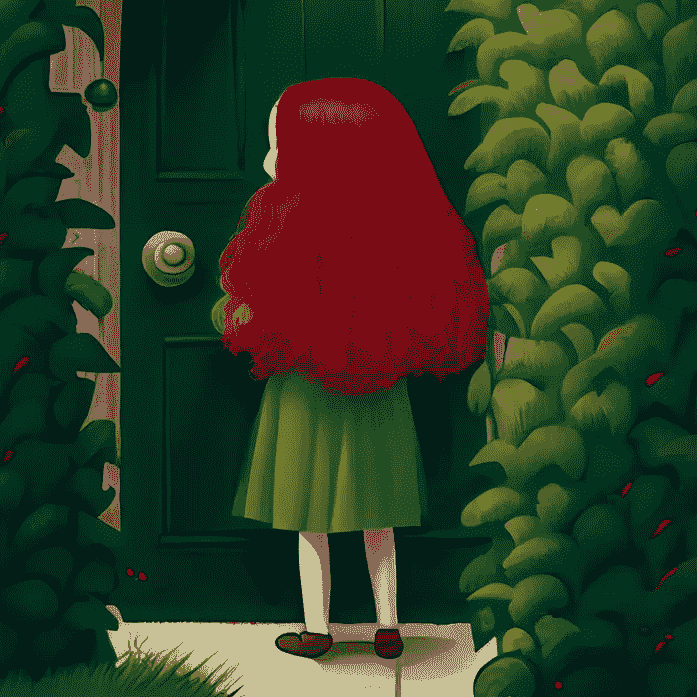

**书封面上的莉莉细节**（左）**和首幅插图**（右），Midjourney 作者图像

使用 Midjourney 生成图画书插图时，这是一个重要问题。除非你告诉它，否则系统并不会“知道”新角色应该是什么样子。

改善插图之间连续性的有两个可能方案。首先，在提示中提供更详细的角色描述会有帮助，即包括对服装和头发的详细描述。Midjourney 会采纳这些词汇，渲染出的角色会更相似。其次，可以在 Photoshop 中清理图像，即使用曲线工具和吸管匹配头发和衣物的颜色。

我没有花太多时间修复图书的连续性问题。尽管如此，我选择了角色匹配度较高的缩略图，偶尔调整了提示，并在 Photoshop 中做了一些清理。

## 创作其余的插图

我使用 ChatGPT 和 Midjourney 重复了第二页到第八页的插图制作过程。总体来说，我喜欢**奥克利**这个脾气暴躁的树和**法伊**这个顽皮的仙女的渲染效果。

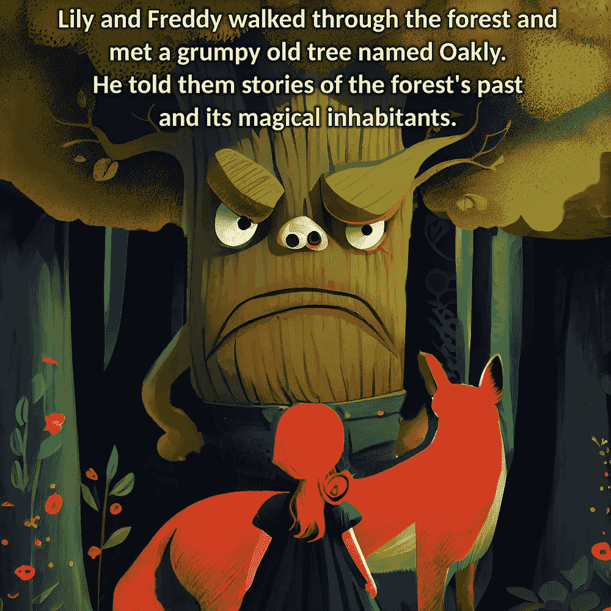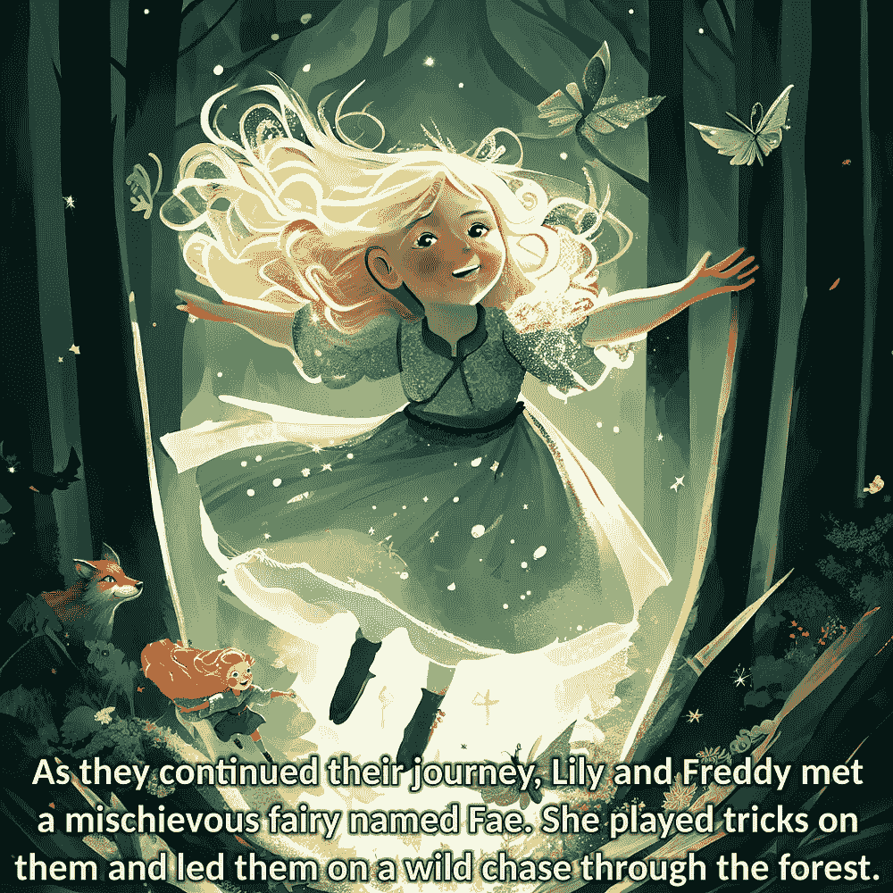

**《弗雷迪狐狸与神奇森林》的插图，展示了奥克利**（左）**和菲**（右），Midjourney 图像由作者编辑

特别是，我喜欢 Midjourney 将奥克利的眉毛渲染成树枝的效果，以及喜欢菲的发光背光效果。

## 完成的书籍

我将所有页面加载到一个 Microsoft Word 文档中以编制书籍，并添加了最后的“完”页以及鸣谢页面。然后将其保存为 PDF 文件。

这是完成的书籍。请注意，你可以使用右侧的滚动条或箭头按钮翻页。全屏模式并不非常有用，因为它会放大太多，无法显示完整的页面。

书中的最后一张图片是我在 Photoshop 中创建的蒙太奇，通过复制和粘贴 Midjourney 生成的“最佳”角色图片。我尝试使用系统的图像提示功能来自动生成汇编图像，但没有成功。

# 讨论

经过大量的实验，我设法使用 ChatGPT 和 Midjourney 作为写作/插画伙伴来创建一本简单的儿童图画书。总体而言，我对结果感到满意。角色很有趣，插图也很好看。

然而，正如我之前提到的，情节简单且缺乏细节。首先，它需要超过八页，以创建更具吸引力的故事。例如，Margaret Wise Brown 和 Clement Hurd 的《晚安月亮》有 30 页，Maurice Sendak 的《野兽国》有 48 页。但我认为可以与 ChatGPT 合作，创建一个更复杂故事的高层次大纲，然后将其拆分成各个部分，并生成有助于故事主线的单独页面。

此外，还需要更多的实验来在页面之间渲染具有适当连续性的角色。例如，可能可以使用 Midjourney 创建角色研究，从不同角度生成角色的各种姿势。然后使用孤立的姿势作为图像提示，以及描述特定场景的文本。

我希望那些开发文本到图像生成系统的开发者，如[Midjourney](https://midjourney.com/)、[Dall-E](https://openai.com/dall-e-2/)和[Stable Diffusion](https://dreamstudio.com/create/)，能改进他们的模型，以便能够渲染具有视觉连续性的角色。

# 更多关于 ChatGPT 作为创意写作伙伴的内容

这是本系列的前两篇文章。

 ## 使用 ChatGPT 作为创意写作伙伴 — 第一部分：散文

### 最新的 OpenAI 语言模型如何帮助创作诗歌、小说和剧本

towardsdatascience.com  ## 使用 ChatGPT 作为创意写作伙伴——第二部分：音乐

### 最新的 OpenAI 语言模型如何帮助你为新歌曲编写和弦，音乐由 Band-in-a-Box 提供

towardsdatascience.com

# 致谢

我想感谢 Jennifer Lim 在这个项目中的帮助。

# 参考文献

[1] J. Schulman 等，[ChatGPT：优化对话的语言模型](https://openai.com/blog/chatgpt/)（2020 年）

[2] Midjourney [`midjourney.gitbook.io/docs/`](https://github.com/midjourney/docs)

[2] T. Brown 等，[语言模型是少样本学习者](https://arxiv.org/pdf/2005.14165.pdf)（2020 年）

[3] L. Ouyang 等，[训练语言模型以遵循带有人类反馈的指令](https://arxiv.org/pdf/2203.02155.pdf)（2020 年）
