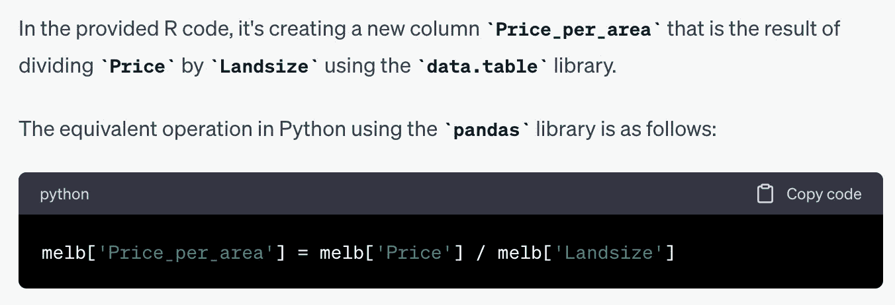
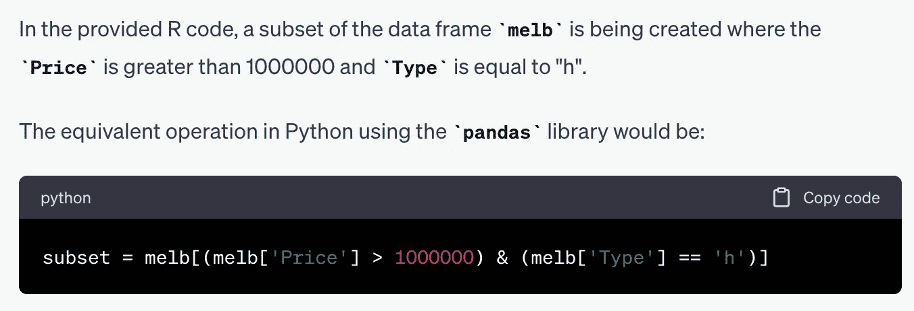
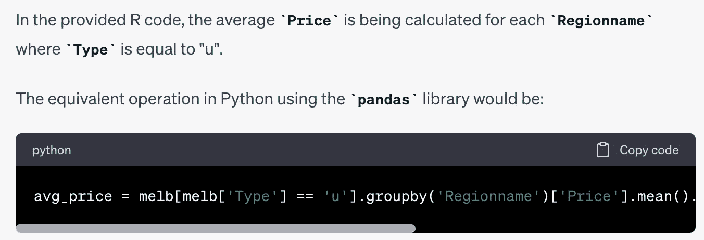
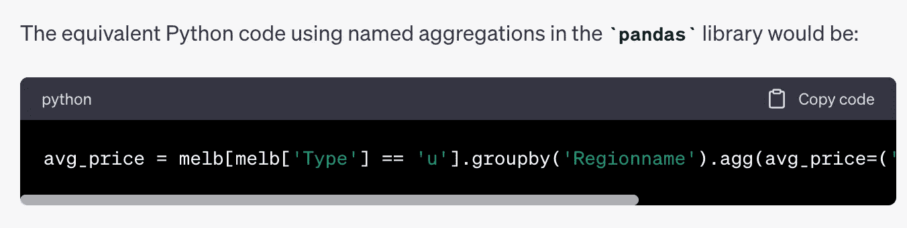
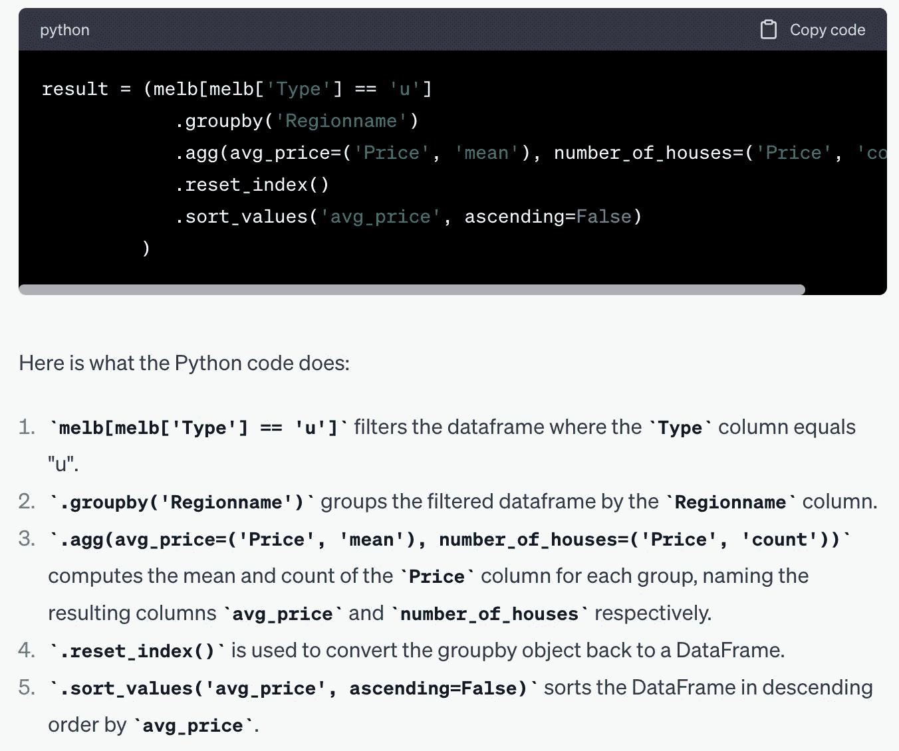
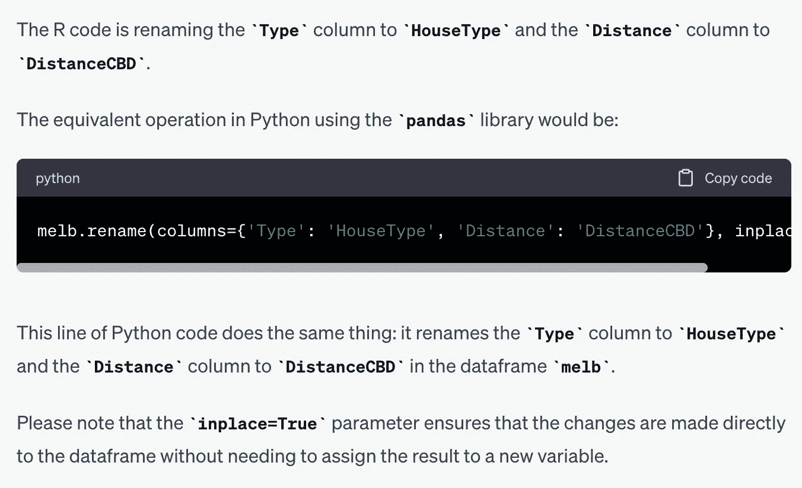

# 使用 ChatGPT 将 R 代码翻译成 Python

> 原文：[`towardsdatascience.com/using-chatgpt-to-translate-r-code-to-python-effed461037e`](https://towardsdatascience.com/using-chatgpt-to-translate-r-code-to-python-effed461037e)

## 进入翻译代码库的第一步。

[](https://sonery.medium.com/?source=post_page-----effed461037e--------------------------------)[](https://towardsdatascience.com/?source=post_page-----effed461037e--------------------------------) [Soner Yıldırım](https://sonery.medium.com/?source=post_page-----effed461037e--------------------------------)

·发布于 [Towards Data Science](https://towardsdatascience.com/?source=post_page-----effed461037e--------------------------------) ·阅读时间 5 分钟·2023 年 5 月 28 日

--


图片由 [Katka Pavlickova](https://unsplash.com/@katerinapavlickova?utm_source=unsplash&utm_medium=referral&utm_content=creditCopyText) 提供，来源于 [Unsplash](https://unsplash.com/s/photos/two?utm_source=unsplash&utm_medium=referral&utm_content=creditCopyText)

Python 和 R 是数据科学生态系统中的两个关键角色。我在 Python 和 R 编写的项目中都有工作经验。它们在高效处理数据清理、操作和分析任务方面表现出色。

然而，有时我们希望将代码库从 R 翻译成 Python，或反之亦然。这种动机可能来源于公司内部的技能组合。如果你有许多 Python 开发者和少数 R 开发者，你可能希望将项目维护在 Python 中。

在某些情况下，特定的项目要求可能会促使你翻译代码库。例如，虽然 Python 以其多功能性而闻名，涵盖了网页开发、软件开发和机器学习等领域，但 R 在统计分析和可视化方面表现出色。因此，如果项目涉及大量统计分析或复杂的图形表示，翻译 Python 代码到 R 可能会有益。

翻译过程通常需要具备两种编程语言技能的人才，这可能很难找到。好消息是我们可以使用 ChatGPT，它在几乎所有编程语言中都具备相当高的技能水平。

在这篇文章中，我们将使用 ChatGPT 将使用 “data.table” 包编写的 R 代码翻译成使用 “pandas” 库的 Python 代码。

我们将仅给出代码，而不说明其作用或预期功能。让我们从初始提示开始，定义 ChatGPT 的角色并说明我们的期望：

*初始提示：你是一名拥有多年 Python 和 R 经验的软件工程师。你的任务是将 R 代码转换为 Python 代码。R 代码使用 data.table 包进行数据清理和处理。你将使用 Pandas 库将其转换为 Python 代码。*

第一个示例是创建数据表中新列的代码行。

```py
Convert the following R code that uses `data.table` package 
to Python using the `pandas` library:

```

melb[, Price_per_area := Price / Landsize]

```py
```

这是 ChatGPT 的回答：



(作者提供的图片)

它不仅提供了代码，还解释了代码的功能。这对于没有源语言或目标语言专业知识的人来说非常有用。

第二个示例通过对价格和类型列进行过滤来创建数据表的子集。

```py
Convert the following R code that uses `data.table` package 
to Python using the `pandas` library:

```

subset <- melb[Price > 1000000 & Type == "h"]

```py
```

ChatGPT：



(作者提供的图片)

我们再做一个稍微复杂的例子。下面提示中的代码行计算了不同地区类型为“u”的房屋的平均房价。

```py
Convert the following R code that uses `data.table` package 
to Python using the `pandas` library:

```

melb[Type == "u", .(avg_price = mean(Price)), by="Regionname"]

```py
```

ChatGPT：



(作者提供的图片)

上面截图中的代码：

```py
avg_price = melb[melb['Type'] == 'u'].groupby('Regionname')['Price'].mean().reset_index().rename(columns={'Price': 'avg_price'})
```

它成功地完成了任务，但我更倾向于使用命名聚合，我认为这更具可读性且更简洁。我们也让 ChatGPT 使用它：

```py
Convert the following R code that uses `data.table` package 
to Python using the `pandas` library. Used named aggregations.

```

melb[Type == "u", .(avg_price = mean(Price)), by="Regionname"]

```py
```

ChatGPT：



(作者提供的图片)

上面截图中的代码：

```py
avg_price = melb[melb['Type'] == 'u'].groupby('Regionname').agg(avg_price=('Price', 'mean')).reset_index()
```

这样更好，因为它不需要之后重命名列。我们还可以使用`groupby`函数的`as_index`参数并将其值设置为 False，这样我们在计算后就不需要重置索引。

下一个提示中的 R 代码计算了每个地区的平均房价和房屋总数，并按降序排序结果。

```py
Convert the following R code that uses `data.table` package 
to Python using the `pandas` library. Used named aggregations.

```

melb[

    Type == "u",

    .(avg_price = mean(Price), number_of_houses=.N),

    by="Regionname"

][order(-avg_price)]

```py 
```

ChatGPT：



(作者提供的图片)

与之前的示例一样，逐步解释对于理解和调试代码非常有用。

我们来做一个关于更改列名的最终示例。下面提示中的 R 代码将类型和距离列重命名为“HouseType”和“DistanceCBD”。

```py
Convert the following R code that uses `data.table` package 
to Python using the `pandas` library.

```

setnames(melb,

        c("Type", "Distance"),

        c("HouseType", "DistanceCBD"))

```py
```

ChatGPT：



(作者提供的图片)

上面截图中的代码：

```py
melb.rename(columns={'Type': 'HouseType', 'Distance': 'DistanceCBD'}, inplace=True)
```

我喜欢关于`inplace`参数的注释，因为它很容易被忽视。

# 最后总结

本文中的示例展示了 ChatGPT 在将代码从一种编程语言翻译到另一种编程语言方面的成功。我们进行了逐行翻译，这不能作为 ChatGPT 能够翻译整个代码库的证明。

然而，显然，当处理大型代码库时，使用 ChatGPT 可以节省你数小时的时间。你总是可以再检查一次并测试输出，以确保它按预期工作。

*你可以成为* [*Medium 会员*](https://sonery.medium.com/membership) *来解锁我所有的写作内容，以及 Medium 的其他内容。如果你已经是会员，别忘了* [*订阅*](https://sonery.medium.com/subscribe) *以便在我发布新文章时收到邮件通知。*

感谢阅读。如有任何反馈，请告知我。
