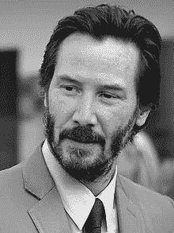
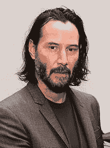
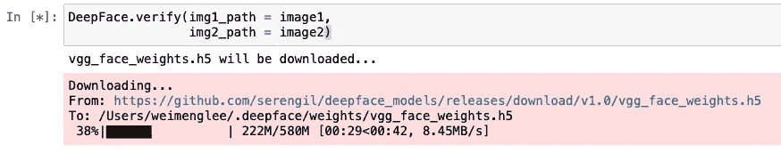
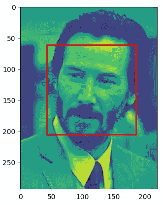
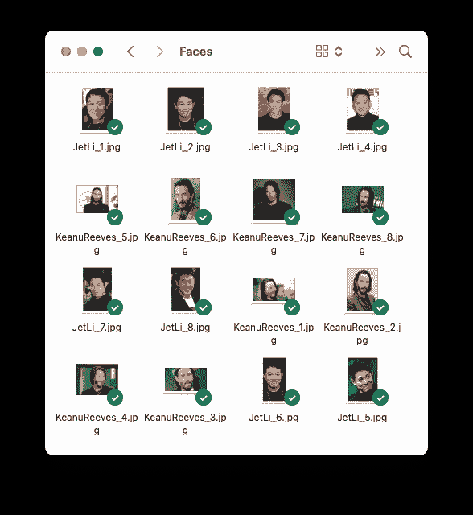
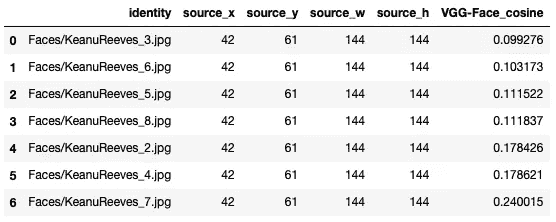
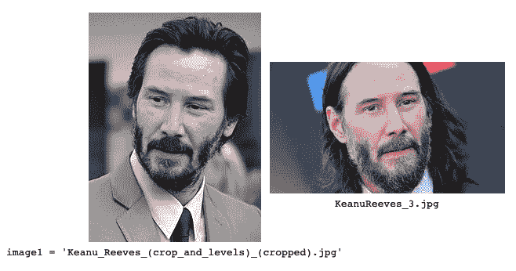

# 使用 DeepFace 进行面部识别

> 原文：[`towardsdatascience.com/using-deepface-for-face-recognition-5f8d1e43f2a6`](https://towardsdatascience.com/using-deepface-for-face-recognition-5f8d1e43f2a6)

## 了解如何在不需要训练自己的模型的情况下进行面部识别

[](https://weimenglee.medium.com/?source=post_page-----5f8d1e43f2a6--------------------------------)[](https://towardsdatascience.com/?source=post_page-----5f8d1e43f2a6--------------------------------) [Wei-Meng Lee](https://weimenglee.medium.com/?source=post_page-----5f8d1e43f2a6--------------------------------)

·发布于 [Towards Data Science](https://towardsdatascience.com/?source=post_page-----5f8d1e43f2a6--------------------------------) ·10 分钟阅读·2023 年 4 月 18 日

--


图片由 [fran innocenti](https://unsplash.com/es/@frani?utm_source=medium&utm_medium=referral) 提供，来源于 [Unsplash](https://unsplash.com/?utm_source=medium&utm_medium=referral)

在我之前关于面部检测的文章中，我讨论了如何使用 OpenCV 在你的网络摄像头中检测面部：

[](/face-detection-using-python-the-precursor-to-face-recognition-316ded4d116f?source=post_page-----5f8d1e43f2a6--------------------------------) ## 使用 Python 进行面部检测 — 面部识别的前奏

### 通过使用你的网络摄像头检测你的面部，享受 Python 的乐趣

towardsdatascience.com

检测面部是你通常首先执行的步骤，之后是 *面部识别*。

> 面部识别是将数字图像或视频帧中的人脸与面部数据库中的人脸进行匹配的过程。

有几种深度学习模型可以用来进行面部识别，但所有这些都需要你具备一些神经网络的知识，并且需要使用你自己的数据集进行训练。对于那些想进行面部识别但不想深入了解神经网络工作原理的人，有一个真正简化面部识别的 API — **DeepFace**。

# 什么是 DeepFace？

DeepFace 是一个轻量级的面部识别和面部属性分析（年龄、性别、情感和种族）框架（API），用于 Python。它本质上是一个用于识别面部的先进模型的封装器。它可以使用以下预训练模型：

+   VGG-Face（默认）

+   Google FaceNet

+   OpenFace

+   Facebook DeepFace

+   DeepID

+   ArcFace

+   Dlib

+   SFace

简而言之，DeepFace 允许你使用预训练的模型来识别自己的一组面孔，而无需创建和训练自己的模型。

在这篇文章中，我将向你介绍 DeepFace 的一些酷炫功能以及如何将面部识别融入你的项目中。

# 面部检测/识别的伦理考虑

尽管识别面孔的能力确实很酷，但它确实有很多伦理影响。在你在项目中实施面部识别之前，需要注意几个问题。关注点包括**隐私**（面部检测可以在未经同意的情况下追踪人们的活动）、**偏见**（面部识别可能对不同种族、性别或年龄的个人存在偏见）和**滥用**（捕获的面孔可能会用于其他非法用途或恶意目的）。因此，虽然这篇文章着重于面部识别的技术能力，但在实施之前，你应仔细考虑道德和伦理影响。

这里有一些低风险的项目，可以实现面部识别：

+   **考勤追踪** — 你可以在学校或工作场所使用面部识别来进行考勤。

+   **个性化** — 使用面部识别来个性化服务。一个很好的例子是娱乐服务，如根据用户的观看历史推荐特定的电视节目。

+   **安全性** — 使用面部识别解锁非关键系统，如智能手机和计算机。

然而，在某些应用中使用面部识别具有严重的道德影响。以下是一些示例：

+   **执法** — 尽管面部识别对执法有用，但对其不准确性和偏见有一些严重的担忧。

+   **监控** — 在一些国家，面部识别技术被用于监控和追踪公民，特别是异议人士。一些公司也使用面部识别来监控员工的生产力，这直接侵犯了他们的隐私。

以下是一些你可以阅读的文章，以了解更多关于面部识别的法律和道德问题：

+   **美国的面部识别：隐私问题和法律发展** — [`www.asisonline.org/security-management-magazine/monthly-issues/security-technology/archive/2021/december/facial-recognition-in-the-us-privacy-concerns-and-legal-developments/`](https://www.asisonline.org/security-management-magazine/monthly-issues/security-technology/archive/2021/december/facial-recognition-in-the-us-privacy-concerns-and-legal-developments/)

+   **与面部识别软件相关的隐私和安全问题** — [`www.techrepublic.com/article/privacy-and-security-issues-associated-with-facial-recognition-software/`](https://www.techrepublic.com/article/privacy-and-security-issues-associated-with-facial-recognition-software/)

+   **10 个关注面部识别技术的理由** — [`www.privacycompliancehub.com/gdpr-resources/10-reasons-to-be-concerned-about-facial-recognition-technology/`](https://www.privacycompliancehub.com/gdpr-resources/10-reasons-to-be-concerned-about-facial-recognition-technology/)

# 安装 DeepFace

安装 DeepFace 相对简单——如果你使用的是 Mac。对于 Windows，需要做一些额外的工作。

我将为你演示在 macOS 和 Windows 上安装 DeepFace 的步骤。

## 对于 macOS

对于 macOS，只需在 Jupyter Notebook 中运行以下命令以安装 `cmake`、`dlib` 和 `deepface`：

```py
!pip install cmake
!pip install dlib
!pip install deepface
```

完成后，你就可以开始使用 DeepFace 了。

## 对于 Windows

对于 Windows，你需要执行一些步骤：

+   从 [`cmake.org/download/`](https://cmake.org/download/) 下载 **CMake** 并运行安装程序。

> 确保在安装过程中将路径环境变量添加到其 bin 目录，例如：**C:/ProgramFiles/cmake/bin** *在安装过程中*

+   从 [`visualstudio.microsoft.com/visual-cpp-build-tools/`](https://visualstudio.microsoft.com/visual-cpp-build-tools/) 下载 **Visual Studio Build Tools** 并运行安装程序。

+   检查 **C++ 构建工具** 并点击 **安装**：


所有图像均由作者提供

> 上述步骤可能需要一点时间。现在可以去休息一下。

+   最后，在 Jupyter Notebook 中运行以下命令：

```py
!pip install dlib
!pip install deepface
```

完成后，你就可以开始使用 DeepFace 了。

# 使用 DeepFace

要使用 DeepFace，首先导入它：

```py
from deepface import DeepFace
```

> 我在本文中使用 Jupyter Notebook。

## 准备图像

我打算下载并准备一些图像，以便我可以用 DeepFace 进行测试。首先，下载以下 *基努·里维斯* 的图像，并将其保存到与你的 Jupyter Notebook 相同的目录中：



来源：[`en.wikipedia.org/wiki/Keanu_Reeves#/media/File:Keanu_Reeves_(crop_and_levels)_(cropped).jpg`](https://en.wikipedia.org/wiki/Keanu_Reeves#/media/File:Keanu_Reeves_(crop_and_levels)_(cropped).jpg)

然后，创建一个名为 `image1` 的变量，并将图像的文件名赋给它：

```py
image1 = 'Keanu_Reeves_(crop_and_levels)_(cropped).jpg'
```

同样，对以下图像也进行此操作：



来源：[`en.wikipedia.org/wiki/Keanu_Reeves#/media/File:Reuni%C3%A3o_com_o_ator_norte-americano_Keanu_Reeves_(46806576944)_(cropped).jpg`](https://en.wikipedia.org/wiki/Keanu_Reeves#/media/File:Reuni%C3%A3o_com_o_ator_norte-americano_Keanu_Reeves_(46806576944)_(cropped).jpg)

```py
image2 = 'Reunião_com_o_ator_norte-americano_Keanu_Reeves_(46806576944)_(cropped).jpg'
```


来源：[`en.wikipedia.org/wiki/Jet_Li#/media/File:Jet_Li_2009_(cropped).jpg`](https://en.wikipedia.org/wiki/Jet_Li#/media/File:Jet_Li_2009_(cropped).jpg)

```py
image3 = 'Jet_Li_2009_(cropped).jpg'
```


来源：[`en.wikipedia.org/wiki/Denzel_Washington#/media/File:Denzel_Washington_2018.jpg`](https://en.wikipedia.org/wiki/Denzel_Washington#/media/File:Denzel_Washington_2018.jpg)

```py
image4 = 'Denzel_Washington_2018.jpg'
```


来源: [`en.wikipedia.org/wiki/Smile#/media/File:Smiling_girl.jpg`](https://en.wikipedia.org/wiki/Smile#/media/File:Smiling_girl.jpg)

```py
image5 = 'Smiling_girl.jpg'
```

## 比较面孔

现在，让我们使用 DeepFace 来比较两张图像，以查看它们是否包含同一个人的面孔。为此，你可以使用`verify()`函数：

```py
DeepFace.verify(img1_path = image1,  # Keanu Reeves
                img2_path = image2)  # Keanu Reeves
```

第一次运行 DeepFace 时，它会将预训练模型的权重（默认使用 VGG-Face 模型）下载到你的计算机上：



权重下载完成后，DeepFace 将返回如下结果：

```py
{'verified': True,
 'distance': 0.17842618501190277,
 'threshold': 0.4,
 'model': 'VGG-Face',
 'detector_backend': 'opencv',
 'similarity_metric': 'cosine',
 'facial_areas': {'img1': {'x': 42, 'y': 61, 'w': 144, 'h': 144},
  'img2': {'x': 73, 'y': 57, 'w': 103, 'h': 103}},
 'time': 0.27}
```

`verified`键的值指示两张面孔是否相同。`distance`键的值是两个面部向量之间的距离（值越小，两个面孔越相似）。`threshold`键的值设置了`distance`值的解释阈值——小于 0.4 的值会使`verified`键设置为`True`。`facial_areas`键包含了两张图像中面孔的位置。

让我们尝试比较另外两张图像——`image1`和`image3`：

```py
DeepFace.verify(img1_path = image1,   # Keanu Reeves
                img2_path = image3)   # Jet Li
```

毫不意外，DeepFace 检测到这两个面孔是不同的：

```py
{'verified': False,
 'distance': 0.4034869302977028,
 'threshold': 0.4,
 'model': 'VGG-Face',
 'detector_backend': 'opencv',
 'similarity_metric': 'cosine',
 'facial_areas': {'img1': {'x': 42, 'y': 61, 'w': 144, 'h': 144},
  'img2': {'x': 20, 'y': 49, 'w': 164, 'h': 164}},
 'time': 0.27}
```

## 嵌入

嵌入是表示面部图像的多维向量。DeepFace 允许你使用`represent()`函数来查找这些嵌入：

```py
embeddings = DeepFace.represent(img_path = image1)  # Keanu Reeves
embeddings
```

`image1`的嵌入如下：

```py
[{'embedding': [0.00948819238692522,
   -0.010876820422708988,
   -0.0013923903461545706,
   0.01534500066190958,
   ...
   -0.014694824814796448,
   -0.015208861790597439,
   0.005312952678650618,
   ...],
  'facial_area': {'x': 42, 'y': 61, 'w': 144, 'h': 144}}]
```

根据你使用的预训练模型的不同，`embedding`键的值的大小会有所不同。对于 VGG-Face，面部图像被表示为 2622 维的向量。更有趣的是`facial_area`键的值，它包含了图像中面部的位置。

以下代码片段显示了基努·里维斯的图像（`image1`）以及绘制在检测到的面部区域周围的矩形：

```py
import matplotlib.pyplot as plt
import matplotlib.patches as patches
from PIL import Image

im = Image.open(image1)
fig, ax = plt.subplots()

# display the image
ax.imshow(im)

# draw a rectangle around the face
face_coord = embeddings[0]['facial_area']
rect = patches.Rectangle((face_coord['x'], face_coord['y']), 
                         face_coord['w'], face_coord['h'], 
                         linewidth = 2, 
                         edgecolor = 'r', 
                         facecolor = 'none')

# add the patch to the axes
ax.add_patch(rect)
```



## 从一组面孔中找到一个面孔

DeepFace 最令人兴奋的功能之一是能够将图像与文件夹中的一组图像进行比较。DeepFace 将告诉你哪些图像与提供的图像最为相似。这本质上是*面部识别*。

为了展示这个功能的强大，我在与 Jupyter Notebook 相同的文件夹中创建了一个名为**Faces**的新文件夹，并用一些*李连杰*和*基努·里维斯*的图像填充了它：



然后我调用`find()`函数并传入`image1`：

```py
DeepFace.find(img_path = image1,    # the image to compare against
              db_path = "Faces",    # folder containing all the images
              enforce_detection = False)[0]
```

> 如果`*find()*`函数发现 Faces 文件夹中的图像不包含任何面孔，它将引发异常。为了防止这种情况发生，请将`enforce_detection`参数设置为`False`。

`find()`函数返回一个 Pandas DataFrame 的列表，因此你需要使用 0 索引来获取第一个 DataFrame：



数据框包含与您搜索的图像最相似的图像文件名列表。在这个例子中，最匹配的是**KeanuReeves_3.jpg**：



> 数据框根据 VGG-Face_cosine 排序（值越小，匹配度越高）。

请注意，当你第一次调用`find()`函数时，将创建一个名为**representations_vgg_face.pkl**的表示文件，并将其存储在**Faces**文件夹中。如果你向**Faces**文件夹中添加新图像，请记得删除**representations_vgg_face.pkl**文件。

使用`find()`函数，你可以在不训练任何模型的情况下进行人脸识别——只需创建一个包含你想识别的面孔的文件夹（每个人应尽可能多地提供图片），然后就完成了，你就拥有了一个人脸识别模型！

## 分析面孔

除了比较面孔和从面孔文件夹中查找面孔，DeepFace 还允许你分析面孔的各种特征，如年龄、性别、情感和种族：

```py
DeepFace.analyze(img_path = image4, 
                 actions = ["age", "gender", "emotion", "race"])
```

上述声明分析了*丹泽尔·华盛顿*（`image4`）的图像，并且相当准确地预测了图像中的面孔是：

+   feeling sad

+   一名黑人男性

以下是`analyze()`函数返回的结果：

```py
[{'age': 35,
  'region': {'x': 31, 'y': 46, 'w': 117, 'h': 117},
  'gender': {'Woman': 0.015357557276729494, 'Man': 99.98464584350586},
  'dominant_gender': 'Man',
  'emotion': {'angry': 0.3038950626725033,
   'disgust': 3.667220231060474e-11,
   'fear': 2.3939014472247897,
   'happy': 1.2440780556642484e-05,
   'sad': 87.49081939349405,
   'surprise': 6.846103949403675e-05,
   'neutral': 9.81130493418037},
  'dominant_emotion': 'sad',
  'race': {'asian': 7.334453304675418,
   'indian': 3.1661530981155095,
   'black': 85.50387534522267,
   'white': 0.09932484836949994,
   'middle eastern': 0.03912873741168454,
   'latino hispanic': 3.8570622418559934},
  'dominant_race': 'black'}]
```

让我们尝试分析另一张图片，这次是一个微笑的女孩的图片（`image5`）：

```py
DeepFace.analyze(img_path = image5, 
                 actions = ["age", "gender", "emotion", "race"])
```

结果相当准确：

```py
[{'age': 26,
  'region': {'x': 377, 'y': 140, 'w': 558, 'h': 558},
  'gender': {'Woman': 99.66641068458557, 'Man': 0.3335847519338131},
  'dominant_gender': 'Woman',
  'emotion': {'angry': 1.31229280062393e-10,
   'disgust': 2.1887400676449618e-26,
   'fear': 3.8267408134914985e-22,
   'happy': 99.99999403953517,
   'sad': 2.6514247764822096e-14,
   'surprise': 2.245952144279152e-17,
   'neutral': 6.961274993922523e-06},
  'dominant_emotion': 'happy',
  'race': {'asian': 3.0054475969609733,
   'indian': 4.536693711482729,
   'black': 0.7851633247927815,
   'white': 41.17996289491211,
   'middle eastern': 23.323961892600284,
   'latino hispanic': 27.168768902870287},
  'dominant_race': 'white'}]
```

## 更改预训练模型

如果你想更改 DeepFace 使用的基础预训练模型，你可以在`verify()`函数中使用`model_name`参数指定你想使用的模型：

```py
models = ["VGG-Face", "Facenet", "OpenFace", "DeepFace", "ArcFace"]
DeepFace.verify(image1, 
                image2, 
                model_name = models[1])  # change to Facenet
```

> 现在，所选模型的权重将被下载到你的计算机上。

`represent()`函数也是如此：

```py
embeddings = DeepFace.represent(img_path = image1,
                                model_name = models[1])
```

以及`find()`函数：

```py
DeepFace.find(img_path = image1, 
              db_path = "Faces",
              model_name = models[1],
              enforce_detection = False)[0]
```

**如果你喜欢阅读我的文章，并且这些文章对你的职业/学习有所帮助，请考虑成为 Medium 会员。每月费用为 5 美元，这将为你提供对 Medium 上所有文章（包括我的文章）的无限制访问权限。如果你使用以下链接注册，我将获得一小部分佣金（对你没有额外费用）。你的支持意味着我可以花更多时间撰写像这样的文章。**

[](https://weimenglee.medium.com/membership?source=post_page-----5f8d1e43f2a6--------------------------------) [## 通过我的推荐链接加入 Medium - Wei-Meng Lee

### 阅读 Wei-Meng Lee 的每一个故事（以及 Medium 上成千上万其他作者的故事）。你的会员费直接支持…

weimenglee.medium.com](https://weimenglee.medium.com/membership?source=post_page-----5f8d1e43f2a6--------------------------------)

# 总结

使用 DeepFace 使得进行面部识别变得非常简单——无需明确的训练，你只需将面部图像放入一个特定的文件夹，DeepFace 就会完成识别特定面孔的繁重工作。DeepFace 的缺点是返回结果需要一点时间。如果你想使用 DeepFace 进行实时面部识别，它可能不是最佳选择。然而，仍然有很多应用可以使用 DeepFace 构建。如果你在当前项目中使用 DeepFace，请务必与我们分享你是如何使用 DeepFace 的，或你打算如何使用它。
