# 使用 DuckDB 与 Polars

> 原文：[`towardsdatascience.com/using-duckdb-with-polars-e15a865e48a3`](https://towardsdatascience.com/using-duckdb-with-polars-e15a865e48a3)

## 了解如何使用 SQL 查询你的 Polars DataFrame

[](https://weimenglee.medium.com/?source=post_page-----e15a865e48a3--------------------------------)[](https://towardsdatascience.com/?source=post_page-----e15a865e48a3--------------------------------) [Wei-Meng Lee](https://weimenglee.medium.com/?source=post_page-----e15a865e48a3--------------------------------)

·发表于 [Towards Data Science](https://towardsdatascience.com/?source=post_page-----e15a865e48a3--------------------------------) ·阅读时间 6 分钟·2023 年 4 月 14 日

--


[Hans-Jurgen Mager](https://unsplash.com/@hansjurgen007?utm_source=medium&utm_medium=referral) 在 [Unsplash](https://unsplash.com/?utm_source=medium&utm_medium=referral) 上的照片

在我之前关于数据分析的几篇文章中，我讨论了两个在业界逐渐受到关注的重要新兴库：

+   **DuckDB** — 你可以使用 SQL 语句在内存中查询数据集。

+   **Polars** — 与久负盛名的 Pandas 库相比，更高效的数据框库。

[](https://levelup.gitconnected.com/using-duckdb-for-data-analytics-bab3e3ff032c?source=post_page-----e15a865e48a3--------------------------------) [## 使用 DuckDB 进行数据分析

### 了解如何使用 SQL 进行数据分析

[levelup.gitconnected.com](https://levelup.gitconnected.com/using-duckdb-for-data-analytics-bab3e3ff032c?source=post_page-----e15a865e48a3--------------------------------) [](/getting-started-with-the-polars-dataframe-library-6f9e1c014c5c?source=post_page-----e15a865e48a3--------------------------------) ## 开始使用 Polars DataFrame 库

### 了解如何使用 Polars DataFrame 库操作表格数据（并替代 Pandas）

towardsdatascience.com

那么，结合这两个库的优势会怎样呢？

> 实际上，你可以通过 DuckDB 直接使用 SQL 语句查询 Polars 数据框。

那么，使用 SQL 查询 Polars 数据框有什么好处呢？尽管使用起来很方便，但操作 Polars 数据框仍然需要一些练习和相对陡峭的学习曲线。但由于大多数开发者已经熟悉 SQL，直接使用 SQL 操作数据框是否更加方便呢？采用这种方法，开发者可以兼得两全其美：

+   使用所有各种函数查询 Polars 数据框的能力，或者

+   在数据提取时，使用 SQL 进行更自然、更简单的操作

在这篇文章中，我将给你一些如何通过 DuckDB 使用 SQL 查询 Polars 数据框的示例。

# 安装 Polars 和 DuckDB

对于这篇文章，我正在使用 Jupyter Notebook。确保你已经通过以下命令安装了 Polars 和 DuckDB：

```py
!pip install polars
!pip install duckdb
```

# 创建 Polars 数据框

要开始使用，让我们手动创建一个 Polars 数据框：

```py
import polars as pl

df = pl.DataFrame(
     {
         'Model': ['iPhone X','iPhone XS','iPhone 12',
                   'iPhone 13','Samsung S11',
                   'Samsung S12','Mi A1','Mi A2'],
         'Sales': [80,170,130,205,400,30,14,8],     
         'Company': ['Apple','Apple','Apple','Apple',
                     'Samsung','Samsung','Xiao Mi',
                     'Xiao Mi'],
     })
df
```

数据框的样子如下：

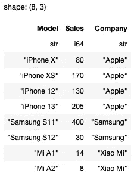

所有图片由作者提供

比如，你现在想找出所有苹果公司销售量超过 80 的手机。你可以使用 Polars 中的 `filter()` 函数，如下所示：

```py
df.filter(
    (pl.col('Company') == 'Apple') &
    (pl.col('Sales') > 80)
)
```

结果如下所示：

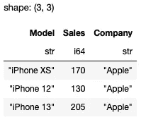

# 在 Polars 数据框上使用 SQL

现在让我们执行与前一节相同的查询，只不过这次我们将使用 DuckDB 和 SQL 语句。不过首先，让我们选择数据框中的所有行：

```py
import duckdb

result = duckdb.sql('SELECT * FROM df')
result
```

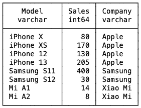

> 你可以直接在 SQL 语句中引用 `df` 数据框。

使用 DuckDB 时，你可以通过 `sql()` 函数发出 SQL 语句。或者，`query()` 函数也可以使用：

```py
result = duckdb.query('SELECT * FROM df')
```

`result` 变量是一个 `duckdb.DuckDBPyRelation` 对象。使用这个对象，你可以执行许多不同的任务，例如：

+   计算 **销售额** 列的平均值：

```py
result.mean('Sales')
```

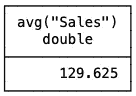

+   描述数据框：

```py
result.describe()
```

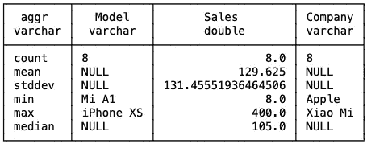

+   对数据框中的列应用缩放函数：

```py
result.apply("max", 'Sales,Company')
```

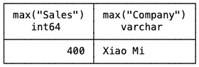

+   重新排序数据框：

```py
result.order('Sales DESC')
```

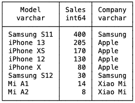

但最简单的方式是直接使用 SQL 查询 Polars 数据框。

例如，如果你想获取所有销售量大于 80 的行，只需使用 `sql()` 函数和以下 SQL 语句：

```py
duckdb.sql('SELECT * FROM df WHERE Sales >80').pl()
```

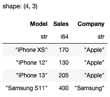

> `pl()` 函数将 `duckdb.DuckDBPyRelation` 对象转换为 Polars 数据框。如果你想将其转换为 Pandas 数据框，请使用 `df()` 函数。

如果你想获取所有型号名称以“*iPhone*”开头的行，请使用以下 SQL 语句：

```py
duckdb.sql("SELECT * FROM df WHERE Model LIKE 'iPhone%'").pl()
```

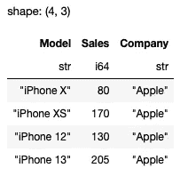

如果你想获取 *Apple* 和 *Xiao Mi* 的所有设备，请使用以下 SQL 语句：

```py
duckdb.sql("SELECT * FROM df WHERE Company = 'Apple' OR Company ='Xiao Mi'").pl()
```

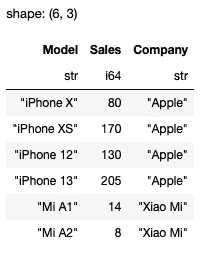

使用 DuckDB 与 Polars 数据框的真正强大之处在于你想从多个数据框中查询时。考虑以下来自 **2015 年航班延误** 数据集的三个 CSV 文件：

> **2015 年航班延误数据集** — [`www.kaggle.com/datasets/usdot/flight-delays`](https://www.kaggle.com/datasets/usdot/flight-delays)。**许可证 —** [CC0: 公开领域](https://creativecommons.org/publicdomain/zero/1.0/)

+   flights.csv

+   airlines.csv

+   airports.csv

让我们使用 Polars 加载它们：

```py
import polars as pl

df_flights = pl.scan_csv('flights.csv')
df_airlines = pl.scan_csv('airlines.csv')
df_airports = pl.scan_csv('airports.csv')

display(df_flights.collect().head())
display(df_airlines.collect().head())
display(df_airports.collect().head())
```

> 上述语句使用了惰性求值来加载这三个 CSV 文件。这确保了在优化所有查询之前，不会对数据框执行任何查询。`collect()` 函数强制 Polars 将 CSV 文件加载到数据框中。

这里是 `df_flights`、`df_airlines` 和 `df_airports` 数据框的样子：

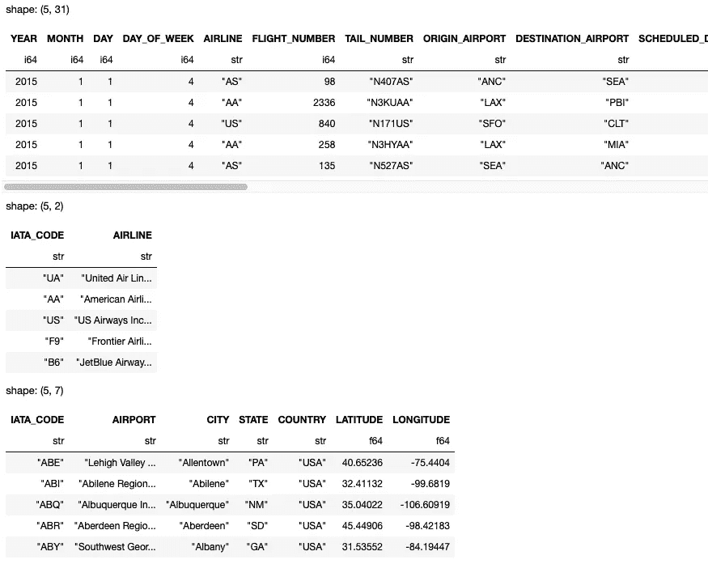

假设你想统计一家航空公司延误的次数，同时显示每家航空公司的名称，这里是你可以使用的 SQL 语句，使用 `df_airlines` 和 `df_flights` 数据框：

```py
duckdb.sql('''
    SELECT 
        count(df_airlines.AIRLINE) as Count,
        df_airlines.AIRLINE
    FROM df_flights, df_airlines
    WHERE df_airlines.IATA_CODE = df_flights.AIRLINE AND df_flights.ARRIVAL_DELAY > 0
    GROUP BY df_airlines.AIRLINE
    ORDER BY COUNT DESC
''')
```

结果如下：

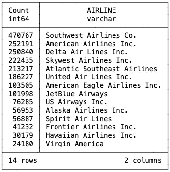

如果你想统计每个州的机场数量并按降序排序，可以使用以下 SQL 语句：

```py
duckdb.sql('''
    SELECT STATE, Count(*) as AIRPORT_COUNT
    FROM df_airports 
    GROUP BY STATE
    ORDER BY AIRPORT_COUNT DESC
''')
```

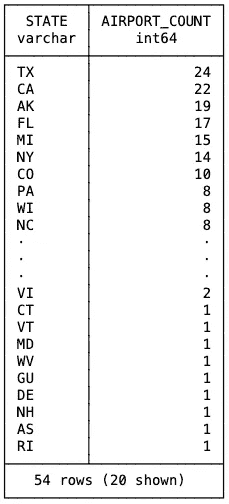

最后，假设你想知道哪家航空公司有最高的平均延误时间。你可以使用以下 SQL 语句计算各种统计数据，如 *最小到达延误*、*最大到达延误*、*平均到达延误* 和 *到达延误的标准差*：

```py
duckdb.sql('''
    SELECT AIRLINE, MIN(ARRIVAL_DELAY), MAX(ARRIVAL_DELAY), 
        MEAN(ARRIVAL_DELAY), stddev(ARRIVAL_DELAY)
    FROM df_flights 
    GROUP BY AIRLINE
    ORDER BY MEAN(ARRIVAL_DELAY)
''')
```

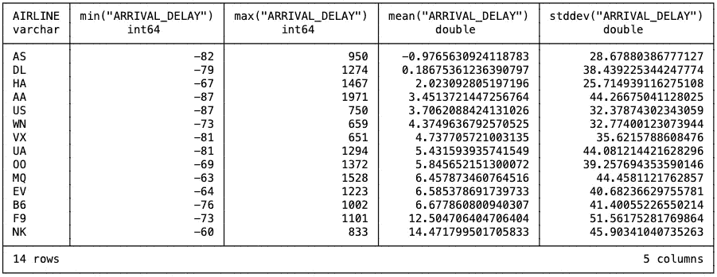

根据平均到达延误，我们可以看到 AS 航空公司是延误最短的航空公司（由于值为负，这意味着大多数情况下它会更早到达！），而 NK 航空公司是延误最长的航空公司。想知道 AS 航空公司是什么吗？尝试使用你刚学到的知识！我将把它留作练习，答案在本文末尾。

**如果你喜欢阅读我的文章并且它对你的职业/学习有所帮助，请考虑注册成为 Medium 会员。每月仅需 5 美元，你将获得对 Medium 上所有文章（包括我的文章）的无限制访问。如果你通过以下链接注册，我将获得一小部分佣金（对你没有额外费用）。你的支持意味着我可以花更多时间写更多类似的文章。**

[## 通过我的推荐链接加入 Medium - Wei-Meng Lee](https://weimenglee.medium.com/membership?source=post_page-----e15a865e48a3--------------------------------)

### 阅读 Wei-Meng Lee 的每个故事（以及 Medium 上其他成千上万的作家的故事）。你的会员费直接支持……

[weimenglee.medium.com](https://weimenglee.medium.com/membership?source=post_page-----e15a865e48a3--------------------------------)

# 总结

在这篇简短的文章中，我展示了如何将 DuckDB 和 Polars 结合使用来查询你的数据框。利用这两个库，你可以享受最好的两个世界——使用熟悉的查询语言（即 SQL）来查询高效的数据框。快用你自己的数据集试试看，并与我们分享它是如何帮助你的数据分析过程的。

*问答题答案：*

```py
duckdb.sql("SELECT AIRLINE from df_airlines WHERE IATA_CODE = 'AS'")
```
