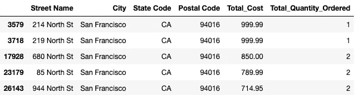

# 使用枚举和 functools 升级你的 Pandas 数据管道

> 原文：[`towardsdatascience.com/using-enums-and-functools-to-upgrade-your-pandas-data-pipelines-d51ca1418fe2`](https://towardsdatascience.com/using-enums-and-functools-to-upgrade-your-pandas-data-pipelines-d51ca1418fe2)

## 编程

## 通过两个逐步示例，看看如何更高效地编程以处理你的数据

[](https://byrondolon.medium.com/?source=post_page-----d51ca1418fe2--------------------------------)[](https://towardsdatascience.com/?source=post_page-----d51ca1418fe2--------------------------------) [Byron Dolon](https://byrondolon.medium.com/?source=post_page-----d51ca1418fe2--------------------------------)

·发布于[Towards Data Science](https://towardsdatascience.com/?source=post_page-----d51ca1418fe2--------------------------------) ·12 分钟阅读·2023 年 6 月 9 日

--


图片使用了我才华横溢的姐姐[ohmintyartz](https://www.instagram.com/ohmintyartz/)的许可。

你可能在创建数据管道以处理原始数据时曾使用过 Pandas。编写代码来过滤、分组和执行数据计算只是构建数据管道和 ETL 过程的第一步。

在大规模数据处理时，除了这些，我们还应该编写**功能性**且**易于阅读和维护**的代码。

有许多方法可以改进你现有的数据管道，比如添加高效的日志记录、包括数据验证，甚至使用除 Pandas 之外的新库，如 PySpark 和 Polars。

此外，你还可以不同地结构化你用于处理数据的实际代码。这意味着不是为了提高管道的性能，而是专注于编写易于修改和迭代的代码。

在这篇文章中，我们将通过两个简单的例子来看看如何做到这一点，特别是通过使用**枚举**和**functools**。

随意在你选择的笔记本或 IDE 中跟随操作！你可以从 Kaggle[这里](https://www.kaggle.com/datasets/deepanshuverma0154/sales-dataset-of-ecommerce-electronic-products?resource=download)下载数据集，CC0 1.0 通用（CC0 1.0）公共领域献身许可下免费使用。然后导入并运行以下内容，我们可以开始了！

```py
import pandas as pd
from pandas import DataFrame
import numpy as np

from functools import reduce
from enum import Enum

FILE_PATH = "/Updated_sales.csv"
CHUNK_SIZE = 1000

def read_raw_data(file_path: str, chunk_size: int=1000) -> DataFrame:
    csv_reader = pd.read_csv(file_path, chunksize=chunk_size)
    processed_chunks = []

    # append the processed chunk to the list
    for chunk in csv_reader:
        chunk = chunk.loc[chunk["Order ID"] != "Order ID"].dropna()
        processed_chunks.append(chunk)

    # concatenate the processed chunks into a single DataFrame
    return pd.concat(processed_chunks, axis=0)

df = read_raw_data(file_path=FILE_PATH)
```

# 使用枚举更好地结构化你的数据管道

## 对枚举的快速介绍

你可能首先会想“什么是枚举”？

枚举，简称“enum”，是“一组与唯一值绑定的符号名称（成员）” ([Python docs, 2023](https://docs.python.org/3/library/enum.html))。实际来说，这意味着你可以在一个主要的“类”下定义和使用一组相关的变量。

一个简单的例子是有一个枚举类“Color”，其中包含“Red”，“Green”和“Blue”等名称，每当你想引用特定颜色时都可以使用它们。

接下来，你可能会想，如果你可以直接在数据处理管道中调用所需的名称，定义一些变量在单独的枚举类中还有什么意义呢？

枚举有一些关键的好处：

+   定义枚举可以让你将相关的常量组织在一个（或多个）类中，这些类可以作为你在管道中调用的维度、度量和其他常量的真实来源；

+   使用枚举将帮助你避免在数据管道中传递无效值，前提是你正确地定义和维护了枚举类；

+   枚举允许用户使用标准化的数据点和常量集，这在多人基于一个主要数据源进行聚合或创建模型时非常有用（有助于避免在原始数据源中对同一列有多个定义或别名）。

听起来有点抽象，所以让我们看看在标准预处理管道中如何实际应用枚举的例子。

## 在你的数据处理管道中使用枚举

我们已经有了初始的 DataFrame，所以让我们开始创建一个函数，通过拆分购买地址来向数据中添加更多列。

```py
def split_purchase_address(df_to_process: DataFrame) -> DataFrame:
    df_address_split = df_to_process["Purchase Address"].str.split(",", n=3, expand=True)
    df_address_split.columns = ["Street Name", "City", "State and Postal Code"]

    df_state_postal_split = (
        df_address_split["State and Postal Code"]
        .str.strip()
        .str.split(" ", n=2, expand=True)
    )
    df_state_postal_split.columns = ["State Code", "Postal Code"]

    return pd.concat([df_to_process, df_address_split, df_state_postal_split], axis=1)
```

接下来，我们可以通过使用 Pandas 的原生`pipe`方法将其应用于现有的表，例如，我们在 DataFrame 上调用 pipe 并将函数名作为参数传递。

```py
processed_df = df.pipe(split_purchase_address)
```


接下来，你会看到我们拥有的数据仍然处于非常详细的层次，订单 ID 是表的主键。当我们想要对数据进行聚合以进行进一步分析时，可以使用 Pandas 中的`groupby`方法来实现。

在 Pandas 中，你可能会看到一些代码用于在一组列上对数据进行分组，然后对其中一个维度（在这个例子中我们将使用订单 ID）进行聚合计数，看起来可能是这样的：

```py
# groupby normally
grouped_df = (
    processed_df
    .groupby(
        ["Product", "Quantity Ordered", "Street Name", "City", "State Code", "Postal Code"]
    )
    ["Order ID"]
    .count()
    .reset_index()
    .sort_values("Order ID", ascending=False)
    .rename({"Order ID": "Count of Order IDs"}, axis=1)
)
```

结果是一个新的 DataFrame，像这样：


在这个简单的例子中，按六列进行分组并不太困难，我们可以将这些列的列表直接传递给`groupby`方法。然而，这有一些缺点：

+   如果我们处理的是一个更大的数据集，并且希望按 20 列进行分组怎么办？

+   如果最终用户提出了新的需求，我们需要调整具体的列进行分组怎么办？

+   如果底层表发生变化，列的名称或别名发生变化怎么办？

我们可以通过在枚举类中定义列来部分解决这些问题。特别是对于这种情况，我们可以在一个新的类`SalesGroupByColumns`中定义这些与销售表相关的分组列，如下所示：

```py
class SalesGroupByColumns(Enum):
    PRODUCT = "Product"
    QUANTITY_ORDERED = "Quantity Ordered"
    STREET_NAME = "Street Name"
    CITY = "City"
    STATE_CODE = "State Code"
    POSTAL_CODE = "Postal Code"
```

我们在这里做的最终只是将列定义为新的 Enum 类中的常量（这是从`from enum import Enum`的导入中获得的）。

现在我们已经定义了这些新的枚举值，我们可以像这样访问枚举的各个成员：

```py
SalesGroupByColumns.PRODUCT
```


```py
SalesGroupByColumns.PRODUCT.value
```


只需调用枚举名称将返回枚举成员，并且在目标枚举上调用`value`让我们直接访问枚举成员的字符串值。现在，要将所有枚举成员放入我们可以传递给`groupby`的列表中，我们可以像这样使用列表推导式：

```py
[column.value for column in SalesGroupByColumns]
```


在将它们放入列表后，我们可以将这个输出分配给一个变量，然后将这个变量传递给我们的`groupby`方法，而不是直接传递原始的字符串列表：

```py
# groupby adjusted
groupby_columns = [column.value for column in SalesGroupByColumns]

grouped_df = (
    processed_df
    .groupby(groupby_columns)
    ["Order ID"]
    .count()
    .reset_index()
    .sort_values("Order ID", ascending=False)
    .rename({"Order ID": "Count of Order IDs"}, axis=1)
)

grouped_df.head()
```


我们得到了与之前相同的表格，但代码看起来稍微更干净。对于长期维护来说，这种做法的好处可以在你处理管道时体现出来。

例如，你可能会发现你想添加几个新的列，比如说如果你还想进行更多的特征工程，创建一个房屋号码和产品类别列，然后添加到分组中。你可以这样更新你的枚举类：

```py
# what's the benefit? adding new columns!

class SalesGroupByColumns(Enum):
    PRODUCT = "Product"
    QUANTITY_ORDERED = "Quantity Ordered"
    STREET_NAME = "Street Name"
    CITY = "City"
    STATE_CODE = "State Code"
    POSTAL_CODE = "Postal Code"
    HOUSE_NUMBER = "House Number"
    PRODUCT_CATEGORY = "Prouct Category"

# then you run the code same as before and it would still work
```

这样，你就不需要修改现有的处理代码，因为列表推导式会自动获取`SalesGroupByColumns`类中的所有值，并将其应用于你的聚合逻辑。

一个好的提示是，所有这些仅在你确切知道你在枚举类中定义了什么并仅按预期使用它们时才会有效。如果你在这里进行更改，并且你在几个不同的表中抓取所有这些列进行分组，重要的是要确保那是你打算做的。

否则，你可以在单独的类中定义你需要用于特定表的枚举集，或者如果有意义的话，在单独的列列表中（这样你仍然避免将原始字符串列表传递给`groupby`方法）。

## 在 Pandas 中使用枚举进行数据聚合

另一个例子是，假设我们有一个不同的情况，我们通过更改一些列的数据类型和创建一个新的总成本列来对数据进行一些额外的转换。我们可以像这样将其添加到之前的管道中：

```py
def convert_numerical_column_types(df_to_process: DataFrame) -> DataFrame:
    df_to_process["Quantity Ordered"] = df_to_process["Quantity Ordered"].astype(int)
    df_to_process["Price Each"] = df_to_process["Price Each"].astype(float)
    df_to_process["Order ID"] = df_to_process["Order ID"].astype(int)

    return df_to_process

def calculate_total_order_cost(df_to_process: DataFrame) -> DataFrame:
    df_to_process["Total Cost"] = df_to_process["Quantity Ordered"] * df_to_process["Price Each"]
    return df_to_process

processed_df = (
    df
    .pipe(split_purchase_address)
    .pipe(convert_numerical_column_types)
    .pipe(calculate_total_order_cost)
)
```


现在我们的 DataFrame 在订单 ID 级别上已经转换过来，接下来我们在一组新列上进行另一个分组，但这次对几个不同的度量进行聚合：

```py
# let's say we have a file now "SalesColumns.py"
# we can add to it

import numpy as np

class AddressColumns(Enum):
    STREET_NAME = "Street Name"
    CITY = "City"
    STATE_CODE = "State Code"
    POSTAL_CODE = "Postal Code"

class SalesMeasureColumns(Enum):
    TOTAL_COST = "Total Cost"
    QUANTITY_ORDERED = "Quantity Ordered"    

# then separately we can do the groupby
groupby_columns = [column.value for column in AddressColumns]

grouped_df = (
    processed_df
    .groupby(groupby_columns)
    .agg(
        Total_Cost=(SalesMeasureColumns.TOTAL_COST.value, np.sum),
        Total_Quantity_Ordered=(SalesMeasureColumns.QUANTITY_ORDERED.value, np.sum)
    )
    .reset_index()
    .sort_values("Total_Cost", ascending=False)
)
```


这里有几个关键点需要注意：

+   我们定义了一组新的枚举类：`AddressColumns` 和 `SalesMeasureColumns`。现在，对于一个不同的表格，如果我们想要专门按地址字段进行分组，我们可以定义 `groupby_columns` 列表来包括这些列，然后将其传递给转换后的 DataFrame 的 `groupby` 方法。

+   `SalesMeasureColumns` 类包括我们希望进行聚合的度量。将原始表格中的列名放入该类中意味着如果其他人也希望汇总成本和订购数量，他们会调用正确的列。

我们可以进一步在之前的管道中添加之前定义的链式管道和函数，并将此代码放入新函数中以收集列列表并聚合表格。这样，最终代码变得更容易阅读，并且随着时间的推移，可能更容易调试和记录。

对于聚合，总成本和订购数量在不同的表格、团队和最终用户中可能会有所不同。在 `SalesMeasuresColumns` 的枚举中定义它，意味着对于 Sales 表格和度量，所有用户都可以使用相同的定义对这些列进行聚合。

# 利用 functools 的 reduce 方法来简化你的数据过滤

现在，让我们来看看如何使用 functools 的 reduce 方法来改进数据过滤。

在 Pandas 中，过滤原始数据的常见方法是使用 `loc` 方法。例如，让我们写一些代码来过滤包含“North”的街道数据。

```py
grouped_df.loc[grouped_df["Street Name"].str.contains("North")]
```


我们的输出 DataFrame 现在只包括根据过滤器筛选的列。一般来说，在对特定问题进行分析或调整数据集以适应机器学习模型时，你可能希望对 DataFrame 应用多个过滤器。你可以这样使用 `loc` 方法应用多个过滤器：

```py
grouped_df.loc[
    (grouped_df["Street Name"].str.contains("North")) &
    (grouped_df["Postal Code"].str.contains("940")) &
    (grouped_df["Total_Cost"] < 1000)
]
```


接下来，就像之前优化代码时使用枚举一样，如果我们想要添加、编辑或删除一些过滤器会怎么样？来自最终用户的需求变化或从一些探索性数据分析中获得的新见解可能意味着你需要随着时间的推移调整过滤数据的方式。

与其继续在 `loc` 方法中添加更多的代码行，我们可以在一个变量中定义过滤器列表，然后稍后将其传递给 `loc`。

```py
filter_conditions = [
    grouped_df["Street Name"].str.contains("North"),
    grouped_df["Postal Code"].str.contains("940"),
    grouped_df["Total_Cost"] < 1000
]
```

然而，我们不能直接将这个列表传递给 `loc`。`loc` 中的多个条件接受的格式是由 DataFrame 的布尔掩码组成，通过 `&` 运算符分隔。

```py
# doesn't work -> you can't just pass a list into loc
df.loc[FILTER_CONDITIONS]

# format should look like this
df.loc[condition_1 & condition_2 & condition_3]
```

这就是 `functools.reduce` 方法发挥作用的地方。如何实现正确的格式可以在这里的示例中看到：

```py
# functools reduce
reduce(lambda x, y: f"{x} & {y}", ["condition_1", "condition_2", "condition_3"])
```


在这个简单的示例中，我们只是将一堆字符串组合在一起，以输出稍后在 `loc` 方法中需要写的内容。

functools 中的`reduce`方法允许你将函数和可迭代对象作为参数传递。`reduce`方法然后将函数应用于可迭代对象中的元素，逐步执行。这意味着它会对可迭代对象中的元素集合进行顺序操作。

在我们的例子中，我们有一个匿名`lambda`函数，它接受两个参数`x`和`y`，并使用 f-string 将它们结合起来，用`&`操作符分隔。这意味着首先函数会输出`condition_1 & condition_2`，然后将`condition_3`添加到第一个累计值中，结果就是`condition_1 & condition_2 & condition_3`。

现在，我们可以将这个 reduce 方法与函数和过滤条件传递给`loc`方法，而不是逐个将所有原始过滤条件传递给`loc`。

```py
grouped_df.loc[reduce(lambda x, y: x & y, filter_conditions)]
```



应用所有过滤器后的最终 DataFrame 如下所示。如果你想要添加另一个过滤器，只需将其添加到现有的`filter_conditions`变量中，其他代码保持不变。

这篇文章的重点是展示几种不同的代码结构方式，以提高代码的可读性和可维护性。虽然这些改变不一定会加快你的管道速度或改善内存使用，但考虑代码的易用性是很重要的。

这有两个好处：

1.  如果多人同时处理相同的原始数据，将列名和过滤器定义在一个集中位置意味着每个人都可以参考一个唯一的真实来源，避免出现不同的名称和逻辑却最终指代同一事物的情况；

1.  当处理包含变化需求的数据时，你只需在一个地方修复列名和逻辑即可加快开发时间。

希望你觉得这些改善数据管道的技巧有帮助。尝试一下这种数据处理结构，看看它是否适合你！

如果你喜欢我的内容，可以考虑关注我并通过下面的链接**注册成为 Medium 会员**。每月只需 5 美元，你将获得对 Medium 上所有内容的无限制访问。通过我的链接注册可以让我赚取少量佣金。如果你已经注册关注我，感谢你的支持！

[](https://byrondolon.medium.com/membership?source=post_page-----d51ca1418fe2--------------------------------) [## 通过我的推荐链接加入 Medium — Byron Dolon

### 作为 Medium 会员，你的一部分会员费用会支付给你阅读的作者，而你可以完全访问每个故事……

byrondolon.medium.com](https://byrondolon.medium.com/membership?source=post_page-----d51ca1418fe2--------------------------------)

> *更多内容：* *-* [*3 种高效的方式通过子字符串过滤 Pandas DataFrame 列*](https://medium.com/towards-artificial-intelligence/3-efficient-ways-to-filter-a-pandas-dataframe-column-by-substring-fc2993692141)
> 
> *-* [*5 条实用建议给有志于数据分析的新人*](https://byrondolon.medium.com/5-practical-tips-for-aspiring-data-analysts-9917006d4dae?sk=019edbddaca4d313665caafe4b747d26) *-* *使用 Python 中的堆叠条形图改进数据可视化* *- C**onditional Selection and Assignment With .loc in Pandas* *-* *5（以及半个）行代码用以理解 Pandas 中的数据*
