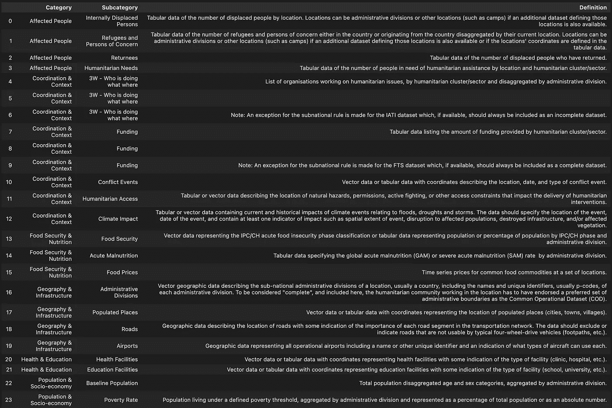
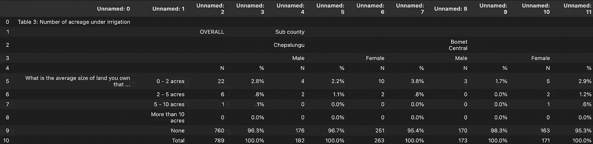
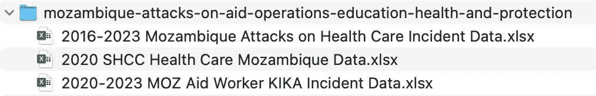

# 使用 GPT-3.5-Turbo 和 GPT-4 进行人道主义数据类别预测

> 原文：[`towardsdatascience.com/using-gpt-3-5-turbo-and-gpt-4-to-apply-text-defined-data-quality-checks-on-humanitarian-datasets-6f02219c693c?source=collection_archive---------5-----------------------#2023-03-29`](https://towardsdatascience.com/using-gpt-3-5-turbo-and-gpt-4-to-apply-text-defined-data-quality-checks-on-humanitarian-datasets-6f02219c693c?source=collection_archive---------5-----------------------#2023-03-29)

[](https://medium.com/@astrobagel?source=post_page-----6f02219c693c--------------------------------)[](https://towardsdatascience.com/?source=post_page-----6f02219c693c--------------------------------) [Matthew Harris](https://medium.com/@astrobagel?source=post_page-----6f02219c693c--------------------------------)

·

[关注](https://medium.com/m/signin?actionUrl=https%3A%2F%2Fmedium.com%2F_%2Fsubscribe%2Fuser%2F4a2cd25b8ff9&operation=register&redirect=https%3A%2F%2Ftowardsdatascience.com%2Fusing-gpt-3-5-turbo-and-gpt-4-to-apply-text-defined-data-quality-checks-on-humanitarian-datasets-6f02219c693c&user=Matthew+Harris&userId=4a2cd25b8ff9&source=post_page-4a2cd25b8ff9----6f02219c693c---------------------post_header-----------) 发表在[数据科学之道](https://towardsdatascience.com/?source=post_page-----6f02219c693c--------------------------------) · 23 分钟阅读 · 2023 年 3 月 29 日[](https://medium.com/m/signin?actionUrl=https%3A%2F%2Fmedium.com%2F_%2Fvote%2Ftowards-data-science%2F6f02219c693c&operation=register&redirect=https%3A%2F%2Ftowardsdatascience.com%2Fusing-gpt-3-5-turbo-and-gpt-4-to-apply-text-defined-data-quality-checks-on-humanitarian-datasets-6f02219c693c&user=Matthew+Harris&userId=4a2cd25b8ff9&source=-----6f02219c693c---------------------clap_footer-----------)

--

[](https://medium.com/m/signin?actionUrl=https%3A%2F%2Fmedium.com%2F_%2Fbookmark%2Fp%2F6f02219c693c&operation=register&redirect=https%3A%2F%2Ftowardsdatascience.com%2Fusing-gpt-3-5-turbo-and-gpt-4-to-apply-text-defined-data-quality-checks-on-humanitarian-datasets-6f02219c693c&source=-----6f02219c693c---------------------bookmark_footer-----------)

图像由[稳定扩散](https://stablediffusionweb.com/#demo)创建，提示词为“预测猫”。

*总结*

*在本文中，我探讨了使用 GPT-3.5-Turbo 和 GPT-4 对数据集进行分类，而不需要标记数据或模型训练，通过向模型提供数据摘录和类别定义。使用从令人惊叹的人道主义数据交换（HDX）找到的一小部分已分类的“数据网格”数据集，GPT-4 的零-shot 提示在预测类别时达到了 96%的准确率，而在预测类别和子类别时达到了 89%的准确率。GPT-4 在相同提示下的表现优于 GPT-3.5-Turbo，类别准确率为 96%对 66%。尤其有用的是，模型能够提供其预测的推理，这有助于识别改进过程。这只是由于成本限制而涉及少量记录的快速分析，但它显示了使用大型语言模型进行数据质量检查和总结的一些前景。由于提示中允许的最大令牌数量影响数据摘录中可以包含的数据量，以及性能和成本挑战——特别是如果你是一个小型非营利组织！——在商业生成 AI 的早期阶段存在局限性。*

[人道主义数据交换](https://data.humdata.org/)（HDX）平台有一个很棒的功能叫做[HDX 数据网格](https://centre.humdata.org/introducing-the-hdx-data-grid-a-way-to-find-and-fill-data-gaps/)，它提供了按国家划分的六个关键危机类别的高质量数据覆盖概述，查看[这里](https://data.humdata.org/group/tcd)了解乍得的例子。进入网格的数据集会经过 HDX 团队[一系列严格的测试](https://humanitarian.atlassian.net/wiki/spaces/HDX/pages/682393601/Data+Grid+Data+Completeness+Curation+Procedures)以确定覆盖范围和质量，其中第一个测试是确定数据集是否在批准的类别中。

我在想，也许大型语言模型（LLMs）可能是一个有效的方法来应用数据质量和分类规则，在那些可能没有标记训练数据的情况下。这也很方便，以人类可读的文本形式提供规则，非技术团队可以轻松维护，并直接使用这些规则以消除对特征工程和模型管理的需求。

哦，我最近也获得了 GPT-4 的早期访问权限，想要试一试！🙂……所以决定也进行一些分析，比较 GPT-3.5-Turbo 的表现。

# 数据集是否在已批准的类别中？

查看[《2023 年人道主义数据现状 附录 B》](https://data.humdata.org/dataset/2048a947-5714-4220-905b-e662cbcd14c8/resource/9d4121c6-b32b-4eb8-a707-209c79241970/download/state-of-open-humanitarian-data-2023.pdf)，其中概述了在评估数据是否具有足够质量和覆盖范围时使用的标准和类别……

> 确定数据集是否应包含在数据网格中的第一步是检查数据集是否符合附录 A 中定义的主题要求。不相关的数据集将被自动排除。

附录 A 中的类别是……



HDX 数据网格数据集的接受数据类别（见 HDX 年度报告，附录 A [[1](https://data.humdata.org/dataset/2048a947-5714-4220-905b-e662cbcd14c8/resource/9d4121c6-b32b-4eb8-a707-209c79241970/download/state-of-open-humanitarian-data-2023.pdf)]）

我们可以编写分类器将这些类别分配给我们的数据集，但我们只知道已批准的 HDX 数据网格数据集的子集的类别。如果仅通过提示就能对我们的数据进行分类而不需要手动标记，那将是太棒了。这是一个零-shot 任务[[2](https://arxiv.org/pdf/2005.14165.pdf)]，这是大语言模型的一个惊人特性，即可以在没有专门为任务训练或提供示例的情况下进行分类。

## 为单个表预测数据集类别

让我们读取类别数据，并使用它生成定义每一类的提示文本……

```py
hdx_data_categories_file = './data/Data Completeness Definitions  - version_1.csv'
dg_categories = pd.read_csv(hdx_data_categories_file)
dg_categories = dg_categories[
    ["Category", "Subcategory", "Definition", "Datagrid recipe category"]
]
dg_categories["prompt_text"] = dg_categories.apply(
    lambda x: f"- Category '{x['Category']} : {x['Subcategory']}' is defined as: {x['Definition']}",
    axis=1,
)

category_prompt_text = dg_categories["prompt_text"].to_string(index=False, header=False)
display(category_prompt_text)
```

这给出……

```py
- Category \'Affected People : Internally Displaced Persons\' is defined as: Tabular data of the number of displaced people by location. Locations can be administrative divisions or other locations (such as camps) if an additional dataset defining those locations is also available.\n                                              
- Category \'Affected People : Refugees and Persons of Concern\' is defined as: Tabular data of the number of refugees and persons of concern either in the country or originating from the country disaggregated by their current location. Locations can be administrative divisions or other locations (such as camps) if an additional dataset defining those locations is also available or if the locations\' coordinates are defined in the tabular data.\n                                                                                                                                                                                                                                                                                                                                                                                  
- Category \'Affected People : Returnees\' is defined as: Tabular data of the number of displaced people who have returned.\n                                                                                                                                                                                                                                                                                                                      
- Category \'Affected People : Humanitarian Needs\' is defined as: Tabular data of the number of people in need of humanitarian assistance by location and humanitarian cluster/sector.\n                                                                                                                                                                                                                                                                                       
- Category \'Coordination & Context : 3W - Who is doing what where\' is defined as: List of organisations working on humanitarian issues, by humanitarian cluster/sector and disaggregated by administrative division.\n                                                                                                                                                                                                                                                                                                                                                                                                                         
- Category \'Coordination & Context : 3W - Who is doing what where\' is defined as: \n                                                                                                                                                                                                                                                                        
- Category \'Coordination & Context : 3W - Who is doing what where\' is defined as: Note: An exception for the subnational rule is made for the IATI dataset which, if available, should always be included as an incomplete dataset.\n                                                                                                                                                                                                                                                                                                                                                           
- Category \'Coordination & Context : Funding\' is defined as: Tabular data listing the amount of funding provided by humanitarian cluster/sector.\n                                                                                                                                                                                                                                                                                                                                                                                                                                              
- Category \'Coordination & Context : Funding\' is defined as: \n                                                                                                                                                                                                                                                                                                 
- Category \'Coordination & Context : Funding\' is defined as: Note: An exception for the subnational rule is made for the FTS dataset which, if available, should always be included as a complete dataset.\n                                                                                                                                                                                                                                                                                                                               
- Category \'Coordination & Context : Conflict Events\' is defined as: Vector data or tabular data with coordinates describing the location, date, and type of conflict event.\n                                                                                                                                                                                                                                              
- Category \'Coordination & Context : Humanitarian Access\' is defined as: Tabular or vector data describing the location of natural hazards, permissions, active fighting, or other access constraints that impact the delivery of humanitarian interventions.\n                                                              
- Category \'Coordination & Context : Climate Impact\' is defined as: Tabular or vector data containing current and historical impacts of climate events relating to floods, droughts and storms. The data should specify the location of the event, date of the event, and contain at least one indicator of impact such as spatial extent of event, disruption to affected populations, destroyed infrastructure, and/or affected vegetation.\n                                                                                                                                                                                                                                      
- Category \'Food Security & Nutrition : Food Security\' is defined as: Vector data representing the IPC/CH acute food insecurity phase classification or tabular data representing population or percentage of population by IPC/CH phase and administrative division.\n                                                                                                                                                                                                                                                                                                
- Category \'Food Security & Nutrition : Acute Malnutrition\' is defined as: Tabular data specifying the global acute malnutrition (GAM) or severe acute malnutrition (SAM) rate\xa0 by administrative division.\n                                                                                                                                                                                                                                                                                                                                                                  
- Category \'Food Security & Nutrition : Food Prices\' is defined as: Time series prices for common food commodities at a set of locations.\n- Category \'Geography & Infrastructure : Administrative Divisions\' is defined as: Vector geographic data describing the sub-national administrative divisions of a location, usually a country, including the names and unique identifiers, usually p-codes, of each administrative division. To be considered "complete", and included here, the humanitarian community working in the location has to have endorsed a preferred set of administrative boundaries as the Common Operational Dataset (COD).\n                                                                                                                                                                                                                                                                                                            
- Category \'Geography & Infrastructure : Populated Places\' is defined as: Vector data or tabular data with coordinates representing the location of populated places (cities, towns, villages).\n                                                                                                                                                                           
- Category \'Geography & Infrastructure : Roads\' is defined as: Geographic data describing the location of roads with some indication of the importance of each road segment in the transportation network. The data should exclude or indicate roads that are not usable by typical four-wheel-drive vehicles (footpaths, etc.).\n                                                                                                                                                                                                                                                                              
- Category \'Geography & Infrastructure : Airports\' is defined as: Geographic data representing all operational airports including a name or other unique identifier and an indication of what types of aircraft can use each.\n                                                                                                                                                                                                                                                                                      
- Category \'Health & Education : Health Facilities\' is defined as: Vector data or tabular data with coordinates representing health facilities with some indication of the type of facility (clinic, hospital, etc.).\n                                                                                                                                                                                                                                                                              
- Category \'Health & Education : Education Facilities\' is defined as: Vector data or tabular data with coordinates representing education facilities with some indication of the type of facility (school, university, etc.).\n                                                                                                                                                                                                                                                                                                                                 
- Category \'Population & Socio-economy : Baseline Population\' is defined as: Total population disaggregated age and sex categories, aggregated by administrative division.\n                                                                                                                                                                                                                                                             
- Category \'Population & Socio-economy : Poverty Rate\' is defined as: Population living under a defined poverty threshold, aggregated by administrative division and represented as a percentage of total population or as an absolute number.'
```

这里有一个与农业相关的测试文件，这是一个不受支持的类别，并且不出现在 HDX 的数据网格中……

```py
filename = "./data/number-of-acreage-under-irrigation.xlsx"
df = pd.read_excel(filename, sheet_name="Sheet1")
df = df.fillna("")
display(df)
```



一个数据集表的摘录，该表不属于 HDX 支持的类别之一

在上述内容中，我故意避免了对表格进行解析以整理内容（有关更多信息，请参见[这里](https://medium.com/towards-data-science/parsing-irregular-spreadsheet-tables-in-humanitarian-datasets-with-some-help-from-gpt-3-57efb3d80d45)）。相反，我们将原始表格扔给 GPT，看看它的表现如何。

作为提示的 CSV 字符串表示，表格如下所示……

```py
csv_as_str = df[0:20].to_csv(index=False)
print(csv_as_str)

Unnamed: 0,Unnamed: 1,Unnamed: 2,Unnamed: 3,Unnamed: 4,Unnamed: 5,Unnamed: 6,Unnamed: 7,Unnamed: 8,Unnamed: 9,Unnamed: 10,Unnamed: 11
Table 3: Number of acreage under irrigation,,,,,,,,,,,
,,OVERALL,,Sub county,,,,,,,
,,,,Chepalungu,,,,Bomet Central,,,
,,,,Male,,Female,,Male,,Female,
,,N,%,N,%,N,%,N,%,N,%
What is the average size of land you own that is currently under irrigation?,0 - 2 acres,22,2.8%,4,2.2%,10,3.8%,3,1.7%,5,2.9%
,2 - 5 acres,6,.8%,2,1.1%,2,.8%,0,0.0%,2,1.2%
,5 - 10 acres,1,.1%,0,0.0%,0,0.0%,0,0.0%,1,.6%
,More than 10 acres,0,0.0%,0,0.0%,0,0.0%,0,0.0%,0,0.0%
,None,760,96.3%,176,96.7%,251,95.4%,170,98.3%,163,95.3%
,Total,789,100.0%,182,100.0%,263,100.0%,173,100.0%,171,100.0%
```

对于提示，我们将类别定义合并为一个聊天提示，并将一些指令和正在分析的表格合并为第二个……

```py
prompts    = []
prompts.append(f"Here is a list of HDX data categories with their definition: \n\n {category_prompt_text} \n\n")
prompts.append(f"Does the following table from file {filename} fall into one of the categories provided, if not say no. "\
               f"If it does, which category and explain why? \n\n {csv_as_str} \n\n")
```

所以提示 1……

```py
Here is a list of HDX data categories with their definition:

- Category \'Affected People : Internally Displaced Persons\' is defined as: Tabular data of the number of displaced people by location. Locations can be administrative divisions or other locations (such as camps) if an additional dataset defining those locations is also available.\n                                              
- Category \'Affected People : Refugees and Persons of Concern\' is defined as: Tabular data of the number of refugees and persons of concern either in the country or originating from the country disaggregated by their current location. Locations can be administrative divisions or other locations (such as camps) if an additional dataset defining those locations is also available or if the locations\' coordinates are defined in the tabular data.\n                                                                                                                                                                                                                                                                                                                                                                                  
- Category \'Affected People : Returnees\' is defined as: Tabular data of the number of displaced people who have returned.\n                                                                                                                                                                                                                                                                                                                      
- Category \'Affected People : Humanitarian Needs\' is defined as: Tabular data of the number of people in need of humanitarian assistance by location and humanitarian cluster/sector.\n                                                                                                                                                                                                                                                                                       
- Category \'Coordination & Context : 3W - Who is doing what where\' is defined as: List of organisations working on humanitarian issues, by humanitarian cluster/sector and disaggregated by administrative division.\n                                                                                                                                                                                                                                                                                                                                                                                                                         
- Category \'Coordination & Context : 3W - Who is doing what where\' is defined as: \n                                                                                                                                                                                                                                                                        
- Category \'Coordination & Context : 3W - Who is doing what where\' is defined as: Note: An exception for the subnational rule is made for the IATI dataset which, if available, should always be included as an incomplete dataset.\n                                                                                                                                                                                                                                                                                                                                                           
- Category \'Coordination & Context : Funding\' is defined as: Tabular data listing the amount of funding provided by humanitarian cluster/sector.\n                                                                                                                                                                                                                                                                                                                                                                                                                                              
- Category \'Coordination & Context : Funding\' is defined as: \n                                                                                                                                                                                                                                                                                                 
- Category \'Coordination & Context : Funding\' is defined as: Note: An exception for the subnational rule is made for the FTS dataset which, if available, should always be included as a complete dataset.\n                                                                                                                                                                                                                                                                                                                               
- Category \'Coordination & Context : Conflict Events\' is defined as: Vector data or tabular data with coordinates describing the location, date, and type of conflict event.\n                                                                                                                                                                                                                                              
- Category \'Coordination & Context : Humanitarian Access\' is defined as: Tabular or vector data describing the location of natural hazards, permissions, active fighting, or other access constraints that impact the delivery of humanitarian interventions.\n                                                              
- Category \'Coordination & Context : Climate Impact\' is defined as: Tabular or vector data containing current and historical impacts of climate events relating to floods, droughts and storms. The data should specify the location of the event, date of the event, and contain at least one indicator of impact such as spatial extent of event, disruption to affected populations, destroyed infrastructure, and/or affected vegetation.\n                                                                                                                                                                                                                                      
- Category \'Food Security & Nutrition : Food Security\' is defined as: Vector data representing the IPC/CH acute food insecurity phase classification or tabular data representing population or percentage of population by IPC/CH phase and administrative division.\n                                                                                                                                                                                                                                                                                                
- Category \'Food Security & Nutrition : Acute Malnutrition\' is defined as: Tabular data specifying the global acute malnutrition (GAM) or severe acute malnutrition (SAM) rate\xa0 by administrative division.\n                                                                                                                                                                                                                                                                                                                                                                  
- Category \'Food Security & Nutrition : Food Prices\' is defined as: Time series prices for common food commodities at a set of locations.\n- Category \'Geography & Infrastructure : Administrative Divisions\' is defined as: Vector geographic data describing the sub-national administrative divisions of a location, usually a country, including the names and unique identifiers, usually p-codes, of each administrative division. To be considered "complete", and included here, the humanitarian community working in the location has to have endorsed a preferred set of administrative boundaries as the Common Operational Dataset (COD).\n                                                                                                                                                                                                                                                                                                            
- Category \'Geography & Infrastructure : Populated Places\' is defined as: Vector data or tabular data with coordinates representing the location of populated places (cities, towns, villages).\n                                                                                                                                                                           
- Category \'Geography & Infrastructure : Roads\' is defined as: Geographic data describing the location of roads with some indication of the importance of each road segment in the transportation network. The data should exclude or indicate roads that are not usable by typical four-wheel-drive vehicles (footpaths, etc.).\n                                                                                                                                                                                                                                                                              
- Category \'Geography & Infrastructure : Airports\' is defined as: Geographic data representing all operational airports including a name or other unique identifier and an indication of what types of aircraft can use each.\n                                                                                                                                                                                                                                                                                      
- Category \'Health & Education : Health Facilities\' is defined as: Vector data or tabular data with coordinates representing health facilities with some indication of the type of facility (clinic, hospital, etc.).\n                                                                                                                                                                                                                                                                              
- Category \'Health & Education : Education Facilities\' is defined as: Vector data or tabular data with coordinates representing education facilities with some indication of the type of facility (school, university, etc.).\n                                                                                                                                                                                                                                                                                                                                 
- Category \'Population & Socio-economy : Baseline Population\' is defined as: Total population disaggregated age and sex categories, aggregated by administrative division.\n                                                                                                                                                                                                                                                             
- Category \'Population & Socio-economy : Poverty Rate\' is defined as: Population living under a defined poverty threshold, aggregated by administrative division and represented as a percentage of total population or as an absolute number.'
```

然后提示 2……

```py
Does the following table from file ./data/number-of-acreage-under-irrigation.xlsx fall into one of the categories provided, if not say no. If it does, which category and explain why? 

Unnamed: 0,Unnamed: 1,Unnamed: 2,Unnamed: 3,Unnamed: 4,Unnamed: 5,Unnamed: 6,Unnamed: 7,Unnamed: 8,Unnamed: 9,Unnamed: 10,Unnamed: 11\nTable 3: Number of acreage under irrigation,,,,,,,,,,,
,,OVERALL,,Sub county,,,,,,,
,,,,Chepalungu,,,,Bomet Central,,,
,,,,Male,,Female,,Male,,Female,
,,N,%,N,%,N,%,N,%,N,%
What is the average size of land you own that is currently under irrigation?,0 - 2 acres,22,2.8%,4,2.2%,10,3.8%,3,1.7%,5,2.9%
,2 - 5 acres,6,.8%,2,1.1%,2,.8%,0,0.0%,2,1.2%
,5 - 10 acres,1,.1%,0,0.0%,0,0.0%,0,0.0%,1,.6%
,More than 10 acres,0,0.0%,0,0.0%,0,0.0%,0,0.0%,0,0.0%
,None,760,96.3%,176,96.7%,251,95.4%,170,98.3%,163,95.3%
,Total,789,100.0%,182,100.0%,263,100.0%,173,100.0%,171,100.0%
```

让我们尝试使用**GPT-3.5-turbo**和**GPT-4**……

```py
def prompt_model(prompts, temperature=0.0, model="gpt-4"):
    messages = [{"role": "system", "content": "You are a helpful assistant."}]
    for prompt in prompts:
        messages.append({"role": "user", "content": prompt})
        response = ai.ChatCompletion.create(
            model=model, temperature=temperature, messages=messages
        )
    return response["choices"][0]["message"]["content"]

prompts = []
prompts.append(
    f"Here is a list of HDX data categories with their definition: \n\n {category_prompt_text} \n\n"
)
prompts.append(
    f"Does the following table from file {filename} fall into one of the categories provided, if not say no. "
    f"If it does, which category and explain why? \n\n {csv_as_str} \n\n"
)

for model in ["gpt-3.5-turbo", "gpt-4"]:
    response = prompt_model(prompts, temperature=0.0, model=model)
    print(f"\n{model} Model response: \n\n{response}")
```

我们得到……

```py
gpt-3.5-turbo Model response: 

No, the table does not fall into any of the categories provided. 
The table is about the number and percentage of people who own land of 
different sizes that are currently under irrigation. 
It does not provide any information about the number of affected people, 
coordination and context, food security and nutrition, geography and 
infrastructure, health and education, or population and socio-economy.

gpt-4 Model response: 

The table from the file ./data/number-of-acreage-under-irrigation.xlsx 
does not fall into any of the provided HDX data categories. 
The table provides information about the number of acreage under 
irrigation in different sub-counties and is not related to any of the 
categories mentioned, such as affected people, coordination & context, 
food security & nutrition, geography & infrastructure, health & education, 
or population & socio-economy.
```

**GPT-3.5-turbo**和**GPT-4**都完美地工作，并识别出我们的表格*不*属于所需类别之一（它与农业相关）。我也喜欢这种推理，至少在这个例子中完全正确。

我们用一个在受支持类别中的表进行尝试，[查德的食品价格](https://data.humdata.org/dataset/wfp-food-prices-for-chad)，如在[查德 HDX 数据网格](https://data.humdata.org/group/tcd)上找到的。这个文件的 CSV 字符串，取前 20 行，如下所示……

```py
date,admin1,admin2,market,latitude,longitude,category,commodity,unit,priceflag,pricetype,currency,price,usdprice
#date,#adm1+name,#adm2+name,#loc+market+name,#geo+lat,#geo+lon,#item+type,#item+name,#item+unit,#item+price+flag,#item+price+type,#currency,#value,#value+usd
2003-10-15,Barh El Gazal,Barh El Gazel Sud,Moussoro,13.640841,16.490069,cereals and tubers,Maize,KG,actual,Retail,XAF,134.0,0.2377
2003-10-15,Barh El Gazal,Barh El Gazel Sud,Moussoro,13.640841,16.490069,cereals and tubers,Millet,KG,actual,Retail,XAF,147.0,0.2608
2003-10-15,Lac,Mamdi,Bol,13.5,14.683333,cereals and tubers,Maize,KG,actual,Retail,XAF,81.0,0.1437
2003-10-15,Lac,Mamdi,Bol,13.5,14.683333,cereals and tubers,Maize (white),KG,actual,Retail,XAF,81.0,0.1437
2003-10-15,Logone Occidental,Lac Wey,Moundou,8.5666667,16.0833333,cereals and tubers,Millet,KG,actual,Retail,XAF,95.0,0.1685
2003-10-15,Logone Occidental,Lac Wey,Moundou,8.5666667,16.0833333,cereals and tubers,Sorghum,KG,actual,Retail,XAF,62.0,0.11
2003-10-15,Logone Occidental,Lac Wey,Moundou,8.5666667,16.0833333,cereals and tubers,Sorghum (red),KG,actual,Retail,XAF,62.0,0.11
2003-10-15,Moyen Chari,Barh-K h,Sarh,9.1429,18.3923,cereals and tubers,Millet,KG,actual,Retail,XAF,100.0,0.1774
2003-10-15,Moyen Chari,Barh-K h,Sarh,9.1429,18.3923,cereals and tubers,Sorghum,KG,actual,Retail,XAF,90.0,0.1597
2003-10-15,Moyen Chari,Barh-K h,Sarh,9.1429,18.3923,cereals and tubers,Sorghum (red),KG,actual,Retail,XAF,90.0,0.1597
2003-10-15,Ndjaména,Ndjamena,Ndjamena,12.11,15.04,cereals and tubers,Maize,KG,actual,Retail,XAF,132.0,0.2342
2003-10-15,Ndjaména,Ndjamena,Ndjamena,12.11,15.04,cereals and tubers,Maize (white),KG,actual,Retail,XAF,132.0,0.2342
2003-10-15,Ndjaména,Ndjamena,Ndjamena,12.11,15.04,cereals and tubers,Millet,KG,actual,Retail,XAF,110.0,0.1952
2003-10-15,Ndjaména,Ndjamena,Ndjamena,12.11,15.04,cereals and tubers,Rice (imported),KG,actual,Retail,XAF,396.0,0.7026
2003-10-15,Ndjaména,Ndjamena,Ndjamena,12.11,15.04,cereals and tubers,Rice (local),KG,actual,Retail,XAF,297.0,0.5269
2003-10-15,Ndjaména,Ndjamena,Ndjamena,12.11,15.04,cereals and tubers,Sorghum,KG,actual,Retail,XAF,100.0,0.1774
2003-10-15,Ndjaména,Ndjamena,Ndjamena,12.11,15.04,cereals and tubers,Sorghum (red),KG,actual,Retail,XAF,100.0,0.1774
2003-10-15,Ouaddai,Ouara,Abeche,13.8166667,20.8166667,cereals and tubers,Millet,KG,actual,Retail,XAF,155.0,0.275
2003-10-15,Ouaddai,Ouara,Abeche,13.8166667,20.8166667,cereals and tubers,Sorghum,KG,actual,Retail,XAF,97.0,0.1721
```

使用相同格式的提示，我们得到……

```py
gpt-3.5-turbo Model response: 

Yes, the table falls into the category 'Food Security & Nutrition : Food Prices'. 
This is because the table contains time series prices for common food 
commodities at different locations.

gpt-4 Model response: 

Yes, the table falls into the category "Food Security & Nutrition : Food Prices". 
This is because the table contains time series prices for common 
food commodities (such as Maize, Millet, and Sorghum) at various 
locations (markets) with their respective coordinates (latitude and longitude). 
The data also includes information on the date, administrative divisions, 
and currency.
```

所以再说一次，两种模型都是正确的。该数据集的类别确实是“食品安全与营养：食品价格”。

好的，对于使用单个表进行的一些快速示例，看起来不错。那么，基于*多个*表的内容来识别类别呢？

## 使用来自多个表的摘录预测数据集类别

在 HDX 中，一个数据集可以有多个“资源”（文件），而对于 Excel 中的数据，这些文件可能在工作表中包含多个表。因此，只查看数据集中的一个表可能无法完全了解情况，我们需要根据多个表做出决策。这一点很重要，因为在数据集中的所有表中可能会有关于数据集、字段查找等的文档标签，而这些标签本身不足以推断数据集中所有数据的类别。

在 ChatGPT API 推出之前，这会由于令牌限制而变得困难。然而，ChatGPT 允许我们指定[多个提示](https://platform.openai.com/docs/guides/chat)，并且有[增加的令牌限制](https://platform.openai.com/docs/guides/rate-limits/overview)。如我们所见，这仍然是一个限制因素，但比以前的模型有所改进。

本分析的样本数据——在笔记本仓库中提供——是从 HDX 中提取的，由…

1.  遍历数据集

1.  对于每个数据集，遍历文件

1.  对于每个表格文件，下载它

1.  对于文件中的每个标签，创建一个表格摘录（前 20 行）以 CSV 格式

*注意：我没有包含这段代码以避免 HDX 上的流量过多，但如果对这段代码感兴趣，可以在 Medium 上给我留言。*

所以每个数据集都有一个这样的字段…

```py
[
    {
       "filename":"<DATASET NAME>/<FILE NAME 1>",
       "format": "EXCEL",
       "sheet": "<SHEET 1>",
       "table_excerpt": "<FIRST 20 ROWS OF TABLE IN CSV FORMAT>"  
    },
    {
       "filename":"<DATASET NAME>/<FILE NAME 1>",
       "format": "EXCEL",
       "sheet": "<SHEET 2>",
       "table_excerpt": "<FIRST 20 ROWS OF TABLE IN CSV FORMAT>"  
    },
    {
       "filename":"<DATASET NAME>/<FILE NAME 2>",
       "format": "CSV",
       "sheet": "",
       "table_excerpt": "<FIRST 20 ROWS OF TABLE IN CSV FORMAT>"  
    },
    {
       "filename":"<DATASET NAME>/<FILE NAME 3>",
       "format": "EXCEL",
       "sheet": "<SHEET 1>",
       "table_excerpt": "<FIRST 20 ROWS OF TABLE IN CSV FORMAT>"  
    },
    ... etc
]
```

对于每个数据集，这种结构允许我们为每个表生成多个提示…

```py
def predict(data_excerpts, temperature=0.0):
    results = []
    for index, row in data_excerpts.iterrows():
        dataset = row["name"]
        title = row["title"]
        print(
            f"\n========================================= {dataset} =============================================\n"
        )

        prompts = []

        # Start the prompt by defining the categories we want to assign
        prompts.append(
            f"Here is a list of HDX data categories with their definition: \n\n {category_prompt_text} \n\n"
        )
        prompts.append(
            f"Here are excerpts from all the tables in this dataset: {title} ...\n\n"
        )

        # Build multiple prompts for each table excerpt for this dataset
        tables = row["table_excerpts"]
        for table in tables:
            table = json.loads(table)
            csv_as_str = table["table_excerpt"]
            sheet = table["sheet"]
            type = table["type"]
            filename = table["filename"]
            print(f"DATA > {filename} / {sheet}")
            prompts.append(
                f"Type {type} sheet {sheet} from file {filename} Table excerpt: \n\n {csv_as_str} \n\n"
            )

        # Finish up with our request
        prompts.append(
            "Does the dataset fall into exactly one of the categories mentioned above, if not say no. "
            "If it does, add a pipe charatcter '|' before and after the top category and sub-category category and explain why it was chosen step-by-step.\n\n"
            "What is the second most likely category if you had to pick one (adding a ^ character either side)? \n\n"
        )

        actual_category = row["datagrid_category"]
        d = {
            "dataset_name": dataset,
            "filename": filename,
            "prompts": prompts,
            "actual_category": actual_category,
        }

        # Send our prompt array to two models
        for model in ["gpt-3.5-turbo", "gpt-4"]:
            # for model in ['gpt-3.5-turbo']:
            # GPT-4 is in test and can fail sometimes
            try:
                print(f"\nCalling model {model}")
                response = prompt_model(prompts, temperature=temperature, model=model)
                if "|" in response:
                    predicted_category = response.split("|")[1].strip()
                else:
                    predicted_category = response
                print(f"\n{model} Model response: \n\n{response}")
                match = actual_category == predicted_category
                d[f"{model}_response"] = response
                d[f"{model}_predicted_category"] = predicted_category
                d[f"{model}_match"] = match
                print(
                    f"******* RESULT: || {match} || prediced {predicted_category}, actual {actual_category} *******"
                )
            except Exception as e:
                print(e)
        results.append(d)

    results = pd.DataFrame(results)
    return results 
```

这会生成像这样的提示…

**提示 1 — 定义类别**

```py
Here is a list of HDX data categories with their definition: 
- Category \'Affected People : Internally Displaced Persons\' is defined as: Tabular data of the number of displaced people by location. Locations can be administrative divisions or other locations (such as camps) if an additional dataset defining those locations is also available.\n                                              
- Category \'Affected People : Refugees and Persons of Concern\' is defined as: Tabular data of the number of refugees and persons of concern either in the country or originating from the country disaggregated by their current location. Locations can be administrative divisions or other locations (such as camps) if an additional dataset defining those locations is also available or if the locations\' coordinates are defined in the tabular data.\n                                                                                                                                                                                                                                                                                                                                                                                  
- Category \'Affected People : Returnees\' is defined as: Tabular data of the number of displaced people who have returned.\n
... etc 
```

**提示 2 — 指定数据集名称并介绍表格摘录**

```py
Here are excerpts from all the tables in this colombia-health-facilities-2021: ...
```

**提示 3、4 等 — 提供表格摘录**

```py
Type XLSX sheet servicios from file ./data/prompts/colombia-health-facilities-2021/fservicios.xlsx Table excerpt: \
,0,1,2,3,4,5,6,7,8,9,10,11,12,13,14,15,16,17,18,19,20
0,depa_nombre,muni_nombre,habi_codigo_habilitacion,codigo_habilitacion,numero_sede,sede_nombre,nivel,grse_codigo,grse_nombre,serv_codigo,serv_nombre,ambulatorio,hospitalario,unidad_movil,domiciliario,otras_extramural,centro_referencia,institucion_remisora,complejidad_baja,complejidad_media,complejidad_alta
1,Amazonas,LETICIA,9100100019,9100100019,01,E.S.E. HOSPITAL SAN RAFAEL,2,7,Apoyo Diagnóstico y Complementación Terapéutica,706,LABORATORIO CLÍNICO,SI,SI,NO,NO,NO,NO,NO,NO,SI,NO
2,Amazonas,LETICIA,9100100019,9100100019,01,E.S.E. HOSPITAL SAN RAFAEL,2,7,Apoyo Diagnóstico y Complementación Terapéutica,712,TOMA DE MUESTRAS DE LABORATORIO CLÍNICO,SI,SI,SI,NO,NO,NO,NO,SI,NO,NO\n3,Amazonas,LETICIA,9100100019,9100100019,01,E.S.E. HOSPITAL SAN RAFAEL,2,7,Apoyo Diagnóstico y Complementación Terapéutica,714,SERVICIO FARMACÉUTICO,SI,SI,NO,NO,NO,NO,NO,SI,NO,NO
... etc

Type XLSX sheet capacidad from file ./data/prompts/colombia-health-facilities-2021/fcapacidad.xlsx Table excerpt: 
,0,1,2,3,4,5,6,7,8,9,10\n0,depa_nombre,muni_nombre,codigo_habilitacion,numero_sede,sede_nombre,nivel,grupo_capacidad,coca_nombre,cantidad,modalidad,modelo
1,Amazonas,EL ENCANTO,9126300019,11,CENTRO DE SALUD SAN RAFAEL - E.S.E HOSPITAL SAN RAFAEL DE LETICIA,2,CAMAS,Pediátrica,1,,0
2,Amazonas,EL ENCANTO,9126300019,11,CENTRO DE SALUD SAN RAFAEL - E.S.E HOSPITAL SAN RAFAEL DE LETICIA,2,CAMAS,Adultos,3,,0
... etc
```

**最终提示 — 我们请求对数据进行分类**

```py
Does the dataset fall into exactly one of the categories mentioned above, if not say no. 
If it does, add a pipe charatcter '|' before and after the top category and sub-category category and explain why it was chosen step-by-step.
What is the second most likely category if you had to pick one (adding a ^ character either side)? 
```

你会注意到在最后的提示中，我们要求有点多：

+   我们要求模型指明数据*不*符合我们的类别，以便我们捕捉负面情况，模型不会尝试为每个数据集分配一个类别。有些将不符合批准的类别

+   请求类别“完全匹配”。如果没有这个要求，GPT-3.5-Turbo 可能会随意构造新的类别！

+   如果模型确实识别出一个类别，将其用‘|’括起来，以便更容易解析

+   我们要求模型提供其推理过程，因为这已被证明可以改善结果[[3](https://arxiv.org/pdf/2205.11916.pdf)]。了解类别决策的原因也有助于突出虚假信息的情况

+   最后，为了后续讨论，我们还请求第二个最可能的类别

此外，如果你仔细查看预测函数中的代码，我在这项研究中使用了[温度](https://platform.openai.com/docs/api-reference/chat/create)为 0.0。温度控制输出的随机程度，由于我们希望结果既准确又具体，而不是描述量子物理的文本，所以我将其设置为尽可能低。

生成我们的预测…

```py
output_folder = "./data/prompts"
data_excerpts = pd.read_pickle(f"{output_folder}/datasets_excerpts.pkl")
data_excerpts = data_excerpts[data_excerpts["is_datagrid"] == True]
data_excerpts = data_excerpts.sample(min(150, data_excerpts.shape[0]), random_state=42)

results = predict(data_excerpts, temperature=0.0)
results.to_excel(f"{output_folder}/results.xlsx")
```

我们做得怎么样？

```py
def output_prediction_metrics(results, prediction_field="predicted_post_processed", actual_field="actual_category"):
    """
    Prints out model performance report if provided results.

    Parameters
    ----------
    results : list
        Where each element has fields as defined by ...
    prediction_field : str
        Field name of element with prediction
    actual_field : str
        Field name of element with actual value
    """
    y_test = []
    y_pred = []
    for index, r in results.iterrows():
        if actual_field not in r:
            print("Provided results do not contain expected values.")
            sys.exit()
        y_pred.append(r[prediction_field])
        y_test.append(r[actual_field])

    print(f"Results for {prediction_field}, {len(results)} predictions ...\n")
    print(f"Accuracy: {round(accuracy_score(y_test, y_pred),2)}")
    print(
        f"Precision: {round(precision_score(y_test, y_pred, average='weighted', zero_division=0),2)}"
    )
    print(
        f"Recall: {round(recall_score(y_test, y_pred, average='weighted', zero_division=0),2)}"
    )
    print(
        f"F1: {round(f1_score(y_test, y_pred, average='weighted', zero_division=0),2)}"
    )

    return 

results.fillna("", inplace=True)

print("\ngpt-3.5-turbo ...")
output_prediction_metrics(results, prediction_field="gpt-3.5-turbo_predicted_category", actual_field="actual_category")

print("\ngpt-4 ...")
output_prediction_metrics(results, prediction_field="gpt-4_predicted_category", actual_field="actual_category")
```

*注意：虽然我们提供了 150 个数据集进行预测，但 GPT-4 的 API 时常超时，且未重试调用以节省成本。这对于处于早期预览阶段的 GPT-4 是完全可以预期的。有些提示也超出了 GPT-3.5-Turbo 的令牌长度。因此，以下结果适用于 GPT-3.5-turbo 和 GPT-4 做出的 53 个预测。*

比如，仅预测类别，如“Coordination & Context”，当完整类别和子类别为“Coordination & Context : Humanitarian Access”时……

```py
Results for **gpt-3.5**-turbo_predicted_category_1, 53 predictions ...

Accuracy: 0.66
Precision: 0.86
Recall: 0.66
F1: 0.68

Results for **gpt-4**_predicted_category_1, 53 predictions ...

Accuracy: 0.96
Precision: 0.97
Recall: 0.96
F1: 0.96
```

GPT-4 几乎总是能够识别正确的类别（**96%**准确率），在相同提示下表现显著优于 GPT-3.5-turbo（66%准确率）。

对于同时预测整个类别*和*子类别……

```py
Results for **gpt-3.5**-turbo_predicted_category, 53 predictions ...

Accuracy: 0.57
Precision: 0.73
Recall: 0.57
F1: 0.60

Results for **gpt-4**_predicted_category, 53 predictions ...

Accuracy: 0.89
Precision: 0.92
Recall: 0.89
F1: 0.89
```

再次强调，GPT-4 比 GPT-3.5 表现显著优越。**89%**的准确率实际上相当不错，鉴于……

+   **我们*仅仅*提供了一组文本规则，没有标记数据、训练分类器或提供任何示例**。

实际上，如果我们查看那些预测失败的示例……

```py
df = results.loc[results["gpt-4_match"] == False]

for index, row in df.iterrows():
    response = row["gpt-4_response"]
    predicted_second_category = response.split("^")[1].strip()
    print(f"Dataset: {row['dataset_name']}")
    # print(f"Dataset: {row['filename']}")
    print("")
    print(f"Actual: {row['actual_category']}")
    print(f"Predicted category: {row['gpt-4_predicted_category']}")
    print(f"Predicted second category: {predicted_second_category}\n")
    print(
        f"Secondary category matched: {predicted_second_category == row['actual_category']}"
    )
    print("=====================================================")
```

我们得到……

```py
Dataset: mozambique-attacks-on-aid-operations-education-health-and-protection

Actual: Coordination & Context : Humanitarian Access
Predicted category: Coordination & Context : Conflict Events
Predicted second category: Health & Education : Health Facilities

Secondary category matched: False
=====================================================
Dataset: iraq-violence-against-civilians-and-vital-civilian-facilities

Actual: Coordination & Context : Humanitarian Access
Predicted category: Coordination & Context : Conflict Events
Predicted second category: Affected People : Humanitarian Needs

Secondary category matched: False
=====================================================
Dataset: south-sudan-access-incidents

Actual: Coordination & Context : Conflict Events
Predicted category: Coordination & Context : Humanitarian Access
Predicted second category: Coordination & Context : Conflict Events

Secondary category matched: **True**
=====================================================
Dataset: somalia-displacement-idps-returnees-baseline-assessment-iom-dtm

Actual: Affected People : Returnees
Predicted category: Affected People : Internally Displaced Persons
Predicted second category: Affected People : Returnees

Secondary category matched: **True**
=====================================================
Dataset: ukraine-border-crossings

Actual: Coordination & Context : Humanitarian Access
Predicted category: Geography & Infrastructure : Populated Places
Predicted second category: Coordination & Context : Humanitarian Access

Secondary category matched: **True**
=====================================================
Dataset: northeast-nigeria-displacement-for-borno-adamawa-and-yobe-states-bay-state

Actual: Affected People : Returnees
Predicted category: Affected People : Internally Displaced Persons
Predicted second category: Affected People : Returnees

Secondary category matched: **True**
=====================================================
Dataset: somalia-acute-malnutrition-burden-and-prevalence

Actual: Food Security & Nutrition : Acute Malnutrition
Predicted category: Affected People : Acute Malnutrition
Predicted second category: Food Security & Nutrition : Food Security

Secondary category matched: False
=====================================================
Dataset: colombia-people-in-need-pin-del-cluster-en-seguridad-alimentaria-y-nutricion-san-sp

Actual: Food Security & Nutrition : Food Security
Predicted category: Affected People : Humanitarian Needs
Predicted second category: Coordination & Context : 3W - Who is doing what where

Secondary category matched: False
=====================================================
Dataset: sind-safeguarding-healthcare-monthly-news-briefs-dataset

Actual: Coordination & Context : Humanitarian Access
Predicted category: Coordination & Context : Conflict Events
Predicted second category: Affected People : Humanitarian Needs

Secondary category matched: False
=====================================================
```

有几件事引起了注意。像‘mozambique-attacks-on-aid-operations-education-health-and-protection’这样的数据集，包含了与医疗保健和攻击相关的数据文件。



因此，假设每个数据集只有一个类别可能不是解决问题的最佳方式，数据集在类别之间被重复使用。

在 GPT-4 错误的约一半的案例中，它预测的第二名类别是正确的。查看这些案例中的一个模型输出，[乌克兰边界穿越](https://data.humdata.org/dataset/ukraine-border-crossings)……

```py
Yes, the dataset falls into exactly one of the categories mentioned above.

|Geography & Infrastructure : Populated Places|

The dataset contains information about border crossings in Ukraine, 
including their names in English and Ukrainian, the country they connect to, 
and their latitude and longitude coordinates. This information is related to 
populated places (border crossings) and their geographic locations, which is why the "Geography & Infrastructure : Populated Places" category is the most appropriate.

^Coordination & Context : Humanitarian Access^

The second most likely category would be "Coordination & Context : Humanitarian Access" 
border crossings can be considered as points of access between countries, and 
understanding their locations could be relevant in the context of humanitarian 
interventions. However, this category is not as fitting as the first one 
since the dataset does not specifically describe access constraints or 
permissions related to humanitarian interventions.
```

很酷的一点是它解释了*为什么*没有选择‘Coordination & Context : Humanitarian Access’，因为‘*……它并不特别关注访问限制*’。这是类别定义……

> Coordination & Context : Humanitarian Access：表格或矢量数据，描述自然灾害、许可、激烈战斗或其他影响人道干预交付的访问限制的位置。

因此，GPT-4 似乎严格遵循类别规则。HDX 团队应用的分类有一些更细致的区别，其中跨境数据集与人道主义访问有很合理的关系。因此，也许提高模型在这种情况下预测的一个方法是向类别定义中添加额外的文本，指明边界穿越可能与人道主义访问相关。

这里的关键是 GPT-4 表现非常出色，而少数不正确的预测是由于我对问题的框定不当（数据集可以有多个类别），以及定义类别的文本可能存在的问题。

# 结论

该技术看起来非常有前途。我们能够获得一些良好的结果，**无需设置标签、训练模型或在提示中提供示例**。此外，像 GPT-4 这样的模型的数据总结能力确实令人印象深刻，帮助调试模型预测，也可能是提供快速数据概览的不错方法。

然而，存在一些警示：

+   由于成本和 GPT-4 仍处于早期预览阶段，这项研究所使用的数据量非常有限。未来的研究当然需要使用更多的数据。

+   目前提示长度是一个限制因素，上述研究只包括了少于 4 个表的数据集，以避免在提示表格摘录时超出 token 限制。HDX 数据集可能包含比这更多的表格，在某些情况下，拥有更大的表格摘录可能会更有价值。像 OpenAI 这样的供应商似乎在逐步增加 token 限制，因此随着时间的推移，这可能会变得不那么成为问题。

+   由于早期预览的原因，GPT-4 模型的性能非常慢，每个提示完成需要 20 秒。

+   问题的框架并不理想，例如，假设一个数据集只能有一个类别。虽然足以展示大型语言模型在评估数据质量和总结方面的潜力，但未来稍微不同的方法可能会产生更好的结果。例如，为 HDX 平台上的数据集预测每个国家的顶级数据集候选者。

能够用自然语言指定数据测试和数据问题仍然很酷！

# 参考文献

[1] OCHA, [2023 年开放人道数据状态](https://data.humdata.org/dataset/2048a947-5714-4220-905b-e662cbcd14c8/resource/9d4121c6-b32b-4eb8-a707-209c79241970/download/state-of-open-humanitarian-data-2023.pdf)

[2] Brown 等人, [语言模型是少样本学习者](https://arxiv.org/pdf/2005.14165.pdf)（2020 年）。

[3] Kojima 等人, [大型语言模型是零样本推理者](https://arxiv.org/abs/2205.11916)。

Schopf 等人, [评估无监督文本分类：零样本和基于相似性的 approaches](https://arxiv.org/abs/2211.16285)

这个分析的代码可以在[这个笔记本](https://github.com/datakind/gpt-3-meta-data-discovery/blob/main/gpt-4-data-quality-tests.ipynb)中找到。
