# 使用 GPT-4 的视觉功能作为艺术评论家

> 原文：[`towardsdatascience.com/using-gpt-4-with-vision-as-an-art-critic-ec91080ba334`](https://towardsdatascience.com/using-gpt-4-with-vision-as-an-art-critic-ec91080ba334)

## OpenAI 最新模型如何提供对视觉艺术的见解

 [Robert A. Gonsalves](https://robgon.medium.com/?source=post_page-----ec91080ba334--------------------------------)

·发表于 [Towards Data Science](https://towardsdatascience.com/?source=post_page-----ec91080ba334--------------------------------) ·14 分钟阅读·2023 年 11 月 2 日

--

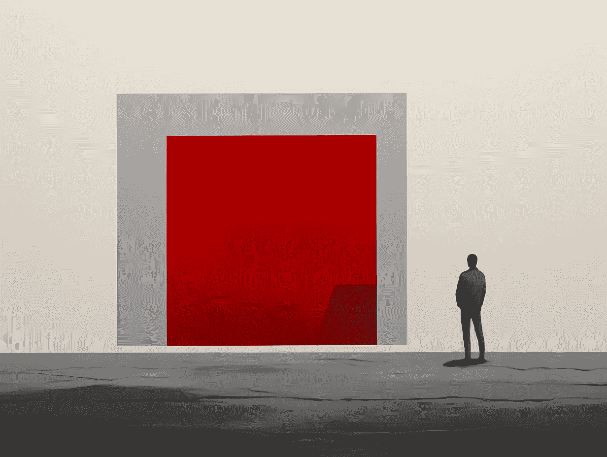

**AI 艺术评论家的极简主义画作**，*图像由 AI 图像创建程序* Midjourney 创建，并由作者编辑

大约两周前，OpenAI 开始推出其具备视觉功能的 GPT-4 模型（GPT-4V）[1]。作为 ChatGPT Plus 的订阅者，每月费用为 20 美元，我获得了新模型的早期访问权限。系统可在这里获取：[chat.openai.com](https://chat.openai.com/)。

使用 GPT-4V，我可以提交一个包含最多四张图片的文本提示。系统会分析提示和图片，并作出相应的回应。由于我一直在写有关 AI 和 ML 创意用途的文章，我的第一个直觉是看看 GPT-4V 是否能够有效地作为艺术评论家。

这是我的第一次实验。我让系统评论了一幅我在 2002 年制作的新的英格兰风景丙烯画，这幅画是通过参考图像、一些自定义软件和投影仪完成的。我拍了一张画作的照片，并将其发送给 GPT-4V 进行评论。

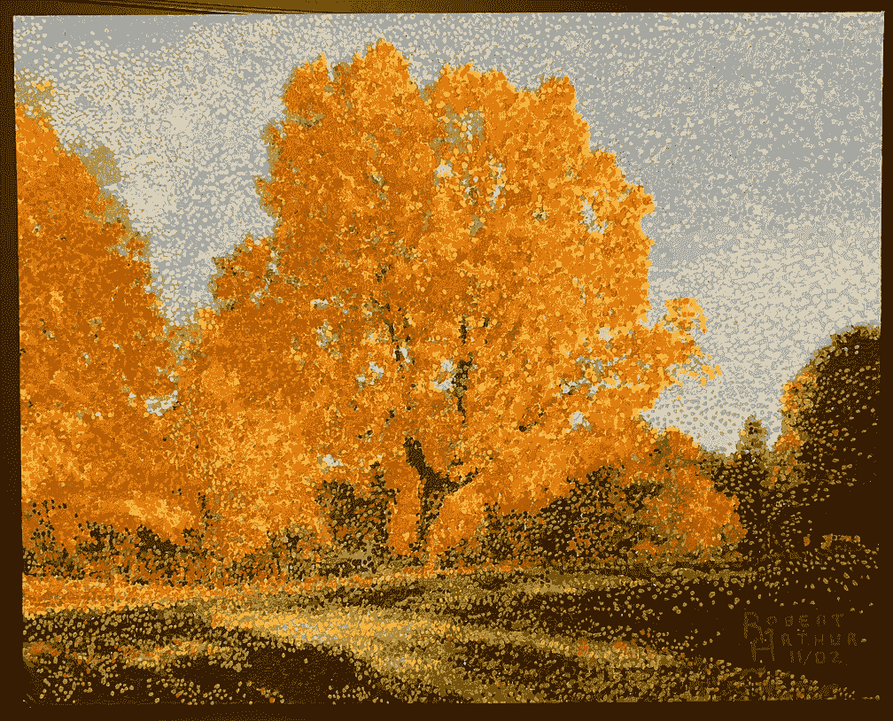

***ChatGPT 用户界面*** *(左侧)*，***秋天的沃伦公园*** *(右侧)*，截图和画作由作者提供

这是我的提示，随后是 GPT-4V 的评论。

> ***RobG****: 根据这幅画的照片，写一篇带有建设性批评的评论。
> 
> 秋天的沃伦公园
> 
> 罗伯特·A·冈萨尔维斯
> 
> 画布板上的丙烯画
> 
> 24” x 32”*
> 
> ***GPT-4V:*** “秋天的沃伦公园”由罗伯特·A·冈萨尔维斯创作，是对大自然美丽的迷人描绘。艺术家选择了充满活力的秋季色彩，捕捉了季节的精髓，使场景充满了炽热的橙色和深邃的棕色。使用的点彩技法赋予了作品梦幻般的、近乎超凡脱俗的质量，让观众感到仿佛被旋转的落叶包围。
> 
> 建设性批评：
> 
> 1\. 尽管点彩画创造了迷人的质感，但如果点的大小能有更多变化，可能会为秋叶增添更多的深度和现实感。
> 
> 2\. 虽然天空以其冷色调的蓝色呈现得很美，但如果能有更平滑的过渡或渐变，会使其感觉更自然。
> 
> 3\. 签名“Robert Arthur 11/02”虽然重要，但显得有些突出。如果能更微妙地融入画作中，可能会更具美感。
> 
> 总体而言，这幅作品是对秋天的绝妙表现，吸引了观众的注意力，并将他们带到了沃伦公园的中心。

第一部分相当令人赞赏。我注意到 ChatGPT 通常提供积极的回应。它指出了我画作的一些客观特征，如点彩风格和秋季色彩。我喜欢它说画作给观众带来了“被卷入旋转的落叶风暴中的感觉”时的热情。

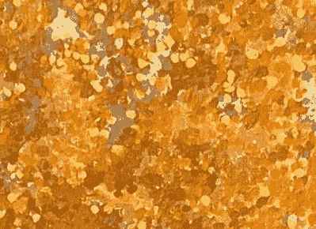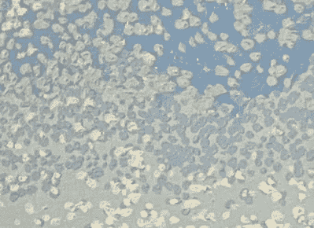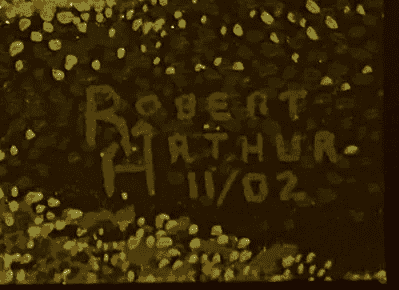

***沃伦公园秋季细节，秋叶*** *(左)，* ***天空*** *(中)，* ***和签名*** *(右)，作者提供的图像*

在我的提示中，我要求一些“建设性批评”，系统确实提供了一些。关于点的大小的评论是公平的，但建议天空使用平滑渐变似乎不太对劲，因为点彩画通常仅由颜色点构成。然而，我对系统能够读取我的签名和日期感到印象深刻，因为我选择了几乎没有对比度的颜色。是的，我的签名在画作中确实不寻常地大。

在本文中，我将提供有关 GPT-4V 模型的一些背景信息，并查看它在审视其他形式的视觉艺术（包括多媒体装置和 AI 生成艺术）时的表现如何。

# GPT-4V 模型

2023 年 3 月，OpenAI 推出了 GPT-4，其中非视觉变体提供给了 ChatGPT Plus 用户。以下是作者们对视觉功能的评价。

> GPT-4 接受由图像和文本组成的提示，这种设置与纯文本设置类似，让用户指定任何视觉或语言任务。具体来说，模型根据由任意交织的文本和图像组成的输入生成文本输出。在各种领域——包括文本和照片、图表或屏幕截图的文档——GPT-4 展现了与纯文本输入类似的能力。 - OpenAI [1]

## 模型大小和架构

与 OpenAI 发布之前的模型不同的是，它没有透露有关 GPT-4 模型的大小和架构的很多信息。然而，有[泄漏的报告](https://the-decoder.com/gpt-4-architecture-datasets-costs-and-more-leaked/)显示 GPT-4 约有 1.8 万亿个参数。它使用了一个专家混合（MoE）系统，在模型中有 16 个专家，每个专家约有 1110 亿个参数。作为参考，早期的 GPT-3 模型使用了 1750 亿个参数 [3]。

## 训练过程

OpenAI 没有透露他们用于训练 GPT-4 模型的数据详情。在他们的[研究网站](https://openai.com/research/gpt-4)上，他们表示 GPT-4 基础模型是通过公共和许可数据语料库进行训练的，涵盖了各种推理能力、陈述和意识形态。为了确保模型的响应与用户意图一致，他们通过人类反馈强化学习（[RLHF](https://openai.com/research/learning-from-human-preferences)）进行了微调。

## 实验结果

为了测试这些模型，OpenAI 进行了各种基准测试，包括模拟最初为人类设计的考试。他们没有对这些考试进行特定的训练。模型在训练期间见到了考试中少量的问题；对于每个考试，他们运行了一个去除这些问题的变体，并报告了较低的分数[1]。以下是一些结果。

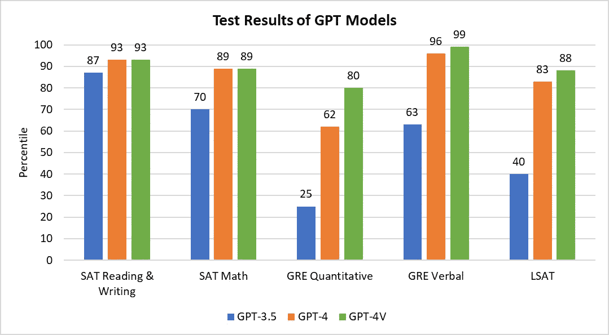

**GPT 模型的测试结果**，数据来自[OpenAI](https://arxiv.org/pdf/2303.08774.pdf)，图表由作者提供

你可以看到 GPT-4 模型在大多数测试中显著优于 GPT-3.5 模型。有趣的是，GPT-4V 在一些测试中，如 GRE 定量测试，表现优于标准 GPT-4。从他们的论文中，我了解到 OpenAI 的研究人员尽可能客观地转录了测试中的任何图像和图表，以供视觉模型和非视觉模型使用[1]。然而，他们没有提供为什么具有视觉的 GPT-4 在测试中表现优于标准 GPT-4 模型的任何见解。我猜测 GPT-4V 在回答那些具有图像描述的“文字”问题时表现更好。

## 模型的局限性

作者描述了 GPT-4 和 GPT-4V 的不足之处。他们报告说，尽管这些模型有所进步，但与其前身一样，仍存在一些弱点：它们并不总是可靠，可能会产生“幻觉”，具有有限的上下文窗口，并且无法从经验中学习。这些局限性，特别是在关键情况下，使用时需要谨慎。模型的能力和限制引入了新的安全问题，强调了由于其潜在的社会影响而需要进一步研究。论文探讨了包括偏见、虚假信息等潜在风险，并概述了为最小化这些风险而采取的措施，如对抗性测试和安全管道[1]。

## GPT-4V 的初步发布

起初，视觉版本 GPT-4V 仅通过[Be My Eyes](https://www.bemyeyes.com/blog/introducing-be-my-eyes-virtual-volunteer)这一由丹麦初创公司创建的应用程序提供。该应用程序通过将盲人或视力低下者与志愿者连接，来帮助他们完成诸如产品识别和机场导航等任务。利用 GPT-4V 的功能，该初创公司在应用程序中推出了一个“虚拟志愿者”功能，旨在匹配人类助手的理解水平[2]。

## OpenAI 的数据收集政策

OpenAI 修改了其数据收集政策。默认情况下，你的提示和回应可以被 OpenAI 用于训练未来的模型。他们之前使用了一个在线表单，用户可以选择退出数据收集。根据他们的新政策，数据收集现在与聊天记录绑定。如果你关闭聊天记录，他们将不会使用你的提示和回应来训练他们的模型。你可以在[这里](https://help.openai.com/en/articles/7730893-data-controls-faq)阅读他们的新政策。

接下来，我将展示更多使用 GPT-4V 作为艺术评论家的实验。

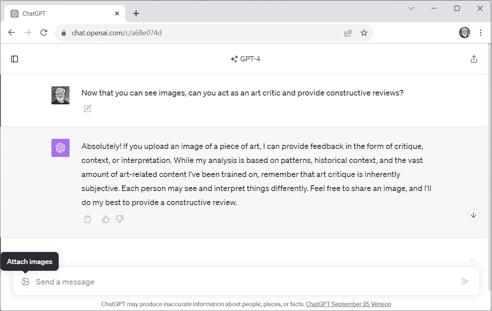

**ChatGPT 用户界面**，作者截图

# GPT-4V 作为艺术评论家

GPT-4V 可以作为艺术评论家吗？我在上面的截图中问了这个问题，它回答说，“绝对可以！”并解释了为什么它可以。让我们看看它在几个例子中的表现。

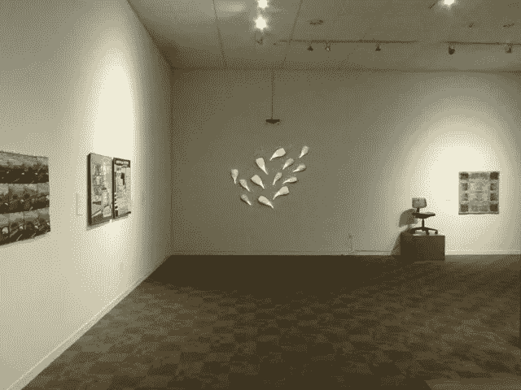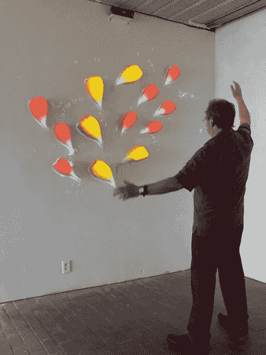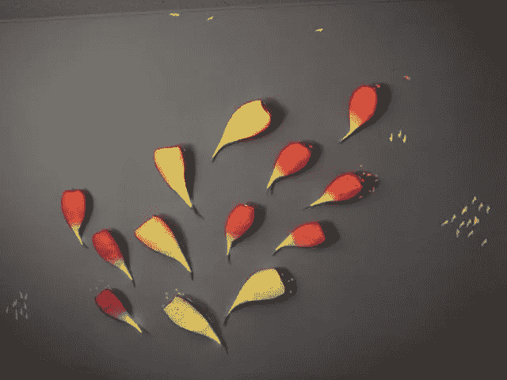

**安娜·克里斯蒂娜·戈朗松和罗布·贡萨尔维斯的《Swarming》**，作者提供的图片

## 装置艺术

第一个例子是对一个名为“Swarming”的互动装置的评论，这个装置是我和我的朋友及艺术家[安娜·克里斯蒂娜·戈朗松](https://www.annakristinagoransson.com/home)共同构建的。该装置展示了毛毡和染色的形状，作为“boids”的家，这些数字生物似乎从这些形状中飞出，通过投影在空中飞翔，最终又回到形状中。boids 可以通过微软 Kinect 设备被观众干扰和移动，该设备正在观察观众。

我将三张图片和一个[装置描述](https://www.robgon.com/artwork/swarming)发送给 GPT-4V，获取评论。以下是互动的过程。

> *RobG: 根据这些照片和互动装置的描述，写一篇带有建设性批评的评论。
> 
> [description]*
> 
> *GPT-4V:* **安娜·克里斯蒂娜·戈朗松和罗布·贡萨尔维斯的《Swarming》评论**
> 
> “Swarming” 是对将触感艺术与现代技术的沉浸式能力相结合的可能性的一次雄心勃勃的证明。由安娜·克里斯蒂娜·戈朗松设计的色彩鲜艳的毛毡雕塑为展览增添了奇幻的质感。这些有机形态与它们的动画对照形成了对日常生活的超现实逃离，展现了一个艺术真的栩栩如生的世界。
> 
> 四种互动模式——睡眠、侦察、集群和互动——经过深思熟虑地设计，以为访客提供分层的体验。观众的存在本身就可以改变装置的行为，弥合被动观看和主动参与之间的差距。使用微软 Kinect 接口来跟踪访客的动作并触发视觉和听觉反馈，这种方法既创新又引人入胜。这种即时反馈循环使访客能够真正融入艺术作品之中。
> 
> 然而，还有一些领域可能需要进一步完善：
> 
> 1. 环境声音：静默模式，特别是睡眠和侦察，可能利用细微的环境声音。这将增强体验，确保在这些较安静的时刻气氛不显得过于单调或空旷。
> 
> 2. 互动清晰度：提供一个简单的指南或指示，说明访客如何将展览从一种模式过渡到另一种模式可能会有所帮助。这可以确保访客能够充分探索“Swarming”提供的互动深度。
> 
> 3. 照明：考虑到视频投影仪在这个装置中的重要性，应特别关注展览室的环境光照。适当的照明可以增强投影的可见性，并确保感应雕塑得到适当的照明。
> 
> 4. 动画中的多样性：虽然“boids”为展览增添了动态元素，但引入多样的图案或行为可以进一步丰富观众的体验。这可以通过多样化 boids 的颜色或大小来实现。
> 
> 总之，“Swarming”是传统艺术与前沿技术的引人入胜的融合，提供了一种既创新又怀旧的多感官体验。通过一些调整，这个装置有潜力进一步吸引观众，使每次访问都成为独特的发现之旅。

GPT-4V 对这件作品的评价非常积极。它以“雄心勃勃”、“异想天开”、“创新”和“引人入胜”等词语开始了对装置的高度评价。几乎就像我付钱让它写这篇评论一样。哦，等等。我确实这么做了。🙂

但它确实提出了一些合理的建设性批评。第一点，关于在睡眠和侦察模式中发出声音，并未考虑艺术坐席者的理智。关于为观众提供指示和光照条件的建议是有效的。最后一点，关于在动画中增加更多多样性也是很好的。但建议改变 boids 的大小听起来很像建议在我开头示例中改变点彩画点的大小。嗯，让我们看看这个趋势是否在其他示例中继续。

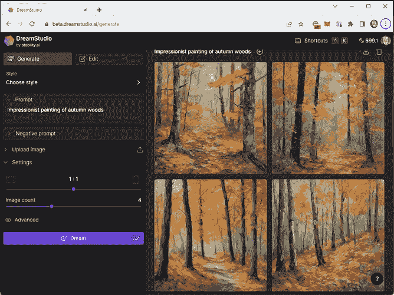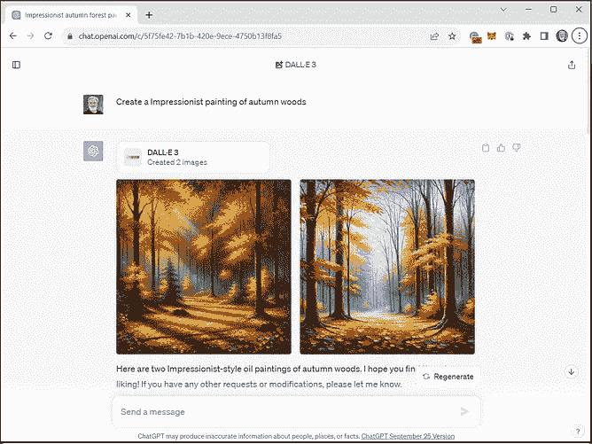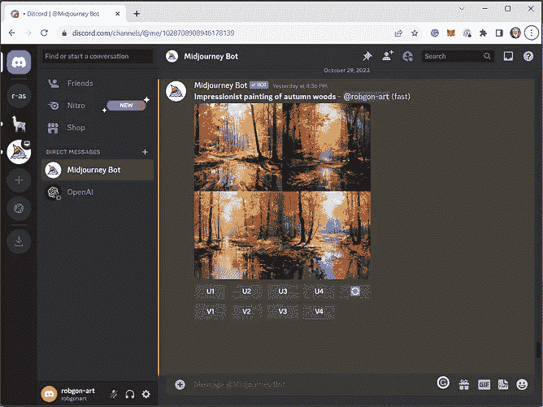

**Dream Studio**（右）、**DALL-E 3**（中）、**和 Midjourney**（左）的用户界面，作者截图

## AI 生成艺术

为了测试系统的比较艺术批评能力，我将相同的提示输入到三个文本生成图像模型中，并请求 GPT-4V 对生成的图像进行比较。我使用的图像生成模型是 Stability AI 最新提供的[Dream Studio](https://beta.dreamstudio.ai/generate)，OpenAI 的[DALL-E 3](https://openai.com/dall-e-3)和[Midjourney](https://www.midjourney.com/)。我为这些服务都拥有付费账户。您可以在上面的截图中看到用户界面。

在这三种图像生成系统中，DALL-E 3 有一个有趣的特点；它使用 ChatGPT 作为界面。当我要求它使用提示“*秋季树林的印象派画作*”生成画作时，它首先将其扩展为更长的提示：“*印象派风格的油画，描绘了秋季的密林。金色的树叶铺满了地面，而树木则装饰着生动的橙色、红色和黄色。斑驳的阳光透过树冠，投射出闪烁的光斑到森林地面上。*”这是一个很酷的功能，所以我用了它。如果我输入的是“*创建秋季树林的印象派画作。使用这个确切的提示。*”它将跳过提示扩展步骤。

以下是生成“*秋季树林的印象派画作*”的结果。

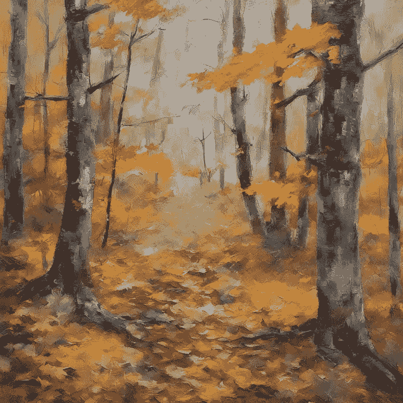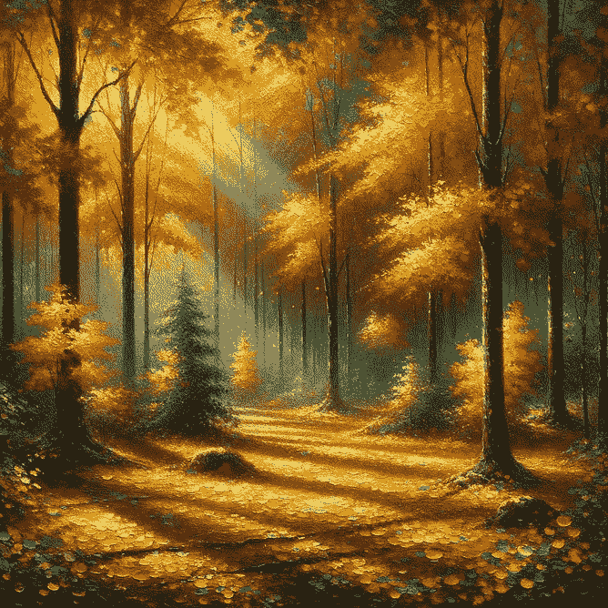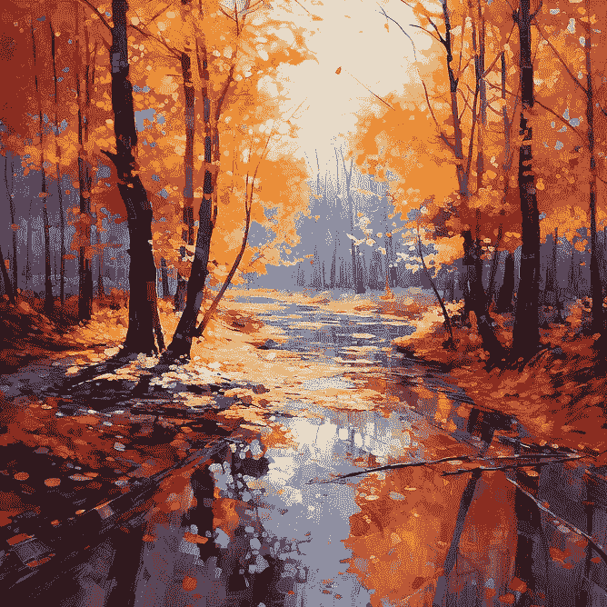

***“秋季树林的印象派画作，” 在 Dream Studio 生成*** *(左)，* ***DALL-E 3*** *(中)，* ***和 Midjourney*** *(右)，作者提供图像*

这是我发送给 GPT-4V 的提示以及三幅图像。

> ***RobG***：分析这些使用提示“秋季树林的印象派画作”创作的三幅图像。提供对比反馈，将图像称为左、中、右。
> 
> ***GPT-4V***：当然！让我们深入分析这三幅秋季树林的印象派画作。
> 
> **左侧图像**：左侧图像使用了柔和的色彩调色板，主要展示了柔和的橙色、黄色和冷灰色。树木用细长的树干绘制，质地光滑，使整个场景呈现出一种精致、空灵的感觉。前景有一条明显的小径，覆盖着落叶，引导观众的视线深入树林。画作中有一种宁静和安静的感觉，就像能听到风在树叶间轻轻沙沙作响。
> 
> **中间图像：** 中间图像在色彩选择上更为大胆和生动，呈现了深金色、火红色和绿色的点缀。光影的对比非常强烈，特别是阳光如何透过树冠，照射到森林地面。与左图不同，这个场景更为密集，树木的集中度显得更高。对森林地面的关注，尤其是阳光照射下的散落叶子，营造了一种神奇、近乎梦幻的氛围。
> 
> **右图：** 右图是三幅图像中最具动感和生动的，色彩调色板十分抢眼，展示了明亮的橙色、红色和对比鲜明的蓝色。图中有一个看似溪流或水坑的倒影，双倍增强了秋天色彩的影响，并创造了树木的镜像效果。这幅画感觉比其他画作更具抽象性，笔触更加大胆，反射效果的运用使其似乎是在雨后场景中观看。画作强调了运动感，可能是由于水面波纹效果和落叶的方向性。
> 
> **对比反馈：** 虽然这三幅画作都美丽地捕捉了秋季树林的精髓，但它们以不同的方式展现。左边的画作提供了平静而柔和的表现，专注于树林的宁静。相比之下，中间的画作将观众沉浸在阳光照射下的光辉森林中，散发着温暖和迷人。右图因其大胆的颜色和抽象性而脱颖而出，利用反射和生动的色调来传达季节的动态特征。每幅画都有自己独特的魅力，使它们各自都很迷人。

哇！这是对三幅画作的极佳而全面的分析。再次强调，所有评论都非常积极。我喜欢它如何从描述第二幅图像开始比较这些图像，“与左图不同，这个场景更为密集…” 它还早早地把第三幅图像标榜为赢家，“右图是三幅图像中最具动感和生动的…” 但它以积极的语调结束，每幅画作都得到了赞扬，“每幅画都有自己独特的魅力…”

寻找一些具体的建设性批评，我问了这个问题。

> ***RobG:*** *简要描述每幅画作可以如何改进。*
> 
> ***GPT-4V:*** **左图：** 为了增强其魅力，艺术家可以在颜色上引入更多的对比度，以赋予场景更多的深度。添加一些更明亮、更鲜艳的秋季色彩也可能帮助某些元素突出，确保图像不会显得过于单调或褪色。
> 
> **中间图像**：虽然光影的表现非常出色，但艺术家可以进一步定义树木，给它们增加更多的纹理或树皮图案的变化。这将打破单一性，并提供额外的兴趣点。
> 
> **右侧图片**：这幅画的动态特性是它的强项，但如果有一个更清晰的焦点会更好。无论是特定的树木、倒影还是其他元素，给观众的眼睛一个休息的地方，可能会使场景更具平衡感。艺术家还可以细化水中的倒影，确保它们与所映照的树木更自然地对齐。

这里是再次提供的三张图片供参考。

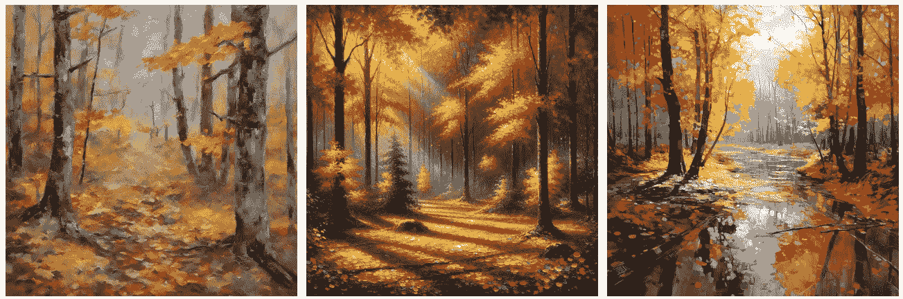

***来自 Dream Studio 生成的画作*** *(左),* ***DALL-E 3*** *(中),* ***和 Midjourney*** *(右), 作者提供的图片*

我同意这三条建议。左侧图片可以增加对比度和色彩饱和度。中间的图片需要在树木上增加一些定义。而右侧的图片缺少一个中央的焦点对象。

# 结论与下一步

在这次探索中，我发现 GPT-4V 作为艺术评论家的能力既有前景又富有洞察力。通过将其分析能力与各种形式的视觉艺术进行对比，很明显，该模型能够提供积极的反馈和建设性的批评，具有相当的深度。

从我画作的反馈到更复杂的互动装置和 AI 生成的艺术作品，GPT-4V 展现了对艺术的深刻理解和令人惊讶的敏锐眼光。虽然该模型的评价显著积极，这可能反映了 OpenAI 的设计决定，以避免过于负面的回应，但在被要求时，它毫不犹豫地提供了改进建议。

然而，必须记住的是，虽然 GPT-4V 可以提供分析，但艺术的实际价值往往在于观众的主观体验。像 GPT-4V 这样的 AI 工具可以提供反馈，但它们不应替代人类的触感，后者在艺术解释中带来个人的视角、情感和体验。

未来，探索 GPT-4V 对更抽象艺术形式的反应或者深入进行历史艺术时期的比较分析将是非常有趣的。例如，比较两幅法国印象派画作，并观察它是否能识别它们，将是很有趣的。此外，随着模型的不断发展和改进，还有可能对艺术、设计和其他视觉媒介提供更深入的见解。

总之，GPT-4V 为寻求反馈的艺术家提供了一个独特且有价值的工具。但仍需以平衡的视角来对待其批评，记住艺术不仅仅关乎技巧或视觉吸引力，更与人类经验密切相关。

# 致谢

我感谢 Jennifer Lim 和 Oliver Strimpel 审阅这篇文章并提供反馈。

# 参考文献

[1] OpenAI, [GPT-4 技术报告](https://arxiv.org/pdf/2303.08774.pdf) (2023)

[2] OpenAI, [Be My Eyes — Be My Eyes 使用 GPT-4 改变视觉可及性](https://openai.com/customer-stories/be-my-eyes) (2023)

[3] T. Brown 等人，[语言模型是少样本学习者](https://arxiv.org/pdf/2005.14165.pdf)（2020）

# 附言

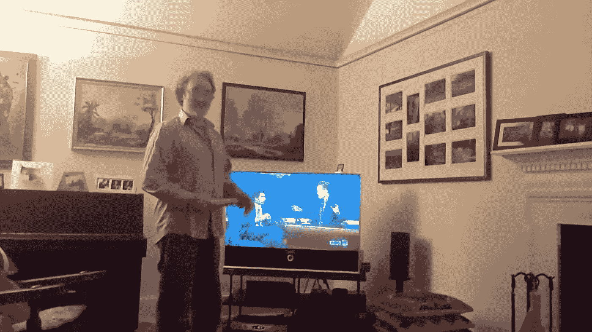

**粉丝纠正：从投球手的投球区到本垒板不是 90 英尺！**，图片作者

尽管 GPT-4V 喜欢我那幅“*秋天的沃伦公园*”画作，但康纳·奥布莱恩并没有那么友好。你可以在 2013 年的这段“[*粉丝纠正*](https://www.youtube.com/watch?v=JQivw-5HYuQ)”视频中听到他对我画作的评价，从 01:36 开始。
