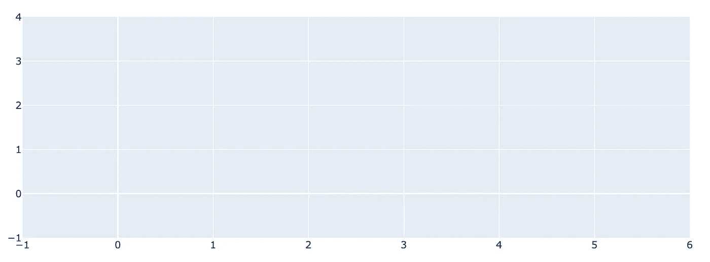
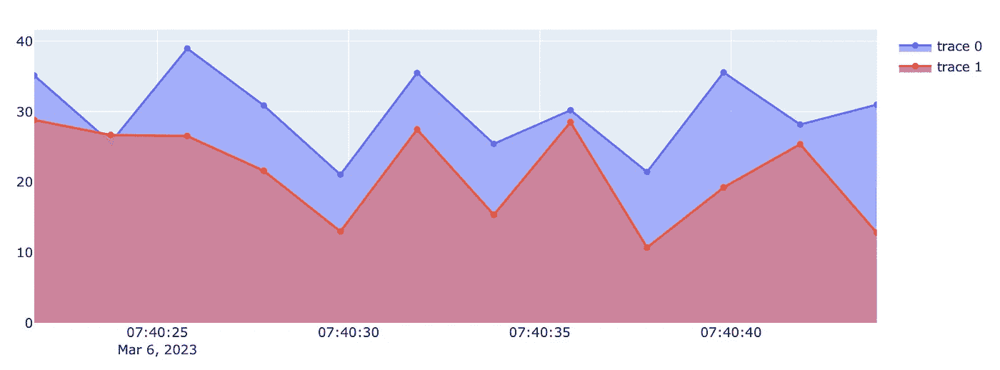

# 使用 Python 和 Kafka

> 原文：[`towardsdatascience.com/using-kafka-with-python-54dc20717cf7`](https://towardsdatascience.com/using-kafka-with-python-54dc20717cf7)

## 了解如何使用 Python 创建生产者和消费者，并绘制动态散点图

[](https://weimenglee.medium.com/?source=post_page-----54dc20717cf7--------------------------------)[](https://towardsdatascience.com/?source=post_page-----54dc20717cf7--------------------------------) [Wei-Meng Lee](https://weimenglee.medium.com/?source=post_page-----54dc20717cf7--------------------------------)

·发表于 [Towards Data Science](https://towardsdatascience.com/?source=post_page-----54dc20717cf7--------------------------------) ·7 分钟阅读·2023 年 3 月 20 日

--


图片由 [Markus Winkler](https://unsplash.com/@markuswinkler?utm_source=medium&utm_medium=referral) 提供，来源于 [Unsplash](https://unsplash.com/?utm_source=medium&utm_medium=referral)

在我之前关于 Kafka 的文章中，我介绍了 Kafka 用于数据流处理的使用。我还展示了如何启动 Kafka 代理服务，并演示了如何使用 Kafka 生产者控制台应用程序发送消息以及如何使用 Kafka 消费者控制台应用程序接收消息。

在这篇文章中，我将向你展示如何使用 Python 利用 Kafka。具体来说，我将：

+   使用 Python 向 Kafka 代理服务发送消息

+   使用 Python 从 Kafka 代理服务接收消息

+   构建一个动态图表应用程序，用于绘制和更新散点图，随时接收来自代理服务的新数据

# 使用 Python 和 Kafka

至少有三个 Python 库可供 Python 开发者与 Kafka 代理服务接口。它们是：

+   Kafka-Python

+   PyKafka

+   Confluent Kafka Python

对于本文，我将使用 **Confluent Kafka Python** 包。

要安装 **Confluent Kafka Python** 包，请使用 `pip` 命令：

```py
!pip install confluent-kafka
```

# 生成消息

首先，让我们先从生产者开始。生产者是向 Kafka 代理服务发送消息的组件。以下代码片段指定了要连接的 Kafka 代理服务器：

```py
from confluent_kafka import Producer
import socket

conf = {
    'bootstrap.servers': "localhost:9092",
    'client.id': socket.gethostname()
}

producer = Producer(conf)
```

> 你需要确保你的 Kafka 代理服务正在运行。有关如何启动服务的详细信息，请参阅 `towardsdatascience.com/using-apache-kafka-for-data-streaming-9199699623fa`。

[## 使用 Apache Kafka 进行数据流处理](https://towardsdatascience.com/using-apache-kafka-for-data-streaming-9199699623fa?source=post_page-----54dc20717cf7--------------------------------)

### 了解如何安装和使用 Kafka 发送和接收消息

towardsdatascience.com](/using-apache-kafka-for-data-streaming-9199699623fa?source=post_page-----54dc20717cf7--------------------------------)

要发送消息，你可以使用`Producer`对象的`produce()`函数。你可以传递四个参数给它：

+   要发送的主题

+   消息负载的关键字

+   消息负载

+   轮询生产者以了解消息是否成功传递（或未传递）时要调用的回调函数。

以下代码片段将消息发送到 Kafka 代理服务：

```py
def acked(err, msg):
    if err is not None:
        print("Failed to deliver message: %s: %s" % (str(msg), str(err)))
    else:
        print("Message produced: %s" % (str(msg)))

producer.produce("SomeTopic", key="key1", value="Hello", callback=acked)     
producer.poll(1)   # Maximum time (1s) to block while waiting for events
```

`poll()`函数返回处理的事件数量（回调服务的数量）。

让我们发送另一条具有不同关键字的消息：

```py
producer.produce("SomeTopic", key="key2", value="World", callback=acked)     
producer.poll(1)
```

# 消费消息

消息发送完毕后，你现在可以处理消费者。以下代码片段连接到 Kafka 代理服务：

```py
from confluent_kafka import Consumer

conf = {
    'bootstrap.servers': "localhost:9092",
    'group.id': "1",
    'auto.offset.reset': 'latest'
}

consumer = Consumer(conf)
```

`group.id`指示你属于哪个消费者组。如果有两个消费者分配了相同的组 ID 到同一个主题，它们将共享从同一主题读取的工作。

`auto.offset.reset`指示…指定当从主题分区消费时没有初始偏移量时，消费者应如何行为。

> 我将在另一篇文章中讨论偏移量。

为了消费消息，让我们定义一个名为`consume()`的函数。它接受消费者和要订阅的主题：

```py
from confluent_kafka import KafkaError, KafkaException

def consume(consumer, topics):    
    try:
        consumer.subscribe(topics)
        # use this as a way to stop the loop
        t = threading.currentThread()
        while getattr(t, "run", True):
            msg = consumer.poll(timeout=5.0)
            if msg is None: 
                continue

            if msg.error():
                if msg.error().code() == KafkaError._PARTITION_EOF:
                    # End of partition event
                    sys.stderr.write('%% %s [%d] reached end at offset %d\n' %
                                     (msg.topic(), msg.partition(), msg.offset()))
                elif msg.error():
                    raise KafkaException(msg.error())
            else:
                key = msg.key().decode("utf-8")
                data = msg.value().decode("utf-8")
                print(key, data)
    finally:
        # Close down consumer to commit final offsets.
        consumer.close()
```

在这个函数中，你首先订阅了你想要监听的主题。然后，你使用`threading.currentThread()`函数检查当前线程上是否设置了名为`run`的属性，该线程用于运行此函数。这用于控制是否继续等待下一条消息或退出函数。

我们将使用无限循环来不断轮询 Kafka 代理服务。`timeout`参数允许你设置阻塞调用的时间，直到代理服务返回消息。如果你想更频繁地轮询代理，请将`timeout`设置为较低的值，例如`0.5`秒。

如果返回了消息，你可以提取其关键字和值，然后打印出来。最后，如果无限循环被终止，你将关闭消费者。

要运行`consume()`函数，我们将使用`threading`包：

```py
import threading
thread = threading.Thread(target=consume, 
                          args=(consumer, ["SomeTopic"]))
thread.start()
```

`start()`函数将`consume()`函数作为独立线程运行，以免冻结你的 Jupyter Notebook。

你现在应该能看到由生产者发送的两个传入消息：

```py
key1 Hello
key2 World
```

要终止消费者，只需将`thread`的`run`属性设置为`False`，`consume()`函数将停止运行：

```py
thread.run = False
```

# 绘制图表

现在你已经能够使用 Confluent Kafka Python 包来生产和消费消息，是时候利用这项新知识做些有用的事情了！

让我们使用生产者模拟一个 IOT 设备向 Kafka 代理服务发送传感器数据，并在消费者端读取这些数据并绘制图表。随着新数据的接收，图表将动态更新。所有这些将在 Jupyter Notebook 中直接运行。

## 发送传感器数据

让我们定义一个名为 `send_message()` 的函数，它接受四个参数：

+   topic — 消息的主题

+   datetime — 收集的传感器数据的日期时间

+   temp1 — 传感器 1 的温度读数

+   temp2 — 传感器 2 的温度读数

这四个参数将用于发送消息：

```py
def send_message(topic, datetime, temp1, temp2):
    producer.produce(topic, key="key", value=f"{datetime},{temp1},{temp2}", callback=acked)
    producer.poll(1)
```

我们还将定义一个名为 `update()` 的函数，它每 2 秒调用一次 `send_message()` 函数，传入一些随机值：

```py
import threading
import datetime
import random

def update():
    threading.Timer(2.0, update).start()     # call update() every 5s
    send_message('SensorData',
                 datetime.datetime.utcnow(), # datetime in UTC
                 random.uniform(20, 39),     # temperature1
                 random.uniform(10, 29))     # temperature2

update()
```

## 消费消息并绘制图表

对于消费者，我们来创建 `Consumer` 对象：

```py
from confluent_kafka import Consumer

conf = {
    'bootstrap.servers': "localhost:9092",
    'group.id': "1",
    'auto.offset.reset': 'latest'
}

consumer = Consumer(conf)
```

然后我们将利用 Plotly 向 `FigureWidget` 中添加两个散点图：

> `FigureWidget` 是一个图形库，可以在 Jupyter Notebook 中显示图表。

```py
from confluent_kafka import KafkaError, KafkaException

import time
import plotly.graph_objects as go
import numpy as np

# initialize a plot
fig = go.FigureWidget()

# add two scatter plots
fig.add_scatter(fill='tozeroy')
fig.add_scatter(fill='tozeroy')
```

我们现在可以从 Kafka broker 服务中轮询消息：

```py
def consume(consumer, topics):
    counter = 0
    x  = []   # datetime
    y1 = []   # first temp
    y2 = []   # second temp
    n  = 12   # the number of points to display on the plot
    try:
        consumer.subscribe(topics)        
        t = threading.currentThread()
        while getattr(t, "run", True):
            msg = consumer.poll(timeout=2.0)
            if msg is None:         
                continue

            if msg.error():
                if msg.error().code() == KafkaError._PARTITION_EOF:
                    # End of partition event
                    sys.stderr.write('%% %s [%d] reached end at offset %d\n' %
                                     (msg.topic(), msg.partition(), msg.offset()))
                elif msg.error():
                    raise KafkaException(msg.error())
            else:
                data = msg.value().decode("utf-8")
                x.append(data.split(',')[0])          # datetime
                y1.append(float(data.split(',')[1]))  # first temp
                y2.append(float(data.split(',')[2]))  # second temp

                #---display the last n points---                
                # first scatter plot
                fig.data[0].x = x[-n:]                # datetime
                fig.data[0].y = y1[-n:]               # temp                
                # second scatter plot
                fig.data[1].x = x[-n:]                # datetime
                fig.data[1].y = y2[-n:]               # temp
    finally:
        # Close down consumer to commit final offsets.
        consumer.close()

display(fig)
```

让我们分析一下上面的代码片段。当从 broker 获取到一条消息时，它会被拆分为三部分 —— `datetime`、`temp1` 和 `temp2`。它们分别被添加到 `x`、`y1` 和 `y2` 列表中：

```py
data = msg.value().decode("utf-8")
                x.append(data.split(',')[0])          # datetime
                y1.append(float(data.split(',')[1]))  # first temp
                y2.append(float(data.split(',')[2]))  # second temp
```

随着时间的推移，列表会包含大量数据。因此，我们只希望绘制最近的 *n* 个点（在此示例中设置为 12）。要更新第一个散点图，设置 `fig.data[0].x` 和 `fig.data[0].y` 属性。对于第二个散点图，设置 `fig.data[1].x` 和 `fig.data[1].y` 属性：

```py
 #---display the last n points---                
                # first scatter plot
                fig.data[0].x = x[-n:]                # datetime
                fig.data[0].y = y1[-n:]               # temp                

                # second scatter plot
                fig.data[1].x = x[-n:]                # datetime
                fig.data[1].y = y2[-n:]               # temp
```

就这样！每当接收到新消息时，散点图将会自动更新！

目前，当你运行代码时，会显示一个空的图：



图片由作者提供

你现在可以准备开启一个线程来运行 `consume()` 函数：

```py
import threading
thread = threading.Thread(target=consume, args=(consumer, ["SensorData"]))
thread.start()
```

过一段时间后，你应该会看到两个散点图更新：



图片由作者提供

这是更新图表的视频：

视频由作者提供

如常，若要暂停 `consume()` 函数，将 `thread` 的 `run` 属性设置为 `False`：

```py
thread.run = False
```

**如果你喜欢阅读我的文章并且它对你的职业/学习有所帮助，请考虑注册成为 Medium 会员。每月 $5，你可以无限制访问 Medium 上的所有文章（包括我的文章）。如果你使用以下链接注册，我将获得少量佣金（对你没有额外费用）。你的支持意味着我可以花更多时间写出像这样的文章。**

[](https://weimenglee.medium.com/membership?source=post_page-----54dc20717cf7--------------------------------) [## 使用我的推荐链接加入 Medium - 韦孟李]

### 阅读 Wei-Meng Lee 的每个故事（以及 Medium 上其他成千上万位作家的故事）。你的会员费用直接支持…

weimenglee.medium.com](https://weimenglee.medium.com/membership?source=post_page-----54dc20717cf7--------------------------------)

# 总结

本文展示了一个你可以使用 Kafka 构建的有用应用。特别是，我向你展示了如何使用 Python 和 Plotly 构建一个动态图表应用。Kafka 的实时流式特性使其成为需要低延迟数据更新的应用（如物联网应用）的理想选择。敬请关注下一篇 Kafka 文章！
