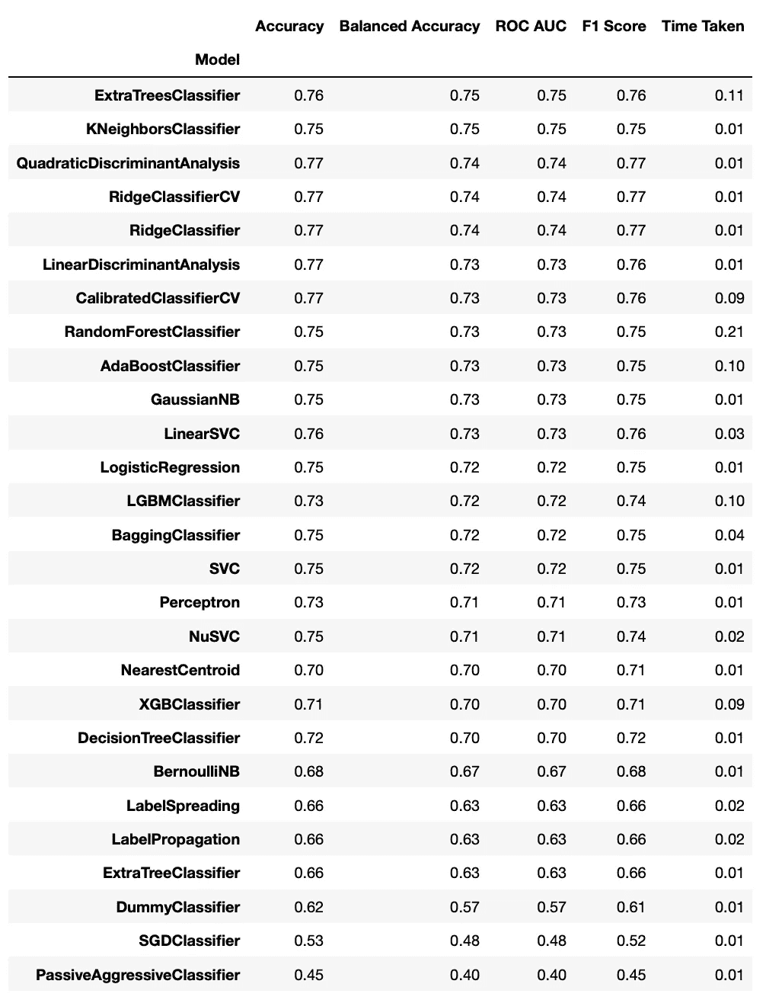

# 使用 LazyPredict 评估 ML 算法

> 原文：[`towardsdatascience.com/using-lazypredict-for-evaluating-ml-algorithms-f912a43eef2`](https://towardsdatascience.com/using-lazypredict-for-evaluating-ml-algorithms-f912a43eef2)

## 使用 LazyPredict 库自动选择最佳机器学习算法的过程

[](https://weimenglee.medium.com/?source=post_page-----f912a43eef2--------------------------------)[](https://towardsdatascience.com/?source=post_page-----f912a43eef2--------------------------------) [Wei-Meng Lee](https://weimenglee.medium.com/?source=post_page-----f912a43eef2--------------------------------)

·发表于 [Towards Data Science](https://towardsdatascience.com/?source=post_page-----f912a43eef2--------------------------------) ·10 分钟阅读·2023 年 3 月 27 日

--


[由 Victoriano Izquierdo](https://unsplash.com/@victoriano?utm_source=medium&utm_medium=referral) 摄影，来自 [Unsplash](https://unsplash.com/?utm_source=medium&utm_medium=referral)

评估机器学习算法是数据科学家常做的任务。虽然数据科学家需要了解不同类型的机器学习算法以应对不同类型的问题，但至关重要的是，他/她需要在自己的数据集上应用这些算法。只有这样，他/她才能更好地了解该使用哪种算法来训练模型，以及如何进行超参数调整。然而，选择合适的算法是一个耗时且令人疲惫的过程。理想情况下，应该有一个自动化的过程，只需提供数据，理想的机器学习算法将会为你选择。

这个问题的答案是 **LazyPredict**。 **LazyPredict** 是一个 Python 库，帮助你部分自动化选择最佳算法来训练你的数据集的过程。通过提供你的数据，LazyPredict 将使用超过 60 种机器学习算法来训练模型。最终结果将呈现给你。之后，你可以选择表现最好的机器学习算法进一步训练或优化你的数据集。

# 手动选择机器学习 (ML) 模型

要欣赏 LazyPredict 的美妙，了解通常如何手动完成这些事情总是有益的。因此，在本节中，我将使用糖尿病数据集作为示例，看看我们如何使用它来评估几种 ML 算法并选择与之最匹配的理想算法。为了简化起见，我们将使用以下 ML 算法：

+   逻辑回归

+   K-最近邻 (KNN)

+   支持向量机

> **糖尿病数据集**: [`www.kaggle.com/datasets/mathchi/diabetes-data-set`](https://www.kaggle.com/datasets/mathchi/diabetes-data-set)。**许可**: [CC0: 公开领域](https://creativecommons.org/publicdomain/zero/1.0/)

## 加载数据

第一步是将 diabetes.csv 文件加载到 Pandas DataFrame 中，然后打印出其详细信息：

```py
import numpy as np
import pandas as pd

df = pd.read_csv('diabetes.csv')
df.info()
```

特别是，数据框中没有`NaN`值：

```py
<class 'pandas.core.frame.DataFrame'>
RangeIndex: 768 entries, 0 to 767
Data columns (total 9 columns):
 #   Column                    Non-Null Count  Dtype  
---  ------                    --------------  -----  
 0   Pregnancies               768 non-null    int64  
 1   Glucose                   768 non-null    int64  
 2   BloodPressure             768 non-null    int64  
 3   SkinThickness             768 non-null    int64  
 4   Insulin                   768 non-null    int64  
 5   BMI                       768 non-null    float64
 6   DiabetesPedigreeFunction  768 non-null    float64
 7   Age                       768 non-null    int64  
 8   Outcome                   768 non-null    int64  
dtypes: float64(2), int64(7)
memory usage: 54.1 KB
```

让我们查看数据框本身：

```py
df
```

注意到一些列有 0 值，例如**Pregnancies**、**SkinThickness**、**Insulin**和**Outcome**：


所有图片均由作者提供

## 清理数据

由于数据框中没有`NaN`值，现在检查一下具体哪些列有 0 值：

```py
#---check for 0s---
print(df.eq(0).sum())
```

从下面的输出中，你可以看到只有**DiabetesPedigreeFunction**和**Age**列没有 0 值：

```py
Pregnancies                 111
Glucose                       5
BloodPressure                35
SkinThickness               227
Insulin                     374
BMI                          11
DiabetesPedigreeFunction      0
Age                           0
Outcome                     500
dtype: int64
```

对于其他具有 0 值的列，只有**Pregnancies**和**Outcome**列可以有 0 值——**Pregnancies**的 0 表示患者以前从未怀孕，而**Outcome**的 0 表示患者不是糖尿病患者。对于其他列，值为 0 是不合逻辑的——0 皮肤厚度，真的吗？

所以现在让我们替换这些列中的 0 值，以便它们具有更有意义的值。第一步是用`NaN`替换 0：

```py
df[['Glucose','BloodPressure','SkinThickness',
    'Insulin','BMI']] = \
    df[['Glucose','BloodPressure','SkinThickness',
        'Insulin','BMI']].replace(0,np.NaN)
df
```


然后，用每列的均值替换`NaN`值：

```py
df.fillna(df.mean(), inplace = True)   # replace the rest of the NaNs with the mean
```

你现在可以验证所有列中除了**Pregnancies**和**Outcome**外都没有 0 值：

```py
print(df.eq(0).sum())
```

```py
Pregnancies                 111
Glucose                       0
BloodPressure                 0
SkinThickness                 0
Insulin                       0
BMI                           0
DiabetesPedigreeFunction      0
Age                           0
Outcome                     500
dtype: int64
```

## 检查特征之间的相关性

尽管数据集中有多个特征，但并非所有特征都对结果有贡献。因此，计算每列的相关因子是有用的：

```py
corr = df.corr()
print(corr)
```

这是结果：

```py
 Pregnancies  Glucose  BloodPressure  SkinThickness  \
Pregnancies                      1.00     0.13           0.21           0.08   
Glucose                          0.13     1.00           0.22           0.19   
BloodPressure                    0.21     0.22           1.00           0.19   
SkinThickness                    0.08     0.19           0.19           1.00   
Insulin                          0.06     0.42           0.07           0.16   
BMI                              0.02     0.23           0.28           0.54   
DiabetesPedigreeFunction        -0.03     0.14          -0.00           0.10   
Age                              0.54     0.27           0.32           0.13   
Outcome                          0.22     0.49           0.17           0.22   

                          Insulin  BMI  DiabetesPedigreeFunction  Age  Outcome  
Pregnancies                  0.06 0.02                     -0.03 0.54     0.22  
Glucose                      0.42 0.23                      0.14 0.27     0.49  
BloodPressure                0.07 0.28                     -0.00 0.32     0.17  
SkinThickness                0.16 0.54                      0.10 0.13     0.22  
Insulin                      1.00 0.17                      0.10 0.14     0.21  
BMI                          0.17 1.00                      0.15 0.03     0.31  
DiabetesPedigreeFunction     0.10 0.15                      1.00 0.03     0.17  
Age                          0.14 0.03                      0.03 1.00     0.24  
Outcome                      0.21 0.31                      0.17 0.24     1.00 
```

## 绘制特征之间的相关性

使用热图可视化特征之间的相关性，使理解这些数字变得更加容易：

```py
%matplotlib inline
import matplotlib.pyplot as plt

fig, ax = plt.subplots(figsize=(10, 10))
cax     = ax.matshow(corr,cmap='coolwarm', vmin=-1, vmax=1)

fig.colorbar(cax)
ticks = np.arange(0,len(df.columns),1)
ax.set_xticks(ticks)

ax.set_xticklabels(df.columns)
plt.xticks(rotation = 90)

ax.set_yticklabels(df.columns)
ax.set_yticks(ticks)

#---print the correlation factor---
for i in range(df.shape[1]):
    for j in range(9):
        text = ax.text(j, i, round(corr.iloc[i][j],2),
                       ha="center", va="center", color="w")
plt.show()
```

这是相关因子的热图。我们感兴趣的是查看哪些特征与**Outcome**高度相关（无论是正相关还是负相关）。因此，我们将查看**Outcome**列，并关注那些深红色（正相关）和深蓝色（负相关；此案例中没有）的单元格：


你还可以通过编程找到最相关的特征：

```py
#---get the top four features that has the highest correlation---
print(df.corr().nlargest(4, 'Outcome').index)

#---print the top 4 correlation values---
print(df.corr().nlargest(4, 'Outcome').values[:,8])
```

你可以看到，**Outcome**最相关的前三个特征是**Glucose**、**BMI**和**Age**：

```py
Index(['Outcome', 'Glucose', 'BMI', 'Age'], dtype='object')
[1\.         0.49292767 0.31192439 0.23835598]
```

# 评估机器学习算法

数据清理完成后，下一步是选择不同的算法来使用你的数据训练模型。

## 使用逻辑回归

首先使用逻辑回归来训练模型。我们将使用交叉验证来评分模型：

```py
from sklearn import linear_model
from sklearn.model_selection import cross_val_score

#---features---
X = df[['Glucose','BMI','Age']]

#---label---
y = df.iloc[:,8]

log_regress = linear_model.LogisticRegression()
log_regress_score = cross_val_score(log_regress, X, y, cv=10, scoring='accuracy').mean()

print(log_regress_score)
```

对于逻辑回归，我获得了 0.7669856459330144 的分数。我将把结果添加到列表中，以便稍后可以与其他模型进行比较：

```py
result = []
result.append(log_regress_score)
```

## **使用 K-最近邻**

接下来，我们将使用 K-最近邻算法来训练模型：

```py
from sklearn.neighbors import KNeighborsClassifier

#---empty list that will hold cv (cross-validates) scores---
cv_scores = []

#---number of folds---
folds = 10

#---creating odd list of K for KNN---
ks = list(range(1,int(len(X) * ((folds - 1)/folds)), 2))

#---perform k-fold cross validation---
for k in ks:
    knn = KNeighborsClassifier(n_neighbors=k)
    score = cross_val_score(knn, X, y, cv=folds, scoring='accuracy').mean()
    cv_scores.append(score)

#---get the maximum score---
knn_score = max(cv_scores)

#---find the optimal k that gives the highest score---
optimal_k = ks[cv_scores.index(knn_score)]

print(f"The optimal number of neighbors is {optimal_k}")
print(knn_score)
result.append(knn_score)
```

我们将尝试不同的 K 值，并逐一打分。我们将选择最高的分数并打印出最佳的 K 值。结果如下：

```py
The optimal number of neighbors is 19
0.7721462747778537
```

## 使用支持向量机

我们要使用的最终算法是支持向量机（SVM）。我们将尝试两种类型的核函数。首先尝试`linear`核函数：

```py
from sklearn import svm

linear_svm = svm.SVC(kernel='linear')
linear_svm_score = cross_val_score(linear_svm, X, y,
                                   cv=10, scoring='accuracy').mean()
print(linear_svm_score)
result.append(linear_svm_score)
```

接下来是`rbf`（径向基函数）核：

```py
rbf = svm.SVC(kernel='rbf')
rbf_score = cross_val_score(rbf, X, y, cv=10, scoring='accuracy').mean()
print(rbf_score)
result.append(rbf_score)
```

## 选择最佳性能算法

现在我们已经用不同的算法训练了数据集，我们可以汇总所有结果并进行比较：

```py
algorithms = ["Logistic Regression", "K Nearest Neighbors", "SVM Linear Kernel", "SVM RBF Kernel"]
cv_mean = pd.DataFrame(result,index = algorithms)
cv_mean.columns=["Accuracy"]
cv_mean.sort_values(by="Accuracy",ascending=False)
```

从下图可以看出，KNN 是赢家，但其他模型也不落后。


根据这个结果，你现在知道 KNN 是这个特定数据集的最佳算法。

# 使用 LazyPredict 进行分类问题

尽管我们从之前的结果中知道 KNN 在使用的四种算法中表现最好，但结论并非绝对。你可能会发现还有其他更适合你的数据集的算法。这时你可以使用 LazyPredict 自动训练你的数据集，利用不同的算法。

> LazyPredict 支持回归和分类算法。

关于数据集，我将使用我之前清理过的数据。你可以使用从 CSV 文件中读取的原始数据，LazyPredict 会自动预处理你的数据——它将用均值（对于数值列）和常量值（对于分类列）替换缺失值。然后它会标准化数值列并编码分类列。

然而，自己进行数据预处理总是更好，因为你最了解自己的数据（正如我们数据集中某些列的 0 值不可接受所示）。

因此，我将从清理后的数据框`df`中提取前 8 列的特征，将第九列作为标签：

```py
#---features---
X = df.iloc[:,:8]

#---label---
y = df.iloc[:,8]
```

接下来，安装 LazyPredict：

```py
!pip install lazypredict
```

对于分类问题，导入`LazyClassifier`类。你还需要导入其他所需模块：

```py
import lazypredict

# for classification problem
from lazypredict.Supervised import LazyClassifier

# split dataset into training and testing sets
from sklearn.model_selection import train_test_split
```

初始化`LazyClassifier`类，特别是将`predictions`参数设置为`True`：

```py
clf = LazyClassifier(verbose=0, ignore_warnings=True, 
                     custom_metric = None, predictions=True)
```

将数据集拆分为 80%的训练集和 20%的测试集：

```py
X_train, X_test, y_train, y_test = train_test_split(X, y, test_size=.2, random_state = 42)
```

你现在可以使用`clf`分类器来拟合（训练）你的数据，并使用各种分类算法进行预测：

```py
scores, predictions = clf.fit(X_train, X_test, y_train, y_test)
scores
```

`scores`变量是一个数据框，显示了各种机器学习模型及其各自的指标，如准确率、ROC AUC、F1 分数等：



你可以看到结果与我们最初的测试非常接近，其中 K-Nearest Neighbor 表现得相当不错（在这种情况下是第二好的模型）。当然，现在我们知道**ExtraTreesClassifier**算法效果更好。

`predictions`变量是一个数据框，包含了每个模型的预测值：

```py
predictions
```


# 使用 LazyPredict 解决回归问题

在结束这篇文章之前，让我们使用`LazyPredict`处理一个回归问题。这一次，我们将利用`sk-learn`库中附带的 Boston 数据集。对于回归问题，使用`LazyRegressor`类：

```py
from lazypredict.Supervised import LazyRegressor
from sklearn.model_selection import train_test_split
from sklearn import datasets

# load the Boston dataset
data = datasets.load_boston()
X, y = data.data, data.target

# split the data
X_train, X_test, y_train, y_test = train_test_split(X, y, test_size=.2, random_state=42)

clf = LazyRegressor(predictions=True)

# fit the data using different algorithms
models, predictions = clf.fit(X_train, X_test, y_train, y_test)
models
```

评估结果如下：


以及每个算法的预测值：

```py
predictions
```


**如果你喜欢阅读我的文章并且这些文章对你的职业/学习有所帮助，请考虑成为 Medium 会员。会员费用为每月$5，可以无限制访问 Medium 上的所有文章（包括我的）。如果你通过以下链接注册，我将获得一小部分佣金（不会增加你的额外费用）。你的支持意味着我可以投入更多时间撰写类似的文章。**

[](https://weimenglee.medium.com/membership?source=post_page-----f912a43eef2--------------------------------) [## 使用我的推荐链接加入 Medium - Wei-Meng Lee

### 阅读 Wei-Meng Lee 的每一个故事（以及 Medium 上的其他成千上万的作家）。你的会员费用直接支持…

[weimenglee.medium.com](https://weimenglee.medium.com/membership?source=post_page-----f912a43eef2--------------------------------)

# 总结

这篇文章展示了如何使用**LazyPredict**库简化机器学习算法选择的过程。一旦你确定了理想的算法，应该通过超参数调整进一步优化你的模型。如果你想快速了解这个话题，请查看我之前的文章：

[](/tuning-the-hyperparameters-of-your-machine-learning-model-using-gridsearchcv-7fc2bb76ff27?source=post_page-----f912a43eef2--------------------------------) ## 使用 GridSearchCV 调整机器学习模型的超参数

### 学习如何使用 GridSearchCV 函数优化你的机器学习模型

[towardsdatascience.com
