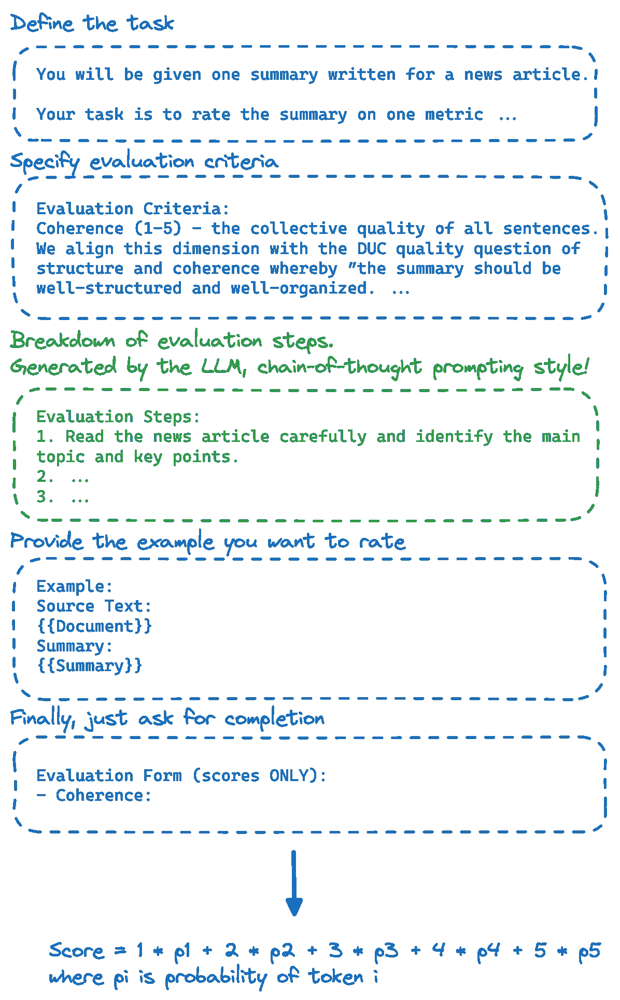
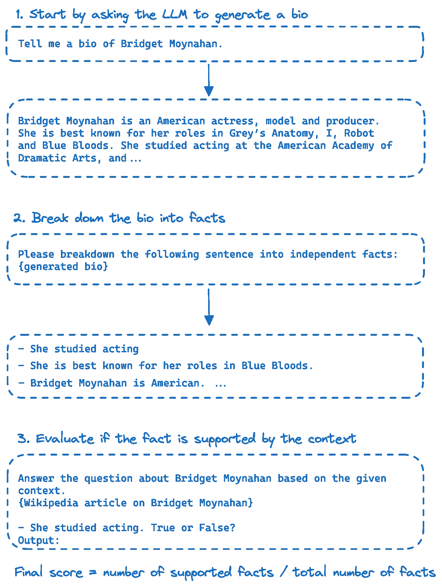

# 使用 LLM 来评估 LLM

> 原文：[`towardsdatascience.com/using-llms-to-evaluate-llms-ce390ae575c6?source=collection_archive---------6-----------------------#2023-11-10`](https://towardsdatascience.com/using-llms-to-evaluate-llms-ce390ae575c6?source=collection_archive---------6-----------------------#2023-11-10)

 [Maksym Petyak](https://medium.com/@petyak.mi?source=post_page-----ce390ae575c6--------------------------------)

·

[关注](https://medium.com/m/signin?actionUrl=https%3A%2F%2Fmedium.com%2F_%2Fsubscribe%2Fuser%2F2ab7d66fcd36&operation=register&redirect=https%3A%2F%2Ftowardsdatascience.com%2Fusing-llms-to-evaluate-llms-ce390ae575c6&user=Maksym+Petyak&userId=2ab7d66fcd36&source=post_page-2ab7d66fcd36----ce390ae575c6---------------------post_header-----------) 发布于 [Towards Data Science](https://towardsdatascience.com/?source=post_page-----ce390ae575c6--------------------------------) ·7 分钟阅读·2023 年 11 月 10 日

--

图片由 OpenAI 的 DALL-E 3 生成。

你可以要求 ChatGPT 以百万种不同的方式进行工作：作为你的营养师、语言导师、医生等。不奇怪我们看到很多基于 OpenAI API 的演示和产品发布。但虽然让 LLM 以某种方式运作很容易，确保它们表现良好并准确完成给定任务则是完全不同的故事。

问题在于我们关注的许多标准都是极其主观的。回答是否准确？回答是否连贯？有没有虚假信息？建立可量化的评估指标很困难。通常，你需要人工判断，但让人类检查大量 LLM 输出是非常昂贵的。

此外，LLM 具有许多可以调整的参数，如提示、温度、上下文等。你可以在特定数据集上微调模型以适应你的使用案例。通过提示工程，即使是让模型深呼吸 [1] 或让你的请求更具情感色彩 [2] 也能改善性能。有很大的调整和实验空间，但在你更改某些内容后，你需要能够判断系统整体上是变得更好还是更差。

由于人工劳动缓慢且昂贵，强烈的动力驱使我们寻找这些更主观标准的自动化指标。一种有趣的方法，正在获得越来越多的关注，是使用 LLM 来评估 LLM 的输出。毕竟，如果 ChatGPT 能生成一个良好的、连贯的回应，它是否也能判断给定的文本是否连贯呢？这打开了一整盒潜在的偏见、技术和机会，让我们深入探讨一下。

# LLM 偏见

如果你对使用 LLM 构建指标和评估器有负面的直觉反应，你的担忧是有根据的。这可能只是延续现有偏见的糟糕方式。

例如，在稍后我们将详细讨论的 G-Eval 论文中，研究人员展示了他们基于 LLM 的评估给予 GPT-3.5 摘要的分数高于人类编写的摘要，即使人类评审更喜欢人类编写的摘要。

另一项研究题为 [“大型语言模型不是公平的评估者”](https://arxiv.org/abs/2305.17926) [3]，发现当被要求选择两个选项中哪个更好时，选项呈现的顺序存在显著偏差。例如，GPT-4 通常更喜欢第一个给出的选项，而 ChatGPT 更喜欢第二个选项。你可以通过将问题的顺序颠倒过来提问，看看 LLM 在回答中的一致性如何。他们随后开发了通过用不同顺序的选项多次运行 LLM 来缓解这种偏差的技术。

# 评估评估器

到头来，我们想知道 LLM 是否能像人类评估员一样好或相似地表现。我们仍然可以将其作为科学问题来处理：

1.  设置评估标准。

1.  让人类和 LLM 根据标准进行评估。

1.  计算人类和 LLM 评估之间的相关性。

通过这种方式，我们可以了解 LLM 与人类评估员的相似程度。

确实，已经有几个类似的研究表明，对于某些任务，LLM 的表现比传统的评价指标要好得多。值得注意的是，我们不需要完美的相关性。如果我们在多个示例上进行评估，即使评估不完美，我们仍然可以得到新系统表现更好还是更差的某种概念。我们还可以使用 LLM 评估器来标记令人担忧的边缘案例，以便人类评估员进一步检查。

让我们来看看一些最近提出的依赖于 LLM 的核心指标和评估器。

# G-Eval

[G-Eval](https://arxiv.org/abs/2303.16634) [4] 的工作方式是首先概述评估标准，然后简单地要求模型给出评分。它可以用于摘要和对话生成任务，例如。

G-Eval 包含以下组件：

1.  **提示。** 定义了评估任务及其标准。

1.  **中间指令。** 概述了评估的中间指令。它们实际上要求 LLM 生成这些步骤。

1.  **评分函数。** 我们不会直接采纳 LLM 的评分，而是查看底层的标记概率以获得最终得分。因此，如果你要求在 1 到 5 之间评分，我们不会仅仅采用 LLM 给出的数字（例如“3”），而是会查看每个等级的概率并计算加权得分。这是因为研究人员发现通常一个数字主导了评估（例如主要输出 3），即使你要求 LLM 给出一个小数值，它仍然倾向于返回整数。

G-Eval 提供的提示用于在 1 到 5 的范围内计算连贯性。你可以在[原始论文](https://arxiv.org/pdf/2303.16634.pdf)中找到更多示例。

研究发现 G-Eval 在显著程度上超越了传统的基于参考的指标，如 BLEU 和 ROUGE，这些指标与人工判断的相关性相对较低。表面上看，这似乎非常简单，因为我们只是要求 LLM 执行评估。我们也可以尝试将任务分解为更小的组件。

# FactScore

[FactScore](https://arxiv.org/abs/2305.14251)（原子性得分中的事实精确度）[5] 是一个用于事实精确度的指标。这里的两个关键概念是将原子事实视为一个单元，并基于特定的知识来源来评估可信度。

在评估中，你将生成内容分解为小的“原子”事实（例如“他出生在纽约”），然后检查每个事实是否得到给定真实知识来源的支持。最终得分是通过将被支持的事实数量除以总事实数量来计算的。

在论文中，研究人员让 LLM 生成人物传记，然后使用关于他们的维基百科文章作为真实来源。LLM 进行与人类相同程序的错误率低于 2%。

FactScore 用于生成布里奇特·莫伊纳汉的传记。请参阅[原始论文](https://arxiv.org/abs/2305.14251)。

# RAGAS

现在，让我们来看看一些检索增强生成（RAG）的指标。使用 RAG 时，你首先在外部知识库中检索相关的上下文，然后让 LLM 根据这些事实回答问题。

[RAGAS](https://arxiv.org/abs/2309.15217v1)（检索增强生成评估）[6]是一个用于评估 RAG 的新框架。它不是一个单一的指标，而是一系列指标的集合。论文中提出的三个指标是忠实度、回答相关性和上下文相关性。这些指标完美地展示了如何将评估分解为 LLMs 的简单任务。

**忠实度**衡量回答在给定上下文中的扎实程度。这与 FactScore 非常相似，你首先将生成的内容分解为一系列陈述，然后询问 LLM 这些陈述是否得到给定上下文的支持。得分是支持的陈述数除以所有陈述的总数。对于忠实度，研究人员发现与人工标注者有很高的相关性。

**回答相关性**试图捕捉回答是否针对实际问题的概念。你可以先要求 LLM 根据答案生成问题。对于每个生成的问题，你可以计算生成的问题与原始问题之间的相似度（通过创建嵌入并使用余弦相似度）。通过这样做*n*次并计算相似度得分的平均值，你将得到最终的回答相关性值。

**上下文相关性**指的是提供的上下文的相关性。也就是说，提供的上下文仅包含回答问题所需的信息。在理想情况下，我们只向 LLM 提供回答问题所需的正确信息。上下文相关性是通过要求 LLM 提取上下文中与答案相关的句子来计算的。然后只需将相关句子的数量除以总句子数以获得最终得分。

你可以在[这里](https://docs.ragas.io/en/latest/getstarted/index.html)找到更多的指标和解释（以及开源的 GitHub 仓库）。

关键点是我们可以将评估转化为更小的子问题。我们不是询问整个文本是否得到上下文支持，而是询问一个小的具体事实是否得到上下文支持。我们不是直接给出答案是否相关的数字，而是要求 LLM 为给定的答案想出一个问题。

# 结论

评估 LLMs 是一个极具趣味的研究课题，随着越来越多的系统进入生产阶段并应用于更多安全关键的环境，这一话题将受到越来越多的关注。

我们还可以使用这些指标来监控 LLMs 在生产中的表现，以便发现输出质量是否开始下降。特别是在错误成本高的应用场景中，如医疗保健，开发保护措施和系统以捕捉和减少错误将是至关重要的。

尽管使用 LLM 作为评估器时肯定存在偏见和问题，我们仍应以研究问题的态度保持开放的心态。当然，人类仍将参与评估过程，但在某些场景中，自动化指标可以部分评估性能。

这些指标不必总是完美的；它们只需要足够好以正确指导产品的开发。

*特别感谢 Daniel Raff 和 Yevhen Petyak 的反馈和建议。*

*最初发表于* [*Medplexity substack*](https://medplexity.substack.com/p/using-llms-to-evaluate-llms)*。*

1.  杨成润等人。[*大语言模型作为优化器*](https://arxiv.org/abs/2309.03409)。arXiv，2023 年 9 月 6 日。*arXiv.org*，[`doi.org/10.48550/arXiv.2309.03409.`](https://doi.org/10.48550/arXiv.2309.03409.)

1.  李成等人。*大语言模型理解并能通过情感刺激进行增强*。arXiv，2023 年 11 月 5 日。*arXiv.org*，[`doi.org/10.48550/arXiv.2307.11760.`](https://doi.org/10.48550/arXiv.2307.11760.)

1.  王培毅等人。[*大语言模型并非公平的评估器*](https://arxiv.org/abs/2305.17926)。arXiv，2023 年 8 月 30 日。*arXiv.org*，[`doi.org/10.48550/arXiv.2305.17926.`](https://doi.org/10.48550/arXiv.2305.17926.)

1.  刘洋等人。[*G-Eval: 使用 GPT-4 进行更好人类对齐的 NLG 评估*](https://arxiv.org/abs/2303.16634)。arXiv，2023 年 5 月 23 日。*arXiv.org*，[`doi.org/10.48550/arXiv.2303.16634.`](https://doi.org/10.48550/arXiv.2303.16634.)

1.  闵世温等人。[*FActScore: 长篇文本生成中细粒度原子级事实精确度评估*](https://arxiv.org/abs/2305.14251)。arXiv，2023 年 10 月 11 日。*arXiv.org*，[`doi.org/10.48550/arXiv.2305.14251.`](https://doi.org/10.48550/arXiv.2305.14251.)

1.  Shahul Es 等人。[*RAGAS: 自动化评估检索增强生成*](https://arxiv.org/abs/2309.15217v1)。1，arXiv，2023 年 9 月 26 日。*arXiv.org*，[`doi.org/10.48550/arXiv.2309.15217.`](https://doi.org/10.48550/arXiv.2309.15217.)
