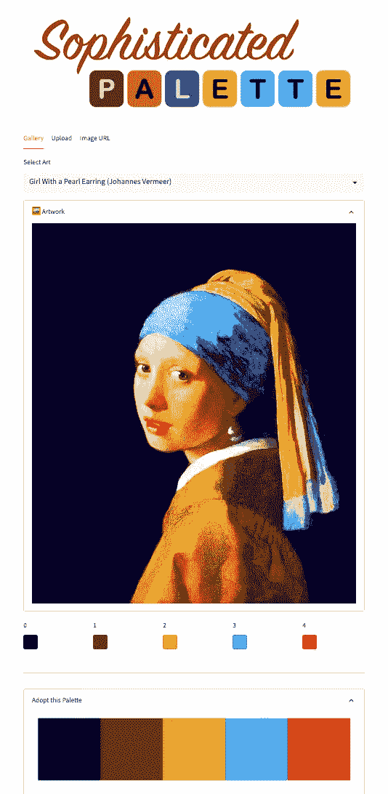
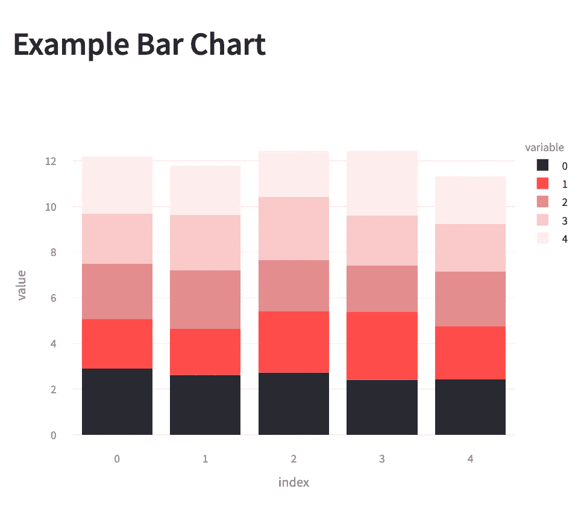
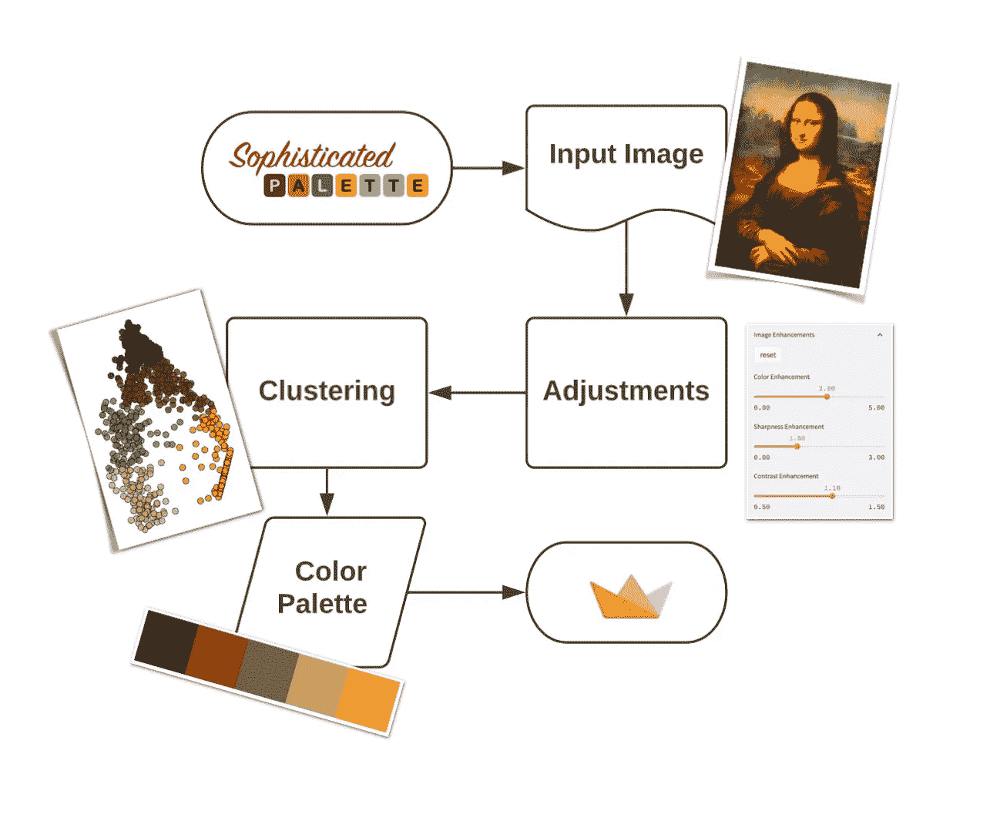
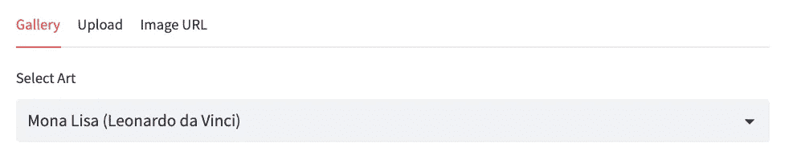
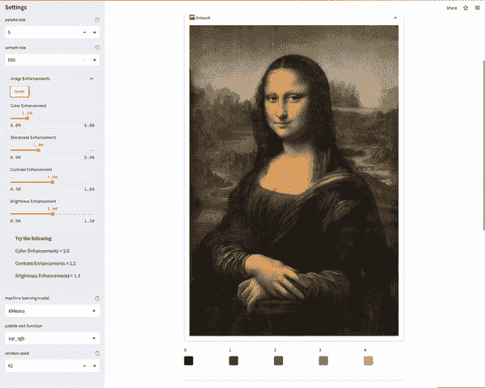
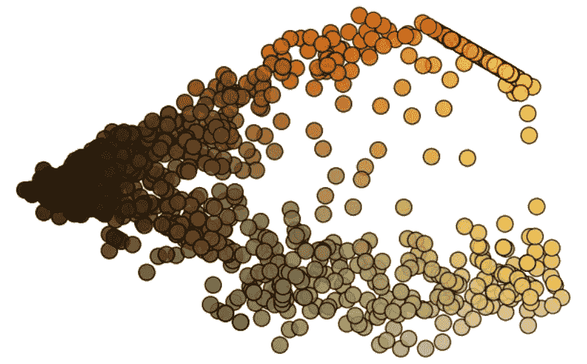
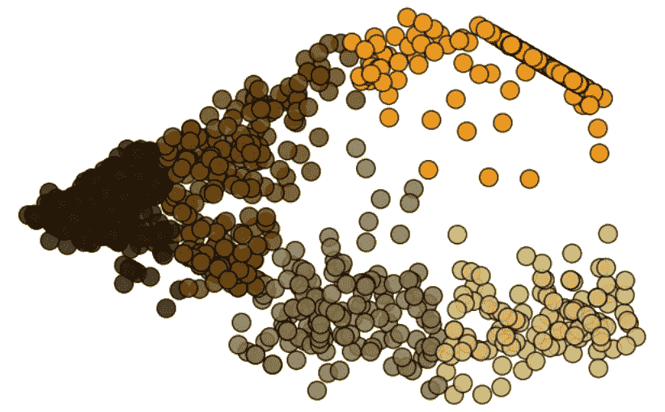
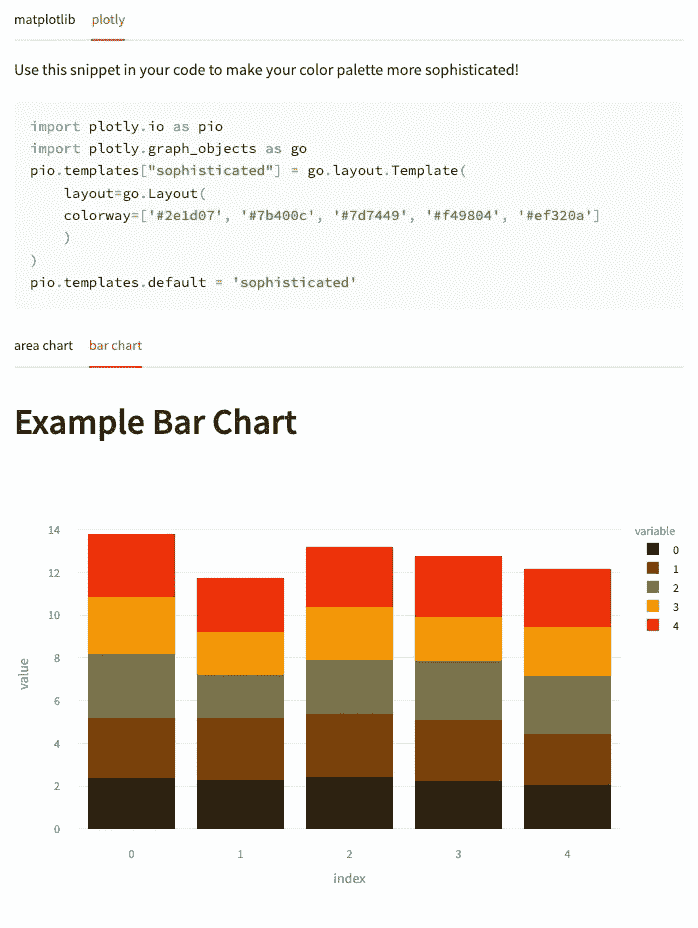

# 使用机器学习创建自定义色彩调色板

> 原文：[`towardsdatascience.com/using-machine-learning-to-create-custom-color-palettes-acb4eeaa06aa`](https://towardsdatascience.com/using-machine-learning-to-create-custom-color-palettes-acb4eeaa06aa)

## 深入了解 Streamlit 的本月应用

[](https://medium.com/@siavashyasini?source=post_page-----acb4eeaa06aa--------------------------------)[](https://towardsdatascience.com/?source=post_page-----acb4eeaa06aa--------------------------------) [Siavash Yasini](https://medium.com/@siavashyasini?source=post_page-----acb4eeaa06aa--------------------------------)

·发表在[Towards Data Science](https://towardsdatascience.com/?source=post_page-----acb4eeaa06aa--------------------------------) ·12 分钟阅读·2023 年 2 月 16 日

--


照片由[Ricardo Gomez Angel](https://unsplash.com/@rgaleriacom?utm_source=medium&utm_medium=referral)提供，[Unsplash](https://unsplash.com/?utm_source=medium&utm_medium=referral)

# **介绍**

我们都喜欢接触新的数据集、探索它，并从中学习。但原始数字本身并不是优秀的讲述者。我们原始的大脑天生对线条、形状和颜色敏感。这就是为什么数字需要被可视化才能讲述一个好的故事。

数据可视化的色彩调色板可能会决定你的数据故事的成败。虽然为你的数据可视化找到完美的颜色组合可能是一个严格且耗时的任务，但你不必完全独自完成。你可以从历史上最伟大的画家和艺术家那里获得灵感。



作者提供的图片

从零开始创建色彩调色板通常是可视化工程师和设计师的专业领域，他们使用色彩理论来组合适合各种可视化目的的和谐调色板（例如，*单色*调色板用于顺序或渐变图，或*互补*调色板用于分类图表）。像`[matplotlib](https://matplotlib.org/)`或`[plotly](https://plotly.com)`这样的可视化包已经提供了令人惊叹的调色板集合。

虽然数据分析师和数据科学家可以使用预制的颜色调色板，但在某些情况下，我们可能想要自己创建自定义调色板。例如，当你想制作一个与公司颜色主题一致的可视化时。例如，你可能想创建一个与喜欢的公司的 logo 主题匹配的柱状图。有一个可以自动为你完成这项工作的应用程序会非常好，对吧？


图片由作者提供



图片由作者提供

我花费了太多时间试图为我的可视化找出完美的颜色组合，因此我决定让这个过程对我自己来说更简单一些。

我使用[Streamlit](https://www.linkedin.com/company/streamlit/) 🎈构建了一个 Web 应用程序，可以从任何输入图像中推断颜色调色板：无论是画作、电影海报、摇滚专辑封面，还是圣诞家庭照片，应有尽有！虽然应用程序可能不会立即提供完美的颜色调色板，但至少会给你一个很好的起点。

那么，让我们看看我是如何构建这个应用程序的。

# 构建颜色调色板推断应用程序



图片由作者提供

为了创建一个颜色调色板推断工具，我们需要几个组件。

在这篇文章中，我将教你：

1.  如何构建一个图像加载组件

1.  如何构建一个带滑块的图像增强组件

1.  如何对像素进行聚类并使用组平均值来制作调色板

1.  如何使用颜色选择器小部件来显示和修改调色板

想要亲自试用这个应用程序吗？你可以在[这里](https://sophisticated-palette.streamlit.app/)查看它，并在[这里](https://github.com/syasini/sophisticated_palette)查看源代码。

## 1\. 如何构建一个图像加载组件

我们的应用程序需要的第一个元素是输入我们想要转换为颜色调色板的图像的方法。我们可以通过三种方式做到这一点：

+   从现有的图像或艺术品库中加载。

+   使用`st.file_uploader()`将新的图像文件上传到应用程序中。

+   从 URL 下载一张新图像到应用程序中。

我们可以使用`st.tabs()`构建三个不同的选项卡，让我们可以无缝切换这三种输入模式。



使用`st.tabs()`构建的图像输入源。

由于 Streamlit 运行应用程序的方式是从上到下，后来的输入模式会获得更高的优先级并覆盖之前加载器的输出。例如，由于你将输入模式按 Gallery → File Uploader → Image URL 的顺序排列，如果你将图像保存到变量`img`中，则画廊加载的任何内容都会被文件上传器和 URL 下载器的输出覆盖。

当用户使用层级较低的加载器加载图像时，你可以为用户添加弹出警告，如果层级较高的加载器已经加载了图像。

这就是代码的样子：

```py
# define three tabs for the three loading methods
gallery_tab, upload_tab, url_tab = st.tabs(["Gallery", "Upload", "Image URL"])
```

```py
with gallery_tab:
    ...

# raise a warning if file uploader or URL downloader have already loaded an image 
    if st.session_state.get("file_uploader") is not None:
        st.warning("To use the Gallery, remove the uploaded image first.")
    if st.session_state.get("image_url") not in ["", None]:
        st.warning("To use the Gallery, remove the image URL first.")

  img = ...

with upload_tab:
  img = ...

  # raise a warning if the URL downloader has already loaded an image
    if st.session_state.get("image_url") not in ["", None]:
        st.warning("To use the file uploader, remove the image URL first.")

with url_tab:
  img = ...
```

因此，如果你尝试从画廊加载一个预先存在的图像，但在 URL 下载器中已经存在一个链接，你将需要先删除那个链接。这可能不是最优雅的解决方案，但它有效！

现在，继续实现每一部分的加载方法。

**画廊视图**

对于画廊视图，我们可以简单地将一些图像保存在公共存储库中，并直接在应用程序中加载这些图像（我在这里使用 GitHub，但你也可以使用 AWS S3 或 Google Cloud Storage）。`st.selectbox` 包含我保存的艺术品名称，因此用户可以通过从下拉菜单中选择来加载它们。实现代码如下。

```py
import streamlit as st
from PIL import Image

with gallery_tab:
    options = list(gallery_dict.keys())
    file_name = st.selectbox("Select Art",
                             options=options, 
                             index=options.index("Mona Lisa (Leonardo da Vinci)")
                             )
    img_file = gallery_dict[file_name]

    if st.session_state.get("file_uploader") is not None:
        st.warning("To use the Gallery, remove the uploaded image first.")
    if st.session_state.get("image_url") not in ["", None]:
        st.warning("To use the Gallery, remove the image URL first.")

    img = Image.open(img_file)
```

`gallery_dict` 是一个字典，包含文件名和图像文件路径作为键值对，`PIL.Image.open()` 用于加载这些文件。结果保存在一个名为 `img` 的变量中。

**文件上传器**

实现文件上传器非常简单，因为已经有一个 Streamlit 小部件。它叫做（你能猜到吗？）`st.file_uploader()`！

实现代码如下：

```py
with upload_tab:
    img_file = st.file_uploader("Upload Art", key="file_uploader")
    if file is not None:
        try:
            img = Image.open(img_file)
        except:
            st.error("The file you uploaded does not seem to be a valid image. Try uploading a png or jpg file.")

    if st.session_state.get("image_url") not in ["", None]:
        st.warning("To use the file uploader, remove the image URL first.")
```

这个小部件允许你上传一个文件，然后你可以将其传递给 `PIL.Image.open()` 来加载。如果文件实际上不是图像文件，或者格式与 `PIL.Image` 期望的不一致，这一步可能会失败。为了防止这个问题发生，我们可以将加载部分放入一个 `try/except` 块中。

⚠️ 我在这里使用这个代码块作为万用块，以避免在加载文件时出现各种意外错误。然而，通常不推荐在没有实际指定要绕过的`Exception`类型的情况下使用`except`，尤其是因为你可能不知道的致命错误会默默地通过这个代码块，使得调试代码变得困难。

**URL 下载器**

说实话！虽然上传文件是用户加载他们希望推断颜色调色板的自定义图像的好方法，但这不是最简单的方法。用户需要找到图像（如果他们还没有的话），在本地下载，然后上传到应用程序中。听起来简单，但在实际操作中却很麻烦。

为了消除这个障碍，我们可以在应用程序中添加一个 URL 下载器，这样用户可以简单地复制图像链接（例如，从 Google 搜索结果中），然后直接粘贴到应用程序中。为了实现这一点，我们需要 `requests` 模块，它获取 URL 的内容，以及 `io.BytesIO` 函数，它使得内容能够被 `PIL.Image.open()` 理解。实现起来简单且与文件上传器的实现类似。

```py
import requests
from io import BytesIO

with url_tab:
    url_text = st.empty()

    url = url_text.text_input("Image URL", key="image_url")

    if url != "":
        try:
            response = requests.get(url)
            img = Image.open(BytesIO(response.content))
        except:
            st.error("The URL does not seem to be valid.")
```

## 2\. 如何使用滑块构建图像增强组件

现在我们已经上传了图像，我们准备推断颜色调色板，对吗？其实不完全是。

你加载到应用程序中的原始图像可能未经过颜色推断的优化。颜色可能过于暗淡，画布上的亮度或对比度可能不足。这就是为什么你需要首先进行一些图像调整。



为了将增强功能应用于图像，我们可以使用 `PIL.ImageEnhance`。API 非常简单。例如，如果你想将图像（加载到 `img` 中）的颜色增强因子设置为 2.5，你可以运行：

```py
img = ImageEnhance.Color(img)
img = img.enhance(2.5)
```

只需将 `Color` 替换为 `Shapness`、`Contrast` 或 `Brightness`，即可分别调整这些图像属性。我们可以创建四个不同的滑块，将每个属性的值分配给这些滑块，然后编写单独的代码块，依次将增强应用于图像。但我们是优秀的程序员，我们尽量保持代码优雅和 DRY（Don’t Repeat Yourself）。所以让我们以更实用的方式来处理这个问题。

我们可以定义一个字典，其中包含我们希望应用的所有增强功能作为键，值表示我们希望在应用程序中分配给这些增强功能的滑块范围和步长。

```py
enhancement_range = {
  # "enhancement_type": [min, max, step_size]
    "Color": [0., 5., 0.2], 
    "Sharpness": [0., 3., 0.2], 
    "Contrast": [0.5, 1.5, 0.1], 
    "Brightness": [0.5, 1.5, 0.1]
}
enhancement_categories = enhancement_range.keys()
# put adjustment sliders inside an expander 
enh_expander = st.sidebar.expander("Image Enhancements", expanded=False)
# create a reset button that resets all enhancements to default value (1.0)
with enh_expander:
    if st.button("reset"):
        for cat in enhancement_categories:
            if f"{cat}_enhancement" in st.session_state:
                st.session_state[f"{cat}_enhancement"] = 1.0
# create sliders for each enhancement category using the dictionary values (min, max, step_size)
enhancement_factor_dict = {
    cat: enh_expander.slider(f"{cat} Enhancement", 
                            value=1., 
                            min_value=enhancement_range[cat][0], 
                            max_value=enhancement_range[cat][1], 
                            step=enhancement_range[cat][2],
                            key=f"{cat}_enhancement")
    for cat in enhancement_categories
}
```

使用这种方法，如果我们想更改增强类型或值范围，我们只需更改原始字典。

现在我们已经在侧边栏上放置了滑块，剩下的就是使用 `ImageEnhance` 将这些值应用于图像。

```py
from PIL import ImageEnhance
for cat in enhancement_categories:
  # apply the enhancement class to the image
  # e.g. for cat='Color' this would be the same as 
    # img = ImageEnhance.Color(img)
    img = getattr(ImageEnhance, cat)(img)

  # apply the enhencement value from the corresponding st.slider
    img = img.enhance(enhancement_factor_dict[cat])
```

**显示图像**

现在我们已经加载了图像，剩下的就是使用 `st.image()` 将其显示在应用程序中：

```py
with st.expander("🖼  Artwork", expanded=True):
    st.image(img, use_column_width=True)
```

和 *瞧*！

## 3\. 如何聚类像素并使用组平均值制作调色板

最后，进入有趣的部分！使用机器学习推断色彩调色板。

这里的想法非常简单。一幅图像是像素的集合，每个像素都有三个值：R、G、B。这些值基本上告诉你每个像素包含多少红色、绿色和蓝色。为了推断色彩调色板，像素在画布上的实际位置基本上是无关紧要的。重要的是它在 (R, G, B) 坐标空间中的位置。因此，在继续之前，让我们将图像分解到这个新的坐标系统中，并摆脱像素在图像上的实际位置。

```py
r, g, b = np.array(img).reshape(-1, 3).T
df_rgb = pd.DataFrame({"R": r, "G": g, "B": b}).sample(n=sample_size)
```

如果我们查看 RGB 坐标中的像素，我们可以将相互接近的像素分组，并使用像素的平均值来表示每个组——实际上是我们调色板中的一种颜色。例如，如果我们想从蒙娜丽莎的增强图像中构建一个 5 色调色板，我们需要首先查看 RGB 空间中像素的分布（这里通过 PCA 算法投影到二维）：



原始像素颜色在 (R, G, B) 空间中的二维 PCA 分解



然后我们选择 5 个不同的簇，并将每个簇的平均值分配给调色板中的一个槽。

使用 K-means 算法将原始采样像素分配到 5 个不同的簇

显然，我们不需要手动完成这个工作。有一种方便的机器学习算法叫做 K-means 聚类，它可以一举完成这个任务。我们唯一需要提供的参数是聚类的数量，也就是我们的调色板大小。这是使用 `sklearn.cluster.KMeans` 实现的样子。

```py
from sklearn.cluster import KMeans
palette_size = st.sidebar.number_input("palette size", 
                    min_value=1, 
                    max_value=20, 
                    value=5, 
                    step=1, 
                    help="Number of colors to infer from the image.")
model = KMeans(n_clusters=palette_size)
clusters = model.fit_predict(df_rgb)

palette = model.cluster_centers_.astype(int).tolist()
```

就这样！我们现在有了我们的调色板，只需要将其返回给应用中的用户。

ℹ️ 尽管我们在这里使用了流行的 R、G、B 像素分解，但值得注意的是，这不是分解颜色的唯一方法。我们本可以在 HSV（色调、饱和度、明度）空间中进行像素聚类，这将以不同的方式分布像素，从而得到不同的调色板。

## 4\. 如何使用色彩选择器控件

不知为何，我感觉我决定构建这个应用的潜意识原因是为了使用 Streamlit 的神奇 `st.color_picker()` 控件！这个控件的好处在于，你可以同时展示从图像中推断出的调色板颜色，并且如果愿意的话，还可以更改它们。这非常完美，因为正如我之前提到的，从应用中得到的颜色可能并不是针对你特定用例的 100% 完美，而只是一个很好的起点。所以你可能需要稍微调整一下，在实际用于你的可视化之前做一些修饰。

我们不希望调色板在应用程序中占据页面的一半，因此让我们把它们分别放在不同的列中。

```py
columns = st.columns(palette_size)
for i, col in enumerate(columns):
    with col:        
        st.session_state[f"col_{i}"]= \\
				    st.color_picker(label=str(i), 
                                    value=palette[i], 
                                    key=f"pal_{i}")
						  							value=palette[i], 
							  						key=f"pal_{i}")
```

美极了！

最后一件要做的事情是为用户提供一个可以在日常工作中使用的实用产品。如果数据分析师或数据科学家使用这个应用来推断一个色彩调色板，他们很可能会在 `matplotlib` 或 `plotly` 中使用这个调色板来应用于他们的可视化中。为什么不提供一个代码片段来处理这个问题，这样他们就不必将每一个十六进制颜色代码从调色板中复制粘贴到他们的编码环境中。



图片由作者提供

感谢 Streamlit 的 `st.code()` 控件，可以一键复制整个代码块！

# 总结

就这样！现在你有了一个功能齐全的调色板推断应用，可以帮助你弄清楚列奥纳多·达·芬奇是用什么颜色让蒙娜丽莎的脸上带上微笑的！

在这篇文章中，我们介绍了很多 Streamlit 的功能，特别是像 `st.image`、`st.tabs`、`st.file_uploader` 和 `st.color_picker` 这样的控件。不过为了简洁起见，我们没有涵盖所有内容，所以请随时跳转到 [源代码](https://github.com/syasini/sophisticated_palette) 仓库，自己查看所有细节。你可以看到，我在多个应用运行间保持一致性时，依赖了大量的 `st.session_state`。

我们学会了

+   构建一个图像加载组件（加载现有图像、上传或 URL 下载）。

+   构建一个带滑块的图像增强组件。

+   使用 K-means 将像素聚类，并使用组平均值来构建调色板。

+   使用颜色选择器小部件将调色板返回给最终用户。

我很高兴能带你走过所有这些步骤，希望你喜欢阅读/浏览这篇文章，并希望你学到了一些东西。

你可以亲自查看这个应用，[这里](https://sophisticated-palette.streamlit.app/)。我很想听听你的想法、问题、评论和反馈！通过[LinkedIn](https://www.linkedin.com/in/siavash-yasini/)或我的[网站](https://www.siavashyasini.com/)与我联系。

*这篇文章与* [*Ksenia Anske*](https://www.linkedin.com/in/kseniaanske/) *及团队* [*Streamlit*](https://streamlit.io/) *在* [*Snowflake*](https://www.snowflake.com/en/) *的合作下编写。请查看这篇文章在 Streamlit 博客上发布的最终版本* [*这里*](https://blog.streamlit.io/create-a-color-palette-from-any-image/)*。*

*除非另有说明，所有图片均由作者提供。*
