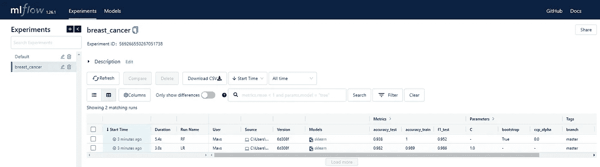

# 使用 MLflow 和 ATOM 跟踪所有机器学习实验，而无需额外的代码

> 原文：[`towardsdatascience.com/using-mlflow-with-atom-to-track-all-your-machine-learning-experiments-without-additional-code-583128687d45?source=collection_archive---------19-----------------------#2023-03-13`](https://towardsdatascience.com/using-mlflow-with-atom-to-track-all-your-machine-learning-experiments-without-additional-code-583128687d45?source=collection_archive---------19-----------------------#2023-03-13)

## 开始仅通过更改一个参数来存储模型、参数、管道、数据和图表

[](https://tvdboom.medium.com/?source=post_page-----583128687d45--------------------------------)[](https://towardsdatascience.com/?source=post_page-----583128687d45--------------------------------) [Marco vd Boom](https://tvdboom.medium.com/?source=post_page-----583128687d45--------------------------------)

·

[关注](https://medium.com/m/signin?actionUrl=https%3A%2F%2Fmedium.com%2F_%2Fsubscribe%2Fuser%2Fe2091b627921&operation=register&redirect=https%3A%2F%2Ftowardsdatascience.com%2Fusing-mlflow-with-atom-to-track-all-your-machine-learning-experiments-without-additional-code-583128687d45&user=Marco+vd+Boom&userId=e2091b627921&source=post_page-e2091b627921----583128687d45---------------------post_header-----------) 发表在 [Towards Data Science](https://towardsdatascience.com/?source=post_page-----583128687d45--------------------------------) ·6 分钟阅读·2023 年 3 月 13 日[](https://medium.com/m/signin?actionUrl=https%3A%2F%2Fmedium.com%2F_%2Fvote%2Ftowards-data-science%2F583128687d45&operation=register&redirect=https%3A%2F%2Ftowardsdatascience.com%2Fusing-mlflow-with-atom-to-track-all-your-machine-learning-experiments-without-additional-code-583128687d45&user=Marco+vd+Boom&userId=e2091b627921&source=-----583128687d45---------------------clap_footer-----------)

--

[](https://medium.com/m/signin?actionUrl=https%3A%2F%2Fmedium.com%2F_%2Fbookmark%2Fp%2F583128687d45&operation=register&redirect=https%3A%2F%2Ftowardsdatascience.com%2Fusing-mlflow-with-atom-to-track-all-your-machine-learning-experiments-without-additional-code-583128687d45&source=-----583128687d45---------------------bookmark_footer-----------)

照片由 [Hans Reniers](https://unsplash.com/@hansreniers?utm_source=medium&utm_medium=referral) 提供，来源于 [Unsplash](https://unsplash.com/?utm_source=medium&utm_medium=referral)

## **介绍**

[MLflow Tracking 组件](https://mlflow.org/docs/latest/tracking.html)是一个 API 和 UI，用于记录参数、代码版本、指标和输出文件，在运行机器学习实验时用于后续结果的可视化。

在本故事中，我们将解释如何使用[ATOM](https://github.com/tvdboom/ATOM)库轻松跟踪你的模型、参数、管道、数据和图表。ATOM 是一个开源 Python 包，旨在帮助数据科学家探索机器学习管道。

**注意**：本故事侧重于使用 ATOM 的实验跟踪功能。讲解库的基础知识不在本故事范围内。如果你想要一个温和的库介绍，请阅读这篇其他故事。

## 功能概述

通过在*atom*的构造函数中为`[experiment](https://tvdboom.github.io/ATOM/v5.1/API/ATOM/atomclassifier/#atomclassifier-experiment)`参数分配名称来开始跟踪实验。每个模型都使用单独的运行进行跟踪。当未配置后端时，数据会存储在`./mlruns`本地。要配置后端，请在初始化*atom*之前，在笔记本或 IDE 中使用[mlflow.set_tracking_uri](https://www.mlflow.org/docs/latest/python_api/mlflow.html#mlflow.set_tracking_uri)。这不会影响当前活动的运行（如果存在），但会对后续运行生效。在终端运行`mlflow ui`以打开 MLflow 的跟踪 UI，并在[`localhost:5000`](http://localhost:5000)查看。

**注意：** 在[Databricks](https://databricks.com/)上使用 ATOM 时，实验名称应包含存储的完整路径，例如`/Users/username@domain.com/experiment_name`。

跟踪以下元素：

**标签**

运行将自动标记为模型的全名，[分支](https://tvdboom.github.io/ATOM/latest/user_guide/data_management/#branches)

模型训练来源及拟合模型所需时间。

通过`ht_params`参数添加其他自定义标签，例如`atom.run(["LR", "RF"], ht_params={"tags": {"tag1": 1}})`。

**参数**

初始化时使用的所有参数都会被跟踪。传递给 fit 方法的额外参数**不会**被跟踪。

**模型**

模型的估算器被存储为工件。可以通过*atom*的`[log_model](https://tvdboom.github.io/ATOM/v5.1/API/ATOM/atomclassifier/#atomclassifier-log_model)`属性来关闭此选项，例如`atom.log_model = False`。

**超参数调整**

如果进行[超参数调整](https://tvdboom.github.io/ATOM/latest/user_guide/training/)，每个试验都会作为模型主运行中的嵌套运行进行跟踪。可以通过*atom*的`[log_ht](https://tvdboom.github.io/ATOM/v5.1/API/ATOM/atomclassifier/#atomclassifier-log_ht)`属性来关闭此选项，例如`atom.log_ht = False`。

**指标**

所有指标结果都会被追踪，不仅是在训练过程中，还包括在稍后调用 [evaluate](https://tvdboom.github.io/ATOM/v5.1/API/ATOM/atomclassifier/#atomclassifier-evaluate) 方法时。在训练验证期间计算的指标也会被存储。

**数据集**

用于拟合和评估模型的训练和测试集可以作为`.csv`文件存储到运行的工件中。可以使用*atom*的`[log_data](https://tvdboom.github.io/ATOM/v5.1/API/ATOM/atomclassifier/#atomclassifier-log_data)`属性开启此选项，例如`atom.log_data = True`。

**管道**

模型的管道（由 [export_pipeline](https://tvdboom.github.io/ATOM/v5.1/API/ATOM/atomclassifier/#atomclassifier-export_pipeline) 方法返回）可以作为一个工件进行存储。可以使用*atom*的`[log_pipeline](https://tvdboom.github.io/ATOM/v5.1/API/ATOM/atomclassifier/#atomclassifier-log_pipeline)`属性开启此选项，例如`atom.log_pipeline = True`。

**图表**

默认情况下，图表作为`.html`工件存储在所有与图表中显示的模型对应的运行中。如果指定了`filename`参数，则会以该名称存储，否则使用方法的名称。可以使用*atom*的`[log_plots](https://tvdboom.github.io/ATOM/v5.1/API/ATOM/atomclassifier/#atomclassifier-log_plots)`属性关闭此选项，例如`atom.log_plots = False`。

## 示例

了解功能的最简单方法是通过示例。我们按照通常的方式初始化*atom*，并指定`experiment`参数。这里提供的名称是使用的 mlflow 实验的名称。如果没有该名称的实验，则会创建一个新的。

```py
from atom import ATOMClassifier
from sklearn.datasets import load_breast_cancer

X, y = load_breast_cancer(return_X_y=True, as_frame=True)

atom = ATOMClassifier(X, y, experiment="breast_cancer")
```

让我们指定一下我们也想记录数据和管道。这两个选项默认是关闭的。

```py
atom.log_data = True
atom.log_pipeline = True
```

按照通常的方式训练模型。所有选择的指标都会被记录。

```py
atom.run(models=["LR", "RF"], metric=["f1", "accuracy", "precision"])
```

现在在终端中运行`mlflow ui`打开 UI。每个模型都有其单独的运行。



每次运行，*atom*会存储：

+   模型的参数：


+   训练集和测试集上的指标分数：


+   预定义标签和自定义标签（如果指定）：


+   工件，包括估计器和管道的 pickle 文件，以及训练和测试集的 csv 文件。


额外的指标（使用 [evaluate](https://tvdboom.github.io/ATOM/latest/API/ATOM/atomclassifier/#atomclassifier-evaluate) 方法计算）和显示模型的图表也会被添加到运行中。

```py
atom.evaluate()
```


```py
atom.plot_gains()
```


**超参数调优**

在运行 [超参数调优](https://tvdboom.github.io/ATOM/latest/user_guide/training/#hyperparameter-tuning) 时，研究的每个试验都会作为嵌套运行添加到主运行中。

```py
atom.run(models="LGB", n_trials=10)
```


嵌套运行的名称为 `<model_name> — <trial_number>`。它们的指标分数不是在训练集或测试集上，而是在验证集上，验证集是用于验证该特定试验的训练集子集（其余部分用于拟合估计器）。测试集在超参数调整期间不会使用，以避免数据泄露。

**注意：** 数据和管道不会存储在嵌套运行中。

**训练中的验证**

一些 [模型](https://tvdboom.github.io/ATOM/v5.1/user_guide/models/#predefined-models) 允许 [训练中的验证](https://tvdboom.github.io/ATOM/latest/user_guide/training/#in-training-validation)。这意味着在每轮训练后（对于线性模型是一轮迭代，对于提升树模型是增加的一棵树），估计器在训练集和测试集上使用 **第一个指标** 进行评估。验证分数存储在 `evals` 指标中，也在 mlflow 中跟踪。


**注意：** `evals` 指标在嵌套运行中不会计算。

## DAGsHub 集成

ATOM 内置了与 [DAGsHub](https://dagshub.com/) 的集成，这是一种基于开源工具的数据科学优化平台，面向开源社区。要将你的 mlflow 实验存储在 DAGsHub 仓库中，请在 `experiment` 参数中输入 `dagshub:<experiment_name>`（而不仅仅是实验名称）。如果仓库不存在，将创建一个新的公共仓库。

一个简约的示例如下：

```py
from atom import ATOMClassifier
from sklearn.datasets import load_breast_cancer

X, y = load_breast_cancer(return_X_y=True, as_frame=True)

atom = ATOMClassifier(X, y, experiment="dagshub:breast_cancer")

atom.run(models=["LR", "RF"])
```


**注意：** 如果在运行 atom 的构造函数时已登录到你的 DAGsHub 账户，浏览器页面会自动打开以授予访问权限。如果没有，请阅读 [这里](https://dagshub.com/docs/integration_guide/mlflow_tracking/#3-set-up-your-credentials) 了解如何设置你的 DAGsHub 凭据。

## 结论

我们展示了使用 ATOM 库跟踪机器学习实验的简便性。只需最少的代码更改，现在可以存储每个训练模型的估计器、参数、管道、数据和图表。

有关 ATOM 的更多信息，请查看软件包的 [文档](https://tvdboom.github.io/ATOM/)。对于错误或功能请求，请随时在 [GitHub](https://github.com/tvdboom/ATOM) 上提出问题或发邮件给我。

相关故事：

+   `towardsdatascience.com/atom-a-python-package-for-fast-exploration-of-machine-learning-pipelines-653956a16e7b`

+   `towardsdatascience.com/how-to-test-multiple-machine-learning-pipelines-with-just-a-few-lines-of-python-1a16cb4686d`

+   `towardsdatascience.com/from-raw-data-to-web-app-deployment-with-atom-and-streamlit-d8df381aa19f`

+   `towardsdatascience.com/exploration-of-deep-learning-pipelines-made-easy-e1cf649892bc`

+   `towardsdatascience.com/deep-feature-synthesis-vs-genetic-feature-generation-6ba4d05a6ca5`

+   `towardsdatascience.com/from-raw-text-to-model-prediction-in-under-30-lines-of-python-32133d853407`

+   `towardsdatascience.com/how-to-make-40-interactive-plots-to-analyze-your-machine-learning-pipeline-ee718afd7bc2`

+   `towardsdatascience.com/machine-learning-on-multioutput-datasets-a-quick-guide-ebeba81b97d1`

参考资料：

+   所有图表和图片（除特色图片外）均由作者创建。
