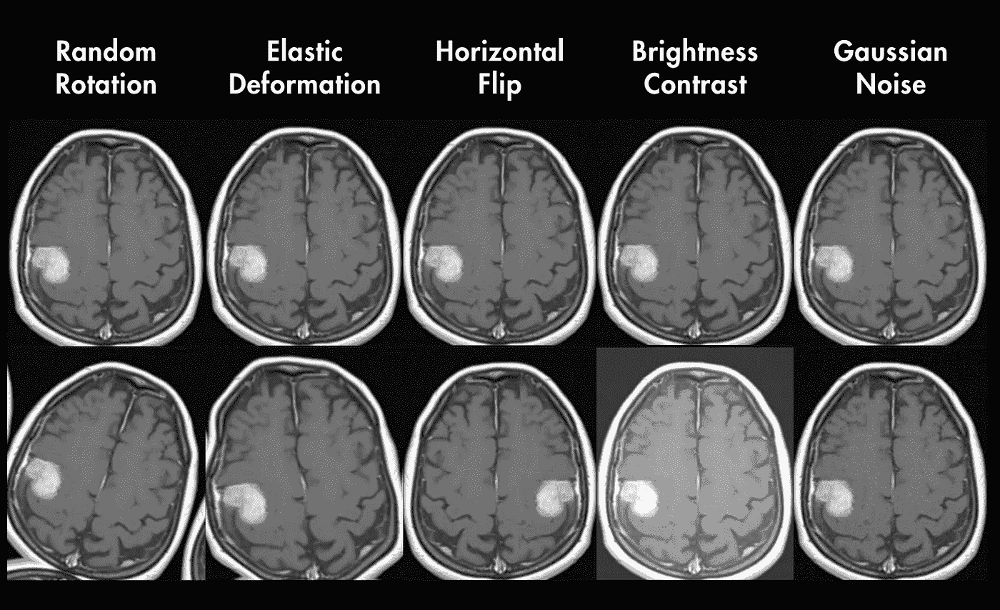

# 使用多任务和集成学习预测阿尔茨海默病的认知功能

> 原文：[`towardsdatascience.com/using-multi-task-and-ensemble-learning-to-predict-alzheimers-cognitive-functioning-7b46fe09f9ff`](https://towardsdatascience.com/using-multi-task-and-ensemble-learning-to-predict-alzheimers-cognitive-functioning-7b46fe09f9ff)

## 个人故事与数据科学

## 认识到我在机器学习领域的影响力，源于认知科学和我的第一篇科学论文的发表

 [Christabelle Pabalan](https://medium.com/@christabellecp?source=post_page-----7b46fe09f9ff--------------------------------)

·发布于 [Towards Data Science](https://towardsdatascience.com/?source=post_page-----7b46fe09f9ff--------------------------------) ·11 分钟阅读·2023 年 6 月 9 日

--

图片由 [Alina Grubnyak](https://unsplash.com/it/@alinnnaaaa?utm_source=unsplash&utm_medium=referral&utm_content=creditCopyText) 拍摄，来源于 [Unsplash](https://unsplash.com/s/photos/neuroscience?utm_source=unsplash&utm_medium=referral&utm_content=creditCopyText)

在我之前的一篇 [文章](https://medium.com/towards-data-science/why-my-cognitive-science-degree-was-a-great-foundation-for-data-science-and-machine-learning-f5838b527d40) 中，我详细描述了我从认知科学转向机器学习的经历以及对我的困惑症。 在那篇文章中，我提到：

> “一个想法开始慢慢展开——也许，我的背景 [在认知科学] 提供了比我最初预期的更为坚实的基础。”

在这篇文章中，我将分享一个具体的例子，展示我的认知科学背景如何使我能够 1) 为在神经科学领域对我个人具有重要意义的疾病开发创新的建模方法，以及 2) 构建通常在传统讨论中被忽视的独特联系。

通过这次经历，我意识到深度学习领域虽然潜力巨大，但仍处于初期阶段，这提醒了我它对传统和非传统背景的个人都提供了包容性的机会。

# 大脑网络实验室

完成本科学位后，我心中萦绕着一种感觉，即虽然有不错的理论基础，但缺乏有效应用这些工具的实践理解。我设想了一个理想的场景，在神经科学或心理健康领域应用这些工具。

因此，当有机会申请[Wicklow 医学中的人工智能研究计划](https://wamri.ai/#wamri)时，我感到非常激动，这意味着我将致力于在我的研究生项目中进行一个以“利用人工智能模型推动医疗研究，包括肿瘤学、心脏病学和神经学等领域”的[实践](https://www.usfca.edu/arts-sciences/programs/graduate/data-science/practicum)。

图 I. 由 cottonbro studio 在 Pexels 上拍摄（[来源](https://www.pexels.com/photo/medical-imaging-of-the-brain-5723875/)）

在这个项目中，我被接受了🎉，最终在 UCSF 的[脑网络实验室](https://radiology.ucsf.edu/research/labs/brain-networks-lab)工作。该实验室的重点是：

> “通过将计算工具应用于神经影像数据，理解健康和疾病脑部的机制。”

我迫不及待地等待着有关实践的更多细节；兴奋之情在我内心涌动，期待开始弥合理论与实践之间的差距。最后，当我收到任务时，期待已久的时刻终于到来了。

## 预测阿尔茨海默病患者的认知评分

**任务：** 预测阿尔茨海默病患者的认知评分

**问题：** 我完全**没有经验**于计算机视觉。

我的*第一次印象*是，“*我怎么可能对此做出贡献？*”自然，恐惧和冒名顶替综合症的声音想要显现出来。此外，我在深度学习方面的经验有限——几乎可以忽略不计——而且，职位由于任务复杂性有被取消的风险。

然而，我确实拥有的是全面理解阿尔茨海默病的动力，对受影响者的真诚同情，以及利用我们现有的计算工具做出贡献的热情。此外，理论与实践之间的脱节激发了我做出贡献和成长的决心。

# 生活方式与阿尔茨海默病的相关性

我*第二次印象*是，仅仅依赖 MRI 数据来预测认知评分似乎有些奇怪，因为已知的人口统计学、遗传学和生活方式与阿尔茨海默病的相关性。

图 II. 作者拍摄。引用见文章末尾。

在研究中，“[肠道微生物群、衰老、现代生活方式与阿尔茨海默病之间的联系](https://pubmed.ncbi.nlm.nih.gov/32257964/)”，作者强调“已经在阿尔茨海默病患者中报道了肠道微生物群的显著……变化……**肠道微生物群对负面的外部生活方式因素**，如饮食、睡眠剥夺、昼夜节律干扰、慢性噪音和久坐行为**非常敏感，这些也被认为是**发病的**重要风险因素**。

然而，我知道我需要集中精力完成任务；尽管如此，好奇心仍然驱使我去探询是否有可能获得人口统计学和临床数据的访问权限，以防机会出现…… **搓手**

我们稍后会再讨论这个问题。

# 测量认知功能

## ADAS Cog-11 分数

与此同时，我继续在仅使用 MRI 数据的基础上进行建模方法的头脑风暴。然而，你可能会想，我们如何定义‘认知功能’？换句话说，我们的预测目标是什么？我们的目标标签是什么？

我们正在使用**ADAS-Cog-11**来测量认知功能——这是一个用于评估阿尔茨海默病患者记忆、语言和实践能力退化的指标。根据[维基百科](https://en.wikipedia.org/wiki/ADAS-Cog)，"它是最广泛使用的认知量表之一……并被认为是评估抗痴呆治疗的‘金标准’"。

ADAS-Cog-11 分数来源于以下十一项认知任务：

图 III. 由作者基于[这里](https://www.ncbi.nlm.nih.gov/pmc/articles/PMC5929311/table/jad-63-jad170991-t001/?report=objectonly)的信息拍摄的照片

你可以在[这里](https://www.ncbi.nlm.nih.gov/pmc/articles/PMC5929311/table/jad-63-jad170991-t001/?report=objectonly)找到任务的详细总结。

## 简单的卷积神经网络

为了开始实验，我们在 MRI 数据上训练了一个基准卷积神经网络（CNN）模型，以预测认知评分。

这个简单的 CNN 包含以下层：第一卷积层、池化层、第二卷积层、池化层、一个 2 层全连接神经网络，以及一个回归层。

结果并不显著，交叉验证的 R2 范围从 0.33 到 0.52，测试 R2 为 0.47。尽管如此，考虑到对这个简单模型的期望较低，我们还是很高兴建立了一个起始基准，今后可以在此基础上进行改进。

## 多任务学习与捕捉大脑结构上下文

下一步是研究痴呆症的结构性预测因素。这导致了一些文献，突出了灰质和白质体积与痴呆症严重程度之间的独立关系。

根据[Stout et al](https://pubmed.ncbi.nlm.nih.gov/8759980/)，

> “定量磁共振方法提供了有力证据，表明皮质灰质体积（可能反映萎缩）和异常白质体积与可能的阿尔茨海默病痴呆的严重程度独立相关：较低的灰质和较高的异常白质体积与更严重的痴呆相关。”

从中，一个理论浮现出来：如果模型能够捕捉灰质和白质体积的信息，它应该会提升预测能力。

那我们该如何做到这一点呢？

简短的回答是：✨ 多任务学习 ✨

> “多任务学习是机器学习的一个子领域，其中**多个学习任务同时解决**，同时利用任务之间的共性和差异 […] 利用相关任务训练信号中包含的领域信息 […] **每个任务学到的东西可以帮助其他任务学得更好**”
> 
> — 多任务学习，2021 年 7 月 6 日。在 [*维基百科*](https://en.wikipedia.org/wiki/Multi-task_learning)

**直觉**：如果我们的模型预测认知评分，同时学习将输入 MRI 扫描分割为白质、灰质和脑脊液，这些相关任务将利用共享的领域信息，并提升每个单独任务的表现。

## U-Net 架构

对于这个模型，我们使用了 U-Net 架构：

> “一个依赖于强大的数据增强使用的架构，[…] 包括一个收缩路径来捕捉上下文和一个对称的扩展路径以实现精确定位 […] 这样的网络可以从非常少的图像中端到端训练，并超越了之前最好的方法（一个滑动窗口卷积网络）” — Ronneberger et al., 2015

图 IV. U-Net 架构。许可：Apache 2.0 ([来源](https://www.kaggle.com/code/julian3833/4-exploring-public-models))

这是一个具有吸引力的架构来进行实验，因为我们能够使用非常少的图像来实现比以前的方法更好的性能，只要我们应用数据增强技术。

## 医学成像中的数据增强技术是什么？

数据增强是对输入图像应用随机化更改（例如：平移、旋转、翻转、拉伸、剪切等）的过程，以增加变异性。这个过程通过对输入数据进行小的位移来使我们的模型更好地泛化，只要修改后的图像仍然在可能的输入范围内。

这些技术还作为解决标记医学成像稀缺挑战的宝贵解决方案。获取足够大的医学成像数据集是一个突出的问题，主要有两个原因：1）医学扫描的人工标注极其耗时，2）临床数据的共享受到越来越严格的患者隐私法的限制。

图 V. 数据增强。照片由作者提供。

## 不同器官和模态的性能

实验各种数据增强技术以找出最适合特定任务的技术是常见做法。然而，特别是在医疗影像中，指导探索过程的一种方式是了解不同器官/结构、模态和任务组合的合适——也即最有效的——增强技术。在这里，“合适”指的是确保增强的数据包含输入空间内有效的示例。

例如，弹性变形通常适用于具有固有弹性或可变形性的器官。脑组织就是一个很好的例子，因为大脑具有显著的**神经可塑性**，能够在经历、学习和环境变化时进行结构和功能上的变化。

圣地亚哥·拉蒙·卡哈尔，这位被誉为现代神经科学之父的人曾宣称：

> “任何人都可以，如果他愿意的话，成为自己大脑的雕塑家”
> 
> — 圣地亚哥·拉蒙·卡哈尔

然而，骨骼的可变形性有限，血管是刚性结构，因此应用弹性变形可能无法准确表示现实的变化或保持解剖结构的完整性。

此外，缩放（放大图像以强调特定区域）通常适合 X 光图像，因为它们通常涵盖了更广泛的视野。然而，对于已经具有较窄视野并集中于特定兴趣区域的 MRI，缩放可能会无意中排除重要的背景信息，从而使其作为 MRI 数据增强技术不太适用。

关于医疗影像数据增强技术的详细文献综述可以在[这里](https://www.sciencedirect.com/science/article/abs/pii/S001048252201099X)找到。作者强调了这一点：

> “根据输入的性质和视觉任务的不同，不同的数据增强策略可能表现不同。因此，可以想象医疗影像需要特定的增强策略，以生成合理的数据样本并有效地对深度神经网络进行正则化。”

## 多任务学习架构可视化

我在下面提供了多任务模型的可视化表示。在 U-Net 架构的最底部，我们加入了一个回归块。在这个块中，所有像素被展平，然后通过一个线性层，最终输出表示认知分数。

图 VI. 多任务，U-Net 架构。照片由作者提供。

## U-Net 和多任务学习性能

总结一下，最初我们使用了一个简单的 CNN 基线模型，得到的交叉验证 R2 值范围从 0.33 到 0.52，测试 R2 值为 0.47。

然而，实施多任务模型后，我们见证了显著的改进：

+   交叉验证 R2：提升至 0.41 到 0.69 的范围

+   测试 R2：提升至 0.57

还值得一提的是，我们为分割任务开发了一个基线模型，使用了 U-Net 架构，准确率为 93.7%。

值得注意的是，分割任务的性能也得到了提升，使其准确率从 93.7% 提升到 97.27% [🎉](https://emojipedia.org/party-popper/)

图 VII. 分割和回归结果。作者拍摄

多任务模型似乎在脑部分割的当前最先进水平中表现更佳，如下所示：

图 VIII. 作者拍摄。文章来源可以在 [这里](https://www.sciencedirect.com/science/article/abs/pii/S0167739X18332291) 查找。

## 那么人口统计学和遗传特征呢？

那么我之前承诺回到的人口统计学和遗传特征呢？

嗯，我们获得了数据！**干杯**

第一步是仅在表格特征上训练*另一个*基线模型。我们最终选择了具有泊松损失函数的基于直方图的梯度提升回归模型（HGB Regressor），结果出乎意料地不错。

+   交叉验证 R2：范围从 0.56 到 0.63

+   测试 R2：0.51

## 将表格数据整合到一个集成多任务模型中

在最终实验中，我们集思广益，寻找有效地将这些特征整合到我们的模型中的方法。

表格数据和成像数据的整合是一项挑战，因为成像数据（每个体素都被视为一个输入）与表格数据集（每个特征表示为一个单一值）之间的输入数量差异很大。将所有特征等同对待可能会降低人口统计学和遗传风险因素在整体模型中的重要性。

为了解决这个问题，我们为表格数据开发了一个单独的模型，使用 HGB 回归器。然后，我们应用了**加权平均集成方法**，将 HGB 回归器和多任务模型的预测结果结合起来。对每个模型分配的权重基于其性能和可靠性，给更准确或更有信心的模型分配更高的权重。这种集成技术通过分配适当的权重有效地优化了每个模型的贡献。

下面，你可以看到这种集成方法的可视化图。

图 IX. 多任务学习和集成方法。作者拍摄。

## 最终模型性能

那么这个集成的多任务方法与之前的实验相比如何呢？

**鼓点**

回归任务性能：

+   交叉验证 R2：0.73–0.78

+   测试 R2：0.67

分割任务性能：

+   准确率：98.12%

与多任务学习中观察到的显著性能提升类似，通过集成方法纳入人口统计特征和遗传风险因素，不仅显著提升了回归任务的性能，还进一步增强了分割任务的表现。这清晰地展示了利用多个数据源并利用其协同潜力的力量。

## 结束语

有机会深入研究神经科学与机器学习的交汇点，特别是在阿尔茨海默病方面，并意识到我的背景使我能够将不同领域的概念联系起来，这种经历是颠覆性的。自从体验到将当前神经科学研究与机器学习概念对接所带来的显著改进以来，我对整合多样数据源和以领域驱动方式应用模型架构的力量有了更深刻的认识。

我希望这项研究能够激励那些：

+   从认知科学转向机器学习

+   对获取和应用神经系统疾病技术充满热情

+   对医学领域的计算机视觉感兴趣

如有任何问题，请随时联系，我希望这对你来说与对我一样令人激动！

**图 II 使用的文章：**

1.  [健康生活方式特征的结合可能显著减少阿尔茨海默病](https://www.nih.gov/news-events/news-releases/combination-healthy-lifestyle-traits-may-substantially-reduce-alzheimers)

1.  [肠道微生物组、衰老、现代生活方式与阿尔茨海默病之间的联系](https://pubmed.ncbi.nlm.nih.gov/32257964/)

1.  [认知储备与生活方式：向临床前阿尔茨海默病迈进](https://pubmed.ncbi.nlm.nih.gov/26321944/)
