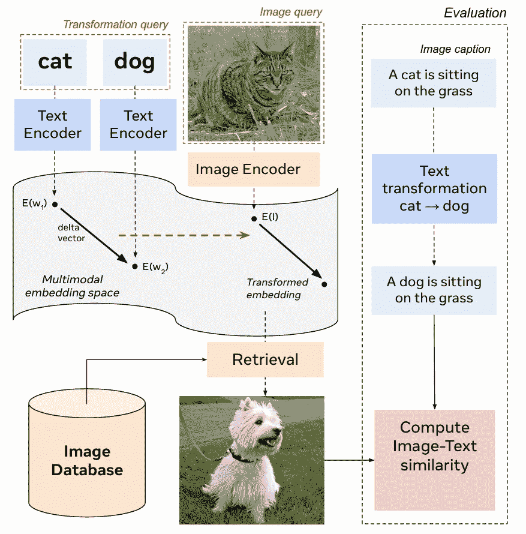
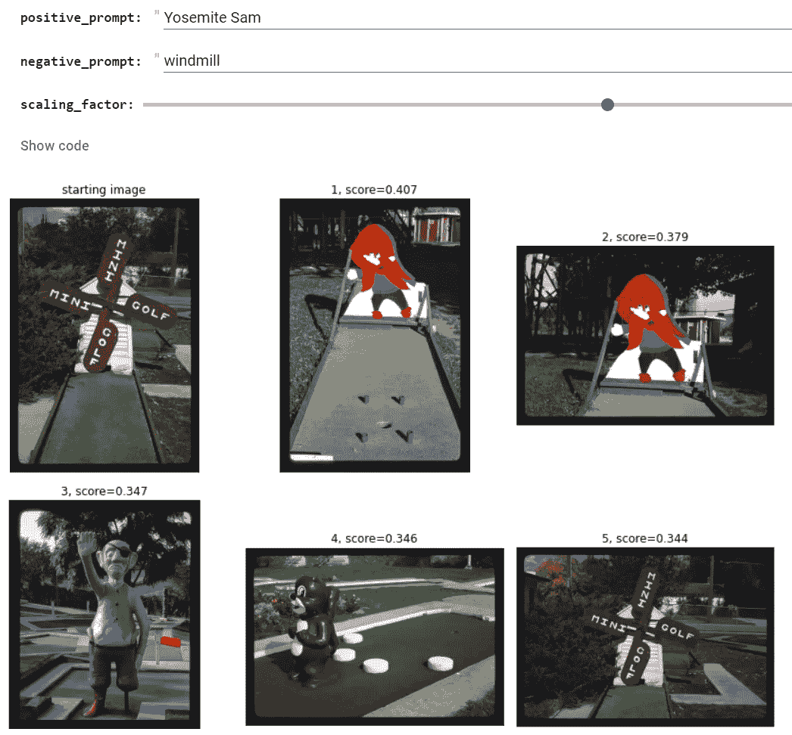

# 使用 OpenCLIP 进行图像搜索和自动字幕生成

> 原文：[`towardsdatascience.com/using-openclip-for-image-search-and-automatic-captioning-fa1cbbd48ce4`](https://towardsdatascience.com/using-openclip-for-image-search-and-automatic-captioning-fa1cbbd48ce4)

## 如何利用更多数据和新的机器学习训练技术来改善图像和文本嵌入，以应用于各种场景

 [Robert A. Gonsalves](https://robgon.medium.com/?source=post_page-----fa1cbbd48ce4--------------------------------)

·发表于 [Towards Data Science](https://towardsdatascience.com/?source=post_page-----fa1cbbd48ce4--------------------------------) ·阅读时间 12 分钟·2023 年 3 月 7 日

--

“**用于在大型库中查找图片的高科技计算机系统**，”我*使用 AI 图像创建程序* Midjourney 创建，并由作者编辑

自 2021 年推出以来，我一直在使用和撰写关于 OpenAI 的 CLIP 系统的文章 [1]。它包含可以用于各种跨模态比较的图像和文本编码模型，例如使用文本查询快速找到库中最匹配的图像。

2022 年 12 月，一个名为 LAION 的独立研究小组发布了一篇名为《对比语言-图像学习的可重复扩展定律》的论文 [2]，描述了他们如何首先重新实现并训练了一个类似于 CLIP 的模型，然后通过使用更大的数据集和新的机器学习技术来改进系统。他们称他们的新模型为 OpenCLIP。

在这篇文章中，我将提供有关原始 CLIP 的一些背景信息，描述 LAION 如何改进该模型，并展示我使用 [国会图书馆 Flickr 照片流](https://www.flickr.com/photos/library_of_congress/) 的图像进行的两个系统实验的一些结果。我还实现了一种称为“嵌入算术”的酷技术，这项技术来自 Meta AI，用于通过图像和文本提示搜索照片 [3]。

我将在文章末尾展示一个使用 LAION 的 OpenCLIP 模型变体自动生成图片字幕的演示。例如，我使用 Midjourney 创建了这篇文章的标题图片，文本提示为“用于在大型库中查找图片的高科技计算机系统”。当我将该图像输入 OpenCLIP 时，它生成了标题为“一个女孩站在图书馆里看电视”的字幕。还不错！

# **OpenAI 的 CLIP**

在 2021 年，OpenAI 发布了一篇名为“从自然语言监督中学习可转移的视觉模型”的论文，描述了他们的新系统，称为对比语言-图像预训练（CLIP）。该系统包括两个 AI 模型，一个文本编码器和一个图像编码器，训练以生成称为嵌入的数字数组。他们发布了源代码和预训练模型。

**CLIP 的系统组件，** OpenAI 绘制的图示

OpenAI 使用 4 亿对图像/文本对训练编码器，目标是使编码器生成相似的嵌入，当文本和图像相似时。该系统可用于涉及文本和图像的各种任务，如检索，即用文本搜索图像，以及分类，即自动将图像分配到类别中。你可以在我的[使用该系统的文章](https://medium.com/towards-data-science/using-openais-clip-to-search-for-design-patents-7fcc63d91033)中了解更多关于 CLIP 的信息。

# LAION 的 OpenCLIP

LAION 是一个独立研究者小组，提供数据集、工具和 AI 模型。他们重新实现了 OpenAI 的 CLIP 模型，并在他们的 20 亿对图像/文本对的数据集上进一步训练以提高性能。在他们的论文[2]中，他们讨论了如何通过使用 Google 发明的浮点数格式 bfloat16 解决在更多数据训练时遇到的问题[4]。

> 对于更大规模的模型……我们观察到训练过程中损失值的激增，对性能产生了不利影响。我们通过从 float16 的混合精度切换到 bfloat16 的混合精度解决了这个问题。我们推测 bfloat16 解决了这个问题，因为较大的模型通常显示更大的激活值……使 bfloat16 在其更宽的动态范围下更为合适。—— Mehdi Cherti 等，来自 LAION

他们的论文展示了他们的 OpenCLIP 系统在图像搜索等任务上优于 OpenAI 的 CLIP。下图中，OpenCLIP 用橙色表示，CLIP 用蓝色表示，其中数值越小越好。

**使用 CLIP（蓝色）和 OpenCLIP 进行图像检索的结果（数值越小越好），** LAION 绘制的图表

图表中有很多信息。我会看看能否将其拆解。横轴表示用于训练的计算量，以 Giga 乘加操作 (GMACs) 为单位。纵轴显示了结果的准确度，定义为 100 - Recall @ 5 针对 Flicker 30K 数据集。例如，如果系统搜索了五张猫的照片，只有四张包含猫，则 Recall@5 值为 80%。但从 100 中减去它将得到 20%，值越低越好。你跟上了吗？图表中的形状代表各种数据集，右侧的键显示了不同的大小。蓝线显示了 CLIP 在 CLIP-WIT 数据集上的表现，经过多种配置训练。橙线显示了最佳 OpenCLIP 模型在 LAION 数据集上的表现，使用了各种配置。底线：OpenCLIP 比 CLIP 更好。

如上图所示，LAION 计算了训练和性能之间关系的方程，带有指数成分。他们讨论了使用这种“缩放定律”来预测需要多少额外的训练以进一步提高他们的模型[2]。

在下一部分，我将展示如何构建和运行一些测试，以展示这两个系统在美国国会图书馆图像上的表现。

# 比较 OpenCLIP 和 CLIP

我使用了[国会图书馆 Flickr 照片流](https://www.flickr.com/people/library_of_congress/)中的照片进行测试。图书馆发布了超过四万张带有说明的图片供人们浏览和评论。请注意，所有图片均标记为“无已知版权限制”，因此可以用于任何目的。

这里是一些数据集样本，图像上方有说明。

**来自国会图书馆 Flickr 照片流的样本**，来自 LOC 的图像

通过这些样本，你可以对数据集中图像的类型有个了解，包括绘画、旧照片、新照片等。

为了测试这些系统，我将六个说明和图像通过 CLIP 和 OpenCLIP，并计算了余弦相似度，这是一种衡量文本和图像嵌入之间接近度的指标。请注意，结果范围大致从 0.0 到 0.4，较低的数字表示不匹配，较高的数字表示匹配。

图像横向展示在顶部，相应的说明纵向列在左侧。你可以看到，右侧的 OpenCLIP 结果在对角线块（较亮的黄色）上的匹配分数更高，而在非匹配分数（较暗的蓝色）上则更低，相比之下，左侧的 CLIP 结果较低。这意味着，如果你使用这些系统搜索带有文本的图像，使用 OpenCLIP 会得到比 CLIP 更好的结果。

# 使用 OpenCLIP 探索 LOC 图像

为了探索国会图书馆的 Flickr 照片流，我创建了一个[Google Colab](https://colab.research.google.com/github/robgon-art/open-clip/blob/main/Index_LOC_Photos_with_OpenCLIP.ipynb)，下载了所有 4 万张图像，并通过 OpenCLIP 图像编码器进行文本搜索。

**使用 OpenCLIP 搜索 LOC 图像的组件**，图表由作者绘制，图像来自 LOC

我开始使用[Flickr API](https://www.flickr.com/services/api/)将所有 4 万张照片下载到本地文件夹。接下来，我将图片发送到 OpenCLIP 图像编码器以创建图像嵌入。编码器之前由 LAION 使用 20 亿张带有说明的图像进行训练。然后，我输入了文本查询，例如“gone fishing”，并通过文本编码器创建了一个嵌入。我计算了文本嵌入与 40K 图像嵌入之间的余弦相似度，以找到最佳匹配。最后，我对数组进行排序并显示了搜索的前六张图像。

这里是使用 OpenCLIP 和数据集结果的一些示例搜索。

## “boat vacation”

我输入了一个搜索短语并点击了“运行”按钮，以查看得分前六的结果。

**“boat vacation”的 OpenCLIP 搜索结果**，截图由作者提供，图像来自 LOC

果然，它找到了几艘假期中的船只。注意这些匹配的得分相对较低（0.259 到 0.281）。这些得分较低的原因可能是由于使用了有些抽象的词语“vacation”。接下来，我尝试了一些更具体的内容。

## “建造飞机发动机”

在这里，我尝试使用了更具体的搜索短语。

**“building an airplane engine”的 OpenCLIP 搜索结果**，截图由作者提供，图像来自 LOC

好的，这次搜索的得分要高得多（0.302 到 0.326）。最佳结果展示了一张人们建造飞机发动机的漂亮照片。接下来，我尝试了一些有趣的东西。

## “mini golf”

数据集中有很多具有美国风情的图像，所以我检查了一下是否有迷你高尔夫球场的图像。

果然，答案是“是的！”注意这些图像的得分较高（0.378 到 0.395）。最佳结果是一个经典的风车洞，风车叶片上写着“MINI GOLF”两次。在描述一种酷炫的新方法来优化图像搜索之后，我会重新审视这个搜索。

# 嵌入算术

2022 年 10 月，Meta AI 发布了一篇标题引人注目的论文，《多模态查询的嵌入算术用于图像检索》，其中“多模态”指的是其他形式的媒体，如文本[8]。

概念是这样的：如果你在数据集中找到一张图像，并且想要找到另一张保留部分特质但改变其他特质的图像，你可以通过结合图像和文本元素来构建查询。运行新的查询应该能够找到你所寻找的内容，前提是数据集中存在这样的图像。

这里是论文中的一个视觉示例。

**使用嵌入算术进行图像检索**，图片由 Meta AI 提供

这开始于顶部的猫图像，该图像被编码成嵌入 E(I)。然后，“cat”和“dog”这两个词通过文本编码器分别得到 E(W1) 和 E(W2)。E(W2) 和 E(W1) 之间的差值被加到猫图像的嵌入中，从而找到类似的狗图像所在的位置。从图像数据库中检索得到的结果显示了一个接近的匹配，如底部所示。匹配通过将原始标题中的“dog”替换为“cat”来评估，得到“狗坐在草地上。” 将转换后的标题文本嵌入与狗图像的嵌入进行比较，以查看是否匹配。

论文讨论了如何使用缩放因子 λ 来调整从文本提示中进行的修改量。这里是产生新嵌入 *x* 的方程。

论文讨论了如何在 1.0 到 1.5 之间的缩放因子对于许多搜索效果良好。

我在我的 Colab 中实现了这种形式的嵌入数学。这里是一些结果，从基于迷你高尔夫风车图像的修改搜索开始。

## 迷你高尔夫风车图像 + 1.5（“约塞米蒂·萨姆” - “风车”）

对于这次搜索，我从迷你高尔夫风车的肖像照片开始，添加了“约塞米蒂·萨姆”这一短语，并删除了“风车”。我使用了 1.5 的缩放因子。

**迷你高尔夫风车图像 + 1.5（“约塞米蒂·萨姆” - “风车”）**，作者截图，图片来自 LOC

原始图像在左上角，最佳匹配在其旁边，得分很高，为 0.407。顶部的结果与起始图像非常相似，只是显示了约塞米蒂·萨姆而不是风车。接下来是一些路边餐馆的图像。

## 甜甜圈店图像 + 1.2（“汉堡包” - “甜甜圈”）

对于下一个测试，我从搜索“甜甜圈店”开始，选择了一张名为甜甜圈洞的有趣地方的图像。接下来，我使用了“汉堡包”作为正向提示，“甜甜圈”作为负向提示。我使用了 1.2 的缩放因子。以下是结果。

**甜甜圈店图像 + 1.2（“汉堡包” - “甜甜圈”）**，作者截图，图片来自 LOC

哇，它找到了一家经典的麦当劳餐厅，其中金色拱门与起始图像中的巨型甜甜圈完美对齐。注意到顶部匹配的非常高的分数 0.533。我的最后一次搜索涉及一些名人的旧照片。

## 亚伯拉罕·林肯图像 + 1.1（“奥斯卡·王尔德” - “亚伯拉罕·林肯”）

对于我的最终测试，我首先搜索了“亚伯拉罕·林肯”，并选择了一张他坐在椅子上的著名图像。我使用系统检查数据集中是否有类似的奥斯卡·王尔德图像。我为这次测试使用了 1.1 的缩放因子。

**亚伯拉罕·林肯图像 + 1.1（“奥斯卡·王尔德” - “亚伯拉罕·林肯”）**，作者截图，LOC 提供的图像

果然，它找到了一个色调为褐色的奥斯卡·王尔德坐在木椅上的图像。尽管姿势不同，但最高匹配的得分是我见过的最高，为 0.675。高分可能是因为著名人物的名字和面孔之间的强相关性超越了其他因素。接下来，我将展示我如何使用 OpenCLIP 生成图像字幕。

# 使用 CoCa 和 OpenCLIP 创建字幕

在他们 2022 年的论文《CoCa: 对比字幕生成模型是图像-文本基础模型》中，[5] 作者展示了如何训练类似于 OpenAI 的 CLIP 的模型来自动从图像生成字幕。

> 在这项工作中，我们展示了对比字幕生成模型（CoCa），这是一个新的图像-文本基础模型系列，它包含了现有的视觉预训练范式，并结合了自然语言监督。CoCa 在来自各种数据源的图像-文本对上进行了单阶段预训练，能够高效地结合对比和字幕生成目标于一个编码器-解码器模型中。 — 来自 Google 的 Jiahui Yu 和 Zirui Wang

独立研究员 Phil Wang，外号 lucidrains，将 CoCa 模型适配到了 OpenCLIP 上。结果非常出色。

例如，这里有六张图像，附有来自 LOC 的原始字幕。

以下是由 CoCa/OpenCLIP 生成的带字幕的图像：

尽管字幕缺少一些细节，如具体的个人（谁）和地点（哪里），但系统在描述图像的视觉内容（什么）方面做得非常出色。你可以在我的 Colab [这里](https://colab.research.google.com/github/robgon-art/open-clip/blob/main/Create_Captions_with_OpenCLIP.ipynb) 查看这一点。

# 社会影响

在互联网上训练的大型 AI 模型可能会表现出文化偏见，如果不加以缓解，可能会对社会造成伤害。OpenCLIP 模型的作者在他们的论文 [2] 中表达了他们的担忧。

> 我们的工作涉及研究大规模预训练模型的功能和属性。将这些模型公开可能有正面和负面的影响，就像任何具有通用功能的研究工具一样。…… 基于大规模预训练通用模型的技术可能被滥用，而民主机构的任务是制定涉及这些模型的敏感应用的规则。模型的开放发布也为广泛的研究社区提供了研究这些模型安全性方面的机会，以预防恶意方滥用技术，从而进行共同的透明努力。 — Mehdi Cherti 等人，来自 LAION

他们的透明政策允许其他研究人员评估和缓解他们模型的使用。

# 讨论与下一步

OpenCLIP 系统在大规模数据集中搜索图像时表现良好。新的数学嵌入技术提供了专家工具，帮助人们找到完美的镜头。CoCa/OpenCLIP 模型在为图像创建描述性标题方面做得很好。

一个改进的领域是看看这些系统是否可以微调以找到或创建个人照片的标题。与 OpenAI 不同，LAION 发布了他们模型的训练代码。尽管他们的代码是为大规模训练设计的，但如果能够调整为仅使用例如你叔叔 Bob 的十张照片来微调模型，那将会很有帮助。

# 源代码

本项目的源代码可在 [GitHub](https://github.com/robgon-art/open-clip) 上获得。

**知识共享 署名-相同方式共享**

# 致谢

我想感谢 Jennifer Lim 在这个项目上的帮助。

# 参考文献

[1] A. Radford 等人, CLIP, [从自然语言监督中学习可转移的视觉模型](https://cdn.openai.com/papers/Learning_Transferable_Visual_Models_From_Natural_Language_Supervision.pdf) (2021)

[2] M. Cherti 等人, OpenCLIP, [对比语言-图像学习的可重复性缩放法则](https://arxiv.org/pdf/2212.07143.pdf) (2022)

[3] G. Couairon 等人, [多模态查询的嵌入算术用于图像检索](https://arxiv.org/pdf/2112.03162.pdf) (2022)

[4] S. Wang 和 P. Kanwar, [BFloat16: 云 TPUs 高性能的秘密](https://cloud.google.com/blog/products/ai-machine-learning/bfloat16-the-secret-to-high-performance-on-cloud-tpus) (2019)

[5] J. Yu, [CoCa: 对比式标题生成器是图像-文本基础模型](https://arxiv.org/pdf/2205.01917.pdf) (2022)
