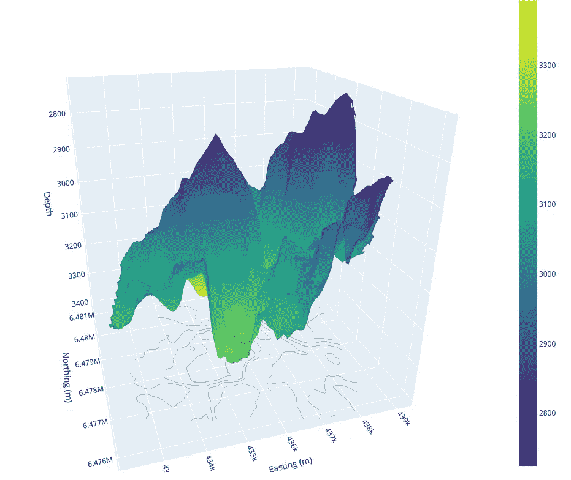

# 使用 Plotly 3D 表面图可视化地质表面

> 原文：[`towardsdatascience.com/using-plotly-3d-surface-plots-to-visualise-geological-surfaces-8829c06a5c9a`](https://towardsdatascience.com/using-plotly-3d-surface-plots-to-visualise-geological-surfaces-8829c06a5c9a)

## 使用 Python 数据可视化库可视化地下结构

[](https://andymcdonaldgeo.medium.com/?source=post_page-----8829c06a5c9a--------------------------------)[](https://towardsdatascience.com/?source=post_page-----8829c06a5c9a--------------------------------) [安迪·麦克唐纳](https://andymcdonaldgeo.medium.com/?source=post_page-----8829c06a5c9a--------------------------------)

·发布于 [Towards Data Science](https://towardsdatascience.com/?source=post_page-----8829c06a5c9a--------------------------------) ·9 分钟阅读·2023 年 6 月 21 日

--


Hugin 组的 3D 表面图。图像由作者提供。

在地球科学中，全面了解地下的地质表面至关重要。了解构造的确切位置及其几何形状，可以更容易地识别潜在的石油和天然气勘探新目标以及潜在的碳捕集和储存地点。我们可以使用多种方法来完善这些表面，从地震数据到测井推导的构造顶部。通常，这些技术会相互结合以完善最终表面。

本文继续我之前的文章，后者关注于通过区域内的测井数据来推断和可视化地理空间变异。在这篇文章中，我们将探讨如何使用交互式 Plotly 图表创建 3D 表面。

由于建模地质表面是一个复杂的过程，通常涉及多个迭代和完善，本文演示了如何使用 Python 简单可视化这些数据的示例。

为了了解如何利用 Plotly 可视化我们在一个区域内的地质构造顶部，我们将使用两组数据。

第一组数据来自 28 个测井孔交点，这些数据用于克里金插值以生成低分辨率表面。相比之下，第二组数据来自解释的地震数据，提供了更高分辨率的表面。

两组数据均来自 Equinor Volve 数据集，详细信息见本文底部。

你还可以通过以下链接查看这一小系列中的其他文章：

+   [**Plotly 和 Python：为岩石物理学和地质数据创建交互式热图**](https://medium.com/p/701c22b32e4)

+   **利用 pykrige 和 matplotlib 进行地质变化的空间可视化**

+   **使用 Plotly Express 可视化 3D 线图中的井路径**

# 导入库与数据

在对数据进行任何操作之前，我们首先需要导入所需的库。这些是：

+   [**pandas**](https://pandas.pydata.org/) — 用于读取我们的数据，数据格式为 `csv`

+   [**matplotlib**](https://matplotlib.org/) 用于创建我们的可视化

+   [**pykrige**](https://github.com/GeoStat-Framework/PyKrige) 用于进行克里金计算

+   [**numpy**](https://numpy.org/) 用于一些数值计算

+   **plotly.graph_objects** 用于 3D 可视化表面

```py
import pandas as pd
import matplotlib.pyplot as plt
import plotly.graph_objects as go

from pykrige import OrdinaryKriging
import numpy as np
```

接下来，我们可以使用 `pd.read_csv()` 加载数据。

由于这些数据包含 Volve 领域所有井眼的地质表面信息，我们可以使用 `query()` 提取我们需要的地层数据。在这种情况下，我们将关注 Hugin 地层。

```py
df = pd.read_csv('Data/Volve/Well_picks_Volve_v1 copy.csv')
df_hugin = df.query('SURFACE == "Hugin Fm. VOLVE Top"')
df_hugin
```

当我们运行上述代码时，我们会得到以下表格。你可能会注意到一些井眼多次遇到 Hugin 地层。这可能是由于井眼或地层几何形状导致井眼多次穿透地层。


Pandas 数据框包含关于 Volve 领域 Hugin 地层的井位信息。图片来自作者。

# 外推 TVDSS 生成地质表面

在我之前的文章中，我专注于如何使用一种称为克里金的过程来“填补测量点之间的空白”。我们不会在这篇文章中详细介绍这个过程；然而，你可以查看 这篇文章以获取更多信息。

一旦数据加载完毕，我们可以通过调用 pykrige 的 `OrdinaryKriging` 方法来运行克里金过程。

在此调用中，我们传入我们的 `x` 和 `y` 数据，表示井眼在地下遇到地层的位置的东向和北向坐标。

由于我们想要生成 Hugin 地层的表面，我们需要使用 TVDSS（真实垂直深度水下）测量。这真实反映了表面在所选基准面下的深度。

```py
OK = OrdinaryKriging(x=df_hugin['Easting'], 
                      y=df_hugin['Northing'], 
                      z=df_hugin['TVDSS'],
                      variogram_model='linear',
                      verbose=True, enable_plotting=True)
```


Hugin 地层的普通克里金结果。图片来自作者。

一旦模型生成，我们可以将其应用于覆盖井眼/穿透点整个范围的两个数组。

这使我们能够生成一个值的网格，然后将其传递到我们上面生成的 `OrdinaryKriging` 对象中。

```py
gridx = np.arange(433986, 438607, 50, dtype='float64')
gridy = np.arange(6477539, 6479393, 50,dtype='float64')

zstar, ss = OK.execute('grid', gridx, gridy)
```

最后，我们可以使用 matplotlib 的 `imshow` 方法生成一个简单的 2D 地图视图。

```py
fig, ax = plt.subplots(figsize=(15,5))

# Create a 2D image plot of the data in 'zstar'
# The 'extent' parameter sets the bounds of the image in data coordinates
# 'origin' parameter sets the part of the image that corresponds to the origin of the axes
image = ax.imshow(zstar, extent=(433986, 438607, 6477539, 6479393), 
                  origin='lower')

# Set the labels for the x-axis and y-axis
ax.set_xlabel('X Location (m)', fontsize=14, fontweight='bold')
ax.set_ylabel('Y Location (m)', fontsize=14, fontweight='bold')

# Add contours
contours = ax.contour(gridx, gridy, zstar, colors='black')

colorbar = fig.colorbar(image)

colorbar.set_label('DTC (us/ft)', fontsize=14, fontweight='bold')

# Display the plot
plt.show()
```


应用克里金插值后的 Hugin 组的 2D 表面和等高线图。图片由作者提供。

# 使用 Plotly 创建简单的 3D 表面图

要将我们的 2D 表面转换为 3D，我们需要使用 [**Plotly**](https://plotly.com/)。我们可以使用 matplotlib 来完成这一点；然而，根据我的经验，使用 Plotly 生成 3D 可视化更容易、更顺畅且更具交互性。

在下面的代码中，我们首先创建坐标网格。为此，我们使用 numpy 的 `linspace` 函数。这个函数将创建一个在指定范围内均匀分布的数字集合。对于我们的数据集和示例，范围从 `xgrid_extent` 和 `ygrid_extent` 的最小值到最大值。

在此范围内使用的总值数量将等于我们上面创建的 `zstar` 网格中 x 和 y 元素的数量。

一旦我们的网格形成，我们就会调用 Plotly。

首先，我们创建图形对象，然后使用 `fig.add_trace` 将 3D 表面图添加到图形中。

添加后，我们需要调整图形的布局，以便添加轴标签，定义宽度和高度，并设置一些内边距。

```py
xgrid_extent = [433986, 438607]
ygrid_extent = [6477539, 6479393]

x = np.linspace(xgrid_extent[0], xgrid_extent[1], zstar.shape[1])
y = np.linspace(ygrid_extent[0], ygrid_extent[1], zstar.shape[0])

fig = go.Figure()

fig.add_trace(go.Surface(z=zstar, x=x, y=y))

fig.update_layout(scene = dict(
                    xaxis_title='X Location',
                    yaxis_title='Y Location',
                    zaxis_title='Depth'),
                  width=1000,
                  height=800,
                  margin=dict(r=20, l=10, b=10, t=10))

fig.show()
```

当我们运行上述代码时，我们会得到一个交互式图，显示基于多次遇到的钻井井眼的 Hugin 组的地质表面。


使用 Plotly 生成的 Hugin 组的 3D 表面图。图片由作者提供。

# 使用 Plotly 进行完整解释的表面视图

[Volve 数据集](https://www.equinor.com/energy/volve-data-sharing)中有许多完全解释的表面，这些表面是根据地质解释生成的，包括地震数据。

这些数据包含场地中数据点的 `x` 和 `y` 位置，以及我们的 TVDSS 数据（`z`）。

提供在 Volve 数据门户上的数据是 .dat 文件的形式，不过，通过在文本编辑器中稍作处理，可以轻松地将其转换为 CSV 文件并使用 pandas 加载。

```py
hugin_formation_surface = pd.read_csv('Data/Volve/Hugin_Fm_Top+ST10010ZC11_Near_190314_adj2_2760_EasyDC+STAT+DEPTH.csv')
```


Hugin 组的 X、Y 和 Z 位置。图片由作者提供。

数据加载完成后，我们可以通过将 x、y 和 z 数据提取到变量中来简化操作。

```py
x = hugin_formation_surface['x']
y = hugin_formation_surface['y']
z = hugin_formation_surface['z']
```

然后，我们需要在 x 和 y 数据位置之间创建一个规则间隔的网格。这可以使用 numpy 的 meshgrid 完成。

```py
xi = np.linspace(x.min(), x.max(), 100)
yi = np.linspace(y.min(), y.max(), 100)
xi, yi = np.meshgrid(xi, yi)
```

有几种方法可以在一系列数据点之间进行插值。选择的方法将取决于数据的形式（规则采样数据点与不规则采样数据点）、数据大小和计算能力。

如果我们有像这里这样的大型数据集，使用一些方法如径向基函数的计算成本会更高。

在这个示例中，我们将使用 scipy 中的 LinearNDInterpolator 方法来构建我们的模型，然后将其应用于我们的 z（TVDSS）变量。

为了在点之间进行插值，我们需要将`xi`、`yi`重塑为 1D 数组，因为`LinearNDInterpolator`期望 1D 数组。

```py
xir = xi.ravel()
yir = yi.ravel()

interp = LinearNDInterpolator((x, y), z)
zi = interp(xir, yir)
```

一旦计算完成，我们可以继续使用[Plotly](https://plotly.com/)图形对象创建我们的 3D 表面。

```py
fig = go.Figure()

fig.add_trace(go.Surface(z=zi, x=xi, y=yi, colorscale='Viridis'))

fig.update_layout(scene = dict(
                    xaxis_title='Easting (m)',
                    yaxis_title='Northing (m)',
                    zaxis_title='Depth',
                    zaxis=dict(autorange='reversed')),
                  width=1000,
                  height=800,
                  margin=dict(r=20, l=10, b=10, t=10))

fig.update_traces(contours_z=dict(show=True, 
                                  usecolormap=True, 
                                  project_z=True,
                                  highlightcolor="white"))

fig.show()
```

当我们运行上述代码时，会得到 Hugin 地层的以下 3D 表面图。


Hugin 地层的完全解释地质表面。图像由作者提供。

当我们将这个图与从井眼测量生成的图进行比较时，我们可以明显看到整体形状上的相似之处，尤其是中间的山谷。然而，地震导出的表面提供了比井导出的地层顶部更多的细节。



Hugin 地层表面的比较：左侧是从稀疏的井测量生成的表面，右侧是从地震数据生成的表面。图像由作者提供。

# 摘要

在这个简短的教程中，我们展示了如何使用[Plotly](https://plotly.com/)的 3D 表面图生成地质表面的互动 3D 可视化。通过井测量得出的地层顶部，我们可以生成非常基础的 3D 表面。这是因为测量仅限于交叉了 Hugin 地层的井眼，这意味着我们得到的是低分辨率的表面。

相比之下，如果我们有更详细的测量点，比如来自地震导出的地层面，我们可以生成对地层的更真实的印象。

两种方法都是有效的，但请注意，当从仅通过井测量得到的地层顶部进行外推时，我们可能无法生成该区域地层的完整图像。

# 使用的数据集

本教程中使用的数据是 Equinor 在 2018 年发布的 Volve 数据集的一个子集。数据集的完整详细信息，包括许可证，可以在以下链接找到。

[](https://www.equinor.com/energy/volve-data-sharing?source=post_page-----8829c06a5c9a--------------------------------) [## Volve 油田数据集

### Equinor 已发布 Volve 油田 2008-2016 年的完整数据集。点击此处下载以供学习、研究等使用…

[www.equinor.com](https://www.equinor.com/energy/volve-data-sharing?source=post_page-----8829c06a5c9a--------------------------------)

Volve 数据许可证基于 CC BY 4.0 许可证。许可证协议的完整详细信息可以在此处找到：

[`cdn.sanity.io/files/h61q9gi9/global/de6532f6134b9a953f6c41bac47a0c055a3712d3.pdf?equinor-hrs-terms-and-conditions-for-licence-to-data-volve.pdf`](https://cdn.sanity.io/files/h61q9gi9/global/de6532f6134b9a953f6c41bac47a0c055a3712d3.pdf?equinor-hrs-terms-and-conditions-for-licence-to-data-volve.pdf=)

*感谢阅读。在你离开之前，你一定要订阅我的内容，并将我的文章发送到你的收件箱。* [***你可以在这里做到这一点！***](https://andymcdonaldgeo.medium.com/subscribe)

*其次，你可以通过注册会员获得完整的 Medium 体验，并支持成千上万的其他作者和我。这只需每月$5，你就可以完全访问所有精彩的 Medium 文章，并有机会通过你的写作赚取收入。*

*如果你通过* [***我的链接***](https://andymcdonaldgeo.medium.com/membership)***注册，*** *你将直接用你的费用的一部分支持我，而不会额外增加你的费用。如果你这样做，非常感谢你的支持。*
