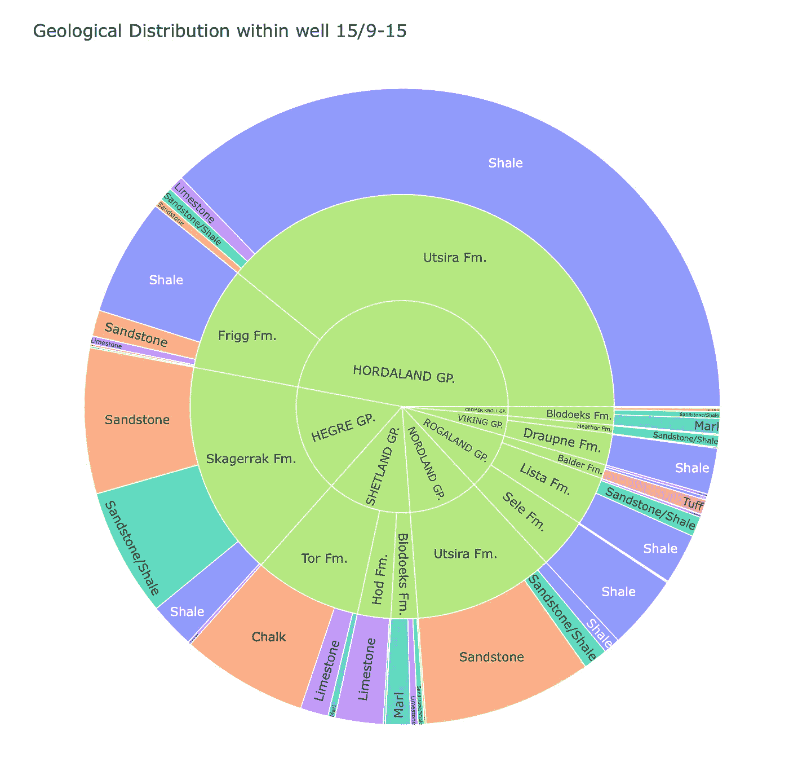

# 使用 Plotly Express Sunburst 图表探索地质数据

> 原文：[`towardsdatascience.com/using-plotly-express-sunburst-charts-to-explore-geological-data-841f179d08c8?source=collection_archive---------4-----------------------#2023-07-27`](https://towardsdatascience.com/using-plotly-express-sunburst-charts-to-explore-geological-data-841f179d08c8?source=collection_archive---------4-----------------------#2023-07-27)

## 使用 Python 轻松快捷地理解地质层次数据

 [Andy McDonald](https://andymcdonaldgeo.medium.com/?source=post_page-----841f179d08c8--------------------------------)

·

[关注](https://medium.com/m/signin?actionUrl=https%3A%2F%2Fmedium.com%2F_%2Fsubscribe%2Fuser%2F9c280f85f15c&operation=register&redirect=https%3A%2F%2Ftowardsdatascience.com%2Fusing-plotly-express-sunburst-charts-to-explore-geological-data-841f179d08c8&user=Andy+McDonald&userId=9c280f85f15c&source=post_page-9c280f85f15c----841f179d08c8---------------------post_header-----------) 发表在 [Towards Data Science](https://towardsdatascience.com/?source=post_page-----841f179d08c8--------------------------------) ·5 min 阅读·2023 年 7 月 27 日

--

在交互式 Plotly Express Sunburst 图表上表示的地质层次结构。图片由作者提供。

数据可视化在地球科学和数据科学领域发挥着至关重要的作用。它使我们能够深入了解地下情况，理解地质结构和层级关系。地下常常被划分为不同的类别，从最广泛的地质时间范围，如纪、期和世，到岩性差异，如砂岩、石灰岩和页岩。

在处理地质层级数据时，数据可以通过多种方式进行可视化。这包括传统的[地质时间尺度](https://en.wikipedia.org/wiki/Geologic_time_scale)图表和表格，以及互动式日晷图。

日晷图可以以独特的方式展示数据，是可视化地质层级数据的绝佳方式。它们通过使用多层同心圆环图来实现，这些图表根据使用的工具，可以完全互动，帮助从最高层级深入到最低层级。

为了演示这些图表，我们将使用[Plotly Express](https://plotly.com/)，一个高级数据可视化 Python 库，从挪威大陆架的一个井数据开始……
