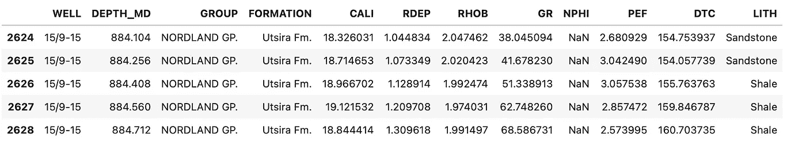
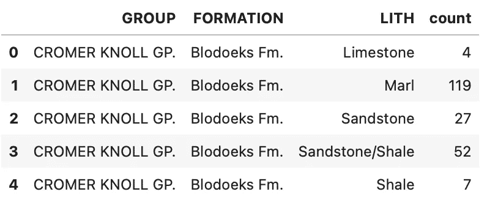
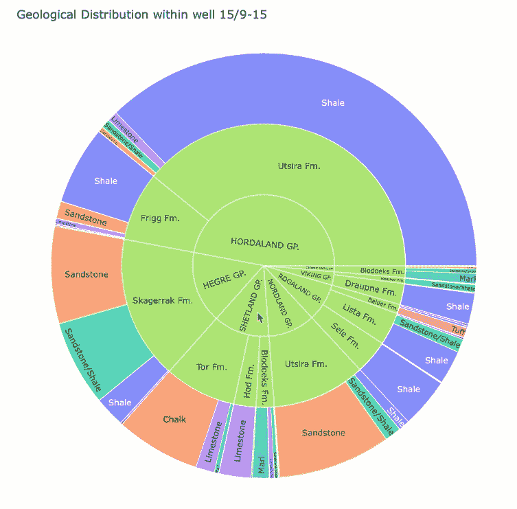

# 使用 Plotly Express 旭日图探索地质数据

> 原文：[`towardsdatascience.com/using-plotly-express-sunburst-charts-to-explore-geological-data-841f179d08c8`](https://towardsdatascience.com/using-plotly-express-sunburst-charts-to-explore-geological-data-841f179d08c8)

## 用 Python 轻松快速地理解你的地质层级数据

[](https://andymcdonaldgeo.medium.com/?source=post_page-----841f179d08c8--------------------------------)[](https://towardsdatascience.com/?source=post_page-----841f179d08c8--------------------------------) [安迪·麦克唐纳](https://andymcdonaldgeo.medium.com/?source=post_page-----841f179d08c8--------------------------------)

·发表于[数据科学前沿](https://towardsdatascience.com/?source=post_page-----841f179d08c8--------------------------------) ·阅读时间 5 分钟·2023 年 7 月 27 日

--


在互动式 Plotly Express 旭日图上展示的地质层级。图像由作者提供。

数据可视化在地球科学和数据科学领域发挥着至关重要的作用。它可以让我们深入了解地下情况，理解地质结构和层级关系。地下通常被细分为不同的类别，从最广泛的地质时间范围，如时代、纪、世，到岩性差异，如砂岩、石灰岩和页岩。

在处理地质层级数据时，数据可以以多种方式进行可视化。这包括传统的[地质时间尺度](https://en.wikipedia.org/wiki/Geologic_time_scale)图表和表格以及互动式旭日图。

旭日图（Sunburst charts）可以用独特的方式展示数据，是可视化地质层级数据等层级数据的好方法。它们通过使用多层同心圆环图来实现，这些图表可以根据使用的工具进行完全交互，帮助从最高层级钻取到最低层级。

为了演示这些图表，我们将使用[Plotly Express](https://plotly.com/)，一个高级数据可视化 Python 库，从挪威大陆架上的一个井中获取一些数据，并可视化地质层级以及每个地层的岩性组成。我们还将看到如何在创建图表之前准备井中的数据。

# 导入库并加载数据

首先，我们需要两个库：[pandas](https://pandas.pydata.org/) 用于加载和处理数据，[plotly_express](https://plotly.com/python/plotly-express/) 用于创建可视化。

```py
import pandas as pd
import plotly_express as px
```

接下来，我们将从 CSV 文件加载数据。有关使用的数据的详细信息可以在文章底部找到。

如果你有 LAS 文件，可以快速使用[加载 LAS 文件](https://andymcdonaldgeo.medium.com/loading-and-displaying-well-log-data-b9568efd1d8)功能，通过[LASIO](https://lasio.readthedocs.io/en/latest/)库来加载文件，然后将数据转换为[pandas](https://pandas.pydata.org/)数据框。

```py
df = pd.read_csv('Data/Xeek_Well_15-9-15.csv')
```

# 清理和准备数据

现在我们已经加载了数据，我们需要做一点清理。

首先，我们将删除 Formation 列中任何缺失信息的行，以简化问题。请注意，这样做可能会影响后续岩石类型和地层的计数，因此任何缺失数据应彻底检查和理解。

删除数据的替代方法是用占位符值（如“未知”）替换缺失数据。

```py
data_cleaned = df.dropna(subset=['FORMATION'])
```

当我们查看数据框的前五行时，我们得到如下内容。



删除包含缺失值的行后，数据的前 5 行。图片由作者提供。

下一步是将数据结构化，以便在 sunburst 图上正确绘制。

为此，我们需要进行以下操作

+   按以下顺序对数据进行分组：Group、Formation 和 Lith。

+   计算每个 Group、Formation 和 Lith 的唯一组合的出现次数

```py
grouped_data = data_cleaned.groupby(['GROUP', 'FORMATION', 'LITH']).size().reset_index(name='count')
```

当我们查看新的`grouped_data`数据框的头部时，会得到每个地质层的岩石类型概述，这些概述随后与 Group 相关联。



分组和计数每个地质层岩石类型后的前五行数据框。图片由作者提供。

# 使用 Plotly Express 创建 Sunburst 图

现在数据已经是正确格式，我们可以最终使用 Plotly Express 创建 Sunburst 图。

我们要做的就是调用`px.sunburst`并传入一些参数。

首先，我们传入分组数据框，然后为`path`参数指定我们希望显示的环的顺序。在我们的情况下，我们将按 Group 到 Formation 再到 Lithology 的顺序。

接下来，我们将`values`参数设置为计数列。这将允许我们控制每个岩石类型的切片大小。岩石类型的数量越多，切片就会越宽。

然后，我们设置图形的`width`和`height`，以及`title`。

最后，我们希望岩石类型的颜色是不同的；然而，我们也可以将其设置为数据框中的任何其他列或自定义颜色刻度。

```py
fig = px.sunburst(grouped_data,
                  path=["GROUP", "FORMATION", "LITH"],
                  values='count',
                  title="Geological Distribution within well 15/9-15",
                  width=800, 
                  height=800,
                  color='LITH')
fig.show()
```

当我们运行上述代码时，我们会得到以下图形，这为每个地质组和地层以及不同岩石类型的分布和贡献提供了出色的概述。


太阳辐射图显示了与地层相关的不同地质群、地层和岩性。图像来源：作者。

使用 [Plotly](https://plotly.com/) 的一个优点是它默认是互动的。我们不需要像使用 matplotlib 时那样添加额外的 Python 代码来使图表具有互动性。

在下面的示例中，我们可以深入探讨我们的数据，了解特定地层的岩性组成。



动画太阳辐射图显示了与地层相关的不同地质群、地层和岩性。图像来源：作者。

# 摘要

使用 Plotly 创建的太阳辐射图是展示地质信息的绝佳方式。它们提供了出色的可视化效果，并允许你通过互动深入数据，以了解地质层次结构中每一层的组成。

通过一些预处理，容易将现有的地质信息从井中提取并转换为适合绘图的格式。此外，在处理互动图形时，你对数据的感知要比研究静态图形要好得多。而且，它们也更有趣。

# 本教程中使用的数据集

训练数据集用于 Xeek 和 FORCE 2020 举办的机器学习竞赛 *(Bormann et al., 2020)*。此数据集受 Creative Commons Attribution 4.0 International 许可证保护。

完整的数据集可以通过以下链接访问：[`doi.org/10.5281/zenodo.4351155`](https://doi.org/10.5281/zenodo.4351155)。

*感谢阅读。在你离开之前，你一定要订阅我的内容，以便将我的文章发送到你的邮箱。* [***你可以在这里订阅！***](https://andymcdonaldgeo.medium.com/subscribe)

*其次，你可以通过注册会员获得完整的 Medium 体验，并支持成千上万的其他作家和我。只需每月$5，你就可以全面访问所有精彩的 Medium 文章，并有机会通过写作赚钱。*

*如果你通过* [***我的链接***](https://andymcdonaldgeo.medium.com/membership)***注册，*** *你将直接用你的一部分费用支持我，这不会增加你的费用。如果你这样做，非常感谢你的支持。*
