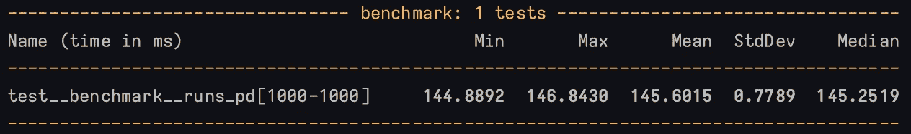
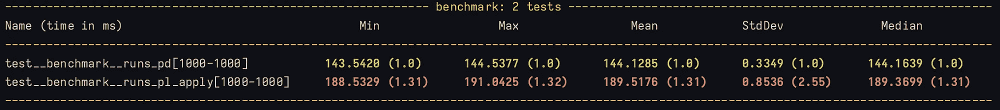
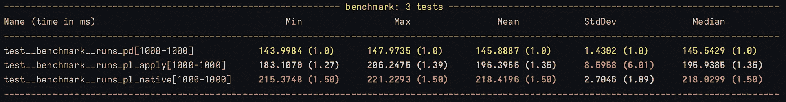
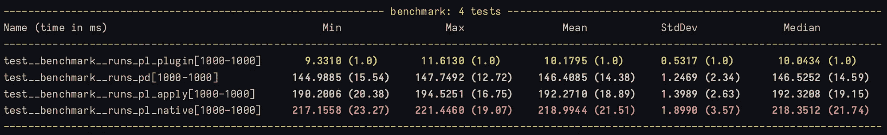

# 使用 Polars 插件通过 Rust 实现 14 倍速度提升

> 原文：[`towardsdatascience.com/using-polars-plugins-for-a-14x-speed-boost-with-rust-ce80bcc13d94?source=collection_archive---------0-----------------------#2023-11-09`](https://towardsdatascience.com/using-polars-plugins-for-a-14x-speed-boost-with-rust-ce80bcc13d94?source=collection_archive---------0-----------------------#2023-11-09)

## 在本地 Polars 库之外实现高速度

[](https://medium.com/@nelsongriffiths123?source=post_page-----ce80bcc13d94--------------------------------)[](https://towardsdatascience.com/?source=post_page-----ce80bcc13d94--------------------------------) [Nelson Griffiths](https://medium.com/@nelsongriffiths123?source=post_page-----ce80bcc13d94--------------------------------)

·

[关注](https://medium.com/m/signin?actionUrl=https%3A%2F%2Fmedium.com%2F_%2Fsubscribe%2Fuser%2F7278fd01858d&operation=register&redirect=https%3A%2F%2Ftowardsdatascience.com%2Fusing-polars-plugins-for-a-14x-speed-boost-with-rust-ce80bcc13d94&user=Nelson+Griffiths&userId=7278fd01858d&source=post_page-7278fd01858d----ce80bcc13d94---------------------post_header-----------) 发表在 [Towards Data Science](https://towardsdatascience.com/?source=post_page-----ce80bcc13d94--------------------------------) ·8 min read·2023 年 11 月 9 日[](https://medium.com/m/signin?actionUrl=https%3A%2F%2Fmedium.com%2F_%2Fvote%2Ftowards-data-science%2Fce80bcc13d94&operation=register&redirect=https%3A%2F%2Ftowardsdatascience.com%2Fusing-polars-plugins-for-a-14x-speed-boost-with-rust-ce80bcc13d94&user=Nelson+Griffiths&userId=7278fd01858d&source=-----ce80bcc13d94---------------------clap_footer-----------)

--

[](https://medium.com/m/signin?actionUrl=https%3A%2F%2Fmedium.com%2F_%2Fbookmark%2Fp%2Fce80bcc13d94&operation=register&redirect=https%3A%2F%2Ftowardsdatascience.com%2Fusing-polars-plugins-for-a-14x-speed-boost-with-rust-ce80bcc13d94&source=-----ce80bcc13d94---------------------bookmark_footer-----------)

由 DALL-E 3 生成

# 介绍

[Polars](https://www.pola.rs/) 正因其速度、内存效率和美观的 API 而风靡全球。如果你想了解它有多强大，不妨看看 [DuckDB Benchmarks](https://duckdb.org/2023/04/14/h2oai.html#results)。而且这些测试甚至还没有使用 Polars 的最新版本。

尽管 Polars 可以做很多惊人的事情，但它传统上并不比 Pandas 更适合做你可能想做的所有计算。有几个例外情况 Polars 并未超越。不过，随着最近 Rust 的 Polars 插件系统的发布，这种情况可能会发生变化。

# Polars 插件

什么是 polars 插件？它只是创建自己 Polars 表达式的一种方法，使用原生 Rust 并通过自定义命名空间将其暴露给表达式。它允许你利用 Rust 的速度，将其应用到你的 Polars DataFrame，以便以利用 Polars 提供的速度和内置工具的方式执行计算。

让我们看一些具体的例子。

## 顺序计算

Polars 在某些功能上似乎有所欠缺，例如那些需要知道 DataFrame 之前值的操作。性质上是顺序的计算在原生 Polars 表达式中并不总是特别容易或高效。让我们看看一个具体的例子。

我们有以下算法来计算给定运行中的数字数组的累计值，该运行定义为具有相同符号的一组数字。例如：

```py
┌───────┬───────────┐
│ value ┆ run_value │
│ ---   ┆ ---       │
│ i64   ┆ i64       │
╞═══════╪═══════════╡
│ 1     ┆ 1         │   # First run starts here
│ 2     ┆ 3         │
│ 3     ┆ 6         │
│ -1    ┆ -1        │   # Run resets here
│ -2    ┆ -3        │
│ 1     ┆ 1         │   # Run resets here
└───────┴───────────┘
```

我们希望计算一个列的累计和，每当值的符号从正数变为负数或从负数变为正数时，累计和会重置。

让我们从一个用 pandas 编写的基准版本开始。

```py
def calculate_runs_pd(s: pd.Series) -> pd.Series:
    out = []
    is_positive = True
    current_value = 0.0
    for value in s:
        if value > 0:
            if is_positive:
                current_value += value
            else:
                current_value = value
                is_positive = True
        else:
            if is_positive:
                current_value = value
                is_positive = False
            else:
                current_value += value
        out.append(current_value)
    return pd.Series(out)
```

我们遍历一个系列，计算每个位置的当前运行值，并返回一个新的 Pandas Series。

## 基准测试

在继续之前，我们将设置几个基准。我们将使用 [pytest-benchmark](https://pypi.org/project/pytest-benchmark/) 和 [pytest-memray](https://pytest-memray.readthedocs.io/en/latest/) 测量执行速度和内存消耗。我们将设置问题，使得我们有一个实体列、一个时间列和一个特征列。目标是计算数据中每个实体在时间上的运行值。我们将把实体和时间戳的数量都设为 1,000，使我们拥有一个包含 1,000,000 行的 DataFrame。

当我们使用 Pandas 的 groupby apply 功能对我们的基准进行测试时，我们得到以下结果：



Pandas Apply Pytest-Benchmark（作者提供的图片）


Pandas 应用的 Memray 输出（作者提供的图片）

## Polars 原始实现

好的，现在我们有了基准测试。接下来，让我们看看如何在 Polars 中实现相同的功能。我们将从一个非常相似的版本开始，该版本将通过映射函数应用到 Polars GroupBy 对象上。

```py
def calculate_runs_pl_apply(s: pl.Series) -> pl.DataFrame:
    out = []
    is_positive = True
    current_value = 0.0
    for value in s:
        if value is None:
            pass
        elif value > 0:
            if is_positive:
                current_value += value
            else:
                current_value = value
                is_positive = True
        else:
            if is_positive:
                current_value = value
                is_positive = False
            else:
                current_value += value
        out.append(current_value)
    return pl.DataFrame(pl.Series("run", out))
```

现在让我们看看这与我们原来的 Pandas 基准测试的比较结果。



Pandas Apply 与 Polars Apply Pytest-Benchmark（作者提供的图片）


Polars 应用的 Memray 输出（作者提供的图片）

好吧，这样做效果并不好。不过这不应该让人感到惊讶。Polars 的开发者已经明确表示，Pandas 中非常常见的 groupby apply 方法在 Polars 中并不是一种高效的计算方式。这一点在这里得到了体现。速度和内存消耗都比我们原来的 Pandas 实现要差。

## Polars 表达式实现

现在让我们把这个函数写成原生的 Polars 表达式。这是与 Polars 一起工作时的首选和优化方式。算法会看起来有些不同。但这是我想出的计算相同输出的方案。

```py
def calculate_runs_pl_native(df: pl.LazyFrame, col: str, by: str) -> pl.LazyFrame:
    return (
        df.with_columns((pl.col(col) > 0).alias("__is_positive"))
        .with_columns(
            (pl.col("__is_positive") != pl.col("__is_positive").shift(1))
            .over(by)
            .fill_null(False)
            .alias("__change_sides")
        )
        .with_columns(pl.col("__change_sides").cumsum().over(by).alias("__run_groups"))
        .with_columns(pl.col(col).cumsum().over(by, "__run_groups").alias("runs"))
        .select(~cs.starts_with("__"))
    )
```

对我们正在做的事情的简要说明：

+   查找所有特征值为正的行

+   查找所有 `__is_positive` 列与前一行不同的行。

+   对 `__change_sides` 进行累加，以标记每个不同的运行

+   对每个不同的运行中的值进行累加

现在我们有了原生的 Polars 函数。让我们再次进行基准测试。



Pandas Apply 与 Polars Apply 与 Polars Native Pytest-Benchmark（作者提供的图像）


Polars Native 的 Memray 输出（作者提供的图像）

不幸的是，我们没有看到函数执行速度的提升。这很可能是因为我们需要做的 `over` 语句数量来计算运行值。然而，我们确实看到了预期中的内存减少。可能还有更好的方法使用 Polars 表达式来实现这一点，但我现在不打算担心这个问题。

## Polars 插件

现在让我们来看看新的 Polars 插件。如果你想要设置这些插件的教程，可以查看 [这里的文档。](https://pola-rs.github.io/polars/user-guide/expressions/plugins/) 在这里，我主要展示插件的具体实现。首先，我们将用 Rust 编写我们的算法。

```py
use polars::prelude::*;
use pyo3_polars::derive::polars_expr;

#[polars_expr(output_type=Float64)]
fn calculate_runs(inputs: &[Series]) -> PolarsResult<Series> {
    let values = inputs[0].f64()?;
    let mut run_values: Vec<f64> = Vec::with_capacity(values.len());
    let mut current_run_value = 0.0;
    let mut run_is_positive = true;
    for value in values {
        match value {
            None => {
                run_values.push(current_run_value);
            }
            Some(value) => {
                if value > 0.0 {
                    if run_is_positive {
                        current_run_value += value;
                    } else {
                        current_run_value = value;
                        run_is_positive = true;
                    }
                } else if run_is_positive {
                    current_run_value = value;
                    run_is_positive = false;
                } else {
                    current_run_value += value;
                }
                run_values.push(current_run_value);
            }
        }
    }

    Ok(Series::from_vec("runs", run_values))
}
```

你会注意到这看起来与我们在 Python 中编写的算法非常相似。我们在这里没有做任何花哨的 Rust 魔法！我们使用 Polars 提供的宏来标注输出类型，仅此而已。然后我们可以将新的函数注册为表达式。

```py
from polars import selectors as cs
from polars.utils.udfs import _get_shared_lib_location

lib = _get_shared_lib_location(__file__)

@pl.api.register_expr_namespace("runs")
class RunNamespace:
    def __init__(self, expr: pl.Expr):
        self._expr = expr

    def calculate_runs(
        self,
    ) -> pl.Expr:
        return self._expr.register_plugin(
            lib=lib,
            symbol="calculate_runs",
            is_elementwise=False,
            cast_to_supertypes=True,
        )
```

然后我们可以这样运行它：

```py
from polars_extentsion import RunNamespace

df.select(
  pl.col(feat_col).runs.calculate_runs().over(entity_col).alias("run_value")
).collect()
```

好了，现在让我们查看结果吧！



所有实现 Pytest-Benchmark（作者提供的图像）


Polars 插件的内存输出（作者提供的图像）

这才像样！我们获得了 14 倍的速度提升，内存分配从 ~57MiB 降低到 ~8MiB。

# 何时使用 Polars 插件

现在我已经展示了使用插件的强大功能，我们来谈谈不应使用插件的情况。我可能不使用插件的一些原因（每个都有其自身的注意事项）：

+   **如果您可以轻松使用原生 Polars 表达式编写一个非常快速的计算版本。** Polars 的开发者非常聪明。我不会赌自己写的函数比他们编写的快很多。Polars 的工具已经存在。利用它们擅长的部分吧！

+   **如果您的计算没有自然的并行化**。例如，如果我们没有在多个实体上运行上述问题，我们的加速可能会显著减少。我们既受益于 Rust 的速度，也受益于 Polars 自然能够同时对多个组应用 Rust 函数的能力。

+   **如果您不需要顶级的速度或内存性能。** 许多人会同意，编写 Rust 要比编写 Python 更困难且耗时。所以，如果您不介意您的函数运行时间从 200 毫秒变成 2 秒，您可能不需要使用插件。

牢记上述内容，这里有一些我感觉有时会让我倾向于使用插件的要求：

+   **速度和内存非常重要。** 我最近在一个 Polars 插件中重写了很多数据管道的功能，因为我们在 Polars 和其他工具之间来回切换，内存分配变得太大了。在我们想要的数据量下，难以在我们希望的基础设施上运行管道。插件使我们能够在更短的时间和更小的机器上运行相同的管道。

+   **您有一个独特的使用案例。** Polars 提供了很多内置函数。但它是一个广泛适用的通用工具集。有时，这个工具集并不特别适用于您试图解决的问题。在这种情况下，插件可能正是您需要的。我遇到的两个最常见的例子是更复杂的数学计算，例如应用横截面线性回归，或顺序（基于行的）计算，就像我们在这里展示的那样。

新的插件系统是对 Polars 已经支持的所有列式计算的完美补充。通过这个补充，Polars 允许其功能有美妙的扩展性。除了编写自己的插件之外，还要留意一些酷炫的 Polars 插件包，它们可以扩展您的功能而无需自己编写插件！

Polars 发展迅速并引起了广泛关注。查看这个项目，开始使用它，留意他们将发布的其他精彩功能，也许在此期间还可以学习一些 Rust！
