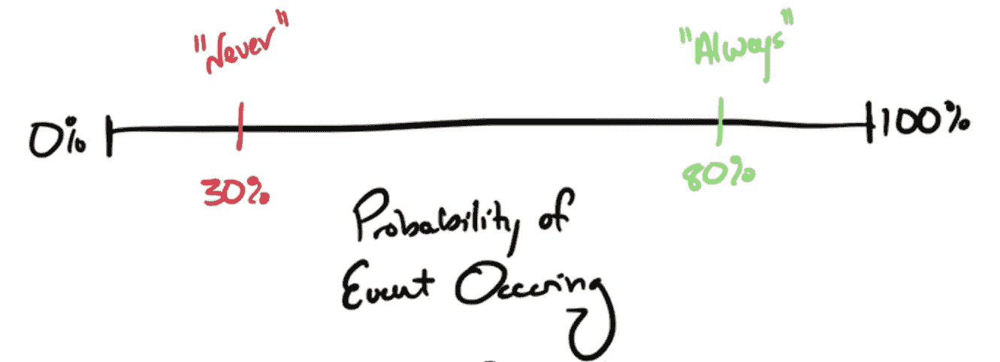
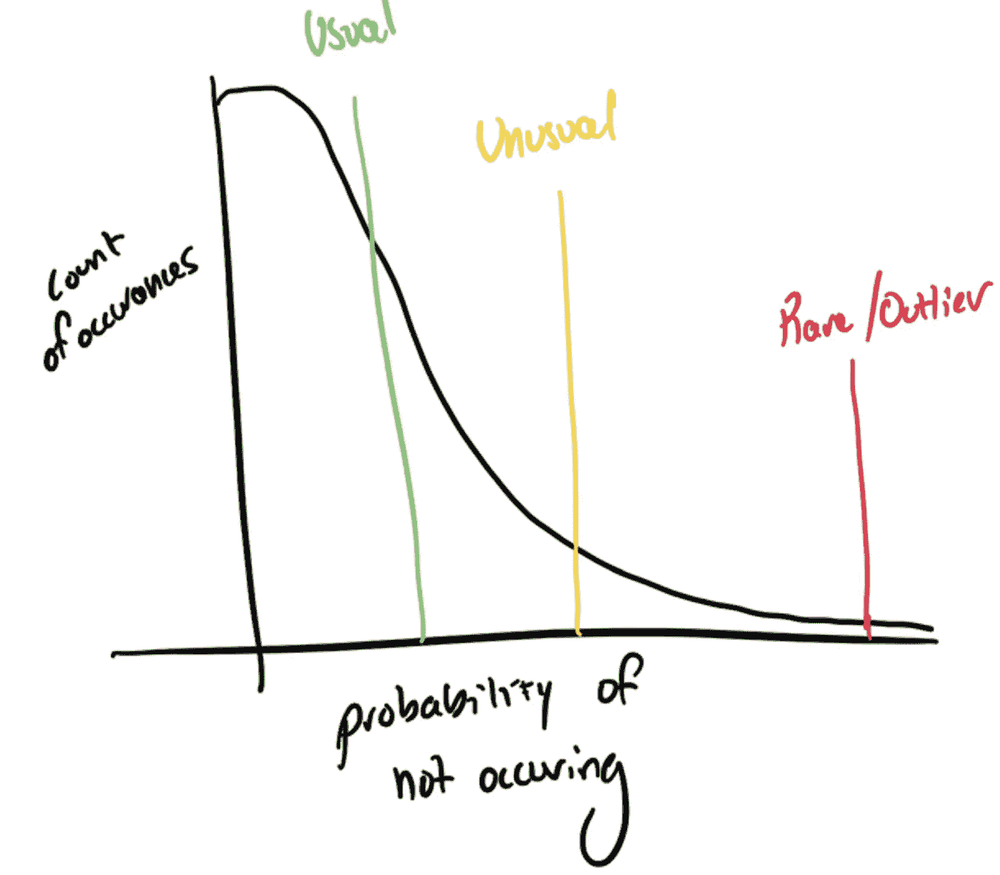
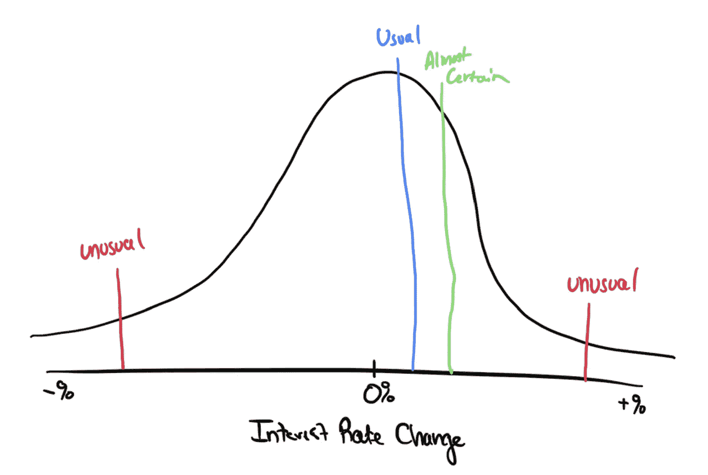
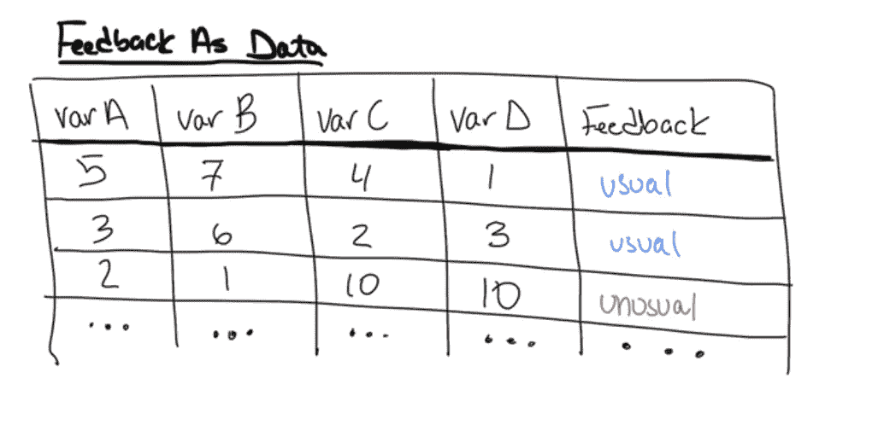

# 数据科学中的概率词使用

> 原文：[`towardsdatascience.com/using-probabilistic-words-in-data-science-3b0b9777e9d7?source=collection_archive---------15-----------------------#2023-02-07`](https://towardsdatascience.com/using-probabilistic-words-in-data-science-3b0b9777e9d7?source=collection_archive---------15-----------------------#2023-02-07)

## 将模糊的反馈转化为机器学习的具体概率

 [Taylor Jensen](https://medium.com/@T_Jen?source=post_page-----3b0b9777e9d7--------------------------------)

·

[关注](https://medium.com/m/signin?actionUrl=https%3A%2F%2Fmedium.com%2F_%2Fsubscribe%2Fuser%2F4d9206d21dd8&operation=register&redirect=https%3A%2F%2Ftowardsdatascience.com%2Fusing-probabilistic-words-in-data-science-3b0b9777e9d7&user=Taylor+Jensen&userId=4d9206d21dd8&source=post_page-4d9206d21dd8----3b0b9777e9d7---------------------post_header-----------) 发表在 [Towards Data Science](https://towardsdatascience.com/?source=post_page-----3b0b9777e9d7--------------------------------) ·9 分钟阅读·2023 年 2 月 7 日

--

图片由 [Christina @ wocintechchat.com](https://unsplash.com/@wocintechchat?utm_source=medium&utm_medium=referral) 提供，来自 [Unsplash](https://unsplash.com/?utm_source=medium&utm_medium=referral)

在开始新的数据科学模型时，你必须评估提供给你的数据。通常，新的数据科学项目始于一个数据集，并与主题专家或其他联系人进行联系。主题专家为数据集的意义提供额外的背景。这包括数据集中的异常值或例外情况，以及主题专家认为的“正常”或“异常”情况，或“总是”或“从不”发生的情况。但如果“从不”并不意味着“从不”，“总是”也不意味着“总是”呢？这些词被称为“概率词”，包含其他地方无法找到的关键信息。本文讨论了如何使用这些概率词来了解你的数据并改进你的模型。

“从不”并不意味着“从不”

# 定义概率词

概率词是表达不确定性或概率的词语。它们包括“也许”，“可能”，“大概”，“很可能”，“不太可能”，“可能”，“不可能”等词语。这些词用来表示某人对事件的信念或信心的隐性分布。

每个人，无论是有意识还是无意识地，都在脑海中为这些概率词分配一个概率。然而，这些词的确切概率常常被个人对词语的解释所掩盖，从而与数据的关联变差。例如，“通常”是指 40%还是 80%的时间？这一定义在不同人和情况之间可能有所不同。一旦提取出这些概率的解释，就可以将其融入建模开发过程中。

人们心中的概率范围可以发生剧烈变化。

# 概率词与以往的工作

两项涉及概率词的显著研究包括 1993 年美国中央情报局（CIA）谢尔曼·肯特的《估计概率的词汇》([Words of Estimative Probability (cia.gov)](https://www.cia.gov/static/0aae8f84700a256abf63f7aad73b0a7d/Words-of-Estimative-Probability.pdf))。第二篇文章是由安德烈·莫博辛和迈克尔·J·莫博辛于 2018 年在《哈佛商业评论》中撰写的《如果你说某事“很可能”，人们认为它有多可能？》

肯特撰写的研究旨在解决在情报行业中，人们常用不具体的陈述来描述事件发生的可能性。在文章中，他利用了一组报告样本来建立单词与概率之间的映射，将数字赋予人们回应的不确定性。原始表格的输出范围从 0%的不可能到 100%的确定性，中间有一个“可能性的一般区域”。“可能性的一般区域”包含 7 种概率短语。这些词按确定性递增的顺序为：“不可能”，“几乎不可能”，“可能性不大”，“变化不定”，“可能”，“几乎确定”和“确定”。

后来，安德烈和迈克尔·莫博辛进行了跟进研究，进行了更新的调查，包含了更多不同的词汇。他们的目标是增加研究参与者的数量，并扩展到情报界之外。他们在网络上调查用户，将词汇与其解释的概率相关联。作者还试图识别其他背景方面的差异，例如性别和将英语作为第二语言的人。研究的一个教训是，人们应该使用概率来解释数据，而不是使用概率词，以避免在分享数据见解时的误解。此外，人们应使用明确的方法来收集概率。

本节仅为文章的简要概述，我强烈推荐完整阅读这些文章。但问题仍然存在——这对数据科学意味着什么？

“通常”到“罕见”的范围因人而异。

# 在数据科学中使用概率词汇

将模糊的词汇含义与具体示例联系起来，是扩展数据集知识和增加额外知识的极好方法。这些额外的信息可以增加模型可用的信息，提高模型性能。

## 了解数据背景

除了传统的数据探索技术，还有许多不同的方法可以深入了解数据集。这可以通过各种方法完成，通常涉及与受访者的讨论。这个人可以是主题专家、内容审核团队、会计师、用户，或与数据集、行业或问题相关的人。

与受访者交谈时，准备识别他们的概率词汇。首先询问数据的一般统计行为，如相关性，并将每个相关性视为假设。这个假设由受访者根据他们的经验来证明或反驳。目标是倾听人们在表达行动意见时所使用的限定词。你可以利用这些概率词汇来识别他们经验中的正常、异常和异常值。这也可以用于双重检查你的数据集是否与任务一致。例如，数据集中或相关人员中是否存在你不知道的偏差？受访者认为异常的事情在数据中是否经常发生？

在识别正常数据、异常数据和离群值时，脑海中或画出分布图会有所帮助。通过寻找概率词汇，我们试图识别受访者的事件样本在分布中的位置。然而，必须确保我们从受访者的角度收集数据。在数据中看似正常的事件在业务流程中可能非常意外或不寻常——这种知识在建模时是金子般的宝贵。

关于利率变化的隐式分布示例。

例如，设想你是一个数据科学家，任务是开发一个模型来预测美联储是否会提高利率。在学习利率、美联储的动作以及市场反应时，获取专家的观点至关重要，这能让我们了解他们认为哪些因素会影响这些决定。比如，我们询问一位基金经理他们认为利率会如何变化，他们说：“可能会以较慢的速度上涨。”在这种情况下，重要的是要求交易员用概率术语（比例、百分比等）来量化“可能”对他们来说意味着什么。通过要求交易员用百分比术语表达他们的理解，我们可以开始建立对以下内容的理解：

+   “**可能**”对他们来说意味着什么，以及实现这一点需要什么经济背景

+   什么会导致**几乎肯定**的正面或负面利率变动

+   他们认为美联储在这种情况下**通常**会做什么

+   一个**不寻常的** **负面**利率变动会是什么样子

+   一个**不寻常的** **正面**利率变动会是什么样子

通过要求交易员详细描述每个回应的背景来跟进。澄清交易员提到的每个词的概率可能性，并寻找口头解释的统计见解。这些见解包括多重共线性、次要效应以及其他影响模型性能但不在训练数据集中的来源。为了减少结果的偏差，尽量采访几个人。

有了这些信息，你对可能导致利率变化的原因会有更多了解，并能构建出交易员的信念。数据甚至可以用来建立一个网络抓取的情感模型，将外部情感转化为业务情感。

## 增强你的数据集

使用概率词汇，可以增强数据集以包含见解。例如，你可以添加一个分类列，标记“异常”情况。你可以使用这些数据预测更大数据集上的反馈，将其作为机器学习模型的原始输入，并量化这些“人类”信息对数据的价值。

一个包含反馈信息的示例数据集。

使用数据来预测更大数据集上的反馈被称为“**弱学习**”。在这种情况下，构建了一个模型，该模型利用反馈样本来预测其余数据集上的反馈内容。这意味着反馈样本可以扩展到覆盖整个数据集。然后，这些扩展的反馈可以作为另一个模型的输入或用于探索性数据分析。这种方法的好处是可以将数据样本扩展到覆盖大量数据。然而，这也带来了准确性的成本。由于模型是在小样本上训练的，模型可能会有更高的偏差或表现不完全符合受访者的实际情况。

如果你需要即时反馈以作为模型的一部分进行预测，那么可以使用“**弱学习**”来构建一个“**即时反馈**”系统。随着模型进行在线预测，“**弱学习**”模型接收原始数据，预测反馈内容，然后将原始数据和预测的反馈传递给主在线模型。这允许你构建一个功能齐全的模型，而无需人类时刻参与。

收集这些数据的另一个好处是，它可以用来量化采访提供的信息比原始数据更多。可以通过构建有反馈和没有反馈的模型来评估这一点。在训练完两个模型后，比较模型分数之间的差异，这将给出反馈的相对价值。如果你的模型在使用反馈数据后比仅使用原始数据训练的模型提高了 15%，那么这证明采访提高了模型的性能。如果这 15%的提升可以与业务影响挂钩，这可以帮助证明采访成本并给出反馈的美元价值。例如，如果一个预测模型的性能提高了 15%，而这转化为 20 万美元的价值，那么反馈的价值就是 20 万美元。

# 构建你自己的概率调查

现在概率词汇已经介绍完毕，这些知识可以用于创建你的概率调查。

要开始，可以从之前提到的原始研究中的常见概率词汇中获得灵感。可以添加你自己和你组织中常用的概率词汇。花一周时间识别你会议中使用的常见词汇并保持一个常见项目的清单也可能会有帮助。我在职业背景中使用的一个例子是“**不确定性**”。如果我正在为我的组织编写一个概率调查，我会想在词汇列表中包括像“**极大不确定性**”和“**几乎确定**”这样的条目以获取反馈。记住，你总是可以稍后添加词汇并收集更多反馈，所以不需要追求完美。

一旦收集了词汇列表，需要创建一个架构来从人们或其他数据源收集词汇。如果你已经有数据源，可以使用你喜欢的方法将数据输入到你的流程中。如果你正在收集来自组织内部人员的反馈，建立一个简单的调查架构以便收集信息是有益的。这可以包括像 Google Forms、Microsoft Forms 和 Streamlit 这样的工具。我的常用选择是 Streamlit，因为它设置迅速，使用 Python 构建，并且可以在本地 PC 上快速运行，或在其网站上运行。

你也可以收集每个人提供反馈时的基本元数据。像公司级别、部门和工作年限这样的元数据可能对细分不同部门如何使用概率词汇很有帮助。一旦收集了大量反馈，你可以收集数据并分析每个回应的分布。从这些分布中，你将能够回答如下问题：

+   哪些词具有相同的概率含义？

+   定义相似的词是否具有不同的概率？

+   例如，“确定性”和“绝对确定”可能分别与 70% 和 95% 的平均概率相关。

+   一个词的概率分布是什么？

+   这些词的分布特征是什么？（均值、中位数、众数、标准差等）

在这项分析之后，你可以利用这些信息帮助将面试、反馈会话和探索性数据分析中收集的非确定性词汇连接起来。这些数据可以用于数据管道中，以分类陈述中的概率、识别独特情况并改进模型结果。

除非另有说明，否则所有图片均由作者提供。
