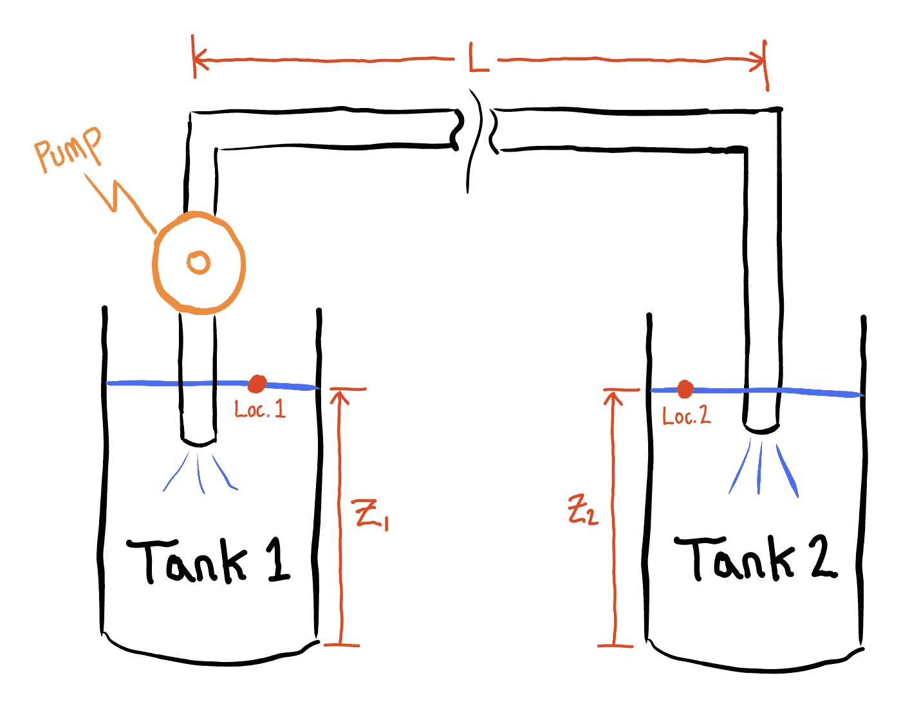
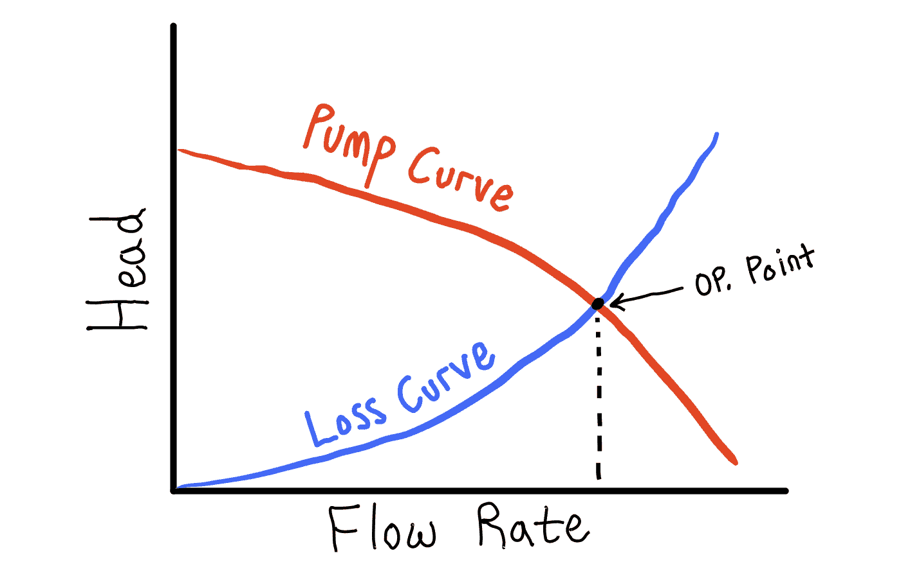
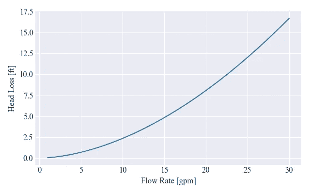
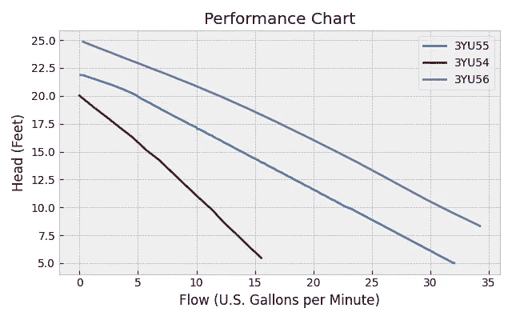
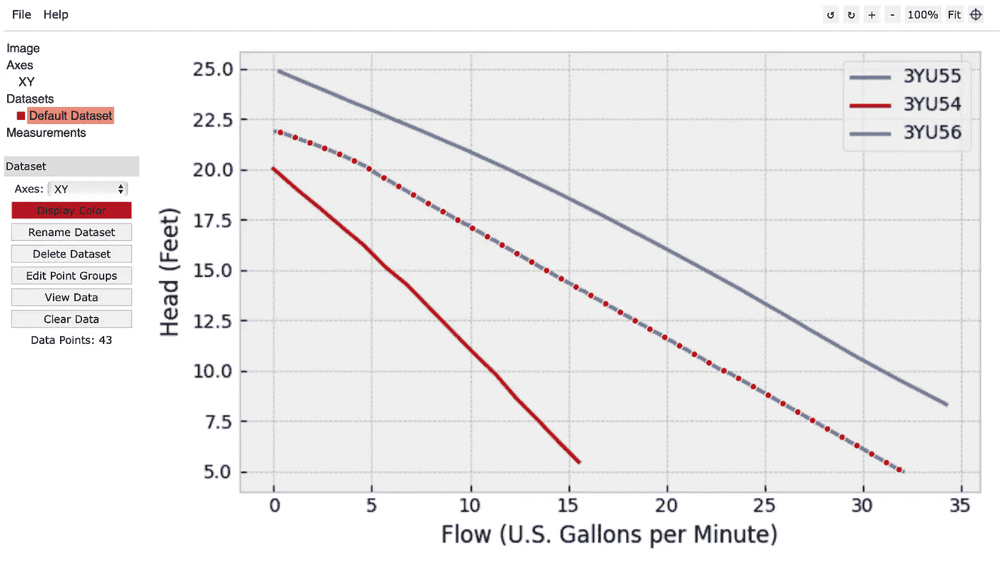
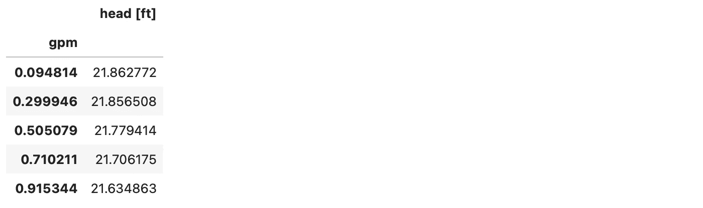
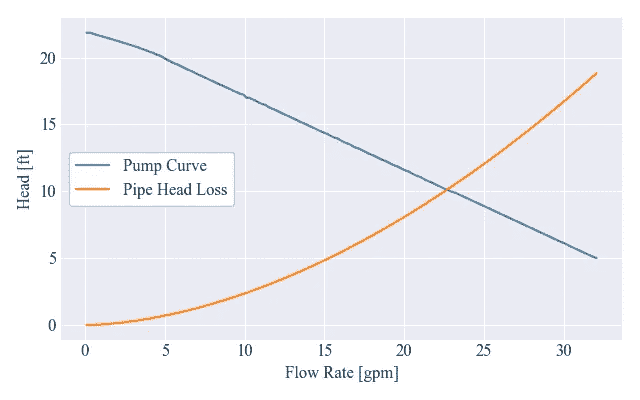
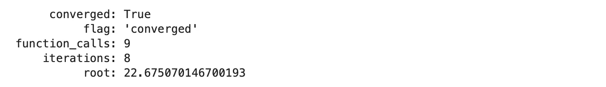
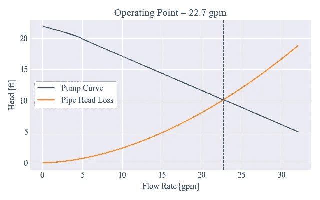
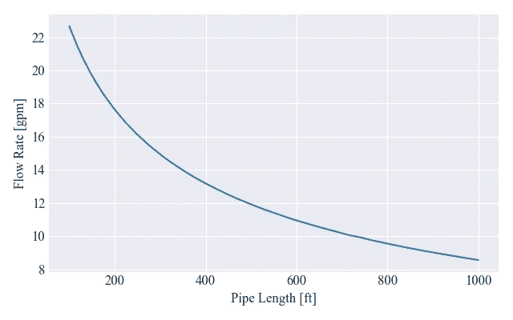

# 使用 Python 解决工程中最常见的问题之一

> 原文：[`towardsdatascience.com/using-python-to-solve-one-of-the-most-common-problems-in-engineering-c7f2a2d46091`](https://towardsdatascience.com/using-python-to-solve-one-of-the-most-common-problems-in-engineering-c7f2a2d46091)

## 创建一个用于工作点分析的通用框架

[](https://medium.com/@nhemenway2013?source=post_page-----c7f2a2d46091--------------------------------)[](https://towardsdatascience.com/?source=post_page-----c7f2a2d46091--------------------------------) [Nick Hemenway](https://medium.com/@nhemenway2013?source=post_page-----c7f2a2d46091--------------------------------)

·发布于 [Towards Data Science](https://towardsdatascience.com/?source=post_page-----c7f2a2d46091--------------------------------) ·17 分钟阅读·2023 年 1 月 2 日

--


图片由 [SpaceX](https://unsplash.com/@spacex?utm_source=medium&utm_medium=referral) 提供，来源于 [Unsplash](https://unsplash.com/?utm_source=medium&utm_medium=referral)

在工程中，某些问题经常出现。本文的重点是讨论一种在我日常工作中经常遇到的问题，我决定分享如何使用 Python 来解决它。我们讨论的是什么类型的问题？就是解决系统工作点的问题！在深入复杂的代码之前，让我们用一个简单的例子来说明我的意思。

我们希望解决下图所示简单电路的工作点。这可以通过重新排列欧姆定律 (V=IR) 来实现，从而根据已知的输入电压和电阻隔离电流。


图片由作者提供

简单，对吧？不幸的是，大多数现实世界的问题都没有这么简单。例如，如果我告诉你，电阻器加热时，其电阻值发生变化，这实际上使电阻成为电流的函数。我们会得到如下形式的方程：


如果不知道实际的电阻函数形式，我们不能仅仅通过代数方法来求解电流。此外，如果方程很复杂，无法单独隔离电流怎么办？或者，假如电阻以电流的形式给出，并且是离散的表格数据 — 那么我们甚至没有代数表达式来操作以尝试求解电流。那我们应该如何确定电路中的电流呢？我们需要一种更通用的方法来解决这个问题。

解决这类问题的一般方法是将其表示为根查找问题。这实际上非常简单——我们只需将方程的右侧从左侧中减去，使得方程等于零。这样得到如下：


通过这样做，我们重新提出了问题。我们不再直接求解电流值，而是尝试找到一个电流值，将其输入方程的左侧，使其结果为零。我们为什么这样制定问题？因为存在大量的数值算法（如二分法、牛顿法等）来解决这种精确的问题！而且大多数算法不在乎方程的左侧有多复杂——它甚至不需要有封闭的代数形式（即，它可以由插值的离散数据、数值评估的积分或任意复杂度的函数组成）。只要我们能将问题表示为 f(x)=0，我们（几乎）总能找到问题的解决方案（如果问题陈述改变，代码也可以轻松修改/扩展——不需要重新做代数）。

本文接下来将通过一个例子来讲解如何将根查找方法应用于一个稍微复杂一点的实际问题，重点是 Python 中的代码结构和组织技巧。尽管这个问题（确定管道/泵系统中的水流量）有些领域特定，但所使用的方法和编码技术完全通用，适用于所有工程领域。考虑到这一点，我会尽量保持问题的物理建模方面处于高层次，使得不论技术背景如何，文章的主要学习目标仍然清晰明了。

作为旁注，我目前的领域“专长”在电机控制和功率电子学领域，与泵/管道应用相去甚远。我已经有好几年没有涉及这一主题，但认为它会是一个有趣的例子。我确信有许多人比我更有资格讨论泵/管道建模的具体细节，但我写这篇文章的意图在于方法论——而不是如何解决泵/管道问题。无论如何，我欢迎那些对该领域更了解的人的评论或改进建议！

# 问题

我们想要将水从一个水箱转移到另一个水箱。我们已经有一个泵和一些管道可以用来连接两个水箱，想要估算转移所有水所需的时间。每个水箱的体积是已知的，因此，如果我们可以估算水在两个水箱之间的流量，我们就可以估算转移过程需要多长时间。完整的设备如下所示。



图片由作者提供

这个特定问题（可以归类为“内部流动”问题）在机械工程领域中非常清楚。对于那些不太熟悉的人，或者需要快速复习的人，我们通常通过伯努利方程来解决这些问题（如下所示）。


伯努利方程本质上是一个能量守恒的陈述，它告诉我们流体粒子在沿流线（即如果流体中丢下一个假想粒子其会沿着的流动路径）移动时，能量如何在不同的能量机制之间转换。方程的左边表示流体粒子在任意第一个位置（位置 1）处的总单位重能量，是重力势能项、动能项和压力项的总和。当流体在系统中流动时，能量必须守恒，因此在流线上的任意第二个点（位置 2）处的总能量（由方程右边表示）必须等于位置 1 的总能量。

上述形式的伯努利方程被称为“扬程”形式，因为每个项的单位是长度/高度。这对我们的直觉很方便，因为我们基本上是在将每个项的能量等同于具有给定扬程高度的流体柱的重力势能。然而，伯努利方程的一个主要限制是它假设系统中没有损失（这并不是一个很好的假设）。为克服这一限制，我们可以在方程中补充两个附加项，如下所示：


Hp(Q)和 Hl(Q)项分别表示泵对系统增加的扬程和由于实际世界效应（如摩擦、粘度等）在系统中损失的扬程。注意这两个项都是系统流体流量 Q 的函数。（作为上述描述扬程解释的一个有趣结果，泵的扬程告诉你泵理论上能将流体推高多少）。我们将稍后更详细地检查泵和损失项，但在此之前，让我们简化上述方程以解决我们的具体问题。

再次查看上面的系统，我们将方便地选择两个位置用于伯努利方程，使得大多数项相互抵消。我们可以通过选择位置 1 和 2 分别位于每个水箱的自由水面来做到这一点，此时压力是常数且等于大气压力（P1=P2），速度大约是常数且为零（V1=V2=0）。我们还将假设在我们分析系统的瞬间两个水箱中的水高度相同，即 Z1=Z2。经过代数简化后，我们发现几乎所有项都抵消了，剩下的就是泵产生的扬程必须等于由于非理想性导致的系统损失的扬程。换句话说，泵在弥补系统中的任何能量损失。


在下图中可以定性地看到这种情况。泵产生的扬程随着流量的增加而减少，而管道系统中的损失随着流量的增加而增加。两条曲线交点（泵扬程 = 损失扬程）决定了系统的工作点（流量）。



作者提供的图片

在我们可以跳入代码之前的最后一步是将问题表示为根寻找问题。将方程右侧减去左侧，我们得到我们正在寻找的根求解问题。也就是说，我们将问题表述为：找到流量（Q），使得下面方程的左侧等于零。此时，泵扬程将等于系统的扬程损失。


# 代码

为了避免丢失我们正在做的大局，我不会解释代码的每一个细节（假设你已经具备合理的 Python 背景）。相反，我会集中精力确保叙述和代码结构清晰，并在需要时提供更多细节。与往常一样，如果有任何不清楚的地方，请随时提问。

## 设置

我们将从导入所有必要的模块开始。稍后将明显每个模块的使用方式，但值得注意的是，关键的导入语句来自 scipy。这些是针对当前问题的特定函数。代码块还设置了一些默认绘图设置（根据个人口味），创建了一个文件夹来保存生成的图形，并定义了一些单位转换常数，使得后续代码中的操作更加简便。

```py
from dataclasses import dataclass
from pathlib import Path

import numpy as np
import matplotlib.pyplot as plt
import pandas as pd

#these are the key libraries for solving the problem
from scipy.interpolate import interp1d
from scipy.optimize import root_scalar

#set plotting defaults
plt.style.use('seaborn-v0_8-darkgrid')
plt.rcParams['font.family'] = 'Times New Roman'
plt.rcParams['font.size'] = 12
figsize = (6.4,4)

#make folder to save plots to
plots_folder = Path('plots')
plots_folder.mkdir(exist_ok=True)

#define conversion constants for ease of use later
INCHES_TO_METERS = 25.4/1000
FEET_TO_METERS = 12*INCHES_TO_METERS
GALLONS_TO_M3 = 0.0037854118 #convert gallons to m³
```

接下来，我们将创建一个 Python `dataclass`，它实际上充当了一个存储流体属性（密度、粘度和重力）的容器。默认情况下，这些属性设置为水的属性。请注意，虽然这不是完全必要的，但 Python 数据类非常方便。如果你对它们不熟悉，我强烈推荐你查看这个[视频](https://www.youtube.com/watch?v=vRVVyl9uaZc&t=291s)。

```py
@dataclass
class Fluid():
    #fluid defaults to water properties
    rho: float = 997 #kg/m³
    mu: float = 0.0007972 #N-s/m² = kg/m-s
    g: float = 9.81 #m/s²
```

## 管道模型

下一步是建模管道的摩擦损失（上述扩展的 Bernoulli 方程中的 Hl(Q)项）。这通常使用如下的 Darcy-Weisbach 方程，其中 f 是摩擦因子（稍后会详细介绍），v 是流速，g 是重力，而 L 和 D 分别是管道的长度和直径。


不幸的是，摩擦因子（f）不是恒定的，而是依赖于流速、流体属性和管道尺寸。存在各种计算 f 的模型，但我们将使用下面的 Haaland 方程。


在这个方程中，epsilon 是管道的表面粗糙度（可以在工程教材的表格中找到），Re 是著名的雷诺数，如下所示。


最后，我们可以注意到每单位时间的扫过体积，或者称为体积流量（Q），等于管道的横截面积（A）乘以流速（v）。因此，给定管道中的流量，我们可以计算出管道中的相应流速：


希望所有这些方程没有让你忽视大局——我们只是查看了计算管道摩擦损失的一个特定模型。给定流量和管道尺寸，首先计算出相应的流速，然后通过上述方程计算管道的摩擦损失。这正是`Pipe` 类（如下所示）所实现的。

初始化方法存储了管道的尺寸（假设都以米为单位）和流体属性。`A` 方法计算管道的横截面积（对于不熟悉`@property` 装饰器的人，这篇[文章](https://realpython.com/python-property/)解释得非常好）。`Q_to_v` 方法将每分钟加仑数（gpm）的流量转换为米/秒的流速。`friction_factor` 方法评估了上述提到的 Haaland 方程，而`head_loss` 和 `head_loss_feet` 分别评估了管道的摩擦损失（以米和英尺为单位）（使用 Darcy-Weisbach 方程）。

```py
class Pipe():

    def __init__(self, L, D, epsilon, fluid: Fluid):

        #pipe dimensions are all assumed to be in meters
        self.L = L
        self.D = D
        self.epsilon= epsilon

        #fluid properties
        self.fluid = fluid

    @property
    def A(self):
        """computes cross-sectional area of pipe in m²"""

        return np.pi*(self.D/2)**2 #area in m²

    def Q_to_v(self, gpm):
        """Converts gpm to fluid speed in pipe in m/s"""

        Q = gpm*GALLONS_TO_M3/60 #flow rate in m³/s
        return  Q/self.A #flow velocity in m/s

    def friction_factor(self, gpm):
        """computes Darcy friction factor, given flow rate in gpm

        This method uses Haaland's equation, wich is an explicit approximation
        of the well-known, but implicit Colebrook equation
        """
        #first get flow velocity from flow rate and pipe dimensions
        v = self.Q_to_v(gpm)
        #compute Reynold's number
        Re = self.fluid.rho*v*self.D/self.fluid.mu
        #compute relative roughness
        e_over_d = self.epsilon/self.D
        #use Haaland's equation
        f = (-1.8*np.log10((e_over_d/3.7)**1.11 + 6.9/Re))**-2
        return f

    def head_loss(self, gpm):
        """computes head loss in meters, given flow rate in gpm"""

        #get flow velocity
        v = self.Q_to_v(gpm)
        #get Darcy friction factor
        f = self.friction_factor(gpm)
        #compute head loss in meters
        hl = 0.5*f*(self.L/self.D)*v**2/self.fluid.g
        return hl

    def head_loss_feet(self, gpm):
        """computes head loss in feet, given flow rate in gpm"""

        hl_meters = self.head_loss(gpm)
        return hl_meters/FEET_TO_METERS
```

让我们看看管道类的实际应用。首先，我们可以创建一个水的`Fluid`对象和一个长度为 100 英尺、直径为 1.25 英寸的`Pipe`对象。

```py
#create fluid object for water
water = Fluid()

#create pipe segment with water flowing in it
pipe = Pipe(L=100*FEET_TO_METERS, 
            D=1.25*INCHES_TO_METERS, 
            epsilon=0.00006*INCHES_TO_METERS,
            fluid=water)
```

接下来，我们将绘制流量（以 gpm 为单位）与摩擦损失的关系曲线。当我们利用面向对象编程时，下面的代码变得如此简洁和易读，这难道不令人惊叹吗？

```py
gpm_arr = np.linspace(1,30,100)
hl = [pipe.head_loss_feet(gpm) for gpm in gpm_arr]

fig, ax = plt.subplots(figsize=figsize)
ax.plot(gpm_arr, hl)
ax.set_xlabel('Flow Rate [gpm]')
ax.set_ylabel('Head Loss [ft]')
fig.tight_layout()
fig.savefig(plots_folder/'pipe_loss_curve.png')
```



图片来源：作者

## 泵模型

我们已经有了管道头损失的工作模型——现在我们需要一个泵产生的头部模型，Hp(Q)。我相信有解析模型可以用来确定泵的行为，但我们将假设我们已经有了一个具体的泵——即我在[网上](https://www.grainger.com/product/DAYTON-Plug-In-Utility-Pump-110V-3YU55)找到的随机的、分数马力的泵：

大多数泵都有一个数据表，其中包含描述泵行为的泵曲线。对于我们的泵，下面是泵曲线（请注意，出于版权原因，这只是制造商提供的图示的重建版——原版可以在[这里](https://www.grainger.com/ec/pdf/Dayton-3YU55-Utility-Pump-Technical-Data-Sheet.pdf)找到）。



图片来源：作者

目前我们有了描绘泵行为的图像，但还没有一个可以实际用来确定它在系统中表现的数学模型。这个问题经常出现，我的解决方法是 1) 数字化数据，然后 2) 使用插值方案包装离散数据，以生成一个连续函数。让我来说明一下。

第一步）有许多工具可以将图像数据数字化——我个人最喜欢的是免费的在线工具[WebPlotDigitizer](https://apps.automeris.io/wpd/)。你可以加载感兴趣的图像，校准坐标轴，然后提取所需的数据曲线（可以手动提取，也可以使用自动提取工具）。数据可以导出为 .csv 文件。



图片来源：作者

第二步）现在我们已经得到了数字化的数据，我们只需要用某种插值器进行包装——这正是下面`Pipe`类所做的。初始化方法接收 .csv 文件名，存储文件名，将数据加载到 pandas DataFrame 中，存储在 `data` 属性中，然后将数据传递给 scipy 的 `interp1d` 函数。`interp1d` 函数生成一个新的函数，默认使用线性插值将离散数据点转换为连续函数（`interp1d` 函数的完整文档可以在[这里](https://docs.scipy.org/doc/scipy/reference/generated/scipy.interpolate.interp1d.html)找到）。新生成的插值函数随后存储在 `_interp` 属性中以供后续访问。`Pipe` 类还包含一个 `bounds` 方法，该方法返回包含泵曲线数据中流量的最小/最大值的列表（这将在根查找算法中使用），以及一个 `head_gain_feet` 方法，该方法接受流量值（单位为 gpm），并调用由 `interp1d` 生成的底层插值函数。

```py
class Pump():

    def __init__(self, file):    
        #store file name
        self.file = file 
        #read data into pandas dataframe and assign column names
        self.data = pd.read_csv(file, names=['gpm', 'head [ft]']).set_index('gpm')
        #create continuous interpolation function
        self._interp = interp1d(self.data.index.to_numpy(), self.data['head [ft]'].to_numpy())

    @property
    def bounds(self):
        """returns min and max flow rates in pump curve data"""
        return [self.data.index.min(), self.data.index.max()]

    def head_gain_feet(self, gpm):
        """return head (in feet) produced by the pump at a given flow rate"""
        return self._interp(gpm)
```

我们可以创建一个`Pump`对象并查看我们读取的原始数据。

```py
pump = Pump('pump_data.csv')
pump.data.head()
```



图片来源：作者

我们还可以将泵曲线数据与管道损失曲线一起绘制，以直观地查看系统将在哪里操作。

```py
head_loss = [pipe.head_loss_feet(gpm) for gpm in pump.data.index]

fig, ax = plt.subplots(figsize=figsize)
ax.plot(pump.data, label='Pump Curve')
ax.plot(pump.data.index, head_loss, label='Pipe Head Loss')
ax.set_xlabel("Flow Rate [gpm]")
ax.set_ylabel("Head [ft]")
ax.legend(frameon=True, facecolor='w', framealpha=1, loc=6)
fig.tight_layout()
fig.savefig(plots_folder/'pump_curve_with_losses.png')
```



图片来源：作者

## 系统模型

我们终于建立了能够解决泵/管道系统操作点的基础设施。最后一步是创建一个`System`类，该类接收一个`Pipe`和`Pump`对象，并执行根求解操作。正如下面的代码所示，`System`类接收并存储一个`Pipe`和`Pump`对象。然后，它利用这两个对象创建一个`residual`方法，该方法计算泵头和管道头损失之间的差值。这个`residual`方法随后在`get_operating_point`方法中被使用，以实际求解系统的操作点。该方法包装了 scipy 的`root_scalar`函数，它作为各种根求解算法的接口。我们将让`root_scalar`函数选择它认为最适合的算法，但为了帮助它，我们将指定一个我们知道根在其间的区间。在我们的案例中，这个区间是泵曲线数据的上限和下限流量。关于`root_scalar`函数的完整文档可以在[这里](https://docs.scipy.org/doc/scipy/reference/generated/scipy.optimize.root_scalar.html)找到。

> 提示：将`Pipe`和`Pump`对象注入`System`类（与在实例化时让系统类创建`Pipe`和`Pump`对象相对）被称为“依赖注入”。这通常被认为是一种良好的编码实践，因为它使代码更具模块化、可扩展性，更易于调试/测试。

```py
class System():

    def __init__(self, pipe: Pipe, pump: Pump):
        self.pipe = pipe
        self.pump = pump

    def residual(self, gpm):
        """
        Computes the difference between the head produced by the pump
        and the head loss in the pipe. At steady state, the pump head and 
        head loss will be equal and thus the residual function will go to zero
        """
        return self.pump.head_gain_feet(gpm) - self.pipe.head_loss_feet(gpm)

    def get_operating_point(self):
        """solve for the flow rate where the residual function equals zero. 
        i.e. the pump head equals the pipe head loss"""
        return root_scalar(self.residual, bracket=self.pump.bounds)
```

让我们创建一个`System`并运行`get_operating_point`方法，以观察我们的劳动成果。正如代码输出所示，`get_operating_point`方法仅返回`root_scalar`函数的输出，这是一个`RootResults`对象。这个对象本质上只是一个容器，存储各种属性，其中最重要的是`root`属性，因为它包含我们问题的解决方案。

```py
sys = System(pipe, pump)

res = sys.get_operating_point()
res
```



我们可以再次绘制相同的泵和头损失曲线，这次在计算出的稳态操作点处添加一条垂直线。

```py
head_loss = [pipe.head_loss_feet(gpm) for gpm in pump.data.index]

fig, ax = plt.subplots(figsize=figsize)
ax.plot(pump.data, label='Pump Curve')
ax.plot(pump.data.index, head_loss, label='Pipe Head Loss')
#plot vertical line at operating point
ax.axvline(res.root, color='k', ls='--', lw=1)
ax.legend(frameon=True, facecolor='white', framealpha=1, loc=6)
ax.set_xlabel("Flow Rate [gpm]")
ax.set_ylabel("Head [ft]")
ax.set_title(f'Operating Point = {res.root:.1f} gpm')
fig.tight_layout()
fig.savefig(plots_folder/'intersection_solution.png')
```



图片来源：作者

完成了！我们已经程序化地确定了系统的操作点。因为我们使用的是一种比较通用的编码框架，我们可以轻松尝试使用不同的泵或管道进行相同的分析！我们甚至可以扩展我们的代码以包括多个泵，或各种管道配件/管道分支。

## 设计探索

作为一个小例子，突出我们设置代码方式的好处，我们将进行设计探索。使用相同的泵，我们希望了解管道长度对系统体积流量的影响。为此，我们只需遍历一个管道长度数组（从 100 到 1000 英尺），更新存储在`System`中的`Pipe`对象的长度属性，然后重新计算系统的工作点，将结果追加到列表中。最后，我们将水流量绘制为管道长度的函数。

```py
#sweep pipe length from 100 to 1000 feet
lengths_feet = np.linspace(100, 1000, 1000)
lengths_meters = lengths_feet*FEET_TO_METERS

flow_rates = []
for l in lengths_meters:
    #update pipe length
    sys.pipe.L = l 
    #compute new flow rate solution
    res = sys.get_operating_point()
    #append solution to flow rates list
    flow_rates.append(res.root) 

#plot results
fig, ax = plt.subplots(figsize=figsize)
ax.plot(lengths_feet, flow_rates)
ax.set_xlabel("Pipe Length [ft]")
ax.set_ylabel("Flow Rate [gpm]")
# ax.set_ylim(bottom=0)
fig.tight_layout()
fig.savefig(plots_folder/'flow_vs_pipe_length.png')
```



图片由作者提供

几行代码让我们能够深入了解系统的行为。如果这是一个设计问题，这些见解可能会驱动关键的设计决策。

## 结论

本文虽然主要集中在一个特定领域的示例问题上，但突出了我经常使用的工作流程的几个方面。操作点分析的问题在工程和科学中经常出现，尽管有许多方法可以解决这个问题，但有些方法比其他方法更强大、可扩展和灵活。本文中使用的方法论（问题表述和代码结构原则）对我帮助极大，希望其他人也能受到启发，采用类似的工作流程！

随时留下任何评论或问题，或者在 LinkedIn 上与我联系——我非常乐意澄清任何不确定的点。最后，我鼓励你自己尝试代码（甚至将其用作自己工作流程的起始模板）——这篇文章的 Jupyter Notebook 可以在我的[Github](https://github.com/Nick-Hemenway/medium_most_common_problem)上找到。

# 尼古拉斯·赫门威

+   ***如果你喜欢这个，请******在 Medium 上关注我***

+   ***考虑订阅*** ***电子邮件更新***

+   ***有兴趣合作吗？让我们*** [***在 LinkedIn 上联系***](https://www.linkedin.com/in/nicholas-hemenway/)
