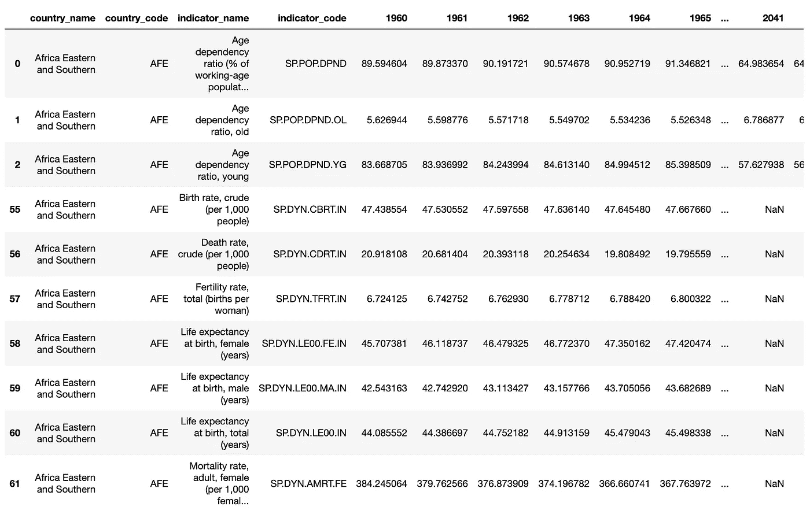
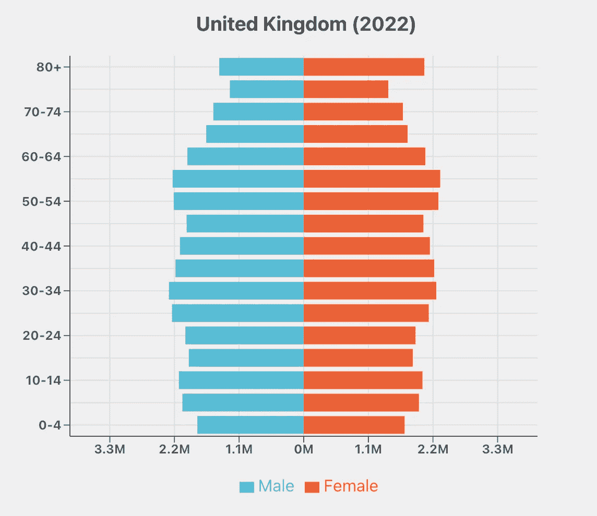

# 使用 React 构建互动界面以展示令人兴奋的数据集

> 原文：[`towardsdatascience.com/using-react-to-build-interactive-interfaces-to-exciting-dataset-c01691a5fc38`](https://towardsdatascience.com/using-react-to-build-interactive-interfaces-to-exciting-dataset-c01691a5fc38)

## 数据教程

## 使用网页开发创建更动态的数据可视化体验

[](https://medium.com/@oscarleo?source=post_page-----c01691a5fc38--------------------------------)[](https://towardsdatascience.com/?source=post_page-----c01691a5fc38--------------------------------) [Oscar Leo](https://medium.com/@oscarleo?source=post_page-----c01691a5fc38--------------------------------)

·发表在 [Towards Data Science](https://towardsdatascience.com/?source=post_page-----c01691a5fc38--------------------------------) ·5 分钟阅读·2023 年 9 月 19 日

--

界面演示视频

除了我作为一家小型机器学习公司的首席执行官的全职工作之外，我的爱好是创建美丽的数据可视化。

我通常使用 Matplotlib，但这次我想创造一个更互动的体验。

由于我喜欢网页开发和设计，我决定为世界银行的 [人口估计和预测](https://datacatalog.worldbank.org/search/dataset/0037655/Population-Estimates-and-Projections) 数据集创建一个 React 应用程序。

这是一个令人着迷的数据集，你可以查看 1960 年至 2022 年所有国家和地区的人口金字塔，包括对 2050 年的预测。它的许可证是 Creative Commons Attribution 4.0。

这是一个非常适合互动界面的数据集，人们可以快速更改年份和地区。

在这个故事中，我将分享我的工作见解和所学到的经验。

如果你想测试这个解决方案，你可以在这里找到：[`datawonder.io/population-pyramids`](https://datawonder.io/population-pyramids)

让我们开始吧。

# 第一部分：准备数据

我想创建一个简单而快速的后台，将数据提供给前端，而不进行任何耗时的预处理。

相反，我的想法是提前处理所有数据，并在应用程序启动时将其全部加载到内存中。

世界银行的数据总是有一组指标，而我需要的指标具有以下格式：

> 人口年龄 <age-group>，<gender>

有 17 个年龄组，从 0–4 岁到 80 岁及以上。每个指标都有一个单独的列表示每一年，如下方的 pandas 数据框所示。



因为我确切知道我需要数据的哪些部分，不想在后台进行任何过滤或其他操作。

相反，我决定将 DataFrame 转换为以下格式的 JSON 文件。

```py
data = {
  <Area1> = {
    "1960": {
      "total": X + Y ... + A + B + ...
      "male": {
        "0-4": X,
        "4-9": Y,
        ...
      }
      "female": {
        "0-4": A,
        "4-9": B,
        ...
      }
    }
    ...
  }
  ...
}
```

这就是准备数据的全部内容。

# 第二部分：创建后端

后端是这个 web 应用程序中最简单的部分，只提供用户界面的 JSON 数据。

当应用程序启动时，我将预处理的 JSON 加载到内存中作为 Python 字典。

```py
import json
from typing import List
from fastapi import FastAPI, Query

app = FastAPI()

population_data_file = open("./data/data.json")
population_data = json.load(population_data_file)
population_data_file.close()
```

我决定使用 FastAPI，因为它是一个可行的选项，并且使创建端点变得容易。

当用户发送查询时，我可以立即访问数据。

```py
@app.get("/population")
def get_data(areas: List[str] = Query(None)):
    populations = []

    for area in areas:
        if area not in population_data.keys():
            return "Unknown area", 400
        populations.append({"area": area, "data": population_data[area]})

    return {"populations": populations}
```

我还有一个端点来列出所有可用的国家和地区。

```py
@app.get("/areas")
def get_countries():
    return list(population_data.keys())
```

这就是我后端所有的代码。

# 第三部分：创建用户界面

构建前端是这个项目中最耗时的部分。我不能详细讲解每一行代码。

我的目标是创建一个简约的应用程序，它既响应迅速又易于使用，因为许多数据接口过于复杂。

我使用了两个主要的 JavaScript 库来让我的生活更轻松：[Recharts](https://recharts.org/en-US) 和 [Chakra](https://chakra-ui.com/)。

我不会详细讲解 Recharts，因为它们有很棒的[文档](https://recharts.org/en-US/api)来描述你可以做的所有事情。

实质上，它们提供了一个叫做 `ResponsiveContainer` 的 React 组件，作为你图表的基础。

然后你可以定义像`BarChart`、`YAxis`、`XAxis`、`Tooltip`和`Legend`这样的东西来创建完美的图表。

结构如下；所有组件都有几个属性来确保样式正确。

```py
<ResponsiveContainer>
  <BarChart>
    <CartesianGrid />
    <YAxis />
    <XAxis />
    <Tooltip />
    <Legend />
    <Bar />
    <Bar />
  </BarChart>
</ResponsiveContainer>
```

例如，我将我的 `BarChart` 组件设置为垂直布局，并将条形图堆叠在“sign”上，以使它们朝相反方向延展。

```py
<BarChart
  stackOffset="sign"
  layout="vertical"
  data={
    prepare_data(
      population.data[year.toString()],
      percentage
    )
  }
>
  <Bar dataKey="Male" stackId="a" fill="#57BED6" z={100} />
  <Bar dataKey="Female" stackId="a" fill="#EC6237" z={10} />
</BarChart>
```

`prepare_data()` 函数将一个区域和年份的人口数据转换为对象列表。

```py
const prepare_data = (population, percentage) => {
  return AGES.map((age) => ({
    name: age,
    Male:
      (population["male"][age] * -1) /
      (percentage ? 0.01 * population["total"] : 1),
    Female:
      population["female"][age] / (percentage ? 0.01 * population["total"] : 1),
  }));
};
```

下面是每个图表的样子。



我为其他组件设置了额外的属性来样式化轴标签和网格等。

# 第四部分：部署应用程序

我决定使用 Digital Ocean 的应用平台作为我的部署方式，但这可能不是最便宜的选择。

他们的最小后端服务比我需要的要好得多，但我计划随着时间的推移添加额外的端点以支持其他数据集。

## 部署前端

如果你使用`create-react-app`创建前端，你可以将 Digital Ocean 指向那个仓库，它会在你将代码推送到 master 时构建应用程序。

你无需创建 Docker 容器或其他类似的东西。这对于像我这样在 DevOps 上比较懒的人来说非常棒。

它对于这个应用程序也很完美，因为它不需要任何花哨的东西。

# 结论

静态数据可视化很棒，但有时你会想要一种更互动的体验，让用户自己探索模式。

在这种情况下，构建简单的 React web 应用程序来使用开源库创建图表和图形是出奇的简单。

在本教程中，我分享了一些关于如何创建一个用户界面的见解，该界面允许用户查看不同国家和地区的年龄分布。

我希望你能从中获得一些灵感，自己做一个类似的项目。

感谢你的阅读，下次见！😊
