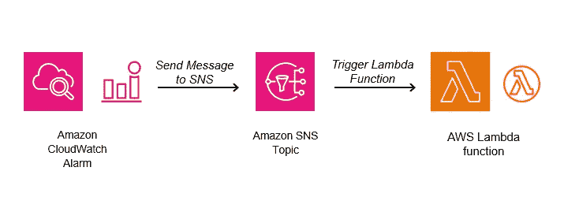

# 使用无服务器函数来管理和监控基于云的训练实验

> 原文：[`towardsdatascience.com/using-server-less-functions-to-govern-and-monitor-cloud-based-training-experiments-755c43fba26b?source=collection_archive---------4-----------------------#2023-12-17`](https://towardsdatascience.com/using-server-less-functions-to-govern-and-monitor-cloud-based-training-experiments-755c43fba26b?source=collection_archive---------4-----------------------#2023-12-17)

## 一种简单的常规方法，可以帮你节省大量金钱

[](https://chaimrand.medium.com/?source=post_page-----755c43fba26b--------------------------------)[](https://towardsdatascience.com/?source=post_page-----755c43fba26b--------------------------------) [Chaim Rand](https://chaimrand.medium.com/?source=post_page-----755c43fba26b--------------------------------)

·

[查看](https://medium.com/m/signin?actionUrl=https%3A%2F%2Fmedium.com%2F_%2Fsubscribe%2Fuser%2F9440b37e27fe&operation=register&redirect=https%3A%2F%2Ftowardsdatascience.com%2Fusing-server-less-functions-to-govern-and-monitor-cloud-based-training-experiments-755c43fba26b&user=Chaim+Rand&userId=9440b37e27fe&source=post_page-9440b37e27fe----755c43fba26b---------------------post_header-----------) 发表在 [Towards Data Science](https://towardsdatascience.com/?source=post_page-----755c43fba26b--------------------------------) · 11 min 阅读 · 2023 年 12 月 17 日[](https://medium.com/m/signin?actionUrl=https%3A%2F%2Fmedium.com%2F_%2Fvote%2Ftowards-data-science%2F755c43fba26b&operation=register&redirect=https%3A%2F%2Ftowardsdatascience.com%2Fusing-server-less-functions-to-govern-and-monitor-cloud-based-training-experiments-755c43fba26b&user=Chaim+Rand&userId=9440b37e27fe&source=-----755c43fba26b---------------------clap_footer-----------)

--

[](https://medium.com/m/signin?actionUrl=https%3A%2F%2Fmedium.com%2F_%2Fbookmark%2Fp%2F755c43fba26b&operation=register&redirect=https%3A%2F%2Ftowardsdatascience.com%2Fusing-server-less-functions-to-govern-and-monitor-cloud-based-training-experiments-755c43fba26b&source=-----755c43fba26b---------------------bookmark_footer-----------)

图片由 [Ziyou Zhang](https://unsplash.com/@teadrinker42?utm_source=medium&utm_medium=referral) 在 [Unsplash](https://unsplash.com/?utm_source=medium&utm_medium=referral) 提供

这篇博客文章是与我的同事[Shay Margalit](https://www.linkedin.com/in/shay-margalit-40581668/?originalSubdomain=il)共同撰写的。它总结了他关于如何利用[AWS Lambda](https://aws.amazon.com/lambda/)函数来提高对[Amazon SageMaker](https://aws.amazon.com/sagemaker/)训练服务的使用控制和**成本**的研究。感兴趣吗？请继续阅读 :).

我们很幸运（或者说非常不幸——[这要看你问谁](https://www.bbc.co.uk/news/uk-65746524)）能亲历这场被许多人预期会改变我们所知世界的人工智能革命。得益于硬件开发的进步和对大量数据的获取，这场革命很可能会影响我们日常生活的许多方面——虽然具体如何，没有人能确定。为了满足对人工智能日益增长的需求，基础的机器学习模型规模迅速扩大，训练这些模型所需的资源也在增加。总而言之，要在人工智能开发领域保持相关性，就需要对昂贵的重型设备进行大规模投资。

基于云的托管训练服务，例如 Amazon SageMaker、Google Vertex AI 和 Microsoft Azure ML，通过使开发者能够在他们原本负担不起的机器上进行训练，降低了人工智能开发的门槛。虽然这些服务减少了人工智能的前期成本，并使你**仅**为训练时间付费，但变量成本的潜在累积需要对如何使用训练服务以及它们如何贡献于整体训练费用进行仔细规划。然而，不可避免的是，事情并不总是按计划进行。借用一句古老的意第绪谚语“开发者计划，编程之神笑”。当涉及到高风险时，比如训练人工智能模型——一个错误的实验可能导致数百或数千美元的计算时间浪费，因此明智之举是建立多个防线。

## 防线第一步——鼓励健康的发展习惯

第一防线应关注机器学习算法工程师的开发实践。以下是一些你可能会考虑的指导原则：

1.  鼓励对用于训练的硬件资源进行适当且成本优化的使用（例如，参见这里）。

1.  及早识别并终止失败的实验。

1.  通过定期分析和优化运行时性能来提高性价比（例如，参见[这里](https://medium.com/towards-data-science/pytorch-model-performance-analysis-and-optimization-10c3c5822869)）。

尽管制定和调整像上面这些 AI 开发原则可能会提高您的生产力并减少浪费，但它们并不能完全防护所有可能的失败。例如，专用的故障检测运行时进程可能无法解决培训实验停滞的情况（例如，由于培训应用程序进程中的死锁），而培训任务仍然保持活动状态，直到它被主动停止或超时。

## 第二道防线 — 部署跨项目的保护措施

在这篇文章中，我们提议建立第二道防线，监控项目（或组织）中的所有培训活动，验证其是否符合预定的规则，并在发现异常培训实验时采取适当的措施。一种方法是使用专用的**无服务器函数**，这些函数会在培训任务的不同阶段触发，并编程以评估任务的状态，并根据需要停止或重新启动（可能会更改任务设置）任务。在接下来的章节中，我们将演示如何使用 AWS Lambda 作为对抗异常 Amazon SageMaker 培训实验的第二道防线的几个示例。

## 免责声明

尽管我们选择了 Amazon SageMaker 和 AWS Lambda 进行演示，但本文内容同样适用于其他服务，并且可以为它们实现类似的功能。请不要将我们选择这些服务解读为对其使用的推荐。云端培训有多种选项，每种选项都有其自身的优缺点。最适合您的选择将极大地取决于您项目的具体细节。

虽然我们将分享一些无服务器代码的 Python 示例，但我们不会详细讲解如何创建和部署它们作为 AWS Lambda 函数。与 AWS Lambda 交互的方式有很多种。我们建议读者参阅[官方 AWS 文档](https://docs.aws.amazon.com/lambda/latest/dg/python-tracing.html)以了解更多信息。

以下示例是为演示目的而创建的。它们可能需要修改以适应您项目的具体需求。在调整我们提议的解决方案之前，请确保充分理解所有代码细节及相关服务费用。重要的是，我们将分享的代码没有经过严格测试。任何涉及创建和调用多个 Lambda 函数以及[Amazon CloudWatch 警报](https://docs.aws.amazon.com/AmazonCloudWatch/latest/monitoring/AlarmThatSendsEmail.html)（如本文所述）的解决方案都需要进行适当的验证，以防止冗余/孤立工件的积累。

我们强烈建议您将本文的详细信息与最新的 AWS Lambda 文档和支持库的最新版本进行核对。

# 强制执行开发者合规性

虽然[**云治理**](https://www.redhat.com/en/topics/automation/what-is-cloud-governance)对于成功和高效地使用云服务通常是至关重要的，但其实施有时可能具有挑战性。例如：Amazon SageMaker 包含一个用于向训练作业添加[**标签**](https://docs.aws.amazon.com/sagemaker/latest/APIReference/API_Tag.html)的 API。这些标签可以用来包含与 SageMaker 作业相关的元数据，比如训练项目的名称、开发阶段、当前试验的目标、运行作业的开发组或用户的名称等等。这些元数据可以用来收集统计信息，比如每个项目或组的开发成本。在下面的代码块中，我们展示了如何将多个标签应用于 SageMaker 训练作业：

```py
from sagemaker.pytorch import PyTorch

tags = [{'Key': 'username', 'Value': 'johndoe'}, 
        {'Key': 'model_name', 'Value': 'mnist'},
        {'Key': 'training_phase', 'Value': 'finetune'},
        {'Key': 'description', 'Value': 'fine tune final linear layer'}]

# define the training job with tags
estimator = PyTorch(
    entry_point='train.py',
    framework_version='2.1.0',
    role='<arn role>',
    py_version='py310',
    job_name='demo',
    instance_type='ml.g5.xlarge',
    instance_count=1,
    tags=tags
)

# deploy the job to the cloud
estimator.fit()
```

自然，这些标签只有在我们能够强制执行其应用时才有用。这就是[**AWS Lambda**](https://aws.amazon.com/lambda/)的作用。使用[**Amazon EventBridge**](https://docs.aws.amazon.com/sagemaker/latest/dg/automating-sagemaker-with-eventbridge.html)，我们可以监控 SageMaker 训练作业状态的变化，并注册一个在每次变化时被触发的函数。在下面的代码块中，我们提出了一个 Python 例程，每次作业启动时都会验证特定的 SageMaker 标签。如果缺少某个标签，作业将被自动终止。事件的结构可以在[这里](https://docs.aws.amazon.com/sagemaker/latest/dg/automating-sagemaker-with-eventbridge.html#eventbridge-training)找到。请注意使用（更详细的）[*SecondaryStatus*](https://docs.aws.amazon.com/sagemaker/latest/APIReference/API_DescribeTrainingJob.html)字段来轮询训练作业的状态（而不是*TrainingJobStatus*）。

```py
import boto3
def stop_training_job(training_job_name):
    sm_client = boto3.client("sagemaker")
    response = sm_client.stop_training_job(TrainingJobName=training_job_name)
    assert response['ResponseMetadata']['HTTPStatusCode'] == 200
    # TODO - optionally send an email notification

def enforce_required_tags(training_job_name, event):
    event_tags = event['detail']['Tags']
    if 'model_name' not in event_tags:
        stop_training_job(training_job_name)

# define lambda handler
def sagemaker_event_handler(event, _):
    job_name = event['detail']['TrainingJobName']
    job_secondary_status = event['detail']['SecondaryStatus']
    if job_secondary_status == 'Starting':
        enforce_required_tags(job_name, event)
```

AWS 提供了多种创建 Lambda 函数的方法。有关详细信息，请参见[**AWS Lambda**](https://docs.aws.amazon.com/lambda/latest/dg/API_CreateFunction.html)文档。创建后，请确保将该函数设置为[**EventBridge 规则**](https://docs.aws.amazon.com/sagemaker/latest/dg/automating-sagemaker-with-eventbridge.html#eventbridge-model)的目标。

同样的功能可以用来强制执行额外的开发规则，这些规则旨在控制成本，比如：可以使用的实例类型、每个作业的最大实例数量、作业的最大运行时间等等。

# 停止停滞的实验

想象一下以下场景：你计划了一个大型的云端训练作业，将在八台每小时 $30 的 ML 计算实例上运行三天。为了完成这个任务，你已确保了 $17,280 的预算（8 个实例 x 每小时 $30 x 24 小时 x 3 天）。你在出发去度假三天的周末前启动了训练作业。当你从假期回来时，发现作业开始后一小时内，训练过程停滞，导致昂贵的设备实际上在三天内完全闲置。你不仅浪费了 $17,280（祝你好运向老板解释这一点），而且你的开发进度现在也被推迟了三天！！

保护自己免受这种情况的一种方法是监控底层训练作业资源的使用情况。例如，如果你的训练实例的 GPU 使用率在较长时间内低于某个阈值，这很可能是一个信号，表明出现了问题，需要立即停止训练作业。

我们将通过定义一个 [Amazon CloudWatch 警报](https://docs.aws.amazon.com/AmazonCloudWatch/latest/monitoring/AlarmThatSendsEmail.html) 来实现这一点，该警报监控每个 SageMaker 作业的一个训练实例的 GPU 使用情况，并在警报触发时调用一个 AWS Lambda 函数来终止该作业。设置这一功能需要三个组件：一个 [Amazon CloudWatch 警报](https://docs.aws.amazon.com/AmazonCloudWatch/latest/monitoring/AlarmThatSendsEmail.html)（每个训练作业一个），一个 [AWS Lambda](https://aws.amazon.com/lambda/) 函数，以及一个 [Amazon Simple Notification Service (SNS) 主题](https://docs.aws.amazon.com/sns/)，用于将 Lambda 函数与 CloudWatch 警报连接起来。

首先，我们创建一个 SNS 主题。这可以通过 Amazon SNS 控制台完成，也可以通过 Python 实现，如下所示：

```py
import boto3

sns_client = boto3.client('sns')
# Create a SNS notification topic.
topic = sns_client.create_topic(Name="SageMakerTrainingJobIdleTopic")
topic_arn = topic.arn
print(f"Created SNS topic arn: {topic_arn}")
```

接下来，我们扩展了上面定义的 *sagemaker_event_handler* 函数，每次启动训练作业时创建一个独特的警报。我们编程设置警报以测量五分钟周期内的平均 GPU 使用率，并在连续三次测量低于 1% 时提醒我们的 SNS 主题。训练作业完成时，警报将被删除。

```py
def create_training_alarm(job_name):
    topic_arn = '<sns topic arn>'

    SAMPLE_PERIOD_SECONDS = 60 * 5 # 5 minutes
    SAMPLE_POINTS_LIMIT = 3
    GPU_UTIL_THRESHOLD_PERCENTAGE = 1

    cloudwatch_client = boto3.client('cloudwatch')

    # A new sample is generated each SAMPLE_PERIOD_SECONDS seconds.
    # The alarm will set off it there will be more than SAMPLE_POINTS_LIMIT
    # below the limit.
    response = cloudwatch_client.put_metric_alarm(
        AlarmName=job_name + 'GPUUtil',
        AlarmActions=topic_arn,
        MetricName='GPUUtilization',
        Namespace='/aws/sagemaker/TrainingJobs',
        Statistic='Average',
        Dimensions=[{
            "Name": "Host",
            "Value": job_name+"/algo-1"
        }],
        Period=SAMPLE_PERIOD_SECONDS,
        EvaluationPeriods=SAMPLE_POINTS_LIMIT,
        DatapointsToAlarm=SAMPLE_POINTS_LIMIT,
        Threshold=GPU_UTIL_THRESHOLD_PERCENTAGE,
        ComparisonOperator='LessThanOrEqualToThreshold',
        TreatMissingData='notBreaching'
    )
    assert response['ResponseMetadata']['HTTPStatusCode'] == 200

def delete_training_alarm(job_name):
    cloudwatch_client = boto3.client('cloudwatch')
    response = cloudwatch_client.delete_alarms(
                                   AlarmNames=[job_name+'GPUUtil'])

def sagemaker_event_handler(event, _):
    job_name = event['detail']['TrainingJobName']
    job_secondary_status = event['detail']['SecondaryStatus']
    if job_secondary_status == 'Starting':
        enforce_required_tags(job_name, event)
    elif job_secondary_status == 'Training':
        create_training_alarm(job_name)
    elif job_secondary_status in ['Completed', 'Failed', 'Stopped']:
        delete_training_alarm(job_name) 
```

最后，我们定义一个第二个 Python AWS Lambda 函数，该函数 [解析从 SNS 主题接收到的消息](https://docs.aws.amazon.com/lambda/latest/dg/with-sns-create-package.html#with-sns-example-deployment-pkg-python)，并终止与警报关联的训练作业。

```py
import boto3, json

def lambda_sns_handler(event, context):
    data = json.loads(event['Records'][0]['Sns']['Message'])
    alarm_name = data['AlarmName']
    training_job_name = alarm_name.replace('GPUUtil', '')
    stop_training_job(training_job_name)
```

AWS 提供了多种机制来订阅 Lambda 函数到 SNS 主题，包括 [AWS 控制台](https://docs.aws.amazon.com/sns/latest/dg/lambda-console.html)、[AWS CLI](https://docs.aws.amazon.com/lambda/latest/dg/with-sns-example.html) 和 [AWS 无服务器应用程序模型 (AWS SAM)](https://docs.aws.amazon.com/serverless-application-model/latest/developerguide/sam-resource-function.html)。

我们描述的解决方案总结在下图中：



AWS 架构图（作者提供）

请注意，相同的架构也可以用于强制执行你机器学习训练项目的最低 GPU 利用率。GPU 通常是训练基础设施中最昂贵的资源，你的目标应是最大化所有训练工作负载的利用率。通过规定最低利用率（例如 80%），你可以确保所有开发者适当优化他们的工作负载。

# 确保开发的连续性

在我们之前的示例中，我们演示了如何识别并停止一个停滞的实验。在我们描述的大型训练任务场景中，这有助于节省大量资金，但并没有解决开发的三天延迟。显然，如果停滞的源头在你的代码中，那么推迟恢复训练直到问题解决是有意义的。然而，我们经常遇到的训练中断并不是由于我们的代码造成的，而是由于服务环境中的偶发故障。在这种情况下，你的优先任务可能是确保训练的连续性，而不是等待有人手动恢复训练任务（使用最新的[训练检查点](https://pytorch.org/tutorials/recipes/recipes/saving_and_loading_a_general_checkpoint.html)）。在下面的代码块中，我们使用[boto3](https://boto3.amazonaws.com/v1/documentation/api/latest/index.html)的[*create_training_job*](https://boto3.amazonaws.com/v1/documentation/api/latest/reference/services/sagemaker/client/create_training_job.html) API 来扩展我们的*sagemaker_event_handler*函数，以（简单地）恢复任何运行至少两小时后失败的训练任务。

```py
import boto3, datetime

def clone_job(training_name, disable_spot=False):
    # get description
    client = boto3.client('sagemaker')
    desc = client.describe_training_job(TrainingJobName=training_name)

    # update the training name
    new_training_name = training_name + 'clone'

    use_spots = (not disable_spot) and desc["EnableManagedSpotTraining"]

    if disable_spot:
        desc["StoppingCondition"].pop("MaxWaitTimeInSeconds", None)

    client.create_training_job(
        TrainingJobName=new_training_name,
        HyperParameters=desc["HyperParameters"],
        AlgorithmSpecification=desc["AlgorithmSpecification"],
        RoleArn=desc["RoleArn"],
        OutputDataConfig=desc["OutputDataConfig"],
        ResourceConfig=desc["ResourceConfig"],
        StoppingCondition=desc["StoppingCondition"],
        EnableNetworkIsolation=desc["EnableNetworkIsolation"],
        EnableInterContainerTrafficEncryption=desc[
            "EnableInterContainerTrafficEncryption"
        ],
        EnableManagedSpotTraining=use_spots,
        Tags=client.list_tags(ResourceArn=desc['TrainingJobArn'])
     )

def sagemaker_event_handler(event, _):
    TRAIN_TIME_THRESHOLD = 2 * 60 * 60: # 2 hours
    job_name = event['detail']['TrainingJobName']
    job_secondary_status = event['detail']['SecondaryStatus']
    if job_secondary_status == 'Starting':
        enforce_required_tags(job_name, event)
    elif job_secondary_status == 'Training':
        create_training_alarm(job_name)
    elif job_secondary_status in ['Completed', 'Failed', 'Stopped']:
        delete_training_alarm(job_name)

    if job_secondary_status == 'Failed':
        start_time = datetime.datetime.utcfromtimestamp(
                                     event['detail']['CreationTime']/1000)
        end_time = datetime.datetime.utcfromtimestamp(
                                     event['detail']['TrainingEndTime']/1000)
        training_time_seconds = (end_time - start_time).seconds
        if training_time_seconds >= TRAIN_TIME_THRESHOLD:
            clone_job(job_name)
```

上述函数会自动恢复任何在两小时后失败的任务。一个更实用的解决方案可能会尝试诊断错误类型，以确定恢复任务是否合适。一种方法是解析失败描述消息和/或与失败任务相关的 CloudWatch 日志。

# 高级 Spot 实例利用

Amazon SageMaker 的一个吸引人的特点是其对[托管抢占式训练](https://docs.aws.amazon.com/sagemaker/latest/dg/model-managed-spot-training.html)的支持。[Amazon EC2 Spot 实例](https://aws.amazon.com/ec2/spot/)允许你利用未使用的 EC2 容量，并以折扣价格购买。这些实例的一个问题是它们在使用过程中可能会被收回（“中断”）。因此，Spot 实例应仅用于容错工作负载。SageMaker 通过代表你识别 Spot 中断，并在新的 Spot 实例可用时自动重新启动作业，使利用 Spot 实例变得简单。尽管[托管抢占式](https://docs.aws.amazon.com/sagemaker/latest/dg/model-managed-spot-training.html) 实例可以用来降低训练成本，但有时这一策略可能会适得其反。例如，当 Spot 容量不足时，你的训练作业可能会在开始之前超时。或者，作业可能会经历频繁的中断，这使得它无法取得任何有意义的进展。这两种情况都可能干扰开发并降低生产力。这些类型的情况可以使用 AWS Lambda 进行监控和处理。在下面的代码块中，我们扩展了我们的*sagemaker_event_handler* 函数，以识别一个被中断超过三次的训练作业，并用一个禁用了托管抢占式训练的克隆作业替换它。

```py
def sagemaker_event_handler(event, _):
    TRAIN_TIME_THRESHOLD = 2 * 60 * 60: # 2 hours
    MIN_ITERRUPTS = 3
    job_name = event['detail']['TrainingJobName']
    job_secondary_status = event['detail']['SecondaryStatus']
    if job_secondary_status == 'Starting':
        enforce_required_tags(job_name, event)
    elif job_secondary_status == 'Training':
        create_training_alarm(job_name)
    elif job_secondary_status in ['Completed', 'Failed', 'Stopped']:
        delete_training_alarm(job_name)

    if job_secondary_status == 'Failed':
        start_time = datetime.datetime.utcfromtimestamp(
                                     event['detail']['CreationTime']/1000)
        end_time = datetime.datetime.utcfromtimestamp(
                                     event['detail']['TrainingEndTime']/1000)
        training_time_seconds = (end_time - start_time).seconds
        if training_time_seconds >= TRAIN_TIME_THRESHOLD:
            clone_job(job_name)

    if job_secondary_status == 'Interrupted':
        transitions = event['detail']["SecondaryStatusTransitions"]
        interrupts = [e for e in transitions if e["Status"] == "Interrupted"]
        num_interrupts = len(interrupts)
        if num_interrupts > MIN_ITERRUPTS:
            stop_training_job(job_name)
            clone_job(job_name, disable_spot=True)
```

上述实现仅根据训练作业的中断次数确定了 Spot 使用策略。一个更复杂的解决方案可能还会考虑其他作业（使用相同实例类型）、中断发生的时间段、活跃训练时间的数量和/或由于 Spot 实例容量不足而超时的最近作业数量。

# 总结

有效的 AI 模型开发需要定义一个创意且详细的训练基础设施架构，以最小化成本并最大化生产力。在这篇文章中，我们展示了如何使用无服务器的 AWS Lambda 函数来增强 Amazon SageMaker 的托管训练服务，以解决训练过程中可能出现的一些常见问题。当然，具体应用这些技术的方式将很大程度上取决于你项目的具体情况。

如果有任何问题、意见或修正，请随时联系。务必查看我们关于 DL 训练优化的[其他文章](https://chaimrand.medium.com/)。
