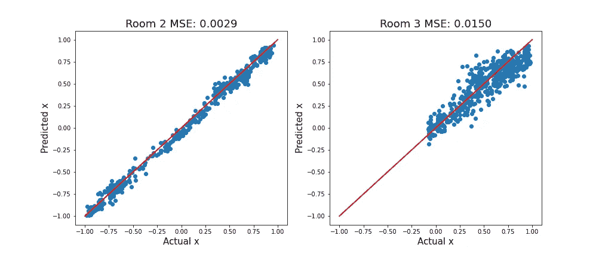

# 使用 SHAP 调试 PyTorch 图像回归模型

> 原文：[`towardsdatascience.com/using-shap-to-debug-a-pytorch-image-regression-model-4b562ddef30d`](https://towardsdatascience.com/using-shap-to-debug-a-pytorch-image-regression-model-4b562ddef30d)

## 使用 DeepShap 来理解和改进驱动自动驾驶汽车的模型

[](https://conorosullyds.medium.com/?source=post_page-----4b562ddef30d--------------------------------)[](https://towardsdatascience.com/?source=post_page-----4b562ddef30d--------------------------------) [Conor O'Sullivan](https://conorosullyds.medium.com/?source=post_page-----4b562ddef30d--------------------------------)

·发表于 [Towards Data Science](https://towardsdatascience.com/?source=post_page-----4b562ddef30d--------------------------------) ·阅读时间 11 分钟·2023 年 1 月 10 日

--


（来源：作者）

自动驾驶汽车让我感到恐惧。巨大的金属块在空中飞驰，如果出现问题没有人可以阻止它们。为了降低风险，仅仅评估这些“怪物”背后的模型是不够的。我们还需要了解它们是如何进行预测的。这是为了避免任何可能导致意外的边缘情况。

好吧，我们的应用程序并没有那么重要。我们将调试用于驱动迷你自动驾驶汽车的模型（最坏的情况可能是一个瘀伤的脚踝）。尽管如此，IML 方法仍然有用。我们将看看它们如何甚至能提高模型的性能。

具体来说，我们将：

+   使用 PyTorch 和图像数据以及连续目标变量来微调 ResNet-18

+   使用 MSE 和散点图来评估模型

+   使用 DeepSHAP 解释模型

+   通过更好的数据收集来纠正模型

+   讨论图像增强如何进一步改善模型

在这个过程中，我们将讨论一些关键的 Python 代码。你还可以在[GitHub](https://github.com/conorosully/SHAP-tutorial/blob/main/src/image_data.ipynb)上找到完整的项目。

如果你是 SHAP 的新手，请查看下面的**视频**。如果你想要更多内容，可以查看我的[**SHAP 课程**](https://adataodyssey.com/courses/shap-with-python/)**。** 如果你注册我的[**新闻通讯**](https://mailchi.mp/aa82a5ce1dc0/signup)，你可以免费访问 :)

# Python 包

```py
# Imports
import numpy as np
import pandas as pd
import matplotlib.pyplot as plt

import glob 
import random 

from PIL import Image
import cv2

import torch
import torchvision
from torchvision import transforms
from torch.utils.data import DataLoader

import shap
from sklearn.metrics import mean_squared_error
```

# 数据集

我们从在一个房间里收集数据开始这个项目（这将对我们造成困扰）。如前所述，我们使用图像来驱动自动化汽车。你可以在[Kaggle](https://www.kaggle.com/datasets/conorsully1/jatracer-images?select=object_detection)上找到这些图像的例子。这些图像的尺寸均为 224 x 224 像素。

我们用下面的代码显示了其中一个。注意图像名称（第 2 行）。前两个数字是 224 x 224 帧中的 x 和 y 坐标。在**图 1**中，你可以看到我们使用绿色圆圈显示了这些坐标（第 8 行）。

```py
#Load example image
name = "32_50_c78164b4-40d2-11ed-a47b-a46bb6070c92.jpg"
x = int(name.split("_")[0])
y = int(name.split("_")[1])

img = Image.open("../data/room_1/" + name)
img = np.array(img)
cv2.circle(img, (x, y), 8, (0, 255, 0), 3)

plt.imshow(img)
```


图 1：赛道输入图像示例（来源：作者）

这些坐标是目标变量。模型使用图像作为输入来预测它们。然后，这一预测用于引导汽车。在这种情况下，你可以看到汽车正在接近左转。理想的方向是朝向绿色圆圈所给的坐标。

# 训练 PyTorch 模型

我想专注于 SHAP，因此我们不会深入讨论建模代码。如果你有任何问题，随时在评论中提问。

我们首先创建**ImageDataset**类。这个类用于加载我们的图像数据和目标变量。它通过**paths**来完成这一任务。值得指出的是目标变量的缩放方式——**x**和**y**的范围都在**-1**和**1**之间。

```py
class ImageDataset(torch.utils.data.Dataset):
    def __init__(self, paths, transform):

        self.transform = transform
        self.paths = paths

    def __getitem__(self, idx):
        """Get image and target (x, y) coordinates"""

        # Read image
        path = self.paths[idx]
        image = cv2.imread(path, cv2.IMREAD_COLOR)
        image = Image.fromarray(image)

        # Transform image
        image = self.transform(image)

        # Get target
        target = self.get_target(path)
        target = torch.Tensor(target)

        return image, target

    def get_target(self,path):
        """Get the target (x, y) coordinates from path"""

        name = os.path.basename(path)
        items = name.split('_')
        x = items[0]
        y = items[1]

        # Scale between -1 and 1
        x = 2.0 * (int(x)/ 224 - 0.5) # -1 left, +1 right
        y = 2.0 * (int(y) / 244 -0.5)# -1 top, +1 bottom

        return [x, y]

    def __len__(self):
        return len(self.paths)
```

实际上，当模型部署时，仅使用 x 预测来引导汽车。由于缩放，x 预测的符号将决定汽车的方向。当**x < 0**时，汽车应该左转。同样，当**x > 0**时，汽车应该右转。x 值越大，转弯越急。

我们使用 ImageDataset 类创建训练和验证数据加载器。这是通过对所有来自房间 1 的图像路径进行随机**80/20**拆分来完成的。最终，我们在训练集和验证集中分别有**1,217**和**305**张图像。

```py
TRANSFORMS = transforms.Compose([
    transforms.ColorJitter(0.2, 0.2, 0.2, 0.2),
    transforms.Resize((224, 224)),
    transforms.ToTensor(),
    transforms.Normalize([0.485, 0.456, 0.406], [0.229, 0.224, 0.225])
])

paths = glob.glob('../data/room_1/*')

# Shuffle the paths
random.shuffle(paths)

# Create a datasets for training and validation
split = int(0.8 * len(paths))
train_data = ImageDataset(paths[:split], TRANSFORMS)
valid_data = ImageDataset(paths[split:], TRANSFORMS)

# Prepare data for Pytorch model
train_loader = DataLoader(train_data, batch_size=32, shuffle=True)
valid_loader = DataLoader(valid_data, batch_size=valid_data.__len__())
```

注意**valid_loader**的**batch_size**。我们使用验证数据集的长度（即 305）。这使我们可以在一次迭代中加载所有验证数据。如果你处理的是更大的数据集，可能需要使用较小的批量大小。

我们加载一个预训练的 ResNet18 模型（第 5 行）。通过设置**model.fc**，我们更新了最后一层（第 6 行）。这是一个从 512 个节点到我们 2 个目标变量节点的全连接层。我们将使用 Adam 优化器来微调这个模型（第 9 行）。

```py
output_dim = 2 # x, y
device = torch.device('mps') # or 'cuda' if you have a GPU

# RESNET 18
model = torchvision.models.resnet18(pretrained=True)
model.fc = torch.nn.Linear(512, output_dim)
model = model.to(device)

optimizer = torch.optim.Adam(model.parameters())
```

我已经使用 GPU 训练了模型（第 2 行）。你仍然可以在 CPU 上运行代码。微调不像从头开始训练那样计算密集！

最后，我们有了模型训练代码。我们使用 MSE 作为损失函数训练 10 个周期。我们的最终模型是验证集上 MSE 最低的模型。

```py
name = "direction_model_1" # Change this to save a new model

# Train the model
min_loss = np.inf
for epoch in range(10):

    model = model.train()
    for images, target in iter(train_loader):

        images = images.to(device)
        target = target.to(device)

        # Zero gradients of parameters
        optimizer.zero_grad()  

        # Execute model to get outputs
        output = model(images)

        # Calculate loss
        loss = torch.nn.functional.mse_loss(output, target)

        # Run backpropogation to accumulate gradients
        loss.backward()

        # Update model parameters
        optimizer.step()

    # Calculate validation loss
    model = model.eval()

    images, target = next(iter(valid_loader))
    images = images.to(device)
    target = target.to(device)

    output = model(images)
    valid_loss = torch.nn.functional.mse_loss(output, target)

    print("Epoch: {}, Validation Loss: {}".format(epoch, valid_loss.item()))

    if valid_loss < min_loss:
        print("Saving model")
        torch.save(model, '../models/{}.pth'.format(name))

        min_loss = valid_loss
```

# 评估指标

此时，我们想了解我们的模型表现如何。我们查看 MSE 和实际与预测 x 值的散点图。暂时忽略 y，因为它不会影响汽车的方向。

## 训练和验证集

**图 2**提供了训练和验证集的这些指标。对角线红线表示完美预测。对于**x < 0**和**x > 0**，此线周围有类似的变异。换句话说，模型能够以类似的准确性预测左转和右转。在训练和验证集上的类似表现也表明模型没有过拟合。


图 2：模型在训练和验证集上的评估（来源：作者）

要创建上述图，我们使用**model_evaluation**函数。注意，数据加载器应创建为在第一次迭代中加载所有数据。

```py
def model_evaluation(loaders,labels,save_path = None):

    """Evaluate direction models with mse and scatter plots
        loaders: list of data loaders
        labels: list of labels for plot title"""

    n = len(loaders)
    fig, axs = plt.subplots(1, n, figsize=(7*n, 6))

    # Evalution metrics
    for i, loader in enumerate(loaders):

        # Load all data
        images, target = next(iter(loader))
        images = images.to(device)
        target = target.to(device)

        output=model(images)

        # Get x predictions
        x_pred=output.detach().cpu().numpy()[:,0]
        x_target=target.cpu().numpy()[:,0]

        # Calculate MSE
        mse = mean_squared_error(x_target, x_pred)

        # Plot predcitons
        axs[i].scatter(x_target,x_pred)
        axs[i].plot([-1, 1], 
                [-1, 1], 
                color='r', 
                linestyle='-', 
                linewidth=2)

        axs[i].set_ylabel('Predicted x', size =15)
        axs[i].set_xlabel('Actual x', size =15)
        axs[i].set_title("{0} MSE: {1:.4f}".format(labels[i], mse),size = 18)

    if save_path != None:
        fig.savefig(save_path)
```

使用下面的函数可以看出我们的意思。我们创建了一个新的**train_loader**，将批量大小设置为训练数据集的长度。加载保存的模型也很重要（第 2 行）。否则，你将使用上一个纪元训练的模型。

```py
# Load saved model 
model = torch.load('../models/direction_model_1.pth')
model.eval()
model.to(device)

# Create new loader for all data
train_loader = DataLoader(train_data, batch_size=train_data.__len__())

# Evaluate model on training and validation set
loaders = [train_loader,valid_loader]
labels = ["Train","Validation"]

# Evaluate on training and validation set
model_evaluation(loaders,labels)
```

## 移动到新位置

结果看起来不错！我们预计汽车会表现良好，它确实如此。直到我们将它移动到新位置：


图 3：模型在新位置表现不佳（来源：作者）

我们从新位置（房间 2 和房间 3）收集了一些数据。对这些图像进行评估时，你会发现我们的模型表现得不如预期。这很奇怪！汽车在完全相同的轨道上，为什么房间会有影响呢？


图 3：模型在房间 2 和房间 3 上的评估（来源：作者）

# 使用 SHAP 调试模型

我们寻求 SHAP 的答案。它可以用来理解哪些像素对给定的预测重要。我们首先加载保存的模型（第 2 行）。SHAP 尚未实现 GPU 支持，所以我们将设备设置为 CPU（第 5-6 行）。

```py
# Load saved model 
model = torch.load('../models/direction_model_1.pth') 

# Use CPU
device = torch.device('cpu')
model = model.to(device)
```

计算 SHAP 值时，我们需要获取一些背景图像。SHAP 将在计算值时对这些图像进行集成。我们使用**batch_size**为 100 的图像。这应该能给我们合理的近似值。增加图像数量将提高近似精度，但也会增加计算时间。

```py
#Load 100 images for background
shap_loader = DataLoader(train_data, batch_size=100, shuffle=True)
background, _ = next(iter(shap_loader))
background = background.to(device)
```

我们通过将模型和背景图像传入**DeepExplainer**函数来创建一个解释器对象。这个函数有效地为神经网络近似 SHAP 值。作为替代，你可以用**GradientExplainer**函数替换它。

```py
#Create SHAP explainer 
explainer = shap.DeepExplainer(model, background)
```

我们加载 2 张示例图像——一张右转和一张左转（第 2 行），并进行变换（第 6 行）。这很重要，因为图像应该与训练模型时使用的格式相同。然后，我们计算这些图像预测的 SHAP 值（第 10 行）。

```py
# Load test images of right and left turn
paths = glob.glob('../data/room_1/*')
test_images = [Image.open(paths[0]), Image.open(paths[3])]
test_images = np.array(test_images)

test_input = [TRANSFORMS(img) for img in test_images]
test_input = torch.stack(test_input).to(device)

# Get SHAP values
shap_values = explainer.shap_values(test_input)
```

最后，我们可以使用**image_plot**函数来显示 SHAP 值。但我们首先需要重新构造这些值。SHAP 值的返回维度是：

**( #targets, #images, #channels, #width, #height)**

我们使用转置函数，所以我们有维度：

**（#targets, #images, #width, #height, #channels）**

请注意，我们也将原始图像传入了**image_plot**函数。由于变换，**test_input**图像可能会显得很奇怪。

```py
# Reshape shap values and images for plotting
shap_numpy = list(np.array(shap_values).transpose(0,1,3,4,2))
test_numpy = np.array([np.array(img) for img in test_images])

shap.image_plot(shap_numpy, test_numpy,show=False)
```

你可以在**图 4**中看到结果。第一列给出原始图像。第二列和第三列分别是 x 和 y 预测的 SHAP 值。蓝色像素降低了预测值。相比之下，红色像素增加了预测值。换句话说，对于 x 预测，红色像素导致了更尖锐的右转。


图 4：左转和右转的示例 shap 值（来源：作者）

现在我们有了进展。重要的结果是模型正在使用背景像素。你可以在图 5 中看到这一点，我们对右转的 x 预测进行了放大。换句话说，背景对预测很重要。这解释了表现不佳的原因！当我们转到一个新房间时，背景发生了变化，我们的预测变得不可靠。


图 5：右转 x 预测的 shap 值（来源：作者）

模型对房间 1 的数据过拟合。每张图像中都有相同的对象和背景。因此，模型将这些与左转和右转关联起来。由于训练和验证图像中都有相同的背景，我们在评估中无法识别出这一点。


图 6：对训练数据的过拟合（来源：作者）

# 改进模型

我们希望我们的模型在所有条件下表现良好。为此，我们期望它只使用轨迹上的像素。那么，让我们讨论一些提高模型鲁棒性的方法。

## 收集新数据

最好的解决方案是简单地收集更多的数据。我们已经有了一些来自房间 2 和 3 的数据。按照相同的过程，我们使用来自所有 3 个房间的数据训练一个新模型。查看**图 7**，它现在在新房间的图像上表现更好。



图 7：在房间 2 和 3 上评估新模型（来源：作者）

希望通过在多个房间的数据上训练，我们可以打破转弯与背景之间的关联。现在，左转和右转上存在不同的对象，但轨迹保持不变。模型应该学会轨迹才是预测的重要因素。

我们可以通过查看新模型的 SHAP 值来确认这一点。这些值对应于我们在**图 4**中看到的相同转弯。现在，背景像素的权重较少。好吧，虽然不完美，但我们在进步。


图 8：在所有 3 个房间上训练的模型的 shap 值（来源：作者）

我们可以继续收集数据。我们收集的数据地点越多，我们的模型就会越强大。然而，数据收集可能是耗时的（而且无聊！）。相反，我们可以考虑数据增强。

## 数据增强

数据增强是指我们使用代码系统地或随机地改变图像。这使我们能够人为地引入噪声并增加数据集的大小。

例如，我们可以通过**翻转图像**在垂直轴上来将数据集的大小翻倍。我们之所以可以这样做，是因为我们的轨道是对称的。如图 9 所示，**删除**也可能是一个有用的方法。这涉及到包含那些对象或整个背景被去除的图像。


图 9：使用删除进行图像增强的示例（来源：作者）

在构建强大的模型时，您还应该考虑诸如光照条件和图像质量等因素。我们可以通过颜色抖动或添加噪声来模拟这些因素。如果您想了解所有这些方法，请查看下面的文章。

[](/augmenting-images-for-deep-learning-3f1ea92a891c?source=post_page-----4b562ddef30d--------------------------------) ## 用于深度学习的图像增强

### 使用 Python 进行数据增强，包括翻转、调整亮度、颜色抖动和随机噪声

towardsdatascience.com

在上述文章中，我们还讨论了为什么很难判断这些增强是否使模型更强大。我们可以在许多环境中部署模型，但这很耗时。幸运的是，SHAP 可以作为一种替代方案。与数据收集一样，它可以帮助我们了解增强如何改变模型的预测方式。

希望您喜欢这篇文章！您可以通过成为我的[**推荐会员**](https://conorosullyds.medium.com/membership) **:)** 来支持我。

[](https://conorosullyds.medium.com/membership?source=post_page-----4b562ddef30d--------------------------------) [## 通过我的推荐链接加入 Medium — Conor O’Sullivan

### 作为 Medium 会员，您的部分会员费会分配给您阅读的作者，同时您可以完全访问每一个故事……

conorosullyds.medium.com](https://conorosullyds.medium.com/membership?source=post_page-----4b562ddef30d--------------------------------)

| [Twitter](https://twitter.com/conorosullyDS) | [YouTube](https://www.youtube.com/channel/UChsoWqJbEjBwrn00Zvghi4w) | [Newsletter](https://mailchi.mp/aa82a5ce1dc0/signup) — 免费注册以获得[Python SHAP 课程](https://adataodyssey.com/courses/shap-with-python/)

# 数据集

**JatRacer 图像**（CC0: 公共领域） [`www.kaggle.com/datasets/conorsully1/jatracer-images`](https://www.kaggle.com/datasets/conorsully1/jatracer-images)

## 参考资料

SHAP，**PyTorch 深度解释器 MNIST 示例** [`shap.readthedocs.io/en/latest/example_notebooks/image_examples/image_classification/PyTorch%20Deep%20Explainer%20MNIST%20example.html`](https://shap.readthedocs.io/en/latest/example_notebooks/image_examples/image_classification/PyTorch%20Deep%20Explainer%20MNIST%20example.html)
