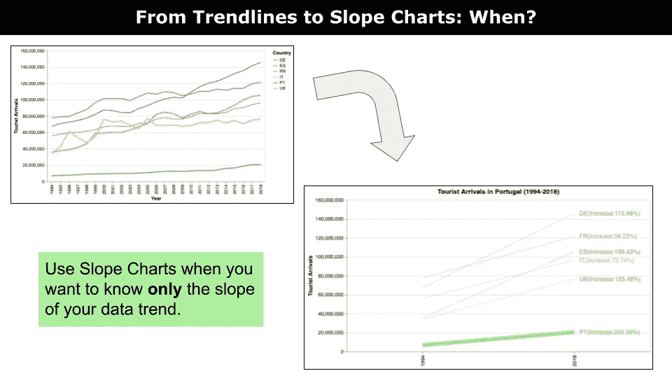
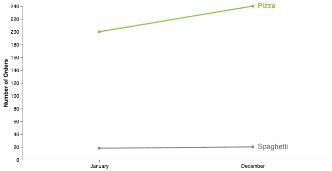
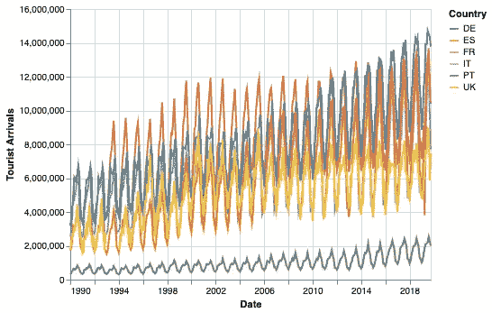
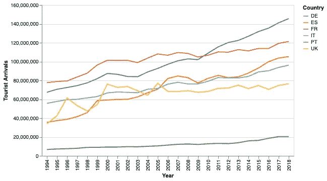
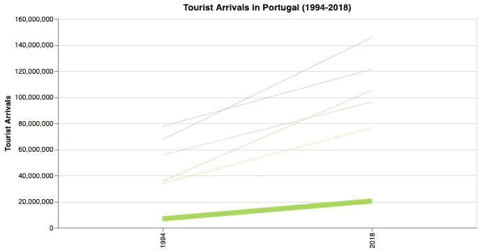
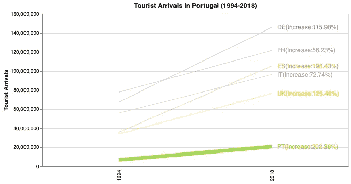

# 使用斜率图表简化你的数据可视化

> 原文：[`towardsdatascience.com/using-slope-charts-to-simplify-your-data-visualization-be1f0eaf1f0f`](https://towardsdatascience.com/using-slope-charts-to-simplify-your-data-visualization-be1f0eaf1f0f)

## 数据可视化，数据讲述

## 通过使用斜率图表来简化你繁杂的图表：一个 Python Altair 教程

[](https://alod83.medium.com/?source=post_page-----be1f0eaf1f0f--------------------------------)[](https://towardsdatascience.com/?source=post_page-----be1f0eaf1f0f--------------------------------) [Angelica Lo Duca](https://alod83.medium.com/?source=post_page-----be1f0eaf1f0f--------------------------------)

·发布于 [Towards Data Science](https://towardsdatascience.com/?source=post_page-----be1f0eaf1f0f--------------------------------) ·阅读时间 5 分钟·2023 年 12 月 8 日

--



作者提供的图片

我们可能会绘制图表以包含尽可能多的概念在我们的可视化中。因此，我们的图表可能会很难阅读且具有干扰性。因此，在绘制任何内容之前，请坐下来计划你想要传达的信息。然后，查看你的数据，决定什么是有效的必要内容。将其余部分排除在你的可视化之外。

在本教程中，我们将看看如何使用斜率图表来简化一个繁杂的趋势线。如果你是数据分析师，你可能会因为使用斜率图表看到**显著的信息损失**而惊慌。但我向你保证，在某些情况下，这确实是值得的。

让我们看看斜率图表可以应用的场景。

# 你可以在何时使用斜率图表

**斜率图表是一种只显示第一个和最后一个点的折线图**，如下面的图示。



作者提供的图片

**当你只想了解数据趋势的斜率时，斜率图表特别有用。因此，斜率图表有助于简化趋势线。** 例如，你可以使用斜率图表来查看产品销售在一段时间内是增加还是减少。假设你有许多趋势线需要在同一图表中表示，而你只对每条趋势线的第一个和最后一个值感兴趣。你可以通过使用斜率图表来简化图表。

让我们实现一个实际的例子，看看如何在 Python 数据可视化库 [Altair](https://altair-viz.github.io/) 中实现斜率图表。

# 示例：游客到达情况

考虑[旅游住宿设施的到达数据集](https://ec.europa.eu/eurostat/databrowser/view/tour_occ_arm/default/table?lang=en)，这是由 Eurostat 发布的开放数据。假设你想将葡萄牙的游客到达情况与其他五个国家进行比较：德国、法国、意大利、英国和西班牙。

从将数据集导入为 Pandas DataFrame 开始，并使用`melt()`函数来解压数据集，即将数据行转换为列。

```py
import altair as alt
import pandas as pd
from ydata_profiling import ProfileReport

df = pd.read_csv('tourist_arrivals_countries.csv', parse_dates=['Date'])

df = pd.melt(df, id_vars='Date', value_name='Tourist Arrivals', var_name='Country')
```

接下来，使用 Python Altair 绘制基本图表。要了解 Altair 的介绍，请阅读[这篇介绍文章](https://medium.com/towards-data-science/3-examples-to-show-python-altair-is-more-than-a-data-visualization-library-700e37cbf95b)由[Soner Yıldırım](https://medium.com/u/2cf6b549448?source=post_page-----be1f0eaf1f0f--------------------------------)提供。

```py
chart = alt.Chart(df).mark_line().encode(
    x = 'Date:T', #A
    y = 'Tourist Arrivals:Q', #B
    color=alt.Color('Country:N') #C
)

chart.save('raw-chart.html')
```

下图显示了结果图表：



图片由作者提供

图表难以阅读。因此，我们通过以下方法改进它：

+   **去除缺失的年份：** 过滤掉 1994 年之前和 2018 年之后的所有年份

+   **按年分组并计算总和：** 不是显示所有月份的细节，而是仅显示年度值。

以下代码片段展示了如何进行操作：

```py
# extract year from date
df.loc[:, 'Year'] = df['Date'].dt.year

# filter out years before 1994 and after 2018
df = df[(df['Year'] >= 1994) & (df['Year'] <= 2018)]

# group by year and country
df = df.groupby(['Year', 'Country'])['Tourist Arrivals'].sum().reset_index()
```

现在，再次绘制图表：

```py
chart = alt.Chart(df).mark_line().encode(
    x = 'Year:O',
    y = 'Tourist Arrivals:Q',
    color=alt.Color('Country:N')
)

chart.save(‘chart.html’)
```

下图显示了结果图表：



图片由作者提供

从图表中，我们注意到所有国家的趋势线都有所上升。因此，如果我们想评估趋势线在最后一年（2018 年）和第一年（1984 年）之间的变化，我们可以排除所有中间年份（1985 年至 2017 年），仅显示第一个和最后一个值。

此外，为了更清楚地展示差距，我们可以计算 2018 年与 1984 年之间的百分比增长，如下代码所示：

```py
# select only 1994 and 2018
df = df[(df['Year'] == 1994) | (df['Year'] == 2018)]

# add a new column containing the difference for each country between the number of tourist arrivals in the year and 1994
for country in df['Country'].unique():
    current = df[df['Country'] == country]['Tourist Arrivals']
    base = df[(df['Country'] == country) & (df['Year'] == 1994)]['Tourist Arrivals'].values[0]
    df.loc[df['Country'] == country, 'PI'] = (current - base)/ base*100
```

现在，让我们构建图表。我们还通过在`strokeWidth`通道中使用条件来突出显示与葡萄牙相关的趋势线。

```py
base = alt.Chart(df).encode(
    x = alt.X('Year:O', title=''),
    y = alt.Y('Tourist Arrivals:Q', title='Tourist Arrivals'),
    color=alt.Color('Country:N',
                    scale=alt.Scale(scheme='set2'), 
                    legend=None),
    strokeWidth=alt.condition(alt.datum.Country == 'PT', alt.value(7), alt.value(0.5))
).properties(
    title='Tourist Arrivals in Portugal (1994-2018)',
    width=600,
)

chart = base.mark_line()

chart.save('chart.html')
```

下图显示了结果图表：



图片由作者提供

只需包括一个要点：与每个图表相关的标签。让我们将它们作为文本注释添加，如下代码片段所示：

```py
annotation = base.mark_text(
    dx=10,
    align='left',
    fontSize=12
).encode(
    # format the text to show only 2 decimal places and add a percentage sign
    text='label:N'
).transform_filter(
    alt.datum.Year == 2018
).transform_calculate(
    label='datum.Country + "(Increase:" + format(datum.PI, ".2f") + "%)"'
)

chart = (chart + annotation)
```

使用`transform_calculate()`来正确格式化标签。下图显示了结果图表：



图片由作者提供

你可以继续优化图表，例如旋转 x 轴标签。不管怎样，斜率图已经完成，非常清晰 :)

# 总结

恭喜你！你刚刚学习了如何在 Python Altair 中实现斜率图！

**使用斜率图仅显示趋势线的第一个和最后一个值。**

你可以在我的书《数据讲故事与生成 AI：使用 Python 和 Altair》的[GitHub 仓库](https://github.com/alod83/Data-Storytelling-with-Generative-AI-Using-Python-and-Altair/blob/main/CaseStudies/tourist-arrivals/exercises/exercise1.py)中找到描述场景的完整代码。此外，这个例子是书中一个练习的解决方案。敬请关注，以实现更多示例 :)

如果你已经读到这里，今天的内容我觉得非常满意。谢谢，下次见 :)

# 附加资源

[书籍] [数据讲故事与生成 AI：使用 Python 和 Altair](https://www.manning.com/books/data-storytelling-with-generative-ai)

[课程] [使用 Python Altair 进行数据讲故事](https://www.educative.io/courses/using-python-altair-for-data-storytelling)

# 你可能也会感兴趣…

这篇文章将展示如何使用 Python Altair 库构建地理地图。

## 在 Python Altair 中构建地理地图的 3 种方法

对于数据科学家来说，数据可视化是一项基本技能。它有助于快速理解数据中的模式和关联，否则可能会被忽视。地理地图是一个很好的方式来 继续阅读…

## 你可能不知道的 3 种时间序列可视化方法

在这篇文章中，我们将描述三种时间序列可视化的替代方法：

+   日历热力图

+   箱形图

+   循环图 继续阅读…
