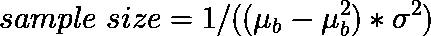

# 使用符号回归为 Elo 著名评分系统增加不确定性

> 原文：[`towardsdatascience.com/using-symbolic-regression-to-add-uncertainty-to-elos-famous-ratings-system-796d54f2b478`](https://towardsdatascience.com/using-symbolic-regression-to-add-uncertainty-to-elos-famous-ratings-system-796d54f2b478)

## 并创建一个意外有用的评分算法

 [Blake Atkinson](https://medium.com/@BlakeAtkinson?source=post_page-----796d54f2b478--------------------------------)

·发表于[Towards Data Science](https://towardsdatascience.com/?source=post_page-----796d54f2b478--------------------------------) ·阅读时间 12 分钟·2023 年 7 月 6 日

--

照片由[JESHOOTS.COM](https://unsplash.com/@jeshoots?utm_source=unsplash&utm_medium=referral&utm_content=creditCopyText)提供，来自[Unsplash](https://unsplash.com/s/photos/video-games?utm_source=unsplash&utm_medium=referral&utm_content=creditCopyText)

# 一个通用评分系统

Elo 评分系统在一些领域变得非常著名。最著名的例子可能是它自 1960 年代以来作为国际象棋评分的基础。此外，网站 538 成功地对其进行了修改，用于他们大部分知名的体育评分。较少公开的是，许多视频游戏开发者在他们的匹配系统中使用了 Elo 系统的变种。如果你正在阅读这篇文章，我会假设你对该系统有一定的了解。它为何在如此多的领域被广泛使用？我认为是因为它的计算扩展性、多功能性和简单性。然而，它也有一些缺点。本文将解决一个非常关键的问题，同时保持上述优点。

# 符号回归

尽管大型语言模型目前获得了所有的关注（双关含义），但也有其他令人兴奋的模型在被单独开发，具有非常不同的用途。符号回归通常适合发现封闭形式的解析规则，而不是处理像图像分类或音频翻译这样的深度学习任务。例如，如果你想重新发现牛顿的冷却定律，你*可以*构建一个资源密集型的密集神经网络。虽然这样做在数据足够的情况下效果良好，但它无法推广到未见过的情况。然而，符号回归将是正确的工具。它可以用有限的数据找到精确的公式，因此不仅可以推广，还能节省相当多的计算资源。[Cranmer 等人撰写的我最喜欢的论文之一](https://arxiv.org/abs/2006.11287)对此进行了更深入的探讨，甚至发展了一个以前未发现的暗物质过密度方程。

# 问题

经典的 Elo 评分将每个评分视为同样确定。这通常对大规模评分系统而言是一个不准确的假设。简单来说，新进入评分系统的玩家应该几乎总是以比那些已存在一段时间的玩家更大的方差进行建模。同样，那些评分系统长时间未曾见过的玩家可能已经有所改进或退步。假设你和你的四个密友经常在马里奥卡丁车中互相竞技。现在，我们可以使用简化的假设，你们只进行一对一的比赛。虽然还没有进行任何比赛，但假设你们有以下基本真实的 Elo 评分：

1.  爱丽丝：1900

1.  鲍勃：1700

1.  切尔西：1500

1.  德米特里：1300

1.  伊夫琳：1100

在经典的 Elo 系统中，预期的胜率完全由评分差异决定：

其中 WP_A 是玩家 A 的胜率，R_B 和 R_A 是每个玩家的评分

因为这是一个模拟，我们不必担心当前的状态、良好的睡眠或血液酒精含量。相反，我们真实的 Elo 评分通过上述方程对应真实的胜率。这将意味着在模拟中每个玩家对抗另一名玩家时，以下是真实的胜率百分比：

你决定使用 Elo 系统来确定每个人的水平，因为目前你不知道真实评分。Elo 系统所需的唯一参数是 K 值。K 值是每场比赛中玩家之间“下注”的评分点数，最终根据赛前获胜概率奖励给胜者。较高的 K 值用于更快响应近期结果，而较低的 K 值用于更信任现有评分。在大多数使用情况下，你会看到 K 值在 10 到 40 之间。高于 40，评分变得非常嘈杂。低于 10，评分几乎不会变化。以下是 5,000 次模拟中，你平均需要多长时间才能确定每个人的水平，使用 K 值为 12、24 和 36，经过大约 100 场比赛：

如你所见，即使使用相当高的 K 值（36），我们的系统仍需 100 场比赛才能收敛。随着 K 值的增加，一致性变得更差。例如，当 K=12 时，我们对绿色玩家 Chelsea 的评分近乎真实评分 1500。然而，使用较高的 K 值时，我们对 Chelsea 评分的估计会在 1400 到 1600 之间漂移。

一个选择是从高 K 值开始，以提高收敛速度，然后随着评分的准确性提高而减少 K 值。这是一种在更多数据到来时减少不确定性的巧妙方法，但结果显示，它的表现不如更有原则的方法。

# 其他系统

过去曾有很多尝试解决这个问题，特别是 1995 年的[Glicko 系统](http://www.glicko.net/glicko/glicko.pdf)和 2005 年的[TrueSkill 系统](https://www.microsoft.com/en-us/research/project/trueskill-ranking-system/)。Glicko 依赖于一个封闭形式的更新方程，而 TrueSkill 使用贝叶斯因子图来更新评分。TrueSkill 具有处理多人比赛场景或团队场景的巨大优势，并且通常收敛更快。TrueSkill 通常需要额外的计算，尤其是当每场比赛/比赛/锦标赛的玩家数量较多时。它也比 Glicko 对参数变化更敏感。使用哪种系统的决定当然取决于应用（但通常最终选择 TrueSkill）。让我们看看 Glicko、TrueSkill、Elo 以及带有衰减 K 的 Elo 如何尝试收敛到 Alice 的评分：

如你所见，Glicko 和 TrueSkill 在平均情况下收敛*快得多*，比 Elo 和带有 K 值衰减的 Elo 更快。从根本上说，更快的收敛是因为它们融入了不确定性度量。TrueSkill 在我的模拟中，实际超出真实评分，这显示了该系统对参数选择的敏感性。如果我调整参数，它将优于 Glicko，并且不会超出真实评分。

# 符号回归与我自己的系统

在我了解到其他人如何解决这个问题之前，我决定自己解决这个问题。我很高兴没有看到他们的解决方案，因为这可能会使我放弃创造自己的方法。在这个过程中，我发现了一个很好的使用案例，就是常常被低估的符号回归。

# 入门数学

与任何经典模型一样，我们必须从假设开始。就本文而言，可以安全地假设玩家和团队的技能在大多数情况下是正态分布的。根据我的经验，这对于几乎任何竞争都是接近真实的。国际象棋评级被发现略微更适合[逻辑分布](https://en.wikipedia.org/wiki/Logistic_distribution)，但我现在想避免过于详细。

假设我们有一个正态分布的 10,000 名马里奥卡丁车玩家的样本。我们来放大其中的两个玩家。其中一个是“蓝色玩家”，另一个是“红色玩家”。

我会说，在这种情况下，我的表现比较符合红色玩家（从差到更差）。

在这种情况下，我从这个分布中随机抽取了两个玩家。在经典的 Elo 公式中，比赛完全可以通过这两个玩家之间的评分差异来描述。经典 Elo 没有试图考虑我们可能对蓝色玩家的数据比红色玩家少。为了澄清，我们还没有使用这些分布来预测*单场*比赛的结果。这些分布仅仅代表了整体的技能水平。即使它们完全不重叠，红色玩家击败蓝色玩家的概率仍然很小。

比如说，我们只见过蓝色玩家一次，他或她表现得相当不错。可能是因为在正确的时间拾取了正确的道具箱，这很难说。另一方面，我们对红色玩家的表现很确定，虽然具体有多差还有些不确定。在这种新的 Elo 形式中，我们承认蓝色玩家实际上可能比红色玩家差（因为分布有些有意义地重叠）。

让我们把红色分布叫做 R，蓝色分布叫做 B，差异分布叫做 Z：

我保证，数学方程不多，而且只有简单的方程

由于这些是独立分布，B 和 R 的协方差为零。我们的方程此时变得非常简单。换句话说，经典 Elo 只关心均值 Z，约为 1.85。在这种情况下，我们还跟踪 Z 的标准差，约为 0.84。这样，当我们记录一个观察值时，可以以贝叶斯方式更新分布。

注意上面的 x 轴具有相同的刻度。我只是通过 sigmoid 函数将技能差异转化为获胜概率。

上面，我可视化了当我们从技能差异分布中运行 Elo 10,000 次时的情况。经典 Elo 会给蓝色玩家一个 86.4%的胜率，用黄色星星表示。我们的新 Elo 模型将根据从分布中抽样的结果给出许多不同的概率。有趣的是，由于一个尾部场景使胜率急剧下降，而另一个尾部场景达到了上限，因此我们分布的平均胜率实际上比仅仅一个点估计要低得多——83.7%。我只是猜测，但这也许有助于解释为什么国际象棋联合会发现弱者往往比 Elo 预测的赢得更多。

还值得快速提及的是，一些游戏比其他游戏更具运气成分。例如，你可以在 Uno、卡坦岛、尤克或者 Five Crowns 中变得更出色，但这些游戏中涉及的运气因素足够多，以至于一个差的玩家仍然可能击败排名更高的玩家。另一方面，如果我与 Magnus Carlson 下棋，我 100 场 100 次都会输，因此涉及的运气成分较少。为了建模不可减少的运气因素，需要额外的复杂性（我现在暂时避免）。

# 符号回归

现在，我们如何利用胜负结果来更新这些分布的参数呢？我们需要将其作为一个二元结果变量，以保持 Elo 系统的通用性——我们希望能够将这个系统应用于几乎所有的游戏（一个好的练习是创建一个基于连续结果更新的系统）。然而，据我所知，没有简单的闭式解来更新带有二元结果的正态分布的参数，因此会出现一些不完美之处。一方面，我可以花费几年时间通过大学课程来磨练我的数学技能，以至于知道如何坐下来解决这个问题。另一方面，我可以作弊，把它放入符号回归模型中，并额外写一篇 Medium 文章。我选择了后者，尽管我非常尊重那些选择前者的人。

Beta 分布非常适合建模二元结果的概率，我们已经通过对正态分布均值的 sigmoid 变换得到了这样一个分布的均值（上面的紫色图表/黄色星星）。问题是是否存在一个合理的公式将正态分布的方差转化为 Beta 分布方差的等效形式。为了回答这个问题，我随机生成了几千个具有已知均值和方差的正态技能差异分布，然后将这些随机生成的分布中的每个点通过 sigmoid 函数转换为其 0 到 1 之间的等效概率。以下是一些示例，其中我调整了上面紫色分布的方差，保持相同的均值：

随着方差的增加，已知的信息减少，我们对蓝色玩家比红色玩家更优秀的信心也减少。黄色是方差最高的分布。

我在 Beta 旁边加了一个问号，因为没有保证通过这样做生成 Beta 分布。实际上，我确实没有。然而，仅仅通过目测这些分布，我猜测我可以找到相应的 Beta 参数来很好地描述这些分布。让我们使用最大似然估计经验性地找到上述分布的参数，以拟合最佳的 Beta 参数。

最小化负对数似然，我得出了以下结果：

Beta 参数拟合远非完美，但在方差较低或概率不极端的情况下似乎表现非常好。在生成了数千个这些后，我简单地使用[PySR 包](https://github.com/MilesCranmer/PySR)拟合了一个符号回归模型。我给它 Beta 均值和正态方差，看看它是否能预测 Beta 样本量（对应于方差）。然后我将得到 Beta 分布模型的所有参数。拟合模型后，PySR 给出了迄今为止最高的评分（基于简洁性和性能）的方程：

其中 mu_b 是 Beta 均值，sigma 平方是正态方差

我对这个方程的简单程度感到惊讶，对于这样一个简单的方程，结果居然如此好。虽然它比上面更远离完美，但你可以看到它对数据的拟合相当好：

这就是符号回归的美妙之处。我们不需要花费数分钟或数小时来优化成千上万的数据点，而是编写一个一行的函数，可以立即给出类似的结果。

将这个关键方程转化为实际的评级系统需要几个额外的步骤，这些步骤不是文章的重点。如果你感兴趣，这涉及使用 Beta 分布的贝叶斯更新，然后使用代数返回到正态分布。我还通过实验发现，由于比赛是成对比较（我们从两个玩家那里获取信息），实际中我们的有效样本量远远高于更新典型的 Beta 分布（如教科书中的掷硬币示例）。对于较高的样本量的调整只涉及添加一个平方项。以下是我用于实现它的所有代码：

当然，此时我仍然不确定我的实现有多好。它会比 TrueSkill 和 Glicko 差得多吗？我很可能只是浪费了大量时间。所以，我对 Alice 进行了之前相同的收敛测试：

（这次我花时间拟合 TrueSkill）

令我惊讶的是，它表现非常好。由于只需要少量基本操作，它可以每秒计算数千个评分，因此具有极高的可扩展性。该系统还具有无需大量参数调整的优点，同时保持了 Elo 系统的多样性和简洁性。当然，我想进一步推进，看看它在哪里崩溃：

当概率接近 0 或 1 时，预测结果与最大似然估计不匹配。因此，最终由于 Beta 分布根本上不是一个完美的拟合，这里存在一些劣势。我相信有一个更复杂的方程可以帮助解决这个问题，或者某种修正方法。也许一位统计学家会告诉我，有比 Beta 分布更适合建模这些结果的分布。然而，我对我创建的系统感到非常惊喜。没有任何系统能做到完美，总是有需要考虑的缺陷。当然，有几种方法可以将这些想法融入实际应用中——如果你感兴趣，可以关注我，我会继续写相关内容。我希望这样的成功能激励读者尝试符号回归以适应自己的使用案例。[这里有一个链接](https://github.com/btatkinson/oddsmaker/blob/main/medium/How%20to%20Add%20Uncertainty%20to%20Arpad%20Elo's%20Famous%20Ratings%C2%A0System.ipynb)到我创建所有这些可视化的笔记本。这是一个库的一部分，我希望在其中实现所有这些评分系统的向量化版本（尽管这可能还需要几个月时间）。

参考文献：

[1] Miles Cranmer, [用于科学的可解释机器学习：PySR 和 SymbolicRegression.jl](https://arxiv.org/abs/2305.01582) (2023)

[2] Mark Glickman, [国际象棋等级评估综合指南](http://www.glicko.net/research/acjpaper.pdf) (1995)

[3] Ralf Herbrich, Tom Minka, Thore Graepel, [TrueSkill(TM): 贝叶斯技能评分系统](https://www.microsoft.com/en-us/research/publication/trueskilltm-a-bayesian-skill-rating-system/) (2007)，神经信息处理系统第 20 卷

除非另有说明，否则所有图像均由作者提供。
