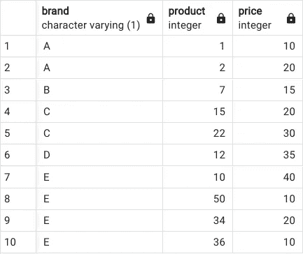
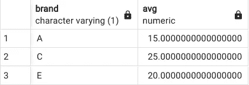
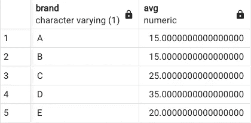
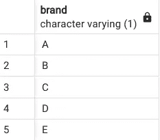
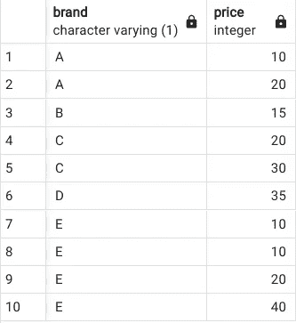
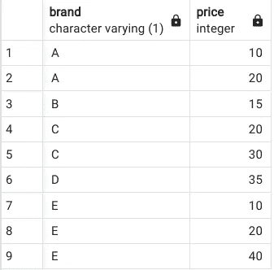

# 使用 SQL 中的 HAVING 和 DISTINCT 子句

> 原文：[`towardsdatascience.com/using-the-having-and-distinct-clauses-in-sql-d9e3be67b4be`](https://towardsdatascience.com/using-the-having-and-distinct-clauses-in-sql-d9e3be67b4be)

## 你应该知道的两个重要 SQL 子句

[](https://mgcodesandstats.medium.com/?source=post_page-----d9e3be67b4be--------------------------------)[](https://towardsdatascience.com/?source=post_page-----d9e3be67b4be--------------------------------) [Michael Grogan](https://mgcodesandstats.medium.com/?source=post_page-----d9e3be67b4be--------------------------------)

·发表于 [Towards Data Science](https://towardsdatascience.com/?source=post_page-----d9e3be67b4be--------------------------------) ·4 分钟阅读·2023 年 1 月 25 日

--


来源：由 [geralt](https://pixabay.com/users/geralt-9301/) 提供的照片，来自 [Pixabay](https://pixabay.com/photos/binary-binary-system-data-2728117/)

SQL 是从数据库中提取数据的强大工具——无论是从一个表还是多个表中。

话虽如此，在有效分析数据时，有些子句特别重要。

本文讨论的两个子句是 **HAVING** 和 **DISTINCT** 子句。

## 为什么我们需要 HAVING 子句？

HAVING 子句的目的是在使用 GROUP BY 函数时充当 WHERE 子句的等效物。

如果你经常使用 SQL，你会知道 GROUP BY 子句对于在表中聚合值是非常重要的，例如，获得特定数据组的平均值，计算特定组的最大值或最小值——以及众多其他功能。

假设数据库中存在以下表格：



来源：作者使用 PostgreSQL 创建的表。表格显示在 pgAdmin4 中。

我们可以看到表格包含：

+   由字母表示的品牌

+   每个品牌的产品由数字 ID 表示

+   每种产品的价格

让我们假设我们希望确定表中每个品牌的平均产品价格，但仅在每个品牌在表中存在多个条目的情况下，即我们可以看到品牌 B 和 D 只有一个条目。因此，我们不希望这些条目包含在分析中。

我们如何使用 HAVING 子句计算在表中有多个条目的品牌的平均价格？

以下是该子句：

```py
select brand, avg(price) from brand_table group by brand having count(brand)>1 order by brand;
```

执行此子句时，SQL 返回如下结果：



来源：表格由作者使用 PostgreSQL 创建。表格在 pgAdmin4 中显示。

正如我们所见，SQL 只返回了品牌 A、C 和 E 的平均价格。由于品牌 B 和 D 在表中只有一个条目，因此这些品牌没有被包括在内。

如果我们仅选择使用 GROUP BY 语句而不使用 HAVING 子句，SQL 将包括所有品牌：



来源：表格由作者使用 PostgreSQL 创建。表格在 pgAdmin4 中显示。

然而，B 和 D 的上述价格并不特别重要——因为计算只有一个产品的平均价格没有意义。因此，我们使用 HAVING 子句来仅显示多个条目的品牌。

## DISTINCT 子句的目的

最简单来说，DISTINCT 子句的目的是选择表中唯一的条目而没有重复。

在上表中，我们可以看到每个品牌条目有多个产品。然而，如果我们只是想在表中显示每个品牌，我们可以如下使用 DISTINCT：

```py
select distinct(brand) from brand_table order by brand;
```



来源：数据由作者使用 PostgreSQL 生成。表格在 pgAdmin 4 中显示。

在上表中，你会注意到品牌 E 的两个产品价格都是 10。

当选择品牌和价格而不使用 DISTINCT 子句时，我们可以看到这两个条目都被显示：

```py
select brand, price from brand_table order by brand, price;
```



来源：数据由作者使用 PostgreSQL 生成。表格在 pgAdmin 4 中显示。

然而，当我们包含 DISTINCT 子句时——我们看到表格仅显示了品牌 E 的一个条目，其中价格为 10——这正是我们想要的：



来源：数据由作者使用 PostgreSQL 生成。表格在 pgAdmin 4 中显示。

从这个角度来看，使用 DISTINCT 可以在必要时获取特定组中的唯一值——在这个案例中是品牌。即使价格相同的产品 ID 可能是唯一的——但在按品牌分析时这并不相关。

## 结论

在本文中，你已经看到了：

+   如何在 GROUP BY 语句中将 HAVING 用作 WHERE 等效项

+   使用 DISTINCT 来返回特定类别中的唯一值

非常感谢阅读，如有任何问题或反馈，我们将不胜感激！

*免责声明：本文是“按原样”编写的，不提供任何担保。它的目的是提供数据科学概念的概述，不应被解读为专业建议。本文中的发现和解释仅代表作者的观点，不代表或与本文中提到的任何第三方相关联。作者与本文中提到的任何第三方没有关系。*
