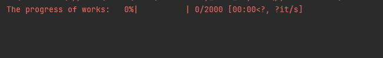
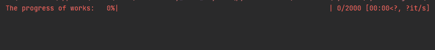
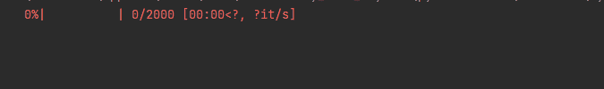
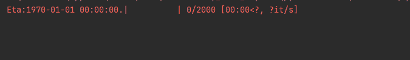

# 在 Python 中使用 Tqdm 与 Asyncio

> 原文：[`towardsdatascience.com/using-tqdm-with-asyncio-in-python-5c0f6e747d55`](https://towardsdatascience.com/using-tqdm-with-asyncio-in-python-5c0f6e747d55)

## [PYTHON CONCURRENCY](https://medium.com/@qtalen/list/python-concurrency-2c979347da3b)

## 一种有效监控并发任务进度的方法

[](https://qtalen.medium.com/?source=post_page-----5c0f6e747d55--------------------------------)[](https://towardsdatascience.com/?source=post_page-----5c0f6e747d55--------------------------------) [Peng Qian](https://qtalen.medium.com/?source=post_page-----5c0f6e747d55--------------------------------)

·发表于 [Towards Data Science](https://towardsdatascience.com/?source=post_page-----5c0f6e747d55--------------------------------) ·6 分钟阅读·2023 年 5 月 2 日

--


图片由 [Jungwoo Hong](https://unsplash.com/@hjwinunsplsh?utm_source=medium&utm_medium=referral) 提供，来自 [Unsplash](https://unsplash.com/?utm_source=medium&utm_medium=referral)

# 介绍

## 让我烦恼的事

对数据科学家来说，使用 Python 进行并发编程以提高效率并不罕见。观察后台各种子进程或并发线程，以保持计算或 IO 绑定任务的有序总是令人满意的。

但让我困扰的一件事是，当我在后台并发处理数百或数千个文件或执行数百个进程时，我总是担心是否有几个任务会悄悄挂起，从而使整个代码永远无法完成。我也很难知道代码目前的执行状态。

最糟糕的部分是，当我看着空白屏幕时，很难判断我的代码还需要多长时间才能执行完成或预计时间。这对我组织工作进度的能力非常有害。

因此，我想要一种方法来让我知道代码执行到了哪里。

## 过去是怎么做的

更传统的方法是在线程之间共享一个内存区域，在这个内存区域中放置一个计数器，让这个计数器在任务完成时加 1，然后使用一个线程不断打印这个计数器的值。

这不是一个好的解决方案：一方面，我需要在现有业务逻辑中添加计数代码，这违反了“低耦合，高内聚”的原则。另一方面，由于线程安全问题，我不得不非常小心锁机制，这会导致不必要的性能问题。

## tqdm 就是解决方案


tqdm 使用进度条来指示任务的进度。图片由作者提供

有一天，我发现了 tqdm 库，它使用进度条来可视化我的代码进度。我可以用进度条来可视化我的 asyncio 任务的完成情况和预计完成时间吗？

我继续研究，最终成功了。然后我与大家分享这种方法，以便每个程序员都有机会监控他们的并发任务进度。让我们开始吧。

# Python 中 asyncio 的背景

在我们开始之前，我希望你对 Python asyncio 有一些背景了解。我的文章描述了一些 asyncio 常见 API 的用法，这将帮助我们更好地理解 tqdm 的设计：

[## 使用这些方法让你的 Python 并发任务表现更佳](https://towardsdatascience.com/use-these-methods-to-make-your-python-concurrent-tasks-perform-better-b693b7a633e1?source=post_page-----5c0f6e747d55--------------------------------)

### asyncio.gather、asyncio.as_completed 和 asyncio.wait 的最佳实践

[towardsdatascience.com](https://towardsdatascience.com/use-these-methods-to-make-your-python-concurrent-tasks-perform-better-b693b7a633e1?source=post_page-----5c0f6e747d55--------------------------------)

# tqdm 概览

正如官方网站所描述，tqdm 是一个用于显示循环进度条的工具。它使用简单，高度可定制，并且资源占用极低。

一种典型的用法是将一个可迭代对象传递给 tqdm 构造函数，然后你将得到一个如下所示的进度条：

或者你可以手动遍历并更新进度条的进度，当文件被读取时：


使用 tqdm 指示读取大数据集的进度。图片由作者提供

# 将 tqdm 与 asyncio 集成

总体来说，tqdm 使用起来非常简单。然而，GitHub 上关于将 tqdm 与 asyncio 集成的信息还不够多。因此，我深入挖掘了源代码，以查看 tqdm 是否支持 asyncio。

幸运的是，tqdm 的最新版本提供了 `tqdm.asyncio` 包，该包提供了 `tqdm_asyncio` 类。

`tqdm_asyncio` 类有两个相关的方法。一个是 `tqdm_asyncio.as_completed`。从源代码中可以看出，它是 `asyncio.as_completed` 的一个封装：

```py
@classmethod
    def as_completed(cls, fs, *, loop=None, timeout=None, total=None, **tqdm_kwargs):
        """
        Wrapper for `asyncio.as_completed`.
        """
        if total is None:
            total = len(fs)
        kwargs = {}
        if version_info[:2] < (3, 10):
            kwargs['loop'] = loop
        yield from cls(asyncio.as_completed(fs, timeout=timeout, **kwargs),
                       total=total, **tqdm_kwargs)
```

另一个是 `tqdm_asyncio.gather`，从源代码中可以看出，它基于对 `tqdm_asyncio.as_completed` 的实现，该实现模拟了 `asyncio.gather` 的功能：

```py
@classmethod
    async def gather(cls, *fs, loop=None, timeout=None, total=None, **tqdm_kwargs):
        """
        Wrapper for `asyncio.gather`.
        """
        async def wrap_awaitable(i, f):
            return i, await f

        ifs = [wrap_awaitable(i, f) for i, f in enumerate(fs)]
        res = [await f for f in cls.as_completed(ifs, loop=loop, timeout=timeout,
                                                 total=total, **tqdm_kwargs)]
        return [i for _, i in sorted(res)]
```

接下来，我将描述这两个 API 的用法。在我们开始之前，我们还需要做一些准备工作。在这里，我写了一个简单的方法，用于模拟一个具有随机睡眠时间的并发任务：

紧接着，我们将创建 2000 个并发任务，然后使用 `tqdm_asyncio.gather` 替代熟悉的 `asyncio.gather` 方法，看看进度条是否正常工作：


`tqdm_asyncio.gather` 的效果。图片由作者提供

噠噠！我终于知道我的任务完成了。相当酷。

或者让我们用 `tqdm_asyncio.as_completed` 替换 `tqdm_asyncio.gather` 并再试一次：


tqdm_asyncio.as_completed 也运行良好。图像来源：作者

很好，它仍然运行良好。

# 高级技巧和窍门

## 一些常见的配置项

tqdm 有一套丰富的 [配置项](https://github.com/tqdm/tqdm#parameters)，这里列出一些常见的配置项。

+   `desc`。你可以配置一个 desc 参数，在进度条前显示标题，这在区分多个任务组时很有用。



desc 配置项的作用。图像来源：作者

+   `ncols`。如果默认的进度条过短，可以通过这个参数将其延长。



使用 ncols 更改进度条的宽度。图像来源：作者

+   `colour`。PyCharm 的 CLI 默认将进度条显示为红色，这仍然有些刺眼，因此你可以使用这个参数将进度条更改为其他颜色。但截至写作本文时，我仍未找到将文本更改为白色的方法。



使用 color 来更改进度条的颜色。图像来源：作者

+   `bar_format`。这个选项允许你灵活控制进度条显示的内容和格式。例如，如果你想在顶部显示 ETA。



使用 bar_format 自定义进度条的内容。图像来源：作者

## 异常处理

从源代码中可以看出，tqdm 通过 `tqdm_asyncio.as_completed` 方法实现了 `gather` 方法。因此，我们不能通过使用 `return_exceptions` 参数来跳过异常捕获。

这很遗憾。但我们仍然可以在 `tqdm_asyncio.as_completed` 中通过 `try…exception` 处理异常：


异常处理。图像来源：作者

# 现实世界中的应用案例

许多 asyncio 的代码示例使用 `asyncio.sleep` 来模拟 IO 绑定的情况，但这不幸地过于简化了现实情况。我们应该使用实际案例来解释如何在 asyncio 中使用 tqdm。

然而，由于篇幅原因，我们无法在本章中使用实际案例。在下一章中，我们将演示 tqdm 进度条如何在实际使用 asyncio 实现 map-reduce 程序处理大型文件的示例中工作。

[](/combining-multiprocessing-and-asyncio-in-python-for-performance-boosts-15496ffe96b?source=post_page-----5c0f6e747d55--------------------------------) ## 在 Python 中结合多进程和 asyncio 提升性能

### 使用实际案例来解释代码实现

towardsdatascience.com

# 结论

在 asyncio 代码中使用 tqdm 指示进度有很多好处：

+   我们可以在调用者的进度条中显示进度，而无需干涉业务代码。

+   所有工作都可以在主进程中完成，无需担心线程安全和性能问题。

+   图形化展示总是比枯燥的文字描述要生动得多。

+   所有这些只需一行代码。

我还尝试过其他进度条库，比如 [alive-progress](https://pypi.org/project/alive-progress/)，它在展示效果上要酷得多，但 alive-progress 不支持 asyncio。

如果设置得当，tqdm 也可以产生一些很酷的效果，但由于时间原因我没有深入研究，所以欢迎进一步讨论并留下评论。你可能会帮助到更多感兴趣的读者。

通过 [加入 Medium](https://medium.com/@qtalen/membership)，你将可以无限制地访问我所有的帖子以及成千上万其他作者的文章。这只需花费你一杯咖啡的钱，但对我来说是极大的鼓励。

本文最初发布在: [`www.dataleadsfuture.com/using-tqdm-with-asyncio-in-python/`](https://www.dataleadsfuture.com/using-tqdm-with-asyncio-in-python/)
