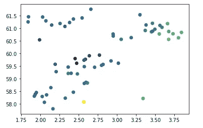

# 使用 pykrige 和 matplotlib 进行地质变化的空间可视化

> 原文：[`towardsdatascience.com/utilising-pykrige-and-matplotlib-for-spatial-visualisation-of-geological-variations-a288b186bfd6`](https://towardsdatascience.com/utilising-pykrige-and-matplotlib-for-spatial-visualisation-of-geological-variations-a288b186bfd6)

## 探索井测量数据中的空间地质变化

[](https://andymcdonaldgeo.medium.com/?source=post_page-----a288b186bfd6--------------------------------)[](https://towardsdatascience.com/?source=post_page-----a288b186bfd6--------------------------------) [Andy McDonald](https://andymcdonaldgeo.medium.com/?source=post_page-----a288b186bfd6--------------------------------)

· 发布于 [Towards Data Science](https://towardsdatascience.com/?source=post_page-----a288b186bfd6--------------------------------) ·阅读时长 7 分钟·2023 年 6 月 13 日

--


挪威大陆架上声波压缩缓慢度测量的空间变化。图像由作者提供。

在处理地质和岩石物理数据时，我们通常希望了解这些数据在我们研究的区域或场地上的变化。我们可以通过网格化实际测量值，并推测尚未通过钻孔探索的其他区域的数据来实现这一点。

一种进行这种外推的方法是克里金法，这是一种以南非矿业工程师 Danie G. Krige 命名的地统计学程序。克里金法的核心思想在于其估计技术：利用观察数据之间的空间相关性来预测未测量位置的值。

通过衡量变量在距离上的变化，这种方法建立了一种统计关系，可以用于预测区域内的值，将分散的数据点转化为连贯的空间地图。

在本教程中，我们将探讨一个名为[**pykrige**](https://github.com/GeoStat-Framework/PyKrige)**的** Python 库。该库设计用于二维和三维克里金计算，并且使用井测数据非常简便。

# 导入库和数据

首先，我们需要导入我们将要用到的库。对于这篇文章，我们将需要以下库：

+   [**pandas**](https://pandas.pydata.org/) — 用于读取我们以 `csv` 格式存储的数据

+   [**matplotlib**](https://matplotlib.org/) 用于创建我们的可视化

+   [**pykrige**](https://github.com/GeoStat-Framework/PyKrige) 用于执行克里金计算

+   [**numpy**](https://numpy.org/) 用于一些数值计算

```py
import pandas as pd
import matplotlib.pyplot as plt

from pykrige import OrdinaryKriging
import numpy as np
```

一旦我们导入了库，现在我们可以导入我们的数据。

在本教程中，我们将使用从 Xeek 和 Force 2020 机器学习竞赛中获得的用于预测井日志测量的岩性数据集。该数据集的详细信息可以在本文底部找到。

这个竞赛数据集的子集包含 65 个井位置及 Balder 组的平均声学压缩慢度测量值。

要读取数据，我们可以使用 pandas 的 `read_csv()` 函数，并传入数据文件的位置。在此示例中，我们使用相对于 Jupyter Notebook 的路径，但如果文件位于其他位置，我们也可以使用绝对路径。

```py
df = pd.read_csv('Data/Xeek Force 2020/Xeek_2020_Balder_DTC_AVG.csv')
df
```

当我们查看数据框时，我们将看到我们有 65 口井，包含 Balder 组顶部的位置（X_LOC 和 Y_LOC 为网格坐标，LAT 和 LON 为纬度和经度）。我们还记录了遇到该地层的真实垂直深度（TVDSS）以及声学压缩慢度的均值（DTC）。


包含我们选择的井位置数据和挪威北海 Balder 组的 DTC — 声学压缩慢度值的数据框。图片来源于作者。

# 可视化井的空间位置

现在我们的数据已成功加载到数据框中，我们可以可视化数据，以了解井的位置。为此，我们将使用 matplotlib 的散点图，并传入经度和纬度列。

```py
plt.scatter(df['Longitude'], df['Latitude'], c=df['DTC'])
```

当我们运行上述代码时，我们会得到以下图表。



基本的 matplotlib 图形展示了我们在挪威北海区域的井位置和 DTC 值。图片来源于作者。

我们可以看到上面的图形非常基本，没有颜色条或坐标轴标签。

让我们稍微修改图表，添加这些特性。

```py
cm = plt.cm.get_cmap('viridis')

plt.figure(figsize=(10,10))
scatter = plt.scatter(df['LON'], df['LAT'], c=df['DTC_MEAN'], cmap=cm, s=50)

plt.colorbar(scatter)

plt.xlabel('Longitude')
plt.ylabel('Latitude')
plt.show()
```

当我们运行上述代码时，我们会得到以下图形，这为我们提供了更多有关数据的信息。我们可以使用颜色条来估算点值。


在添加颜色条和标签后的挪威北海选择井的 matplotlib 散点图。图片来源于作者。

# 应用克里金法

为了更好地理解数据点及 DTC 测量在 Balder 组区域的变化，我们可以使用克里金法和数据点来填补测量值之间的空白。

为此，我们需要从 pykrige 库中创建一个 `OrdinaryKriging` 对象。

在此对象中，我们传入了 x 和 y 的位置数据，以及我们要映射到 z 参数的数据。

我们还需要选择要使用的变差函数模型。在此案例中，我们将使用指数模型。有关模型类型的更多细节，请参见[**文档**](https://geostat-framework.readthedocs.io/projects/pykrige/en/stable/variogram_models.html)。

由于我们使用纬度和经度作为 x 和 y 坐标，我们可以将 coordinates_type 参数更改为 `geographic`

```py
OK = OrdinaryKriging(x=df['LON'], 
                      y=df['LAT'], 
                      z=df['DTC_MEAN'],
                      variogram_model='exponential',
                      verbose=True, enable_plotting=True,
                      coordinates_type='geographic')
```

当我们运行上述代码时，我们会返回以下模型总结和半变差函数。


来自 pykrige 的模型总结。图片由作者提供。

下面是返回的参数的简要总结：

+   **颗粒**：颗粒是变差函数的 y 截距，表示零距离处的方差，通常是由于测量误差或非常小尺度的变化造成的。

+   **完全天花板**：天花板是变差函数达到的最大方差并开始趋于平稳的点，这发生在点之间距离非常远时。

+   **范围**：范围是变差函数达到天花板的距离，意味着在此距离之外，进一步分离点不会增加方差。

+   **部分天花板**：部分天花板是天花板和颗粒之间的差异，表示数据中空间结构的方差量。

这可以让我们理解模型根据生成的线条和点的形状对数据的适用性。

# 显示克里金结果

要开始显示我们的数据，我们需要创建一个数据网格。

为此，我们首先创建纬度和经度的数组，介于我们定义的坐标之间。在这种情况下，我们希望图表从北纬 57.5 度扩展到北纬 62 度，从东经 1.5 度扩展到东经 4.5 度。

使用 `np.arange` 将允许我们以规则间隔创建这些数组。

```py
grid_lat = np.arange(57.5, 62, 0.01, dtype='float64')
grid_long = np.arange(1.5, 4.5, 0.01,dtype='float64')
```

现在我们有了 X 和 Y 坐标，我们可以创建我们的值网格。为此，我们调用 `OK.execute`，并传入我们的纬度和经度数组。

```py
zstar, ss = OK.execute('grid', grid_long, grid_lat)
```

这将返回两个数组。我们的数据网格（zstar）和与之相关的不确定性（ss）

接下来，我们可以使用我们的数据数组，并使用 matplotlib 的 `imshow` 绘制它。

```py
import matplotlib.pyplot as plt

fig, ax = plt.subplots(figsize=(10,10))

image = ax.imshow(zstar, extent=(1.5, 4.5, 57.5, 62), origin='lower')

ax.set_xlabel('Longitude', fontsize=14, fontweight='bold')
ax.set_ylabel('Latitude', fontsize=14, fontweight='bold')

scatter = ax.scatter(x=df['LON'], y=df['LAT'], color='black')

colorbar = fig.colorbar(image)

colorbar.set_label('DTC (us/ft)', fontsize=14, fontweight='bold')

plt.show()
```

当我们运行此代码时，我们得到以下地图，显示了在我们 65 口井中 Balder 地层的声学压缩慢度的变化。


使用 pykrige 生成的声学压缩慢度 (DTC) 数据网格。图片由作者提供。

我们可以看到，在北纬 59 至 60 度之间，我们有更快的岩石，而在东北和西南地区，我们有更慢的岩石。

为了解释这一点，我们需要了解每个井的位置的形成深度。这将帮助我们确定差异是否与埋藏和压实或其他地质过程有关。

我们将在未来的文章中看到如何做到这一点。

## 可视化克里金不确定性

在查看此类数据时，一个关键点是理解与克里金相关的不确定性。

我们可以通过重复使用相同的绘图代码来实现这一点，而不是传入 `zstar`，我们可以将其替换为之前创建的 `ss` 变量。

```py
fig, ax = plt.subplots(figsize=(10,10))

image = ax.imshow(ss, extent=(1.5, 4.5, 57.5, 62), origin='lower')

ax.set_xlabel('Longitude', fontsize=14, fontweight='bold')
ax.set_ylabel('Latitude', fontsize=14, fontweight='bold')

scatter = ax.scatter(x=df['LON'], y=df['LAT'], color='black')

colorbar = fig.colorbar(image)

colorbar.set_label('DTC (us/ft)', fontsize=14, fontweight='bold')

plt.show()
```

通过以下图表，我们能够看到不确定性高或低的区域。


由 pykrige 生成的声波压缩慢度（DTC）不确定性数据网格。图像由作者提供。

在我们井覆盖较少的区域，我们的不确定性会更高，而在我们有多个井的区域，我们的不确定性会更低。

# 总结

在本教程中，我们已经看到如何对井日志测量值（DTC）进行平均处理，并将其映射到整个区域。这使我们能够了解地理区域内数据的趋势。

然而，在查看这些数据时，我们必须记住，我们看到的是一个 2D 表面，而不是我们在地下遇到的更复杂的 3D 结构。因此，测量的变化可能是由深度变化造成的。

# 使用的数据集

本文使用的数据集是由 Xeek 和 FORCE 2020 *(Bormann 等，2020)* 组织的机器学习比赛使用的训练数据集的一个子集。它在挪威政府发布的 NOLD 2.0 许可证下发布，详细信息可以在这里找到：[挪威开放政府数据许可证（NLOD）2.0](https://data.norge.no/nlod/en/2.0/)。完整数据集可以在[这里](https://doi.org/10.5281/zenodo.4351155)访问。

数据集的完整参考资料是：

Bormann, Peter, Aursand, Peder, Dilib, Fahad, Manral, Surrender, & Dischington, Peter. (2020). FORCE 2020 Well well log and lithofacies dataset for machine learning competition [数据集]. Zenodo. [`doi.org/10.5281/zenodo.4351156`](http://doi.org/10.5281/zenodo.4351156)

*感谢阅读。在你离开之前，你应该一定要订阅我的内容，并将我的文章发送到你的邮箱中。* [***你可以在这里完成订阅！***](https://andymcdonaldgeo.medium.com/subscribe)

*其次，你可以通过订阅会员来获得完整的 Medium 体验，并支持成千上万的其他作家和我。它每月只需$5，并且你可以完全访问所有精彩的 Medium 文章，还可以有机会通过你的写作赚钱。*

*如果你通过* [***我的链接***](https://andymcdonaldgeo.medium.com/membership)***注册***，*你将通过你的一部分费用直接支持我，这不会增加你的费用。如果你这样做，非常感谢你的支持。*
