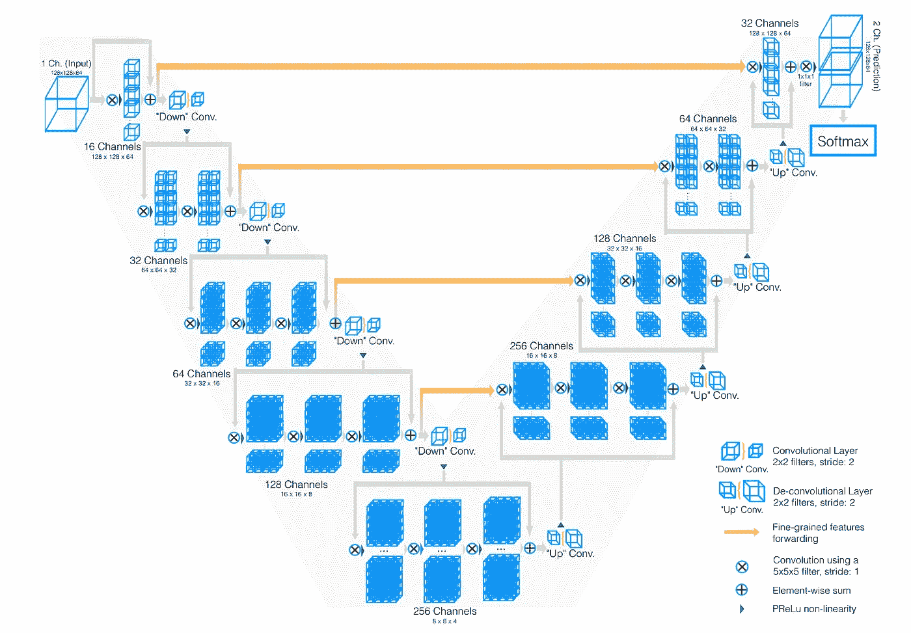
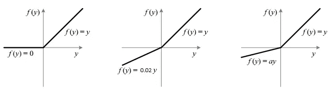

# V-Net，U-Net 在图像分割中的“大哥”

> 原文：[`towardsdatascience.com/v-net-u-nets-big-brother-in-image-segmentation-906e393968f7`](https://towardsdatascience.com/v-net-u-nets-big-brother-in-image-segmentation-906e393968f7)

## 欢迎阅读这本关于 V-Net 的指南，它是著名的 U-Net 的“亲戚”，专用于 3D 图像分割。你将对它了如指掌！

 [François Porcher](https://medium.com/@francoisporcher?source=post_page-----906e393968f7--------------------------------)

·发表在[Towards Data Science](https://towardsdatascience.com/?source=post_page-----906e393968f7--------------------------------) ·阅读时间 8 分钟·2023 年 7 月 28 日

--

欢迎踏上探索深度学习架构的激动人心的旅程！你可能已经对[U-Net](https://medium.com/@foporcher/cooking-your-first-u-net-for-image-segmentation-e812e37e9cd0)有所了解，它是计算机视觉领域的一个重大突破，显著重塑了图像分割的格局。

今天，让我们将焦点转向 U-Net 的“大哥”——V-Net。

由研究人员 Fausto Milletari、Nassir Navab 和 Seyed-Ahmad Ahmadi 发表的论文[“VNet: Fully Convolutional Neural Networks for Volumetric Medical Image Segmentation”](https://arxiv.org/abs/1606.04797)介绍了一种突破性的 3D 图像分析方法。

这篇文章将带你了解这篇开创性的论文，阐明其独特的贡献和架构进展。无论你是经验丰富的数据科学家、正在成长的 AI 爱好者，还是对最新科技趋势感兴趣的人，这里都有你需要的内容！

# 关于 U-Net 的简要提醒

在深入 V-Net 的核心之前，让我们先欣赏一下它的架构灵感——U-Net。如果这是你第一次接触 U-Net，别担心，我有一个[关于 U-Net 架构的快速简单教程](https://medium.com/@foporcher/cooking-your-first-u-net-for-image-segmentation-e812e37e9cd0)来帮助你。它如此简洁，你最多五分钟就能掌握这个概念！

下面是对 U-Net 的简要回顾：

U Net 架构，见于[U Net 文章](https://arxiv.org/abs/1505.04597)

U-Net 以其对称结构而闻名，呈现“U”字形。这种架构由两个不同的路径组成：

1.  **收缩路径（左）：** 在这里，我们逐渐减少图像的分辨率，同时增加过滤器的数量。

1.  **扩展路径（右）：** 这个路径作为收缩路径的镜像。我们逐渐减少过滤器的数量，同时增加分辨率，直到与原始图像大小对齐。

U-Net 的美在于其创新使用的**“残差连接”**或**“跳跃连接”**。这些连接收缩路径和扩展路径中的对应层，使网络能够保留在收缩过程中通常丢失的高分辨率细节。

残差连接，来自 [U Net 论文](https://arxiv.org/abs/1505.04597)

为什么这很重要？因为它简化了反向传播过程中的梯度流动，特别是在早期层中。实质上，我们绕过了梯度消失的风险——一个常见的问题，梯度接近零，阻碍了学习过程：

图片来源：作者

现在，带着对 U-Net 的理解，让我们进入 V-Net 的世界。V-Net 的核心与 U-Net 相似，采用类似的编码器-解码器理念。但正如你很快会发现的，它具有一套独特的特征，使其与其兄弟 U-Net 有所区别。

V-Net 架构，来自 [VNet 论文](https://arxiv.org/abs/1606.04797)

# V-Net 与 U-Net 有何不同？

让我们深入探讨吧！

## 区别 1：3D 卷积代替 2D 卷积

第一个区别显而易见。虽然 U-Net 是为 2D 图像分割量身定制的，但医学图像通常需要 3D 视角（例如体积脑扫描、CT 扫描等）。

这就是 V-Net 发挥作用的地方。V-Net 中的“V”代表“体积”，这种维度的变化要求将 2D 卷积替换为 3D 卷积。

## 区别 2：激活函数，PreLU 代替 ReLU

深度学习领域已经爱上了 ReLU 函数，因为它的简单性和计算效率。与 sigmoid 或 tanh 等其他函数相比，ReLU 是“非饱和”的，这意味着它减少了梯度消失的问题。

（左）ReLU，（中）LeakyReLU 和（右）PReLU，来自 [PReLU 论文](https://arxiv.org/abs/1502.01852v1)

但 ReLU 并不完美。它因一种被称为“Dying ReLU 问题”的现象而臭名昭著，其中许多神经元总是输出零，成为“死神经元”。为了解决这个问题，引入了 LeakyReLU，它在零的左侧有一个小但非零的斜率。

更进一步推理，V-Net 利用了参数化 ReLU（PReLU）。与其硬编码 LeakyReLU 的斜率，不如让网络来学习它？

毕竟，这是深度学习的核心哲学，我们希望尽可能少地引入归纳偏差，让模型自己学习一切，前提是我们有足够的数据。

## 区别 3：基于 Dice 分数的不同损失函数

现在，我们来到 V-Net 可能最具影响力的贡献——损失函数的改变。与 U-Net 的交叉熵损失函数不同，V-Net 使用 Dice 损失函数。

交叉熵函数，来自作者

但这个函数的主要问题是它对不平衡的类别处理不好。而这个问题在医学图像中非常常见，因为大多数时候背景的存在远多于感兴趣区域。

例如考虑这张图片：

背景无处不在，来自作者

结果是，一些模型可能变得“懒惰”，在任何地方都预测背景，因为它们仍然会得到一个较小的损失。

所以，V-Net 使用一种对这个问题更有效的损失函数：Dice 系数。

它更好的原因在于它将预测区域和真实值之间的重叠度量为**比例**，因此考虑了类别的大小。

尽管背景几乎无处不在，Dice 分数测量预测与真实值之间的重叠，因此即使类别占据主导地位，我们仍然可以得到一个介于 0 和 1 之间的数字。

Dice 系数，来自 [VNet 论文](https://arxiv.org/abs/1606.04797)

我认为这可能是本文的主要贡献，因为从 2D 卷积到 3D 卷积是处理 3D 图像的一个非常自然的想法。然而，这种损失函数已在图像分割任务中被广泛采用。

实际上，混合方法通常被证明是有效的，结合交叉熵损失和 Dice 损失，以利用两者的优点。

# V-Net 的性能

因此，我们已经探讨了 V-Net 的独特方面，但你可能在想，“所有这些理论很棒，但 V-Net 实际上能否有效？”好吧，让我们对 V-Net 进行测试！

作者在 PROMISE12 数据集上评估了 V-Net 的性能。

**PROMISE12** 数据集是为 MICCAI 2012 前列腺分割挑战赛提供的。

V-Net 在 50 张磁共振（MR）图像上进行训练，这个数量并不多！

VNet 在 PROMISE 2012 挑战数据集上的分割，[来自 VNet 论文](https://arxiv.org/abs/1606.04797)

PROMISE 2012 挑战数据集上的定量指标，来自 [VNet 论文](https://arxiv.org/abs/1606.04797)

正如我们所见，即使标签很少，V-Net 也能够生成良好的定性分割，并获得非常好的 Dice 分数。

# V-Net 的主要限制

确实，V-Net 在图像分割领域，特别是医学成像中设立了新的基准。然而，每项创新都有成长空间。在这里，我们将讨论 V-Net 可以改进的一些显著领域：

## 局限性 1：模型大小

从 2D 转到 3D 带来了显著的内存消耗增加。这种增加的连锁反应是多方面的：

+   该模型需要大量的内存空间。

+   它严重限制了批量大小（因为将多个 3D 张量加载到 GPU 内存中变得具有挑战性）。

+   医学成像数据稀缺且标注成本高，使得拥有如此多参数的模型更难以拟合。

## 局限性 2：不使用无监督学习或自监督学习

+   V-Net 完全在监督学习的背景下运作，忽视了无监督学习的潜力。在未标注扫描大大超过标注扫描的领域中，融入无监督学习可能会带来突破性的改变。

## 局限性 3：没有不确定性估计

+   V-Net 不估计不确定性，这意味着它无法评估自身预测的信心。这是贝叶斯深度学习闪耀的领域。（请参阅这篇[贝叶斯深度学习简明介绍](https://medium.com/ai-mind-labs/a-gentle-introduction-to-bayesian-deep-learning-d298c7243fd6)）。

## 局限性 4：缺乏鲁棒性

+   卷积神经网络（CNNs）传统上在泛化方面表现不佳。它们对于对比度变化、多模态分布或不同分辨率等变化不够鲁棒。这是 V-Net 还可以改进的另一个领域。

# 结论

V-Net，作为 U-Net 的较少知名但强大的对手，已经彻底改变了计算机视觉，尤其是图像分割。它从 2D 转向 3D 图像，并引入了现在广泛使用的 Dice 系数，为该领域设立了新的标准。

尽管存在局限性，V-Net 应该是开始进行 3D 图像分割任务的首选模型。为了进一步改进，探索无监督学习和整合注意力机制似乎是有前景的方向。

感谢阅读！在你离开之前：

+   查看我在 Github 上的[AI 教程汇编](https://github.com/FrancoisPorcher/awesome-ai-tutorials)

 [## GitHub - FrancoisPorcher/awesome-ai-tutorials: 最佳 AI 教程汇编，助你成为…

### 最佳 AI 教程汇编，助你成为数据科学大师！- GitHub …

github.com](https://github.com/FrancoisPorcher/awesome-ai-tutorials?source=post_page-----906e393968f7--------------------------------)

*你应该在你的收件箱中获取我的文章。* [***点击此处订阅。***](https://medium.com/@francoisporcher/subscribe)

*如果你想访问 Medium 上的优质文章，只需每月$5 的会员订阅。如果你通过* [***我的链接***](https://medium.com/@francoisporcher/membership)*进行注册，你可以在没有额外费用的情况下用你的一部分费用支持我。*

> 如果你觉得这篇文章有见解且有帮助，请考虑关注我并点赞，以获取更多深入内容！你的支持帮助我继续制作有助于我们集体理解的内容。

# 参考文献

+   [为图像分割制作你的第一个 U-Net](https://medium.com/@foporcher/cooking-your-first-u-net-for-image-segmentation-e812e37e9cd0)

+   [贝叶斯深度学习的温和介绍](https://medium.com/ai-mind-labs/a-gentle-introduction-to-bayesian-deep-learning-d298c7243fd6)

+   Milletari, F., Navab, N., & Ahmadi, S. A. (2016). [V-Net：用于体积医学图像分割的全卷积神经网络](https://arxiv.org/abs/1606.04797)。在 2016 年第四届国际 3D 视觉会议（3DV）上（第 565–571 页）。IEEE。

+   Ronneberger, O., Fischer, P., & Brox, T. (2015). [U-Net：用于生物医学图像分割的卷积网络](https://arxiv.org/abs/1505.04597)。在国际医学图像计算与计算机辅助干预会议（第 234–241 页）。Springer, Cham。
